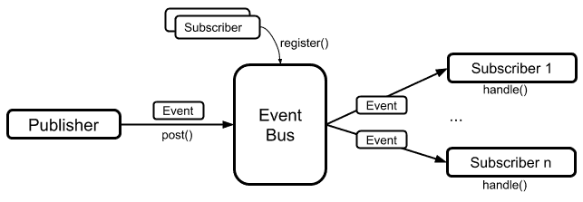
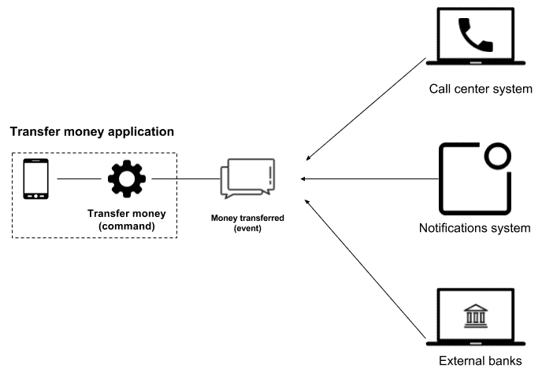
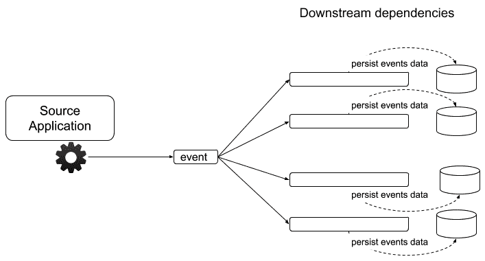
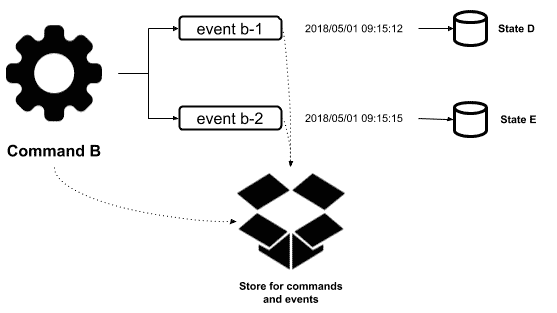
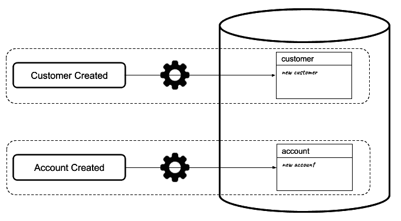
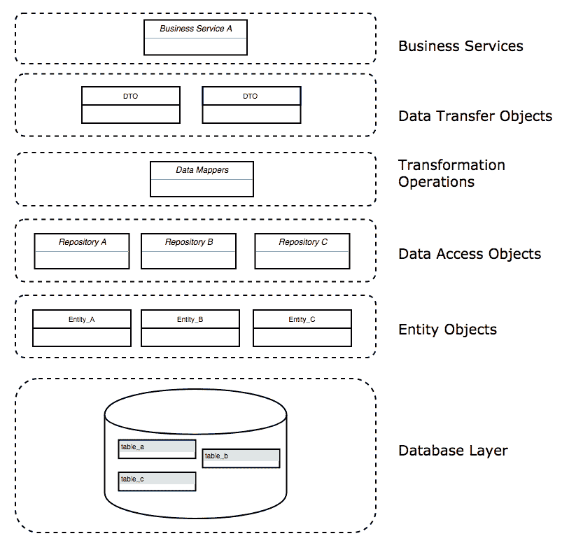
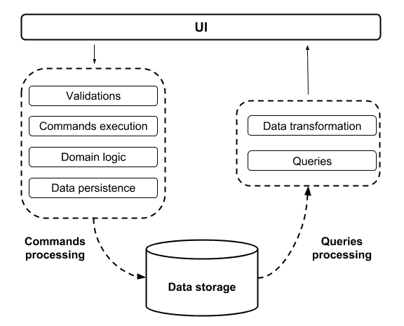

# 事件驱动体系结构

**事件驱动架构**（**EDA**）基于每次应用程序更改状态时创建的命令和事件。根据 Martin Fowler 的说法，有四种模式用于使用这种方法构建软件系统

在本章中，我们将学习这四种模式，并了解如何将消息传递联系在一起，以充分利用基于消息的编程模型。即使不是必需的，也可以使用消息传递为使用事件驱动体系结构样式构建的应用程序添加更多功能

在本章中，我们将研究以下主题：

*   与事件驱动体系结构相关的基本概念和关键方面：
    *   命令
    *   事件
*   事件驱动体系结构中使用的常见模式：
    *   事件通知
    *   事件携带状态转移
    *   事件源
    *   CQRS

# 基本概念和关键方面

在研究事件驱动体系结构的细节之前，我们将首先了解它们的一些关键方面。

使用此方法创建的应用程序开发时考虑了两个不同但相关的概念：

*   命令
*   事件

让我们看一下这些概念的简要定义。

# 命令

命令是在应用程序内执行的一种操作，在执行成功或失败后会发出一个或多个事件。我们可以将这些视为旨在修改系统状态的操作。

命令称为动作。如果我们考虑到它们的预期用途，这是很有意义的。以下列表显示了此类命令的一些示例：

*   转账
*   更新用户信息
*   创建帐户

强烈建议您使用现在时动词来命名命令，如以下示例所示。

# 事件

事件是在应用程序中执行命令的结果。它们被用作有兴趣接收它们的订阅者的通知机制。事件是不可变的，不应该被修改，因为它们被设计用来保存一个日志，该日志保存关于应用程序状态如何随时间变化的信息

在命名事件时，经验法则是使用过去时，例如：

*   转帐
*   更新用户信息
*   创建的帐户

事件与创建后将执行的操作无关。这样，我们可以解耦应用程序，因为订阅者负责执行一个或多个操作，这取决于在通知他们创建事件时需要做什么。

此时，我们可以得出这样的结论：我们可以解耦应用程序，因为订阅者负责执行一个或多个操作，这取决于在通知他们创建事件时需要做什么。我们还可以推断，事件是通过将责任委托给其他系统来逆转依赖关系的一种很好的方法

下图显示了命令如何发出事件以及如何通知这些事件的订阅者：


事件创建和传播

现在我们对事件有了更好的理解，让我们回顾一下我们在本章开头提到的四种模式，以便使用事件驱动的体系结构样式创建应用程序。

# 事件驱动体系结构的模式

当人们谈论事件驱动的体系结构时，通常会提到以下模式之一：

*   事件通知
*   事件携带状态转移
*   事件源
*   CQRS

有时，根据业务需求的不同，在同一个系统中会同时使用其中的多个。让我们回顾一下这些模式中的每一种，以确定它们可以在哪些场景中使用

# 事件通知

事件通知模式通过在执行命令后向订阅者发送事件来工作。这可以与观察者模式相比较，在观察者模式中，您观察的对象具有多个侦听器或订阅者的列表，当观察对象的状态更改时，这些侦听器或订阅者会自动得到通知。

此行为被事件总线库广泛使用，事件总线库允许作为应用程序一部分的组件之间的发布-订阅通信。这些库最常见的用例是针对 UI 的，但它们也适用于后端系统的其他部分。下图演示了如何将事件发送到总线，然后传播到以前注册的所有订阅服务器：



事件总线

使用此事件通知机制有两个主要好处：

*   解耦系统和功能
*   反向依赖

为了更好地理解这些好处，让我们设想一下，我们需要满足银行应用程序的以下要求：

*银行希望为使用移动应用的客户提供转账的机会。这将包括在**我行拥有的**账户之间转移**或转移到外部银行。一旦执行此交易，我们需要使用客户首选的通知渠道通知客户交易状态。*

*银行还有一个应用程序，呼叫中心工作人员使用该应用程序通知我们的代理我们客户的余额。当客户的账户余额高于预定金额时，呼叫中心系统会提醒代理，然后，世卫组织将给客户打电话，让他们了解将资金投资于银行的可能性。最后，如果交易涉及外部银行，我们也需要通知他们交易状态。*

使用经典的方法编写应用程序，我们可以正确构建一个系统，在该系统中，发生转账后，要求中列出的所有以下后条件都在转账应用程序边界内执行，如下图所示：


耦合转账应用

从上图中可以看出，转账申请需要了解交易发生后必须满足的所有后条件；使用这种方法，我们最终将编写与其他系统交互所需的所有代码，这将导致我们将应用程序与其他系统耦合。

另一方面，使用事件通知模式，我们可以解耦转账应用程序，如下图所示：



解耦转账应用

在上图中，我们可以看到，一旦执行了`<Transfer money>`命令，就会发出`<Money transferred>`事件，并通知所有订阅的系统。通过这样做，我们可以消除系统之间的耦合。

这里需要注意的重要一点是，汇款应用程序甚至不需要知道其他软件系统的存在，并且所有的后条件都在该应用程序的边界之外得到满足。换句话说，解耦的系统会导致我们颠倒依赖关系。

解耦的系统和反向依赖听起来很棒，但它们隐含的缺点是您失去了可见性。这是因为发出事件的应用程序对事件发布后执行的进程一无所知，并且没有用于读取其他系统的代码。

通常不可能确定下游的依赖关系，通常使用一些跨不同日志关联事件的技术来缓解这一噩梦

耦合系统提供了关于下游依赖关系的所有信息，并且很难进化。相反，解耦系统对下游依赖性一无所知，但它们提供了独立演化系统的机会。

现在我们已经了解了支持事件通知模式的基本概念，可以说实现此类应用程序的最明显的技术是使用消息传递系统，如 RabbitMQ、AWS SQS/SNS、MSMQ 等。这些由 Spring 在 Spring Cloud Stream 项目的保护伞下提供支持。在本例中，我们将使用 RabbitMQ，可以通过添加以下依赖项来支持它：

```
<dependency>
   <groupId>org.springframework.cloud</groupId> 
   <artifactId>spring-cloud-stream-binder-rabbit</artifactId> </dependency>
```

为了便于访问 RabbitMQ 的设置过程，本章为本书提供的代码包括一个 Docker Compose 文件，该文件应使用`docker-compose up `命令*执行。*我们将在[第 10 章](10.html)中了解 Docker Compose 是什么，以及它是如何将应用程序容器化的。

SpringCloudStream 构建在 SpringIntegration 之上，提供了轻松生成和使用消息的机会，以及使用 SpringIntegration 的所有内置功能的机会。我们将使用此项目来实现前面提到的银行应用程序示例，因此我们需要添加以下依赖项：

```
<dependency> 
    <groupId>org.springframework.cloud</groupId> 
    <artifactId>spring-cloud-stream</artifactId> 
</dependency>
```

转账应用程序将公开一个端点以允许转账。完成此事务后，需要向其他应用发送事件通知。Spring Cloud Stream 可以使用`@Output`注释定义消息传递通道，如下所示：

```
public interface EventNotificationChannel 
{
 @Output  MessageChannel moneyTransferredChannel();
}
```

此接口可以在任何地方进行注释和使用。让我们看看如何在控制器中使用它，它公开了转账功能：

```
@RestController
public class TransferController 
{
  private final MessageChannel moneyTransferredChannel;
  public TransferController(EventNotificationChannel channel) 
  {
    this.moneyTransferredChannel = channel.moneyTransferredChannel();
  }
  @PostMapping("/transfer")
  public void doTransfer(@RequestBody TransferMoneyDetails
  transferMoneyDetails) 
  {
    log.info("Transferring money with details: " +
    transferMoneyDetails);
    Message<String> moneyTransferredEvent = MessageBuilder
 .withPayload
    ("Money transferred for client with id: " + transferMoneyDetails.getCustomerId()).build();
    this.moneyTransferredChannel.send(moneyTransferredEvent);
  }
}
```

在使用事件通知模式时，需要记住的一点是，发出事件的应用程序只提供有关已执行命令的非常基本的信息。在这种情况下，`<Money Transferred>`事件包含客户端 ID，稍后应使用该 ID 查询更多信息并确定是否需要执行其他操作。此过程始终涉及到与其他系统、数据库等的一个或多个附加交互。

订户也可以利用 SpringCloudStream。在这种情况下，`@Input`注释应按如下方式使用：

```
public interface EventNotificationChannel 
{
  @Input
  SubscribableChannel subscriptionOnMoneyTransferredChannel();
}
```

使用 Spring 集成，可以执行完整的集成流，以以下方式处理传入消息：

```
@Bean
IntegrationFlow integrationFlow(
            EventNotificationChannel eventNotificationChannel) {
    return IntegrationFlows.from
        (eventNotificationChannel
            .subscriptionOnMoneyTransferredChannel()).
                handle(String.class, new GenericHandler<String>() {
            @Override
            public Object handle(String payload, 
            Map<String, Object> headers) {

 // Use the payload to find the transaction and determine
            // if a notification should be sent to external banks 
     }
         }).get();
}
```

检索到消息后，应使用该消息查询有关交易的其他信息，并确定是否应向外部银行发送通知。这种方法有助于减小有效载荷的大小。它还有助于避免发送通常对其他系统不必要和无用的信息，但这会增加源应用程序检索的流量。

在最坏的情况下，生成的每个事件都将检索至少一个请求事务细节的附加请求，如下图所示：


请求事务详细信息的下游依赖项

在我们的示例中，对于生成的每个事件，我们将至少有来自从属系统的三个其他请求

# 事件携带状态转移

与前面讨论的事件通知模式相比，事件承载状态传输模式有微小的变化。这里，事件包含与已执行命令相关的非常基本的信息。在这种情况下，事件包含有关已执行命令的所有信息，该命令用于避免联系源应用程序以执行从属系统的进一步处理。

此模式为表格带来以下好处：

*   提高应用程序性能
*   减少源应用程序上的负载
*   提高系统的可用性

让我们在以下各节中讨论其中的每一点。

# 提高应用程序性能

在前面的示例中，一旦下游系统生成并检索到事件，就需要执行额外的操作，以获取与事务相关的详细信息。这决定了作为流程的一部分必须执行哪些操作。此附加操作涉及与源应用程序建立通信。在某些情况下，此步骤可能只需要几毫秒，但响应时间可能会更长，具体取决于网络流量和延迟。这将影响相关系统的性能

结果，源应用程序提供的有效负载的大小增加，但所需的通信量减少。

# 减少源应用程序上的负载

由于与已执行命令相关联的所有信息都包含在生成的事件中，因此无需询问有关源应用程序的更多信息。因此，请求更少，从而减少了源应用程序检索的负载。

在最佳情况下，生成的事件与发出事件后检索到的请求之间的关系为 1:1。换句话说，一个请求将产生一个事件，但这可能更糟糕，这取决于在检索事件时有多少依赖系统需要请求附加信息。

为了避免这种额外的负载，所有下游系统通常都有自己的数据存储，事件信息保存在其中，如下图所示：



持久化事件数据的下游依赖项

当使用这种方法时，每个下游系统只存储与自身相关的数据，其余提供的信息被忽略，因为这些信息对系统没有用处，根本不会被使用。

# 提高系统的可用性

在取消了在检索事件后请求额外数据的需要之后，自然会假设系统的可用性已经增加，因为无论其他系统是否可用，事件都将得到处理。引入这一好处的一个间接后果是最终的一致性，它现在是系统的一部分。

最终一致性是一种用于在系统中实现高可用性的模型，如果没有对给定数据进行新的更新，一旦检索到一条信息，访问该数据的所有实例最终将返回上次更新的值。

下图显示了系统如何在不将这些更改传播到下游依赖项的情况下更改其数据：


不传播数据更新

要更改前面的示例，使其遵循此方法，我们只需要将附加信息作为有效负载的一部分。之前，我们只发送了一个带有`clientId`的`String`；现在，我们将以以下方式介绍完整的`TransactionMoneyDetails`：

```
@RestController
public class TransferController 
{
  private final MessageChannel moneyTransferredChannel;
  public TransferController(EventNotificationChannel channel) 
  {
    this.moneyTransferredChannel = channel.moneyTransferredChannel();
  }
  @PostMapping("/transfer")
  public void doTransfer(@RequestBody TransferMoneyDetails 
  transferMoneyDetails) 
  {
    // Do something
 Message<TransferMoneyDetails> moneyTransferredEvent = 
 MessageBuilder.withPayload(transferMoneyDetails).build();
 this.moneyTransferredChannel.send(moneyTransferredEvent);
  }
}
```

`Message`类可以支持`<>`中应该指定的任何类型的对象，因为该类是使用 Java 的泛型类型特性实现的。

还应修改下游依赖系统，使其能够检索对象而不是简单的字符串。由于处理传入消息的`Handler`也支持泛型，我们可以通过代码中的一点小改动来实现此功能，如下所示：

```
@Bean
IntegrationFlow integrationFlow(EventNotificationChannel eventNotificationChannel) 
{
  return IntegrationFlows
  .from(eventNotificationChannel
  .subscriptionOnMoneyTransferredChannel())
  .handle(TransferMoneyDetails.class, new GenericHandler
  <TransferMoneyDetails>() 
  {
    @Override
    public Object handle(TransferMoneyDetails payload, Map<String, 
    Object> map) 
    {
      // Do something with the payload
      return null;
    }
  }).get();
}
```

# 事件源

事件源是使用事件驱动方法实现应用程序的另一种方法，其中功能的核心基于使用命令，这些命令在处理事件后会生成更改系统状态的事件。

我们可以将命令视为系统内执行的事务的结果。根据以下因素，该交易会有所不同：

*   用户操作
*   从其他应用程序接收的消息
*   已执行的计划任务

使用事件源方法创建的应用程序存储与已执行命令关联的事件。存储产生事件的命令也是值得的。这使得将所有这些关联起来成为可能，以便了解创建的边界。

存储事件的主要原因是在任何时间点重建系统状态时使用它们。使此任务更容易的一种方法是定期为存储系统状态的数据库生成备份，这有助于避免重新处理自应用程序开始工作以来创建的所有事件。相反，我们只需要处理在生成数据库快照后执行的事件集。

让我们回顾一下下面的一组图表，以了解其工作原理。第一张图显示，一旦`Command A`被执行，三个`Events`被创建，并且每一个都被处理后生成一个新的`State`：


执行命令 A 后生成的事件和应用程序状态

下图显示了一个非常类似的过程。在本例中，由于`Command B`执行，创建了两个`Events`：



作为命令 B 执行结果生成的事件和应用程序状态

到目前为止，我们的应用程序有五种状态：

*   州 A
*   B 国
*   C 国
*   D 国
*   E 国

假设我们对调试`Event b-1`感兴趣，因为当它被执行时，应用程序崩溃了。为了实现这一目标，我们有两个选择：

*   逐个处理事件，研究`Event b-1`执行过程中的应用行为，如下图所示：


正在重建应用程序状态以处理所有事件

*   在恢复数据库快照后处理其余事件，并研究`Event b-1`执行期间的应用程序行为，如下图所示：


从数据库快照重建应用程序状态

显然，第二种方法更有效。计划任务通常负责在一段时间后创建数据库快照，应该建立一个策略来管理现有快照。例如，您可以建立一个策略，每天午夜创建一个新快照，并在业务最方便的时间段后清除旧快照。

正如您可能已经意识到的，我们系统的真实来源是事件存储，它允许我们随时重建应用程序状态。由于事件被用于生成系统状态，所以我们可以依赖事件存储 100%。但是，我们也应该考虑一个事实，即系统内的事件执行也需要与另一个应用程序交互。在这种情况下，如果您重播该事件，您应该考虑其他系统将如何受到影响。在这里，我们将以以下两种场景之一结束：

*   在其他应用程序中执行的操作是幂等的
*   其他应用程序将受到影响，因为将生成新事务

在第一种情况下，由于运算是幂等的，我们根本不必担心。这是因为另一次执行不会影响其他系统。在第二种情况下，我们应该考虑创建补偿操作的方式或者忽略这些交互以避免影响其他系统的方法。

采用这种方法后，我们将获得以下固有好处：

*   可用于审计目的的数据存储
*   优秀的日志记录级别
*   调试应用程序会更容易
*   历史悠久的国家
*   能够及时返回到状态的以前版本

事件源应用程序的典型示例是版本控制系统（VCS），如 Git、Apache subversion、CVS 或任何其他版本控制系统，其中存储了应用于源代码文件中的所有更改。此外，提交表示允许我们在需要时撤消/重做更改的事件

为了使其尽可能简单易懂，您可以将事件源应用程序视为以版本控制系统管理文件更改的相同方式管理数据更改的应用程序。您还可以将`git push`操作视为事件源系统中的命令。

既然我们已经解释了事件源背后的基本概念，现在是深入了解细节的时候了，这些细节将使我们能够理解如何按照这种方法实现系统。尽管创建事件源应用程序有不同的方法，但我将在这里解释一种通用的方法。重要的是，您要记住，这种方法应该根据您的业务所需的特定需求或假设进行更改。

我们提到一个事件源系统应该至少有两个*位置来存储数据。其中一个用于保存事件和命令信息，另一个用于保存应用程序状态我们称之为*至少两个*，因为有时需要多个存储选项来保存应用程序的系统状态。由于系统检索到的用于执行业务流程的输入彼此非常不同，因此我们应该考虑使用支持 JSON 格式存储数据的能力的数据库。按照这种方法，应作为在事件源系统内执行的命令的一部分存储的最基本数据如下：*

*   唯一标识符
*   时间戳
*   以 JSON 格式检索的输入数据
*   用于关联命令的任何其他数据

另一方面，建议为事件存储的数据如下：

*   唯一标识符
*   时间戳
*   JSON 格式的事件相关数据
*   生成事件的命令的标识符

正如我们前面提到的，根据您的业务需要，您需要添加更多的字段，但前面提到的字段在任何情况下都是必要的。这里的关键是确保您的数据能够在需要时在以后处理以重新创建应用程序状态。几乎任何 NoSQL 数据库都支持将数据存储为 JSON，但一些 SQL 数据库（如 PostgreSQL）也可以很好地处理这种格式的数据。

就系统状态而言，选择 SQL 或 NoSQL 技术的决定应该完全取决于您的业务；您不必因为应用程序将使用事件源方法构建而改变主意。此外，数据模型的结构还应该取决于业务本身，而不是生成将存储在其中的数据的事件和命令。还值得一提的是，一个事件将生成数据，这些数据将存储在系统状态数据模型的一个或多个表中，在这些术语中没有任何限制。

当我们考虑命令、事件和状态时，通常会提出一个关于信息持久化顺序的问题。这一点将是一个有趣的讨论，但您不必太担心数据的保存顺序。您可以选择在任何数据存储实例中同步或异步持久化数据。

异步方法有时会让我们认为，我们最终会得到不一致的信息，但事实是，这两种方法都可能让我们达到这一点。不要考虑同步或异步处理，我们应该考虑从这些崩溃中恢复我们的应用程序的机制，例如适当的日志记录。良好的日志记录将有助于恢复我们系统的数据，恢复方式与使用事件源以外的任何方法构建的应用程序完全相同。

现在是时候回顾一些代码，将我们前面讨论的概念付诸实践了。让我们构建一个应用程序，允许我们开立一个新的银行账户。所需输入数据如下：

*   客户名称
*   客户姓氏
*   开户的初始金额
*   账户类型（储蓄/活期）

创建帐户后，我们的应用程序状态应反映一个新客户和一个已创建的新银行帐户。

作为我们应用程序的一部分，我们将有一个命令：`CreateCustomerCommand`。这将生成两个事件，分别命名为`CustomerCreated`和`AccountCreated`，如下图所示：


命令执行

执行此命令后，需要执行以下操作：

*   应保存该命令
*   应使用相关信息创建上述事件
*   应该保存事件
*   应该处理这些事件

此过程的相关代码显示在以下代码中：

```
public class CreateCustomerCommand extends Command {

    public void execute() {

        String commandId = UUID.randomUUID().toString();
        CommandMetadata commandMetadata 
            = new CommandMetadata(commandId, getName(), this.data);
 commandRepository.save(commandMetadata);

        String customerUuid = UUID.randomUUID().toString();

        JSONObject customerInformation = getCustomerInformation();
        customerInformation.put("customer_id", customerUuid);

        // CustomerCreated event creation EventMetadata customerCreatedEvent 
 = new EventMetadata(customerInformation, ...);        // CustomerCreated event saved eventRepository.save(customerCreatedEvent);        // CustomerCreated event sent to process eventProcessor.process(customerCreatedEvent);

        JSONObject accountInformation = getAccountInformation();
        accountInformation.put("customer_id", customerUuid);

        // AccountCreated event creation
 EventMetadata accountCreatedEvent 
 = new EventMetadata(accountInformation, ...);        // AccountCreated event saved eventRepository.save(accountCreatedEvent);        // AccountCreated event sent to process eventProcessor.process(accountCreatedEvent);

    }
    ...
}
```

处理事件后，应生成系统状态。在这种情况下，这意味着应该创建一个新客户和一个新帐户，如下图所示：



处理事件后生成的系统状态

为了实现这个目标，我们有一个非常基本的实现，它根据`event name`执行代码指令，如下代码所示：

```
@Component
public class EventProcessor {

    public void process(EventMetadata event) {
        if ("CustomerCreated".equals(event.getEventName())) {
            Customer customer = new Customer(event);
            customerRepository.save(customer);
        } else if ("AccountCreated".equals(event.getEventName())) {
            Account account = new Account(event);
            accountRepository.save(account);
        }
    }
    ...
}
```

如果您想了解应用程序的工作方式，可以执行以下`CURL`命令：

```
$ curl -H "Content-Type: application/json" \
 -X POST \
 -d '{"account_type": "savings", "name": "Rene", "last_name": "Enriquez", "initial_amount": 1000}' \
 http://localhost:8080/customer
```

您将在控制台中看到以下消息：

```
COMMAND INFORMATION
id: 8782e12e-92e5-41e0-8241-c0fd83cd3194 , name: CreateCustomer , data: {"account_type":"savings","name":"Rene","last_name":"Enriquez","initial_amount":1000} 
EVENT INFORMATION
id: 71931e1b-5bce-4fe7-bbce-775b166fef55 , name: CustomerCreated , command id: 8782e12e-92e5-41e0-8241-c0fd83cd3194 , data: {"name":"Rene","last_name":"Enriquez","customer_id":"2fb9161e-c5fa-44b2-8652-75cd303fa54f"} 
id: 0e9c407c-3ea4-41ae-a9cd-af0c9a76b8fb , name: AccountCreated , command id: 8782e12e-92e5-41e0-8241-c0fd83cd3194 , data: {"account_type":"savings","account_id":"d8dbd8fd-fa98-4ffc-924a-f3c65e6f6156","balance":1000,"customer_id":"2fb9161e-c5fa-44b2-8652-75cd303fa54f"}
```

您可以通过在 H2 web 控制台中执行 SQL 语句来检查系统状态，该控制台位于 URL:`http://localhost:8080/h2-console`中。

下面的屏幕截图显示了查询 Account 表的结果：


从科目表中查询结果

以下屏幕截图显示了查询客户表的结果：


客户表中的查询结果

事件源应用程序最关键的测试是在删除数据后重新创建`state`的能力。您可以通过使用以下 SQL 语句从表中删除数据来运行此测试：

```
DELETE FROM CUSTOMER;
DELETE FROM ACCOUNT;
```

在 H2 控制台中执行这些操作后，您可以通过运行以下`CURL`命令来重新创建状态：

```
$ curl -X POST http://localhost:8080/events/<EVENT_ID> 
```

请注意，在执行命令时，您需要将前面 URL 中列出的`<EVENT_ID>`替换为控制台中列出的值。

# CQRS

**命令查询责任分离**（**CQRS**）是一种模式，其主要思想是通过创建与系统数据存储交互的分离接口，创建单独的数据结构和操作来读写数据。

CQR 并非真正基于事件，但由于它通常与事件源实现结合使用，因此值得一提的是其应用场景。将接口与处理和查询信息分离有三种主要用例：

*   复杂域模型
*   查询和持久化信息的不同路径
*   独立标度

# 复杂领域模型

此场景指的是检索到的输入易于管理并保存在数据库中的系统。但是，在向用户交付信息之前，需要进行许多转换，以使数据对业务有用且全面。

想象一下，在一个系统中，代码由一大组实体对象组成，这些实体对象使用 ORM 框架映射数据库表以持久化信息。这类系统涉及许多使用 ORM 执行的写入和读取操作，以及一些作为系统一部分运行的操作，以将检索到的实体对象形式的数据转换为数据传输对象（DTO），从而以有意义的方式为业务提供信息。

下图显示了从数据库到业务服务的数据流，其设计遵循此方法：



使用实体对象和 DTO 的数据流

转换数据不是什么大事。在使用 ORM 的系统中，最大的问题出现在实体对象带来包含无用信息的列时，这些列在转换过程中会被忽略，从而给数据库和网络带来不必要的开销，我们可以看到，在实际获取请求的数据之前，需要一个大的过程将数据库表映射为对象。解决此问题的一个好方法是用存储过程或普通查询语句替换 ORM 框架执行的读取操作，以便仅从数据库中检索所需的数据。

下图显示了如何用点替换实体对象：


使用 DTO 的数据流

很明显，这种方法更简单，更容易实现。甚至所需的代码量也大大减少了。我并不是说 ORM 框架实际上不好，它们中的许多都很棒，像 SpringData 这样的项目提供了大量的内置特性。但是，根据业务需求，普通的 JDBC 操作有时对系统更有利。

# 查询和持久化信息的不同路径

当我们构建应用程序时，很常见的情况是，在使用系统中提供的信息之前，我们会对检索到的输入编写大量的验证。

应用于检索到的数据的常见验证包括以下内容：

*   非空值的验证
*   特定的文本格式，如电子邮件
*   检查以验证字符串长度
*   数字中允许的最大小数数量

在我们的代码中有许多机制可用于实现这种验证。其中最流行的是基于第三方库的注释，这些注释可以在特定场景中使用正则表达式进行扩展。甚至还有一个规范是平台的一部分，可用于验证类字段，称为 Bean 验证。这是目前**Java 规范请求****JSR****380**[的一部分 http://beanvalidation.org/](http://beanvalidation.org/) 。

当用户或外部系统提供数据时，必须进行所有这些验证，但当从数据库读取信息并返回给用户时，无需继续执行这些检查。此外，在某些情况下，例如事件源，一旦检索到数据，就会执行一些命令，创建事件，并最终保存信息。

在这些场景中，显然持久化和读取信息的过程是不同的，它们需要单独的路径来实现目标。

下图显示了应用程序如何使用不同的路径来持久化和检索数据：



使用不同路径持久化和查询数据

从前面的图表中，我们可以很快注意到有多少处理被避免，因为这是绝对不必要的。此外，用于查询和处理信息的域模型通常是不同的，因为它们是为实现不同的目标而定制的。

# 独立标度

今天，开发人员、软件架构师和技术人员通常都在谈论创建单独的服务来解决不同的需求。创建单独的服务支持独立的扩展方法，因为它可以单独扩展创建的服务。

在本例中，主要思想是创建可以独立构建和部署的独立系统。这些不同应用程序的数据源可以相同，也可以不同，具体取决于需求。这里最常见的场景是两个系统使用相同的数据存储，因为应用的更改应该立即反映出来。否则，在应用程序的正常操作过程中，延迟的数据可能会导致混乱或错误。

让我们考虑一个在线商店。假设您在购物车中添加了许多商品，并且在签出订单后，您意识到您支付的金额低于所需金额，因为在签出过程中并未考虑所有商品。这是应用程序中不希望出现的行为。

另一方面，在某些情况下，可以使用不同的数据存储，因为检索延迟数小时或数天的数据就足以解决与应用程序相关的业务需求。想象一下，您的任务是创建一份报告，显示人们倾向于请求休假的月份。当然，如果数据库没有最新的更改，并且有点落后于应用程序的当前状态，那么它将可以完美地工作。当我们有这种需求时，我们可以使用报表数据库（参见[https://martinfowler.com/bliki/ReportingDatabase.html](https://martinfowler.com/bliki/ReportingDatabase.html) 获取更多详细信息）以检索信息。当应用程序旨在提供执行报告信息以做出战略决策，而不是获取数据库表中所有现有记录的列表时，通常会采用这种方法

使用单独的系统来查询和处理信息使我们能够在两个系统上实现独立的扩展功能。当其中一个系统需要更多的资源进行处理时，这非常有用。让我们以前面提到的在线商店为例，人们总是在寻找要购买的商品，进行比较，检查尺寸、价格、品牌等等。

在前面的示例中，签出订单的请求数小于检查项目信息的请求数。因此，在这种情况下，使用单独的系统可以避免不必要的资源浪费，并且只允许添加更多具有最高流量的资源或服务实例。

# 总结

在本章中，我们介绍了事件驱动的体系结构以及用于使用这种体系结构风格实现应用程序的四种常见模式。我们详细解释了这些模式，并编写了一些代码来理解如何使用 Spring 框架实现它们。同时，我们查看了一些可以使用它们的用例，并了解了它们如何帮助我们降低复杂性，这些复杂性是作为我们最终将拥有的系统需求的一部分引入的

作为这些模式的一部分，我们讨论了事件源，它在微服务领域越来越流行，我们将在后面的[第 8 章](08.html)、*微服务*中了解。