# 第二章：用弹簧靴构建微服务

由于功能强大的 Spring Boot 框架，开发微服务不再那么单调乏味。Spring Boot 是一个用 Java 开发生产就绪微服务的框架。

本章将通过回顾代码示例，从上一章中解释的微服务理论过渡到实际操作。本章将介绍 Spring Boot 框架，并解释 Spring Boot 如何根据前一章讨论的原则和特点帮助构建 RESTful 微服务。最后，我们将回顾 SpringBoot 提供的一些特性，这些特性可以使微服务生产就绪。

在本章结束时，您将了解：

*   建立最新的 Spring 开发环境
*   使用 Spring 框架开发 RESTful 服务
*   使用 Spring Boot 构建完全合格的微服务
*   用于构建生产就绪的微服务的有用 Spring 引导功能

# 建立发展环境

为了将微服务概念结晶化，将构建两个微服务。为此，假设安装了以下部件：

*   **JDK 1.8**：[http://www.oracle.com/technetwork/java/javase/downloads/jdk8-downloads-2133151.html](http://www.oracle.com/technetwork/java/javase/downloads/jdk8-downloads-2133151.html)
*   **弹簧工具套件 3.7.2****STS**：[https://spring.io/tools/sts/all](https://spring.io/tools/sts/all)
*   **Maven 3.3.1**：[https://maven.apache.org/download.cgi](https://maven.apache.org/download.cgi)

或者，也可以使用其他 IDE，如 IntelliJ IDEA、NetBeans 或 Eclipse。类似地，也可以使用 Gradle 等替代构建工具。假设 Maven 存储库、类路径和其他路径变量已正确设置以运行 STS 和 Maven 项目。

本章基于以下版本的 Spring 库：

*   弹簧框架`4.2.6.RELEASE`
*   弹簧靴`1.3.5.RELEASE`

### 提示

本书的前言中提到了下载代码包的详细步骤。看一看

该书的代码包也托管在 GitHub 上的[https://github.com/PacktPublishing/Spring-Microservices](https://github.com/PacktPublishing/Spring-Microservices) 。我们在[上还提供了丰富的书籍和视频目录中的其他代码包 https://github.com/PacktPublishing/](https://github.com/PacktPublishing/) 。看看他们！

# 开发 RESTful 服务——传统方法

这个示例将在深入到 Spring Boot 之前回顾传统的 RESTful 服务开发。

STS 将用于开发此 REST/JSON 服务。

### 注

本例的完整源代码在本书的代码文件中作为`legacyrest`项目提供。

以下是开发第一个 RESTful 服务的步骤：

1.  启动 STS 并为此项目设置所选的工作区。
2.  导航至**文件****新建****项目**。
3.  Select **Spring Legacy Project** as shown in the following screenshot and click on **Next**:

    

4.  Select **Spring MVC Project** as shown in the following diagram and click on **Next**:

    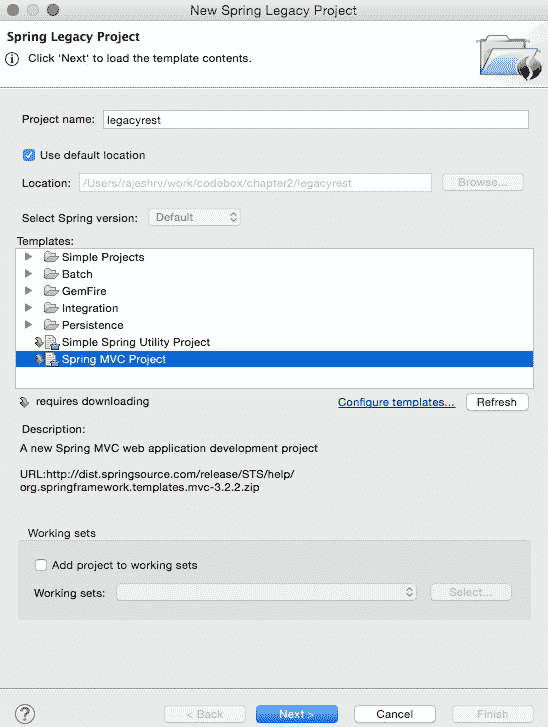

5.  选择所选的顶级包名称。本例使用`org.rvslab.chapter2.legacyrest`作为顶级包。
6.  然后点击**完成**。
7.  This will create a project in the STS workspace with the name `legacyrest`.

    在继续之前，`pom.xml`需要编辑。

8.  将弹簧版本更改为`4.2.6.RELEASE`，如下所示：

    ```java
    <org.springframework-version>4.2.6.RELEASE</org.springframework-version>
    ```

9.  在`pom.xml`文件中为 JSON 到 POJO 和 POJO 到 JSON 的转换添加**Jackson**依赖项。请注意，`2.*.*`版本用于确保与 Spring 4 的兼容性。

    ```java
    <dependency>
        <groupId>com.fasterxml.jackson.core</groupId>
        <artifactId>jackson-databind</artifactId>
        <version>2.6.4</version>
    </dependency>
    ```

10.  Some Java code needs to be added. In **Java Resources**, under **legacyrest**, expand the package and open the default **HomeController.java** file:

    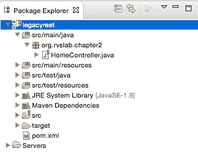

11.  The default implementation is targeted more towards the MVC project. Rewriting `HomeController.java` to return a JSON value in response to the REST call will do the trick. The resulting `HomeController.java` file will look similar to the following:

    ```java
    @RestController
    public class HomeController {
      @RequestMapping("/")
      public Greet sayHello(){
        return new Greet("Hello World!");
      }
    }
    class Greet { 
      private String message;
      public Greet(String message) {
        this.message = message;
      }
      //add getter and setter
    }
    ```

    检查代码，现在有两个类：

    *   `Greet`：这是一个简单的 Java 类，用 getter 和 setter 表示数据对象。`Greet`类中只有一个属性，即`message`。
    *   `HomeController.java`：这只是一个 Spring 控制器 REST 端点，用于处理 HTTP 请求。

    注意`HomeController`中使用的注释为`@RestController`，自动注入`@Controller`和`@ResponseBody`，与下面的代码具有相同的效果：

    ```java
    @Controller
    @ResponseBody
    public class HomeController { }
    ```

12.  The project can now be run by right-clicking on **legacyrest**, navigating to **Run As** | **Run On Server**, and then selecting the default server (**Pivotal tc Server Developer Edition v3.1**) that comes along with STS.

    这将自动启动服务器并在 TC 服务器上部署 web 应用程序。

    如果服务器正确启动，控制台中将显示以下消息：

    ```java
    INFO : org.springframework.web.servlet.DispatcherServlet - FrameworkServlet 'appServlet': initialization completed in 906 ms
    May 08, 2016 8:22:48 PM org.apache.catalina.startup.Catalina start
    INFO: Server startup in 2289 ms

    ```

13.  If everything is fine, STS will open a browser window to `http://localhost:8080/legacyrest/` and display the JSON object as shown in the browser. Right-click on and navigate to **legacyrest** | **Properties** | **Web Project Settings** and review **Context Root** to identify the context root of the web application:

    

备选构建选项是使用 Maven。右键单击项目并导航至**以**运行**Maven 安装**。这将在目标文件夹下生成`chapter2-1.0.0-BUILD-SNAPSHOT.war`。这场战争可以部署在任何 servlet 容器中，如 Tomcat、JBoss 等。

# 从传统 web 应用转向微服务

仔细检查前面的 RESTful 服务将揭示这是否真的构成了一个微服务。乍一看，前面的 RESTful 服务是一个完全限定的可互操作 REST/JSON 服务。然而，它在本质上并不是完全自主的。这主要是因为服务依赖于底层应用服务器或 web 容器。在前面的示例中，war 被显式地创建并部署在 Tomcat 服务器上。

这是将 RESTful 服务开发为 web 应用程序的传统方法。然而，从微服务的角度来看，我们需要一种机制来将服务开发为可执行文件、带有嵌入式 HTTP 侦听器的自包含 JAR 文件。

SpringBoot 是一种允许轻松开发此类服务的工具。Dropwizard 和 WildFly Swarm 是备用的无服务器 RESTful 堆栈。

# 使用 Spring Boot 构建 RESTful 微服务

Spring Boot 是 Spring 团队的一个实用框架，用于快速轻松地引导基于 Spring 的应用程序和微服务。该框架在决策时使用了一种针对配置的固执己见的方法，从而减少了编写大量样板代码和配置所需的工作量。使用 80-20 原则，开发人员应该能够使用许多默认值启动各种 Spring 应用程序。SpringBoot 还为开发人员提供了通过覆盖自动配置的值来定制应用程序的机会。

SpringBoot 不仅提高了开发速度，而且还提供了一组生产就绪的 ops 功能，如运行状况检查和指标收集。由于 Spring Boot 屏蔽了许多配置参数并抽象了许多较低级别的实现，因此它在一定程度上将出错的可能性降至最低。SpringBoot 根据类路径中可用的库识别应用程序的性质，并运行这些库中打包的自动配置类。

通常，许多开发人员错误地将 Spring Boot 视为代码生成器，但实际上并非如此。SpringBoot 只自动配置构建文件，例如，Maven 中的 POM 文件。它还基于某些自以为是的默认设置设置属性，例如数据源属性。请看下面的代码：

```java
<dependency>
    <groupId>org.springframework.boot</groupId>
    <artifactId>spring-boot-starter-data-jpa</artifactId>
</dependency>
<dependency>
    <groupId>org.hsqldb</groupId>
    <artifactId>hsqldb</artifactId>
    <scope>runtime</scope>
</dependency>
```

例如，在前面的例子中，Spring Boot 理解项目被设置为使用 Spring 数据 JPA 和 HSQL 数据库。它会自动配置驱动程序类和其他连接参数。

SpringBoot 的一个伟大成果是，它几乎消除了使用传统 XML 配置的需要。SpringBoot 还通过将所有必需的运行时依赖项打包到 fat 可执行 JAR 文件中来支持微服务的开发。

# 弹簧靴入门

启动基于 Spring Boot 的应用程序开发有多种方式：

*   使用 Spring Boot CLI 作为命令行工具
*   使用诸如 STS 之类的 IDE 来提供 Spring 引导，这是开箱即用的支持
*   使用[处的弹簧初始化器项目 http://start.spring.io](http://start.spring.io)

本章将探讨所有这三个选项，并开发各种示例服务。

# 使用 CLI 开发 Spring Boot 微服务

开发和演示 Spring Boot 功能最简单的方法是使用 Spring Boot CLI，这是一种命令行工具。执行以下步骤：

1.  从[下载`spring-boot-cli-1.3.5.RELEASE-bin.zip`文件，安装 Spring Boot 命令行工具 http://repo.spring.io/release/org/springframework/boot/spring-boot-cli/1.3.5.RELEASE/spring-boot-cli-1.3.5.RELEASE-bin.zip](http://repo.spring.io/release/org/springframework/boot/spring-boot-cli/1.3.5.RELEASE/spring-boot-cli-1.3.5.RELEASE-bin.zip) 。
2.  Unzip the file into a directory of your choice. Open a terminal window and change the terminal prompt to the `bin` folder.

    确保将`bin`文件夹添加到系统路径，以便可以从任何位置运行 Spring Boot。

3.  使用以下命令验证安装。如果成功，Spring CLI 版本将在控制台中打印：

    ```java
    $spring –-version
    Spring CLI v1.3.5.RELEASE

    ```

4.  作为下一步，将在 Groovy 中开发一个 QuickREST 服务，它在 SpringBoot 中得到开箱即用的支持。为此，请使用所选的任何编辑器复制并粘贴以下代码，并将其保存为`myfirstapp.groovy`在任何文件夹中：

    ```java
    @RestController
    class HelloworldController {
        @RequestMapping("/")
        String sayHello() {
            "Hello World!"
        }
    }
    ```

5.  要运行此 Groovy 应用程序，请转到保存有`myfirstapp.groovy`的文件夹并执行以下命令。服务器启动日志的最后几行类似于以下内容：

    ```java
    $spring run myfirstapp.groovy 

    2016-05-09 18:13:55.351  INFO 35861 --- [nio-8080-exec-1] o.s.web.servlet.DispatcherServlet        : FrameworkServlet 'dispatcherServlet': initialization started
    2016-05-09 18:13:55.375  INFO 35861 --- [nio-8080-exec-1] o.s.web.servlet.DispatcherServlet        : FrameworkServlet 'dispatcherServlet': initialization completed in 24 ms

    ```

6.  Open a browser window and go to `http://localhost:8080`; the browser will display the following message:

    **你好，世界！**

没有创建 war 文件，也没有运行 Tomcat 服务器。SpringBoot 自动选择 Tomcat 作为 Web 服务器，并将其嵌入到应用程序中。这是一个非常基本的、最小的微服务。前面代码中使用的`@RestController`注释将在下一个示例中详细研究。

# 使用 STS 开发 Spring Boot Java 微服务

在小节中，将演示使用 STS 开发另一个基于 Java 的 REST/JSON Spring 引导服务。

### 注

本例的完整源代码在本书的代码文件中作为`chapter2.bootrest`项目提供。

1.  Open STS, right-click within the **Project Explorer** window, navigate to **New** | **Project**, and select **Spring Starter Project**, as shown in the following screenshot, and click on **Next**:

    

    SpringStarter 项目是一个基本模板向导，它提供了许多其他 Starter 库供选择。

2.  键入项目名称为`chapter2.bootrest`或您选择的任何其他名称。选择作为罐子的包装是很重要的。在传统的 web 应用程序中，创建 war 文件，然后将其部署到 servlet 容器中，而 Spring Boot 将所有依赖项打包到一个具有嵌入式 HTTP 侦听器的自包含、自治的 JAR 文件中。
3.  Select 1.8 under **Java Version**. Java 1.8 is recommended for Spring 4 applications. Change the other Maven properties such as **Group**, **Artifact**, and **Package**, as shown in the following screenshot:

    

4.  完成后，点击**下一步**。
5.  The wizard will show the library options. In this case, as the REST service is developed, select **Web** under **Web**. This is an interesting step that tells Spring Boot that a Spring MVC web application is being developed so that Spring Boot can include the necessary libraries, including Tomcat as the HTTP listener and other configurations, as required:

    

6.  Click on **Finish**.

    这将在 STS 中的**项目浏览器**中生成一个名为`chapter2.bootrest`的项目：

    

7.  花一点时间检查生成的应用程序。感兴趣的文件包括：
    *   `pom.xml`
    *   `Application.java`
    *   `Application.properties`
    *   `ApplicationTests.java`

## 检查 POM 文件

父元素是`pom.xml`文件中有趣的方面之一。请看以下内容：

```java
<parent>
  <groupId>org.springframework.boot</groupId>
    <artifactId>spring-boot-starter-parent</artifactId>
    <version>1.3.4.RELEASE</version>
</parent>
```

`spring-boot-starter-parent`模式是 Maven 依赖管理使用的**物料清单**（**BOM**模式）。BOM 是一种特殊的 POM 文件，用于管理项目所需的不同库版本。使用`spring-boot-starter-parent`POM 文件的优点是，开发人员无需担心如何找到不同库（如 Spring、Jersey、JUnit、Logback、Hibernate、Jackson 等）的正确兼容版本。例如，在我们的第一个遗留示例中，添加了一个特定版本的 Jackson 库来使用 Spring 4。在本例中，这些由`spring-boot-starter-parent`模式处理。

starter POM 文件包含 Maven 构建所需的引导依赖项、合理的资源筛选和合理的插件配置列表。

### 提示

参见[https://github.com/spring-projects/spring-boot/blob/1.3.x/spring-boot-dependencies/pom.xml](https://github.com/spring-projects/spring-boot/blob/1.3.x/spring-boot-dependencies/pom.xml) 查看 starter 父版本（版本 1.3.x）中提供的不同依赖项。如果需要，可以覆盖所有这些依赖项。

starter POM 文件本身不会向项目添加 JAR 依赖项。相反，它只会添加库版本。随后，当将依赖项添加到 POM 文件时，它们引用该 POM 文件中的库版本。一些属性的快照如下所示：

```java
<spring-boot.version>1.3.5.BUILD-SNAPSHOT</spring-boot.version>
<hibernate.version>4.3.11.Final</hibernate.version>
<jackson.version>2.6.6</jackson.version>
<jersey.version>2.22.2</jersey.version>
<logback.version>1.1.7</logback.version>
<spring.version>4.2.6.RELEASE</spring.version>
<spring-data-releasetrain.version>Gosling-SR4</spring-data-releasetrain.version>
<tomcat.version>8.0.33</tomcat.version>
```

查看 dependency 部分，可以看到这是一个干净整洁的 POM 文件，只有两个依赖项，如下所示：

```java
<dependencies>
   <dependency>
  <groupId>org.springframework.boot</groupId>
  <artifactId>spring-boot-starter-web</artifactId>
   </dependency>

   <dependency>
  <groupId>org.springframework.boot</groupId>
  <artifactId>spring-boot-starter-test</artifactId>
  <scope>test</scope>
   </dependency>
</dependencies>
```

当选择 web 时，`spring-boot-starter-web`添加了 Spring MVC 项目所需的所有依赖项。它还包括对作为嵌入式 HTTP 侦听器的 Tomcat 的依赖性。这提供了一种有效的方法，可以将所需的所有依赖项作为一个包来获取。可以用其他库替换各个依赖项，例如用 Jetty 替换 Tomcat。

与 web 类似，Spring Boot 提供了许多`spring-boot-starter-*`库，如`amqp`、`aop`、`batch`、`data-jpa`、`thymeleaf`等等。

`pom.xml`文件中最后要检查的是 Java8 属性。默认情况下，父 POM 文件添加 Java 6。建议将 Spring 的 Java 版本改写为 8：

```java
<java.version>1.8</java.version>
```

## 检查 Application.java

Spring Boot 在默认情况下，在`src/main/java`下生成一个`org.rvslab.chapter2.Application.java`类进行引导，如下所示：

```java
@SpringBootApplication
public class Application {
    public static void main(String[] args) {
        SpringApplication.run(Application.class, args);
    }
}
```

`Application`中只有一个`main`方法，按照 Java 约定在启动时调用。`main`方法通过调用`SpringApplication`上的`run`方法来引导 Spring Boot 应用程序。`Application.class`作为参数传递，告知 Spring Boot 这是主要组件。

更重要的是，这种魔力是通过`@SpringBootApplication`注释实现的。`@SpringBootApplication`注释是一个顶级注释，封装了其他三个注释，如以下代码段所示：

```java
@Configuration
@EnableAutoConfiguration
@ComponentScan
public class Application {
```

`@Configuration`注释提示所包含的类声明了一个或多个`@Bean`定义。`@Configuration`注释为元注释，带有`@Component`；因此，它是元件扫描的候选者。

`@EnableAutoConfiguration`注释告诉 Spring Boot 根据类路径中可用的依赖项自动配置 Spring 应用程序。

## 检查应用程序属性

默认`application.properties`文件放在`src/main/resources`下。这是一个重要的文件，用于配置 Spring 引导应用程序所需的任何属性。目前，该文件保持为空，并将在本章后面的一些测试用例中重新访问。

## 正在检查 ApplicationTests.java

最后一个要检查的文件是`src/test/java`下的`ApplicationTests.java`。这是一个占位符，用于针对 Spring 引导应用程序编写测试用例。

要实现第一个 RESTful 服务，请添加 REST 端点，如下所示：

1.  可以在`src/main/java`下编辑`Application.java`并添加 RESTful 服务实现。RESTful 服务与上一个项目中所做的完全相同。在`Application.java`文件末尾追加以下代码：

    ```java
    @RestController
    class GreetingController{
      @RequestMapping("/")
      Greet greet(){
        return new Greet("Hello World!");
      }
    }
    class Greet {
      private String message;
    public Greet() {}

      public Greet(String message) {
        this.message = message;
      }
    //add getter and setter
    }
    ```

2.  To run, navigate to **Run As** | **Spring Boot App**. Tomcat will be started on the `8080` port:

    

    我们可以从日志中注意到：

    *   Spring Boot 获取自己的进程 ID（本例中为`41130`）
    *   Spring 引导是通过本地主机端口`8080`上的 Tomcat 服务器自动启动的。
3.  Next, open a browser and point to `http://localhost:8080`. This will show the JSON response as shown in the following screenshot:

    

遗留服务和此服务之间的一个关键区别是 Spring 引导服务是自包含的。为了更清楚，在 STS 之外运行 Spring 引导应用程序。打开终端窗口，转到项目文件夹，然后运行 Maven，如下所示：

```java
$ maven install

```

这将在项目的目标文件夹下生成一个 fat JAR 文件。从命令行运行应用程序显示：

```java
$java -jar target/bootrest-0.0.1-SNAPSHOT.jar

```

可以看到，`bootrest-0.0.1-SNAPSHOT.jar`是自包含的，可以作为独立应用程序运行。此时，JAR 的大小只有 13mb。尽管应用程序仅仅是“Hello World”，但刚刚开发的 Spring 引导服务实际上遵循了微服务的原则。

## 测试弹簧靴微服务

有多种方法可以测试 REST/JSON Spring Boot 微服务。最简单的方法是使用 web 浏览器或指向 URL 的 curl 命令，如下所示：

```java
curl http://localhost:8080

```

有许多工具可用于测试 RESTful 服务，如 Postman、AdvancedRESTClient、SOAPUI、Paw 等。

在本例中，为了测试服务，将使用 Spring Boot 生成的默认测试类。

将新测试用例添加到`ApplicatonTests.java`会导致：

```java
@RunWith(SpringJUnit4ClassRunner.class)
@SpringApplicationConfiguration(classes = Application.class)
@WebIntegrationTest
public class ApplicationTests {
  @Test
  public void testVanillaService() {
    RestTemplate restTemplate = new RestTemplate();
    Greet greet = restTemplate.getForObject("http://localhost:8080", Greet.class);
    Assert.assertEquals("Hello World!", greet.getMessage());
  }
}
```

注意`@WebIntegrationTest`在类级别被添加和删除。`@WebIntegrationTest`注释是一个方便的注释，可确保针对完全启动并运行的服务器启动测试。或者，`@WebAppConfiguration`和`@IntegrationTest`的组合将给出相同的结果。

还要注意，`RestTemplate`用于调用 RESTful 服务。`RestTemplate`是一个实用类，它抽象了 HTTP 客户端的底层细节。

要测试这一点，可以打开终端窗口，转到项目文件夹，然后运行`mvn install`。

# 使用 Spring Initializer 开发 Spring Boot 微服务–以 HATEO 为例

在下一个示例中，Spring 初始化器将用于创建 Spring 引导项目。Spring Initializer 是 STS 项目向导的一个替代品，它提供了一个 web UI 来配置和生成 Spring 启动项目。Spring Initializer 的优点之一是，它可以通过网站生成一个项目，然后可以导入到任何 IDE 中。

在本例中，将检查基于 REST 的服务的**HATEOAS**（简称**超文本作为应用状态**的引擎）和**HAL**（**超文本应用语言**浏览器的概念。

HATEOAS 是一种 REST 服务模式，其中导航链接作为有效负载元数据的一部分提供。客户端应用程序确定状态并遵循作为状态一部分提供的转换 URL。此方法在响应性移动和 web 应用程序中特别有用，在这些应用程序中，客户端根据用户导航模式下载附加数据。

HAL 浏览器是一个方便的 API 浏览器，用于`hal+json`数据。HAL 是一种基于 JSON 的格式，它建立了表示资源之间超链接的约定。HAL 帮助 API 更易于探索和发现。

### 注

本例的完整源代码在本书的代码文件中作为`chapter2.boothateoas`项目提供。

以下是使用 Spring Initilizr 开发 HATEOAS 样本的具体步骤：

1.  In order to use Spring Initilizr, go to [https://start.spring.io](https://start.spring.io):

    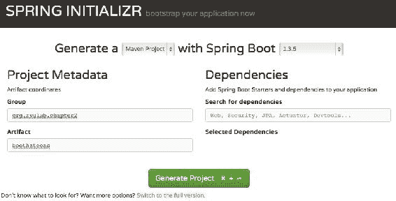

2.  Fill the details, such as whether it is a Maven project, Spring Boot version, group, and artifact ID, as shown earlier, and click on **Switch to the full version** link under the **Generate Project** button. Select **Web**, **HATEOAS**, and **Rest Repositories HAL Browser**. Make sure that the Java version is 8 and the package type is selected as **JAR**:

    

3.  选择后，点击**生成项目**按钮。这将生成一个 Maven 项目，并将该项目作为 ZIP 文件下载到浏览器的下载目录中。
4.  解压缩文件并将其保存到您选择的目录中。
5.  Open STS, go to the **File** menu and click on **Import**:

    

6.  导航至**Maven****现有 Maven 项目**，点击**下一步**。
7.  点击**根目录**旁边的**浏览**，选择解压后的文件夹。点击**完成**。这将把生成的 Maven 项目加载到 STS 的**项目浏览器**中。
8.  编辑`Application.java`文件以添加新的 REST 端点，如下所示：

    ```java
    @RequestMapping("/greeting")
    @ResponseBody
    public HttpEntity<Greet> greeting(@RequestParam(value = "name", required = false, defaultValue = "HATEOAS") String name) {
           Greet greet = new Greet("Hello " + name);
           greet.add(linkTo(methodOn(GreetingController.class).greeting(name)).withSelfRel());

           return new ResponseEntity<Greet>(greet, HttpStatus.OK);
    }
    ```

9.  Note that this is the same `GreetingController` class as in the previous example. However, a method was added this time named `greeting`. In this new method, an additional optional request parameter is defined and defaulted to `HATEOAS`. The following code adds a link to the resulting JSON code. In this case, it adds the link to the same API:

    ```java
    greet.add(linkTo(methodOn(GreetingController.class).greeting(name)).withSelfRel());
    ```

    为此，我们需要从`ResourceSupport`扩展`Greet`类，如下所示。代码的其余部分保持不变：

    ```java
    class Greet extends ResourceSupport{
    ```

10.  `add`方法是`ResourceSupport`中的一种方法。`linkTo`和`methodOn`方法是`ControllerLinkBuilder`的静态方法，这是一个用于在控制器类上创建链接的实用程序类。`methodOn`方法将执行一个虚拟方法调用，`linkTo`将创建一个到控制器类的链接。在这种情况下，我们将使用`withSelfRel`将其指向自身。
11.  默认情况下，这将产生一个链接`/greeting?name=HATEOAS`。客户端可以读取链接并启动另一个调用。
12.  将此作为 Spring 启动应用程序运行。服务器启动完成后，将浏览器指向`http://localhost:8080`。
13.  This will open the HAL browser window. In the **Explorer** field, type `/greeting?name=World!` and click on the **Go** button. If everything is fine, the HAL browser will show the response details as shown in the following screenshot:

    

如屏幕截图所示，**响应主体**部分有一个链接`href`指向同一服务的结果。这是因为我们将引用指向自身。另外，请查看**链接**部分。与**自身**相对的绿色小盒子是可导航链接。

在这个简单的例子中，它并没有多大意义，但在具有许多相关实体的大型应用程序中，它可能很方便。使用提供的链接，客户端可以轻松地在这些实体之间来回导航。

# 下一步是什么？

到目前为止，已经回顾了一些基本的 Spring 引导示例。本章的其余部分将从微服务开发的角度研究一些重要的 Spring 引导特性。在接下来的部分中，我们将了解如何使用动态可配置的属性，更改默认的嵌入式 web 服务器，为微服务添加安全性，以及在处理微服务时实现跨源行为。

### 注

本例的完整源代码在本书的代码文件中作为`chapter2.boot-advanced`项目提供。

# 弹簧靴配置

在本节中，将重点介绍 Spring Boot 的配置方面。已经开发的`chapter2.bootrest`项目将在本节中进行修改，以展示配置功能。复制粘贴`chapter2.bootrest`和将项目重命名为`chapter2.boot-advanced`。

## 了解弹簧靴自动配置

Spring Boot 通过扫描类路径中可用的依赖库，在配置上使用约定。对于 POM 文件中的每个`spring-boot-starter-*`依赖项，Spring Boot 执行一个默认`AutoConfiguration`类。`AutoConfiguration`类使用`*AutoConfiguration`词汇模式，其中`*`表示库。例如，JPA 存储库的自动配置是通过`JpaRepositoriesAutoConfiguration`完成的。

使用`--debug`运行应用程序以查看自动配置报告。以下命令显示`chapter2.boot-advanced`项目的自动配置报告：

```java
$java -jar target/bootadvanced-0.0.1-SNAPSHOT.jar --debug

```

以下是一些自动配置类的示例：

*   `ServerPropertiesAutoConfiguration`
*   `RepositoryRestMvcAutoConfiguration`
*   `JpaRepositoriesAutoConfiguration`
*   `JmsAutoConfiguration`

如果应用程序有特殊要求，并且您希望完全控制配置，则可以排除某些库的自动配置。以下是排除`DataSourceAutoConfiguration`的示例：

```java
@EnableAutoConfiguration(exclude={DataSourceAutoConfiguration.class})
```

## 覆盖默认配置值

也可以使用`application.properties`文件覆盖默认配置值。STS 在`application.properties`上提供了一个易于自动完成的上下文帮助，如以下屏幕截图所示：


在前面的截图中，`server.port`被编辑设置为`9090`。再次运行此应用程序将在端口`9090`上启动服务器。

## 更改配置文件的位置

为了使与十二因素应用程序保持一致，配置参数需要从代码中外部化。Spring Boot 将所有配置具体化为`application.properties`。但是，它仍然是应用程序构建的一部分。此外，通过设置以下属性，可以从包外部读取属性：

```java
spring.config.name= # config file name  
spring.config.location= # location of config file
```

这里，`spring.config.location`可能是本地文件位置。

以下命令使用外部提供的配置文件启动 Spring 引导应用程序：

```java
$java -jar target/bootadvanced-0.0.1-SNAPSHOT.jar --spring.config.name=bootrest.properties

```

## 读取自定义属性

在启动时，`SpringApplication`加载所有属性并将它们添加到 Spring`Environment`类中。将自定义属性添加到`application.properties`文件中。在本例中，自定义属性名为`bootrest.customproperty`。将弹簧`Environment`类自动连接到`GreetingController`类。编辑`GreetingController`类以从`Environment`读取自定义属性，并添加日志语句以将自定义属性打印到控制台。

执行以下步骤：

1.  将以下属性添加到`application.properties`文件：

    ```java
    bootrest.customproperty=hello
    ```

2.  然后，编辑`GreetingController`类如下：

    ```java
    @Autowired
    Environment env;

    Greet greet(){
        logger.info("bootrest.customproperty "+ env.getProperty("bootrest.customproperty"));
        return new Greet("Hello World!");
    }
    ```

3.  重新运行应用程序。log 语句在控制台中打印自定义变量，如下所示：

    ```java
    org.rvslab.chapter2.GreetingController   : bootrest.customproperty hello
    ```

## 使用.yaml 文件进行配置

作为对`application.properties`的替代，可以使用`.yaml`文件。与平面属性文件相比，YAML 提供了类似 JSON 的结构化配置。

要查看此操作，只需将`application.properties`替换为`application.yaml`并添加以下属性：

```java
server
  port: 9080
```

重新运行应用程序以查看控制台中打印的端口。

## 使用多个配置文件

此外，可能有不同的配置文件，如开发、测试、阶段、生产等。这些是逻辑名称。使用这些，可以为不同环境的相同属性配置不同的值。在不同环境下运行 Spring Boot 应用程序时，这非常方便。在这种情况下，从一个环境移动到另一个环境时不需要重建。

更新的`.yaml`文件如下。基于点分隔符的 Spring 引导组配置文件属性：

```java
spring:
    profiles: development
server:
      port: 9090
---

spring:
    profiles: production
server:
      port: 8080
```

按如下方式运行 Spring Boot 应用程序以查看配置文件的使用情况：

```java
mvn -Dspring.profiles.active=production install
mvn -Dspring.profiles.active=development install

```

可以使用`@ActiveProfiles`注释以编程方式指定活动概要文件，这在运行测试用例时特别有用，如下所示：

```java
@ActiveProfiles("test")
```

## 读取属性的其他选项

属性可以通过多种方式加载，例如：

*   命令行参数`(-Dhost.port =9090`
*   操作系统环境变量
*   JNDI（`java:comp/env`）

# 更改默认嵌入式 web 服务器

嵌入式 HTTP 监听器可以轻松定制如下。默认情况下，Spring Boot 支持 Tomcat、Jetty 和 Undertow。在以下示例中，Tomcat 替换为下拖：

```java
<dependency>
    <groupId>org.springframework.boot</groupId>
    <artifactId>spring-boot-starter-web</artifactId>
    <exclusions>
        <exclusion>
            <groupId>org.springframework.boot</groupId>
            <artifactId>spring-boot-starter-tomcat</artifactId>
        </exclusion>
    </exclusions>
</dependency>
<dependency>
    <groupId>org.springframework.boot</groupId>
    <artifactId>spring-boot-starter-undertow</artifactId>
</dependency>
```

# 实现 Spring Boot 安全

确保微服务的安全非常重要。在本节中，我们将使用`chapter2.bootrest`回顾一些保护 Spring Boot 微服务的基本措施，以演示安全功能。

## 用基本安全性保护微服务

在 Spring Boot 中添加基本身份验证非常简单。将以下依赖项添加到`pom.xml`。这将包括必要的 Spring 安全库文件：

```java
<dependency>
  <groupId>org.springframework.boot</groupId> 
  <artifactId>spring-boot-starter-security</artifactId>
</dependency>
```

打开`Application.java`并将`@EnableGlobalMethodSecurity`添加到`Application`类中。此批注将启用方法级安全性：

```java
@EnableGlobalMethodSecurity
@SpringBootApplication
public class Application {
    public static void main(String[] args) {
        SpringApplication.run(Application.class, args);
    }
}
```

默认的基本身份验证假设用户为`user`。默认密码将在启动时在控制台中打印。也可以在`application.properties`中添加用户名和密码，如下图：

```java
security.user.name=guest
security.user.password=guest123
```

在`ApplicationTests`中添加一个新的测试用例来测试安全服务结果，如下所示：

```java
  @Test
  public void testSecureService() {  
    String plainCreds = "guest:guest123";
    HttpHeaders headers = new HttpHeaders();
    headers.add("Authorization", "Basic " + new String(Base64.encode(plainCreds.getBytes())));
    HttpEntity<String> request = new HttpEntity<String>(headers);
    RestTemplate restTemplate = new RestTemplate();

    ResponseEntity<Greet> response = restTemplate.exchange("http://localhost:8080", HttpMethod.GET, request, Greet.class);
    Assert.assertEquals("Hello World!", response.getBody().getMessage());
  }
```

如代码中的所示，创建了一个新的`Authorization`请求头，其 Base64 编码用户名密码字符串。

使用 Maven 重新运行应用程序。请注意，新的测试用例通过了，但旧的测试用例因异常而失败。先前的测试用例现在在没有凭据的情况下运行，因此，服务器拒绝了该请求，并显示以下消息：

```java
org.springframework.web.client.HttpClientErrorException: 401 Unauthorized

```

## 使用 OAuth2 保护微服务

在部分中，我们将了解 OAuth2 的基本 Spring 引导配置。当客户端应用程序需要访问受保护的资源时，客户端将向授权服务器发送请求。授权服务器验证请求并提供访问令牌。此访问令牌针对每个客户端到服务器的请求进行验证。来回发送的请求和响应取决于授予类型。

### 提示

在[阅读更多关于 OAuth 和 grant 类型的 http://oauth.net](http://oauth.net) 。

此示例中将使用资源所有者密码凭据授予方法：


在这种情况下，如上图所示，资源所有者向客户端提供用户名和密码。然后，客户端通过提供凭证信息向授权服务器发送令牌请求。授权服务器授权客户端并返回一个访问令牌。在每个后续请求中，服务器都会验证客户端令牌。

要在我们的示例中实现 OAuth2，请执行以下步骤：

1.  作为第一步，使用 OAuth2 依赖项更新`pom.xml`，如下所示：

    ```java
    <dependency>
      <groupId>org.springframework.security.oauth</groupId>
      <artifactId>spring-security-oauth2</artifactId>
      <version>2.0.9.RELEASE</version>
    </dependency>
    ```

2.  Next, add two new annotations, `@EnableAuthorizationServer` and `@EnableResourceServer`, to the `Application.java` file. The `@EnableAuthorizationServer` annotation creates an authorization server with an in-memory repository to store client tokens and provide clients with a username, password, client ID, and secret. The `@EnableResourceServer` annotation is used to access the tokens. This enables a spring security filter that is authenticated via an incoming OAuth2 token.

    在我们的示例中，授权服务器和资源服务器都是相同的。然而，在实践中，这两个将分别运行。请看下面的代码：

    ```java
    @EnableResourceServer
    @EnableAuthorizationServer
    @SpringBootApplication
    public class Application {
    ```

3.  在`application.properties`文件中添加以下属性：

    ```java
    security.user.name=guest
    security.user.password=guest123
    security.oauth2.client.clientId: trustedclient
    security.oauth2.client.clientSecret: trustedclient123
    security.oauth2.client.authorized-grant-types: authorization_code,refresh_token,password
    security.oauth2.client.scope: openid
    ```

4.  Then, add another test case to test OAuth2, as follows:

    ```java
      @Test
      public void testOAuthService() {
            ResourceOwnerPasswordResourceDetails resource = new ResourceOwnerPasswordResourceDetails();
            resource.setUsername("guest");
            resource.setPassword("guest123");
              resource.setAccessTokenUri("http://localhost:8080/oauth/token");
            resource.setClientId("trustedclient");
            resource.setClientSecret("trustedclient123");
            resource.setGrantType("password");

            DefaultOAuth2ClientContext clientContext = new DefaultOAuth2ClientContext();
            OAuth2RestTemplate restTemplate = new OAuth2RestTemplate(resource, clientContext);

            Greet greet = restTemplate.getForObject("http://localhost:8080", Greet.class);

            Assert.assertEquals("Hello World!", greet.getMessage());
      }
    ```

    如前面的代码所示，通过传递封装在 resource details 对象中的资源详细信息，创建了一个特殊的 REST 模板`OAuth2RestTemplate`。这个 REST 模板处理下面的 OAuth2 进程。访问令牌 URI 是令牌访问的端点。

5.  使用`mvn install`重新运行应用程序。前两个测试用例将失败，新的将成功。这是因为服务器只接受启用 OAuth2 的请求。

这些是弹簧靴开箱即用提供的快速配置，但不足以达到生产级。我们可能需要定制`ResourceServerConfigurer`和`AuthorizationServerConfigurer`以便为生产做好准备。尽管如此，方法仍然是一样的。

# 启用微服务的跨源访问

当从一个来源运行的客户端 web 应用程序从另一个来源请求数据时，浏览器通常受到限制。启用跨源访问通常称为**CORS**（**跨源资源共享**。

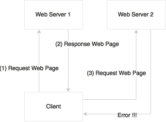

此示例显示如何启用跨源请求。对于微服务，由于每个服务都使用自己的源运行，因此很容易陷入客户端 web 应用程序使用来自多个源的数据的问题。例如，浏览器客户端从客户微服务访问客户和从订单微服务访问订单历史的场景在微服务世界中非常常见。

SpringBoot 提供了一种简单的声明性方法来支持跨源请求。以下示例显示如何启用 microservice 以启用跨源请求：

```java
@RestController
class GreetingController{
  @CrossOrigin
  @RequestMapping("/")
  Greet greet(){
    return new Greet("Hello World!");
  }
}
```

默认情况下，接受所有来源和标题。我们可以通过访问特定的原点来进一步定制跨原点注释，如下所示。`@CrossOrigin`注释允许方法或类接受跨源请求：

```java
@CrossOrigin("http://mytrustedorigin.com")
```

可以使用`WebMvcConfigurer`bean 和定制`addCorsMappings(CorsRegistry registry)`方法来启用全局 CORS。

# 实现 Spring 引导消息传递

在理想情况下，所有微服务交互都应该使用发布-订阅语义异步进行。Spring Boot 提供了一种轻松的机制来配置消息传递解决方案：


在本例中，我们将创建一个 Spring 引导应用程序，其中发送方和接收方都通过外部队列连接。执行以下步骤：

### 注

本例的完整源代码在本书的代码文件中作为`chapter2.bootmessaging`项目提供。

1.  Create a new project using STS to demonstrate this capability. In this example, instead of selecting **Web**, select **AMQP** under **I/O**:

    

2.  Rabbit MQ will also be needed for this example. Download and install the latest version of Rabbit MQ from [https://www.rabbitmq.com/download.html](https://www.rabbitmq.com/download.html).

    本书中使用了 Rabbit MQ 3.5.6。

3.  遵循现场记录的安装步骤。准备好后，通过以下命令启动 RabbitMQ 服务器：

    ```java
    $./rabbitmq-server

    ```

4.  对`application.properties`文件进行配置更改，以反映 RabbitMQ 配置。以下配置使用 RabbitMQ 的默认端口、用户名和密码：

    ```java
    spring.rabbitmq.host=localhost
    spring.rabbitmq.port=5672
    spring.rabbitmq.username=guest
    spring.rabbitmq.password=guest
    ```

5.  在`src/main/java`下的`Application.java`文件中添加消息发送方组件和`org.springframework.amqp.core.Queue`类型的`TestQ`队列。`RabbitMessagingTemplate`是一种方便的消息发送方式，它将抽象所有消息语义。Spring Boot 提供所有样板配置以发送消息：

    ```java
    @Component 
    class Sender {
      @Autowired
      RabbitMessagingTemplate template;
      @Bean
      Queue queue() {
        return new Queue("TestQ", false);
      }
      public void send(String message){
        template.convertAndSend("TestQ", message);
      }
    }
    ```

6.  要接收消息，只需要使用一个`@RabbitListener`注释。Spring Boot 自动配置所有必需的样板配置：

    ```java
    @Component
    class Receiver {
        @RabbitListener(queues = "TestQ")
        public void processMessage(String content) {
           System.out.println(content);
        }
    }
    ```

7.  本练习的最后一部分是将发送者连接到我们的主应用程序，并实现`CommandLineRunner`的`run`方法来启动消息发送。当应用程序初始化时，它调用`CommandLineRunner`的`run`方法，如下所示：

    ```java
    @SpringBootApplication
    public class Application implements CommandLineRunner{

      @Autowired
      Sender sender;

        public static void main(String[] args) {
            SpringApplication.run(Application.class, args);
        }

        @Override
        public void run(String... args) throws Exception {
          sender.send("Hello Messaging..!!!");
        }
    }
    ```

8.  将应用程序作为 Spring Boot 应用程序运行，并验证输出。控制台中将打印以下消息：

    ```java
    Hello Messaging..!!!

    ```

# 开发综合微服务实例

到目前为止，我们所考虑的示例只不过是一个简单的“Hello world”。结合我们所学到的内容，本节演示了端到端的客户配置文件微服务实现。客户档案微服务将演示不同微服务之间的交互。它还演示了带有业务逻辑和原始数据存储的微服务。

在本例中，将开发两个微服务，即客户概要和客户通知服务：


如图所示，客户档案微服务公开了**创建、读取、更新和删除**（**CRUD**）一个客户和一个注册客户的注册服务的方法。注册流程应用特定的业务逻辑，保存客户档案，并向客户通知微服务发送消息。Customer Notification microservice 接受注册服务发送的消息，并使用 SMTP 服务器向客户发送电子邮件。异步消息传递用于将客户配置文件与客户通知服务集成。

客户微服务类域模型图如下所示：


图中的`CustomerController`是 REST 端点，它调用组件类`CustomerComponent`。组件类/bean 处理所有业务逻辑。`CustomerRepository`是定义用于处理`Customer`实体持久性的 Spring 数据 JPA 存储库。

### 注

本示例的完整源代码在本书的代码文件中以`chapter2.bootcustomer`和`chapter2.bootcustomernotification`项目的形式提供。

1.  Create a new Spring Boot project and call it `chapter2.bootcustomer`, the same way as earlier. Select the options as in the following screenshot in the starter module selection screen:

    

    这个将创建一个包含 JPA、REST 存储库和 H2 作为数据库的 web 项目。H2 是一个微型内存嵌入式数据库，使用它可以轻松演示数据库功能。在现实世界中，建议使用适当的企业级数据库。本例使用 JPA 定义持久性实体，并使用 REST 存储库公开基于 REST 的存储库服务。

    项目结构将类似于以下屏幕截图：

    

2.  通过添加名为`Customer`的实体类开始构建应用程序。为简单起见，`Customer`实体类中只添加了三个字段：自动生成的`id`字段、`name`和`email`。请看下面的代码：

    ```java
    @Entity
    class Customer {
      @Id
      @GeneratedValue(strategy = GenerationType.AUTO)
      private Long id;
      private String name;
      private String email;
    ```

3.  Add a repository class to handle the persistence handling of Customer. `CustomerRepository` extends the standard JPA repository. This means that all CRUD methods and default finder methods are automatically implemented by the Spring Data JPA repository, as follows:

    ```java
    @RepositoryRestResource
    interface CustomerRespository extends JpaRepository <Customer,Long>{
      Optional<Customer> findByName(@Param("name") String name);
    }
    ```

    在本例中，我们向 repository 类`findByName`添加了一个新方法，它基本上根据客户名称搜索客户，如果有匹配的名称，则返回一个`Customer`对象。

4.  The `@RepositoryRestResource` annotation enables the repository access through RESTful services. This will also enable HATEOAS and HAL by default. As for CRUD methods there is no additional business logic required, we will leave it as it is without controller or component classes. Using HATEOAS will help us navigate through Customer Repository methods effortlessly.

    请注意，没有添加任何指向任何数据库的配置。由于 H2 库位于类路径中，所有配置默认情况下都是通过基于 H2 自动配置的 Spring 引导完成的。

5.  通过添加`CommandLineRunner`更新`Application.java`文件，使用一些客户记录初始化存储库，如下所示：

    ```java
    @SpringBootApplication
    public class Application {
        public static void main(String[] args) {
            SpringApplication.run(Application.class, args);
        }

        @Bean
      CommandLineRunner init(CustomerRespository repo) {
      return (evt) ->  {
        repo.save(new Customer("Adam","adam@boot.com"));
        repo.save(new Customer("John","john@boot.com"));
      repo.save(new Customer("Smith","smith@boot.com"));
        repo.save(new Customer("Edgar","edgar@boot.com"));
        repo.save(new Customer("Martin","martin@boot.com"));
        repo.save(new Customer("Tom","tom@boot.com"));
        repo.save(new Customer("Sean","sean@boot.com"));
      };
      }
    }
    ```

6.  `CommandLineRunner`定义为 bean，表示当它包含在`SpringApplication`中时应该运行。这将在启动时向数据库中插入六条示例客户记录。
7.  此时，将应用程序作为 Spring 引导应用程序运行。打开 HAL 浏览器并将浏览器指向`http://localhost:8080`。
8.  在**浏览器**部分，指向`http://localhost:8080/customers`并点击**Go**。这将列出 HAL 浏览器的**响应主体**部分中的所有客户。
9.  In the **Explorer** section, enter `http://localhost:8080/customers?size=2&page=1&sort=name` and click on **Go**. This will automatically execute paging and sorting on the repository and return the result.

    当页面大小设置为`2`且请求第一页时，它将以排序顺序返回两条记录。

10.  Review the **Links** section. As shown in the following screenshot, it will facilitate navigating **first**, **next**, **prev**, and **last**. These are done using the HATEOAS links automatically generated by the repository browser:

    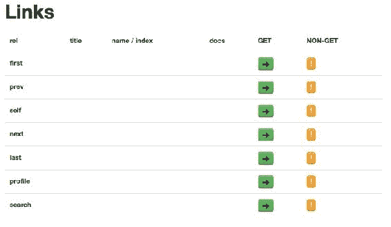

11.  此外，您还可以通过选择适当的链接，例如`http://localhost:8080/customers/2`，来了解客户的详细信息。
12.  作为下一步，添加控制器类`CustomerController`，以处理服务端点。此类中只有一个端点`/register`，用于注册客户。如果成功，则返回`Customer`对象作为响应，如下所示：

    ```java
    @RestController
    class CustomerController{

      @Autowired
      CustomerRegistrar customerRegistrar;

      @RequestMapping( path="/register", method = RequestMethod.POST)
      Customer register(@RequestBody Customer customer){
        return customerRegistrar.register(customer);
      }
    }
    ```

13.  增加`CustomerRegistrar`组件处理业务逻辑。在这种情况下，只有最小的业务逻辑添加到组件中。在这个组件类中，在注册客户时，我们将只检查数据库中是否已经存在客户名称。如果不存在，我们将插入一条新记录，否则我们将返回一条错误消息，如下所示：

    ```java
    @Component 
    class CustomerRegistrar {

      CustomerRespository customerRespository;

      @Autowired
      CustomerRegistrar(CustomerRespository customerRespository){
        this.customerRespository = customerRespository;
      }

      Customer register(Customer customer){
        Optional<Customer> existingCustomer = customerRespository.findByName(customer.getName());
        if (existingCustomer.isPresent()){
          throw new RuntimeException("is already exists");
        } else {
          customerRespository.save(customer); 
        }
        return customer;
      }
    }
    ```

14.  重新启动启动应用程序，并通过 URL`http://localhost:8080`使用 HAL 浏览器进行测试。
15.  Point the **Explorer** field to `http://localhost:8080/customers`. Review the results in the **Links** section:

    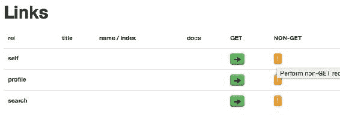

16.  Click on the **NON-GET** option against **self**. This will open a form to create a new customer:

    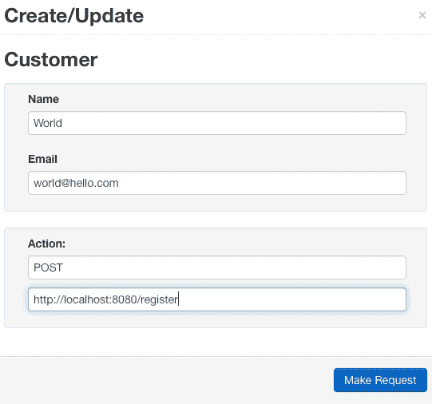

17.  填写表格并更改**动作**，如图所示。点击**提出请求**按钮。这将调用注册服务并注册客户。尝试提供一个重复的名称来测试否定的情况。
18.  让我们通过集成客户通知服务来通知客户，从而完成示例中的最后一部分。注册成功后，通过异步调用 customer Notification microservice 向客户发送电子邮件。
19.  第一个更新`CustomerRegistrar`呼叫第二个服务。这是通过消息传递完成的。在本例中，我们注入了一个`Sender`组件，通过将客户的电子邮件地址传递给发送方来向客户发送通知，如下所示：

    ```java
    @Component 
    @Lazy
    class CustomerRegistrar {

      CustomerRespository customerRespository;
      Sender sender;

      @Autowired
      CustomerRegistrar(CustomerRespository customerRespository, Sender sender){
        this.customerRespository = customerRespository;
        this.sender = sender;
      }

      Customer register(Customer customer){
        Optional<Customer> existingCustomer = customerRespository.findByName(customer.getName());
        if (existingCustomer.isPresent()){
          throw new RuntimeException("is already exists");
        } else {
          customerRespository.save(customer); 
          sender.send(customer.getEmail());
        } 
        return customer;
      }
    }
    ```

20.  The sender component will be based on RabbitMQ and AMQP. In this example, `RabbitMessagingTemplate` is used as explored in the last messaging example; take a look at the following:

    ```java
    @Component 
    @Lazy
    class Sender {

      @Autowired
      RabbitMessagingTemplate template;

      @Bean
      Queue queue() {
        return new Queue("CustomerQ", false);
      }

      public void send(String message){
        template.convertAndSend("CustomerQ", message);
      }
    }
    ```

    `@Lazy`注释非常有用，它有助于增加启动时间。这些 bean 只有在需要时才会初始化。

21.  我们还将更新`application.property`文件以包含兔子 MQ 相关属性，如下所示：

    ```java
    spring.rabbitmq.host=localhost
    spring.rabbitmq.port=5672
    spring.rabbitmq.username=guest
    spring.rabbitmq.password=guest
    ```

22.  我们已准备好发送消息。为了使用消息和发送电子邮件，我们将创建一个通知服务。为此，让我们创建另一个 Spring 引导服务`chapter2.bootcustomernotification`。创建 Spring Boot 服务时，请确保选择了**AMQP**和**邮件**启动器库。**AMQP**和**邮件**都在**I/O**下。
23.  The package structure of the `chapter2.bootcustomernotification` project is as shown here:

    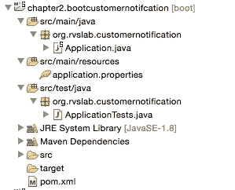

24.  添加一个`Receiver`类。`Receiver`类等待有关 customer 的消息。此将接收客户档案服务发送的消息。消息到达时，它会发送一封电子邮件，如下所示：

    ```java
    @Component
    class Receiver {  
      @Autowired
      Mailer mailer;

      @Bean
      Queue queue() {
        return new Queue("CustomerQ", false);
      }

      @RabbitListener(queues = "CustomerQ")
        public void processMessage(String email) {
           System.out.println(email);
           mailer.sendMail(email);
        }
    }
    ```

25.  Add another component to send an e-mail to the customer. We will use `JavaMailSender` to send an e-mail via the following code:

    ```java
    @Component 
    class Mailer {
      @Autowired
      private  JavaMailSender  javaMailService;
        public void sendMail(String email){
          SimpleMailMessage mailMessage=new SimpleMailMessage();
          mailMessage.setTo(email);
          mailMessage.setSubject("Registration");
          mailMessage.setText("Successfully Registered");
          javaMailService.send(mailMessage);
        }
    }
    ```

    在幕后，Spring Boot 会自动配置`JavaMailSender`所需的所有参数。

26.  要测试 SMTP，需要对 SMTP 进行测试设置，以确保邮件正在发送。在本例中，将使用 FakeSMTP。您可以从[下载 FakeSMTPhttp://nilhcem.github.io/FakeSMTP](http://nilhcem.github.io/FakeSMTP) 。
27.  Once you download `fakeSMTP-2.0.jar`, run the SMTP server by executing the following command:

    ```java
    $ java -jar fakeSMTP-2.0.jar

    ```

    这将打开一个 GUI 来监视电子邮件。单击侦听端口文本框旁边的**启动服务器**按钮。

28.  使用以下配置参数更新`application.properties`以连接到 RabbitMQ 以及邮件服务器：

    ```java
    spring.rabbitmq.host=localhost
    spring.rabbitmq.port=5672
    spring.rabbitmq.username=guest
    spring.rabbitmq.password=guest

    spring.mail.host=localhost
    spring.mail.port=2525
    ```

29.  We are ready to test our microservices end to end. Start both the Spring Boot apps. Open the browser and repeat the customer creation steps through the HAL browser. In this case, immediately after submitting the request, we will be able to see the e-mail in the SMTP GUI.

    在内部，Customer Profile service 异步调用 Customer Notification service，然后 Customer Notification service 将电子邮件发送到 SMTP 服务器：

    

# 弹簧靴执行器

前面的章节探讨了开发微服务所需的大多数 Spring Boot 功能。在本节中，将探讨 Spring Boot 的一些生产准备操作方面。

弹簧靴执行器提供了一种出色的开箱即用机制，用于监控和管理生产中的弹簧靴应用：

### 注

本例的完整源代码在本书的代码文件中作为`chapter2.bootactuator`项目提供。

1.  创建另一个**Spring Starter 项目**并将其命名为`chapter2.bootactuator`。这次在**Ops**下选择**Web**和**执行器**。与`chapter2.bootrest`项目类似，使用`greet`方法添加`GreeterController`端点。
2.  作为 Spring 启动应用程序启动应用程序。
3.  Point the browser to `localhost:8080/actuator`. This will open the HAL browser. Then, review the **Links** section.

    在**链接**部分中提供了许多链接。弹簧防尘套执行器会自动将其暴露：

    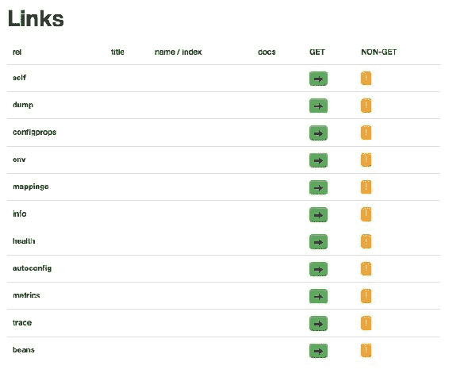

以下列出了一些重要链接：

*   `dump`：此执行线程转储并显示结果
*   `mappings`：此列出了所有 HTTP 请求映射
*   `info`：此显示有关应用程序的信息
*   `health`：此显示应用程序的运行状况
*   `autoconfig`：此显示自动配置报告
*   `metrics`：此显示从应用程序收集的不同度量

## 使用 JConsole 进行监控

或者，我们可以使用 JMX 控制台查看 Spring 引导信息。从 JConsole 连接到远程 Spring 启动实例。引导信息将显示如下：

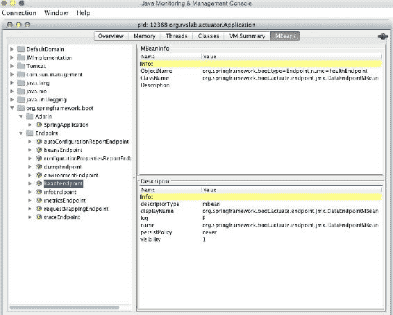

## 使用 SSH 进行监控

Spring Boot 使用 SSH 提供对启动应用程序的远程访问。以下命令从终端窗口连接到 Spring Boot 应用程序：

```java
$ ssh -p 2000 user@localhost

```

可以通过在`application.properties`文件中添加`shell.auth.simple.user.password`属性来定制密码。更新后的`application.properties`文件将类似于以下内容：

```java
shell.auth.simple.user.password=admin
```

当与上述命令连接时，可以访问类似的执行器信息。以下是通过 CLI 访问的度量信息示例：

*   `help`：列出所有可用选项
*   `dashboard`：这是一个有趣的特性，显示了很多系统级信息

# 配置应用信息

在`application.properties`中可以设置以下属性，自定义应用相关信息。添加后，重启服务器，访问执行器的`/info`端点查看更新信息，如下所示：

```java
info.app.name=Boot actuator
info.app.description= My Greetings Service
info.app.version=1.0.0
```

# 添加自定义健康模块

向 Spring Boot 应用程序添加一个新的自定义模块并不复杂。为了演示此功能，假设一个服务在一分钟内获得两个以上的事务，那么服务器状态将设置为停止服务。

为了定制它，我们必须实现`HealthIndicator`接口并重写`health`方法。以下是完成此工作的快速而肮脏的实现：

```java
class TPSCounter {
  LongAdder count;
  int threshold = 2;
  Calendar expiry = null; 

  TPSCounter(){
    this.count = new LongAdder();
    this.expiry = Calendar.getInstance();
    this.expiry.add(Calendar.MINUTE, 1);
  }

  boolean isExpired(){
    return Calendar.getInstance().after(expiry);
  }

  boolean isWeak(){
    return (count.intValue() > threshold);
  }

  void increment(){
     count.increment();
  }
}
```

前面的类是一个简单的 POJO 类，用于维护窗口中的事务计数。`isWeak`方法检查特定窗口中的事务是否达到其阈值。`isExpired`方法检查当前窗口是否过期。`increment`方法只是增加计数器值。

下一步，实现我们的定制健康指标类`TPSHealth`。这是通过扩展`HealthIndicator`来实现的，如下所示：

```java
@Component
class TPSHealth implements HealthIndicator {
  TPSCounter counter;

@Override
    public Health health() {
        boolean health = counter.isWeak(); // perform some specific health check
        if (health) {
            return Health.outOfService().withDetail("Too many requests", "OutofService").build();
        }
        return Health.up().build();
    }

    void updateTx(){
    if(counter == null || counter.isExpired()){
      counter = new TPSCounter();

    }
    counter.increment();
    }
}
```

`health`方法检查计数器是否弱。弱计数器意味着服务处理的事务超过了它所能处理的数量。如果它很弱，它会将实例标记为停止服务。

最后，我们将把`TPSHealth`自动连接到`GreetingController`类中，然后在`greet`方法中调用`health.updateTx()`，如下所示：

```java
  Greet greet(){
    logger.info("Serving Request....!!!");
    health.updateTx(); 
    return new Greet("Hello World!");
  }
```

转到 HAL 浏览器中的`/health`端点，查看服务器的状态。

现在，打开另一个浏览器，指向`http://localhost:8080`，并启动服务两到三次。返回`/health`端点并刷新以查看状态。应将其更改为停止使用。

在本例中，由于除了收集运行状况状态之外没有其他操作，因此即使状态为“停止服务”，新的服务调用仍将通过。然而，在现实世界中，程序应该读取`/health`端点并阻止进一步的请求进入该实例。

## 构建自定义度量

与健康状况类似，指标的定制也是可能的。以下示例演示如何添加计数器服务和仪表服务，仅供演示：

```java
  @Autowired   
  CounterService counterService;

  @Autowired
  GaugeService gaugeService;
```

在问候方法中添加以下方法：

```java
  this.counterService.increment("greet.txnCount");
  this.gaugeService.submit("greet.customgauge", 1.0);
```

重新启动服务器并转到`/metrics`查看添加的新仪表和计数器已反映在中。

# 记录微服务

API 文档的传统方法是编写服务规范文档或使用静态服务注册中心。由于有大量的微服务，很难保持 API 文档的同步。

微服务可以以多种方式记录。本节将探讨如何使用流行的 Swagger 框架记录微服务。下面的示例将使用 Springfox 库生成 RESTAPI 文档。Springfox 是一组 Java 和 Spring 友好的库。

创建一个新的**Spring Starter 项目**，并在库选择窗口中选择**Web**。将项目命名为`chapter2.swagger`。

### 注

本例的完整源代码在本书的代码文件中作为`chapter2.swagger`项目提供。

由于 Springfox 库不是 Spring 套件的一部分，请编辑`pom.xml`并添加 Springfox Swagger 库依赖项。将以下依赖项添加到项目中：

```java
<dependency>
    <groupId>io.springfox</groupId>
    <artifactId>springfox-swagger2</artifactId>
    <version>2.3.1</version>
</dependency>  
<dependency>
    <groupId>io.springfox</groupId>
    <artifactId>springfox-swagger-ui</artifactId>
    <version>2.3.1</version>
</dependency>
```

创建一个类似于前面创建的服务的 REST 服务，但也添加了`@EnableSwagger2`注释，如下所示：

```java
@SpringBootApplication
@EnableSwagger2
public class Application {
```

这就是基本的招摇过市文档所需的全部内容。启动应用程序并将浏览器指向`http://localhost:8080/swagger-ui.html`。这将打开 Swagger API 文档页面：

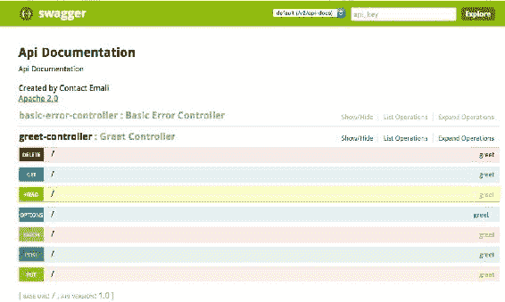

如图所示，招摇过市者列出了**问候控制器**上可能的操作。点击**获取**操作。这将扩展**GET**行，该行提供了一个尝试该操作的选项。

# 总结

在本章中，您了解了 Spring Boot 及其构建生产就绪应用程序的关键特性。

我们研究了上一代 web 应用程序，然后探讨了 Spring Boot 如何使开发人员的生活更容易开发完全合格的微服务。我们还讨论了服务之间基于异步消息的交互。此外，我们还通过实例探讨了如何实现微服务所需的一些关键功能，如安全性、HATEOAS、跨源、配置等。我们还了解了 Spring 启动执行器如何帮助操作团队，以及我们如何根据需要定制它。最后，还探讨了记录微服务 API。

在下一章中，我们将深入探讨在实现微服务时可能出现的一些实际问题。我们还将讨论一个能力模型，该模型在处理大型微服务实现时基本上有助于组织。