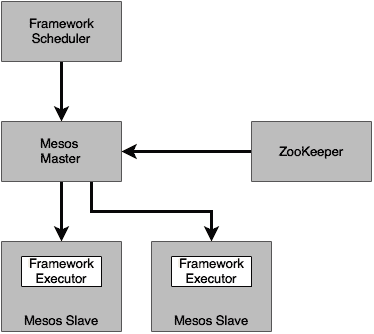
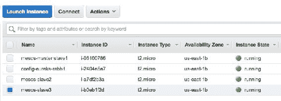
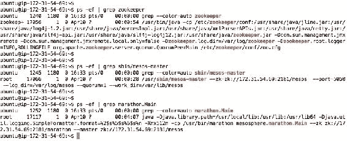
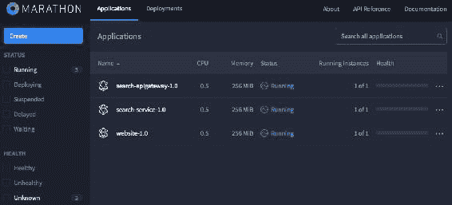
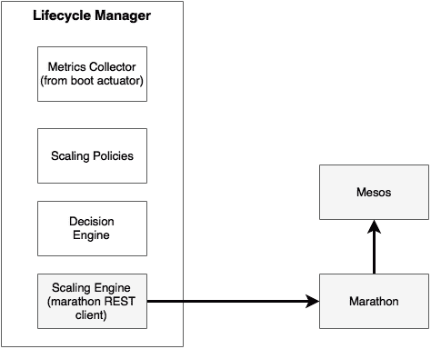

# 第 9 章：使用 Mesos 和 Marathon 管理停靠的微服务

在 Internet 规模的微服务部署中，管理数千个停靠的微服务并不容易。有一个基础设施抽象层和一个强大的集群控制平台来成功管理互联网规模的微服务部署是至关重要的。

本章将分别解释 Mesos 和 Marathon 作为基础设施抽象层和集群控制系统的需要和使用，以在大规模部署微服务时在类似云的环境中实现资源的优化使用。本章还将提供在云环境中逐步建立 Mesos 和 Marathon 的方法。最后，本章将演示如何在 Mesos 和 Marathon 环境中管理停靠的微服务。

在本章结束时，您将了解：

*   需要有一个抽象层和集群控制软件
*   微服务背景下的 Mesos 和 Marathon
*   使用 Mesos 和 Marathon 管理停靠的布朗菲尔德航空公司的 PSS 微服务

# 回顾微服务能力模型

在本章中，我们将从[第 3 章](03.html "Chapter 3. Applying Microservices Concepts")中讨论的微服务能力模型中探索**集群控制&供应**微服务能力，*应用微服务概念*：


# 丢失的碎片

在[第 8 章](08.html "Chapter 8. Containerizing Microservices with Docker")*中，我们与 Docker*讨论了如何对接布朗菲尔德航空公司的 PSS 微服务。Docker 帮助将 JVM 运行时和 OS 参数与应用程序打包在一起，以便在将停靠的微服务从一个环境移动到另一个环境时不需要特别考虑。Docker 提供的 RESTAPI 简化了生命周期管理器在启动和停止工件时与目标机器的交互。

在具有成百上千个 Docker 容器的大规模部署中，我们需要确保 Docker 容器在其自身资源约束（如内存、CPU 等）下运行。除此之外，可能还为 Docker 部署设置了一些规则，例如容器的复制副本不应在同一台计算机上运行。此外，还需要一种机制来优化使用服务器基础设施，以避免产生额外成本。

有些组织处理数十亿个容器。手动管理它们几乎是不可能的。在大规模 Docker 部署的背景下，需要回答的一些关键问题包括：

*   我们如何管理数千个集装箱？
*   我们如何监控他们？
*   在部署工件时，我们如何应用规则和约束？
*   我们如何确保正确使用容器以获得资源效率？
*   我们如何确保在任何时间点至少运行一定数量的最小实例？
*   我们如何确保依赖服务启动并运行？
*   我们如何进行滚动升级和优雅迁移？
*   我们如何回滚错误的部署？

所有这些问题都表明需要有一个解决方案来解决以下两个关键功能：

*   集群抽象层，在许多物理或虚拟机上提供统一的抽象
*   一个群集控制和初始化系统，用于在群集抽象之上智能地管理部署

生命周期经理是处理这些情况的理想人选。可以为生命周期管理器添加足够的智能来解决这些问题。但是，在尝试修改生命周期管理器之前，必须进一步了解集群管理解决方案的作用。

# 为什么集群管理很重要

随着微服务将应用程序分成不同的微应用程序，许多开发人员要求部署更多的服务器节点。为了正确管理微服务，开发人员倾向于为每个 VM 部署一个微服务，这进一步降低了资源利用率。在许多情况下，这会导致 CPU 和内存的过度分配。

在许多部署中，微服务的高可用性要求迫使工程师添加越来越多的服务实例以实现冗余。实际上，尽管它提供了所需的高可用性，但这将导致服务器实例未充分利用。

一般来说，与单片应用程序部署相比，微服务部署需要更多的基础设施。由于基础设施成本的增加，许多组织无法看到微服务的价值：


为了解决前面提到的问题，我们需要一个能够实现以下功能的工具：

*   自动化许多活动，例如高效地将容器分配到基础架构，并使其对开发人员和管理员透明
*   为开发人员提供了一个抽象层，这样他们就可以针对数据中心部署应用程序，而不必知道将使用哪台机器来承载他们的应用程序
*   针对部署构件设置规则或约束
*   为开发人员和管理员提供更高级别的灵活性，并尽可能减少管理开销，也许还需要最少的人员交互
*   通过最大限度地利用可用资源，经济高效地构建、部署和管理应用程序

容器解决了这方面的一个重要问题。我们选择的任何具有这些功能的工具都可以以统一的方式处理容器，而不考虑底层的微服务技术。

# 集群管理做什么？

典型的集群管理工具帮助虚拟化一组机器，并将它们作为单个集群进行管理。集群管理工具还有助于在机器之间移动工作负载或容器，同时对消费者透明。技术传播者和从业者使用不同的术语，如集群编排、集群管理、数据中心虚拟化、容器调度器或容器生命周期管理、容器编排、数据中心操作系统等。

这些工具中的许多目前都支持基于 Docker 的容器以及非容器化的二进制工件部署，例如独立的 Spring 引导应用程序。这些集群管理工具的基本功能是从应用程序开发人员和管理员那里抽象出实际的服务器实例。

群集管理工具有助于基础架构的自助服务和资源调配，而不是要求基础架构团队使用预定义的规范分配所需的机器。在这种自动化集群管理方法中，机器不再预先配置并预先分配给应用程序。一些集群管理工具还可以帮助跨多台异构机器甚至跨数据中心虚拟化数据中心，并创建一个弹性的私有云式基础设施。集群管理工具没有标准参考模型。因此，各供应商的能力各不相同。

集群管理软件的一些关键功能总结如下：

*   **集群管理**：它将虚拟机和物理机集群作为单个大型机进行管理。这些机器在资源能力方面可能是异构的，但它们大体上是以 Linux 为操作系统的机器。这些虚拟集群可以在云上、本地或两者的组合上形成。
*   **部署**：它处理应用程序和容器的自动部署，使用一大组机器。它支持应用程序容器的多个版本，还支持跨大量群集计算机的滚动升级。这些工具还能够处理故障升级的回滚。
*   **可伸缩性**：它根据需要处理应用实例的自动和手动可伸缩性，优化利用率是首要目标。
*   **健康**：它管理集群、节点和应用程序的健康。它从集群中删除故障机器和应用程序实例。
*   **基础设施抽象**：它将开发人员从部署应用程序的实际机器中抽象出来。开发人员不必担心机器、容量等等。如何调度和运行应用程序完全由集群管理软件决定。这些工具还从开发人员那里提取机器细节、容量、利用率和位置。对于应用程序所有者来说，它们相当于一台容量几乎无限的大型机器。
*   **资源优化**：这些工具的固有行为是在一组可用机器上高效地分配容器工作负载，从而降低拥有成本。可以有效地使用简单到极其复杂的算法来提高利用率。
*   **资源分配**：它根据资源可用性和应用开发人员设置的约束来分配服务器。资源分配基于这些约束、关联规则、端口要求、应用程序依赖关系、运行状况等。
*   **服务可用性**：它确保服务在集群中的某个地方启动并运行。在机器出现故障的情况下，群集控制工具通过在群集中的其他一些机器上重新启动这些服务来自动处理故障。
*   **敏捷性**：这些工具能够快速将工作负载分配到可用资源，或者在资源需求发生变化时跨机器移动工作负载。此外，还可以设置约束以根据业务关键性、业务优先级等重新调整资源。
*   **隔离**：这些工具中的一些提供了开箱即用的资源隔离。因此，即使应用程序不是容器化的，也可以实现资源隔离。

资源分配使用各种算法，从简单算法到复杂算法，包括机器学习和人工智能。常用的算法有随机算法、装箱算法和排列算法。针对应用程序设置的约束将覆盖基于资源可用性的默认算法：


上图显示了这些算法如何使用部署填充可用的计算机。在这种情况下，使用两台机器进行演示：

*   **Spread**：此算法在可用机器上平均分配工作负载。如图**A**所示。
*   **装箱**：此算法尝试一台机器一台机器地填充数据，确保机器的最大利用率。当以按需付费的方式使用云服务时，Bin 打包尤其好。如图**B**所示。
*   **随机**：此算法随机选择机器，并在随机选择的机器上部署容器。如图**C**所示。

有可能使用机器学习和协同过滤等认知计算算法来提高效率。**超额订阅**等技术通过将未充分利用的资源分配给高优先级任务（例如，为分析、视频、图像处理等尽力而为的任务提供创收服务），实现了资源的更好利用。

# 与微服务的关系

微服务的基础设施如果配置不当，很容易导致基础设施过大，从本质上说，拥有成本更高。如前几节所述，在处理大规模微服务时，具有集群管理工具的云环境对于实现成本效益至关重要。

SpringCloud 项目中的 SpringBoot 微服务是利用集群管理工具的理想候选工作负载。由于基于 Spring 云的微服务不知道位置，因此这些服务可以部署在集群中的任何位置。每当服务出现时，它们都会自动注册到服务注册中心并公布其可用性。另一方面，使用者总是寻找注册表来发现可用的服务实例。这样，应用程序支持全流体结构，而无需预先假定部署拓扑。使用 Docker，我们能够抽象运行时，以便服务可以在任何基于 Linux 的环境中运行。

# 与虚拟化的关系

集群管理解决方案与服务器虚拟化解决方案有很多不同之处。群集管理解决方案作为应用程序组件运行在虚拟机或物理机器之上。

# 集群管理解决方案

有很多可用的集群管理软件工具。在他们之间做一个苹果对苹果的比较是不公平的。尽管没有一对一的组件，但它们之间的功能有许多重叠区域。在许多情况下，组织使用一个或多个这些工具的组合来满足其需求。

下图显示了 microservices 上下文中群集管理工具的位置：


在本部分中，我们将探讨市场上流行的一些集群管理解决方案。

## 码头工人群

Docker Swarm 是 Docker 的原生集群管理解决方案。Swarm 提供了与 Docker 的本地和更深入的集成，公开了与 Docker 的远程 API 兼容的 API。Docker Swarm 对 Docker 主机池进行逻辑分组，并将其作为单个大型 Docker 虚拟主机进行管理。与应用程序管理员和开发人员决定将容器部署到哪个主机不同，此决策将委托给 Docker Swarm。Docker Swarm 将根据装箱和摊铺算法决定使用哪台主机。

由于 Docker Swarm 基于 Docker 的远程 API，与任何其他容器编排工具相比，已经使用 Docker 的人的学习曲线要窄一些。然而，Docker Swarm 是市场上相对较新的产品，它只支持 Docker 容器。

Docker Swarm 采用了**管理器**和**节点**的概念。管理器是管理部门交互和安排 Docker 容器执行的单一点。节点是部署和运行 Docker 容器的地方。

## 库伯内特斯

Kubernetes（k8s）来自谷歌工程，用 Go 语言编写，并在谷歌进行大规模部署的战斗测试。与 Swarm 类似，Kubernetes 帮助跨节点集群管理容器化应用程序。Kubernetes 帮助自动化容器部署、调度和容器的可伸缩性。Kubernetes 支持许多现成的有用功能，例如自动渐进展开、版本化部署，以及容器因某种原因失败时的容器恢复能力。

Kubernetes 架构具有**主节点**、**节点**和**吊舱**的概念。主节点和节点共同构成 Kubernetes 集群。主节点负责跨多个节点分配和管理工作负载。节点只不过是虚拟机或物理机器。节点进一步细分为 POD。一个节点可以承载多个吊舱。一个或多个容器分组并在 pod 内执行。POD 还有助于管理和部署同一位置的服务，以提高效率。Kubernetes 还支持标签作为键值对的概念，以查询和查找容器。标签是用户定义的参数，用于标记执行常见工作负载类型的特定类型的节点，例如前端 web 服务器。部署在集群上的服务获得单个 IP/DNS 来访问该服务。

Kubernetes 对 Docker 有现成的支持；然而，与 Docker Swarm 相比，Kubernetes 学习曲线更陡峭。RedHat 为 Kubernetes 提供商业支持，作为其 OpenShift 平台的一部分。

## 阿帕奇 Mesos

MeSOS 是一个开源的框架，To1 T1，最初由加州大学伯克利分校开发，并被推特在规模上使用。Twitter 主要使用 Mesos 来管理大型 Hadoop 生态系统。

Mesos 与以前的解决方案略有不同。Mesos 更像是一个资源管理器，它依赖于其他框架来管理工作负载执行。Mesos 位于操作系统和应用程序之间，提供了一个逻辑机器集群。

Mesos 是一个分布式系统内核，它将多台计算机逻辑分组并虚拟化为一台大型计算机。Mesos 能够将大量异构资源分组到一个统一的资源集群中，应用程序可以部署在该集群上。由于这些原因，Mesos 也被称为在数据中心构建私有云的工具。

Mesos 有**主**和**从**节点的概念。与早期的解决方案类似，主节点负责管理集群，而从节点负责运行工作负载。Mesos 内部使用 ZooKeeper 进行集群协调和存储。Mesos 支持框架的概念。这些框架负责调度和运行非容器化的应用程序和容器。Marathon、Chronos 和 Aurora 是用于调度和执行应用程序的流行框架。Netflix Fenzo 是另一个开源 Mesos 框架。有趣的是，Kubernetes 也可以用作介观框架。

Marathon 支持 Docker 容器以及非容器化应用程序。弹簧靴可在马拉松中直接配置。Marathon 提供了许多现成的功能，例如支持应用程序依赖关系、将应用程序分组以扩展和升级服务、启动和关闭健康和不健康的实例、推出升级、回滚失败的升级，等等。

作为 DCOS 平台的一部分，Mesosphere 为 Mesos 和 Marathon 提供商业支持。

## 游牧民族

HashiCorp 的 Nomad 是另一个集群管理软件。Nomad 是一个集群管理系统，它提取较低级别的机器细节及其位置。与前面探讨的其他解决方案相比，Nomad 的体系结构更简单。Nomad 也是轻量级的。与其他集群管理解决方案类似，Nomad 负责资源分配和应用程序的执行。Nomad 还接受特定于用户的约束，并基于此分配资源。

Nomad 有**服务器**的概念，所有作业都在其中管理。一台服务器充当**领导者**，其他服务器充当**追随者**。Nomad 有**任务**的概念，这是最小的工作单元。任务分为**任务组**。任务组具有要在同一位置执行的任务。一个或多个任务组或任务作为**作业**进行管理。

Nomad 支持许多开箱即用的工作负载，包括 Docker。Nomad 还支持跨数据中心部署，并具有区域和数据中心意识。

## 船队

Fleet 是 CoreOS 的集群管理系统。它在较低级别上运行，并在 systemd 上工作。Fleet 可以管理应用程序依赖关系，并确保所有必需的服务都在集群中的某个位置运行。如果服务失败，它将在另一台主机上重新启动该服务。在分配资源时，可以提供关联规则和约束规则。

车队拥有**引擎**和**代理**的概念。群集中任何一点只有一个引擎，具有多个代理。任务提交到引擎，代理在群集计算机上运行这些任务。

舰队还支持 Docker 开箱即用。

# 使用 Mesos 和 Marathon 进行集群管理

正如我们在上一节中所讨论的，有许多集群管理解决方案或容器编排工具可用。不同的组织根据其环境选择不同的解决方案来解决问题。许多组织选择 Kubernetes 或 Mesos，其框架如 Marathon。在大多数情况下，Docker 被用作打包和部署工作负载的默认容器化方法。

在本章的其余部分中，我们将展示 Mesos 如何与 Marathon 一起提供所需的集群管理功能。Mesos 被许多组织使用，包括 Twitter、Airbnb、苹果、eBay、Netflix、PayPal、Uber、Yelp 和许多其他组织。

## 深入中观世界

Mesos 可以被视为数据中心内核。DCOS 是由中间层支持的中间层的商业版本。为了在一个节点上运行多个任务，Mesos 使用了资源隔离概念。Mesos 依靠 Linux 内核的**cGroup**来实现类似于容器方法的资源隔离。它还支持使用 Docker 进行集装箱隔离。Mesos 支持批处理工作负载和 OLTP 类型的工作负载：


Mesos 是 Apache 许可证下的一个开源顶级 Apache 项目。Mesos 从较低级别的物理或虚拟机中抽象出较低级别的计算资源，如 CPU、内存和存储。

在我们研究为什么需要 Mesos 和 Marathon 之前，让我们先了解 Mesos 架构。

### 中观建筑

下图显示了 Mesos 最简单的架构表示。Mesos 的关键组件包括一个 Mesos 主节点、一组从节点、ZooKeeper 服务和一个 Mesos 框架。Mesos 框架进一步细分为两个组件：调度器和执行器：



上图中的方框说明如下：

*   **Master**: The Mesos master is responsible for managing all the Mesos slaves. The Mesos master gets information on the resource availability from all slave nodes and take the responsibility of filling the resources appropriately based on certain resource policies and constraints. The Mesos master preempts available resources from all slave machines and pools them as a single large machine. The master offers resources to frameworks running on slave machines based on this resource pool.

    为了实现高可用性，Mesos 主机由 Mesos 主机的备用组件支持。即使主任务不可用，也可以执行现有任务。但是，如果没有主节点，则无法安排新任务。主备用节点是等待活动主节点发生故障并在发生故障时接管主节点角色的节点。它使用 ZooKeeper 进行主要领导人选举。领导人选举必须满足最低法定人数要求。

*   **从机**：Mesos 从机负责托管任务执行框架。任务在从属节点上执行。Mesos 从站可以使用属性作为键值对启动，例如*数据中心=X*。这用于部署工作负载时的约束评估。从机与 Mesos 主机共享资源可用性。
*   **ZooKeeper**：ZooKeeper 是 Mesos 中用于协调 Mesos 集群内活动的集中式协调服务器。Mesos 使用 ZooKeeper 进行领导人选举，以防 Mesos master 失败。
*   **Framework**: The Mesos framework is responsible for understanding the application's constraints, accepting resource offers from the master, and finally running tasks on the slave resources offered by the master. The Mesos framework consists of two components: the framework scheduler and the framework executor:
    *   调度器负责向 Mesos 注册并处理资源提供
    *   执行器在 Mesos 从节点上运行实际程序

    该框架还负责执行某些政策和限制。例如，一个约束可以是，比方说，至少有 500 MB 的 RAM 可供执行。

    框架是可插入的组件，可以用另一个框架替换。框架工作流如下图所示：

    

上述工作流程图中所示的步骤详述如下：

1.  该框架向 Mesos 主机注册，并等待资源提供。调度器的队列中可能有许多任务要在不同的资源约束下执行（本例中为任务**A**到**D**。在本例中，任务是计划的工作单元，例如 Spring Boot microservice。
2.  Mesos 从设备向 Mesos 主设备提供可用资源。例如，从机播发从机可用的 CPU 和内存。
3.  然后，Mesos 主机根据分配策略集创建资源提供，并将其提供给框架的调度程序组件。分配策略决定将资源提供给哪个框架以及将提供多少资源。可以通过插入其他分配策略自定义默认策略。
4.  调度器框架组件基于约束、功能和策略，可以接受或拒绝资源提供。例如，根据约束和策略集，如果资源不足，框架将拒绝资源提供。
5.  如果调度器组件接受资源提供，它将向 Mesos 主机提交多个任务的详细信息，每个任务都有资源约束。假设在本例中，它已经准备好提交任务**A**到**D**。
6.  Mesos 主机将此任务列表发送到资源可用的从机。安装在从机上的 frameworkexecutor 组件接收并运行这些任务。

Mesos 支持多种框架，例如：

*   Marathon 和 Aurora 用于**长时间运行的**进程，如 web 应用程序
*   用于**大数据**处理的 Hadoop、Spark 和 Storm
*   **批量调度**的 Chronos 和 Jenkins
*   Cassandra 和 Elasticsearch 用于**数据管理**

在本章中，我们将使用 Marathon 运行停靠的微服务。

### 马拉松

Marathon 是一种 Mesos 框架实现，既可以运行容器执行，也可以运行非容器执行。Marathon 是专门为长时间运行的应用程序而设计的，例如 web 服务器。Marathon 可确保通过 Marathon 启动的服务继续可用，即使其承载的 Mesos 从属服务器出现故障。这将通过启动另一个实例来完成。

Marathon 是用 Scala 编写的，具有高度的可扩展性。Marathon 提供了与 Marathon 交互的 UI 和 REST API，如启动、停止、缩放和监视应用程序。

与 Mesos 类似，Marathon 的高可用性是通过运行指向 ZooKeeper 实例的多个 Marathon 实例来实现的。其中一个马拉松实例充当领导者，其他实例处于待机模式。如果领导大师失败，将进行领导选举，并确定下一个活跃的大师。

马拉松的一些基本特征包括：

*   设置资源限制
*   应用程序的放大、缩小和实例管理
*   应用程序版本管理
*   启动和终止应用程序

马拉松的一些高级功能包括：

*   滚动升级、滚动重新启动和回滚
*   蓝绿色部署

# 为棕地微服务实施 Mesos 和 Marathon

在本节中，在[第 8 章](08.html "Chapter 8. Containerizing Microservices with Docker")中开发的棕地微服务*与 Docker*集装箱化微服务将部署到 AWS 云中，并使用 Mesos 和 Marathon 进行管理。

出于演示目的，本说明仅介绍了其中三项服务（**搜索**、**搜索 API 网关**和**网站**：


目标状态实现的逻辑架构如上图所示。该实现使用多个 Mesos 从设备与单个 Mesos 主设备执行停靠的微服务。Marathon scheduler 组件用于调度停靠的微服务。停靠的微服务托管在 Docker Hub 注册表上。停靠的微服务是使用 SpringBoot 和 SpringCloud 实现的。

下图显示了物理部署体系结构：


如上图所示，在本例中，我们将使用四个 EC2 实例：

*   **EC2-M1**：托管 Mesos 主机、ZooKeeper、Marathon 调度器和一个 Mesos 从机实例
*   **EC2-M2**：承载一个 Mesos 从机实例
*   **EC2-M3**：承载另一个 Mesos 从机实例
*   **EC2-M4**：此主机为 Eureka、配置服务器和 RabbitMQ

对于真正的生产设置，容错需要多个 Mesos 主机以及多个 Marathon 实例。

## 设置自动气象站

启动将用于此部署的四个**t2.micro**EC2 实例。所有四个实例都必须位于同一个安全组中，以便这些实例可以使用其本地 IP 地址相互查看。

下表显示了机器详细信息和 IP 地址，以供参考，并链接后续说明：



<colgroup class="calibre17"><col class="calibre18"> <col class="calibre18"> <col class="calibre18"></colgroup> 
| 

实例 ID

 | 

专用 DNS/IP

 | 

公共 DNS/IP

 |
| --- | --- | --- |
| `i-06100786` | `ip-172-31-54-69.ec2.internal``172.31.54.69` | `ec2-54-85-107-37.compute-1.amazonaws.com``54.85.107.37` |
| `i-2404e5a7` | `ip-172-31-62-44.ec2.internal``172.31.62.44` | `ec2-52-205-251-150.compute-1.amazonaws.com``52.205.251.150` |
| `i-a7df2b3a` | `ip-172-31-49-55.ec2.internal``172.31.49.55` | `ec2-54-172-213-51.compute-1.amazonaws.com``54.172.213.51` |
| `i-b0eb1f2d` | `ip-172-31-53-109.ec2.internal``172.31.53.109` | `ec2-54-86-31-240.compute-1.amazonaws.com``54.86.31.240` |

根据 AWS EC2 配置替换 IP 和 DNS 地址。

## 安装 ZooKeeper、Mesos 和 Marathon

以下软件版本将用于部署。本节中的部署遵循前一节中解释的物理部署体系结构：

*   Mesos 版本 0.27.1
*   Docker 版本 1.6.2，构建 7c8fca2
*   Marathon version 0.15.3

    ### 注

    有关至设置 ZooKeeper、Mesos 和马拉松的详细说明，请访问[https://open.mesosphere.com/getting-started/install/](https://open.mesosphere.com/getting-started/install/) 。

对 ZooKeeper、Mesos 和 Marathon 的最小安装执行以下步骤，以部署棕地微服务：

1.  作为先决条件，必须在所有计算机上安装 JRE 8。执行以下命令：

    ```java
    sudo apt-get -y install oracle-java8-installer

    ```

2.  通过以下命令在所有指定用于 Mesos 从机的机器上安装 Docker:

    ```java
    sudo apt-get install docker

    ```

3.  打开终端窗口并执行以下命令。这些命令设置用于安装的存储库：

    ```java
    sudo apt-key adv --keyserver hkp://keyserver.ubuntu.com:80 --recv E56151BF
    DISTRO=$(lsb_release -is | tr '[:upper:]' '[:lower:]')
    CODENAME=$(lsb_release -cs)
    # Add the repository
    echo "deb http://repos.mesosphere.com/${DISTRO} ${CODENAME} main" | \
     sudo tee /etc/apt/sources.list.d/mesosphere.list
    sudo apt-get -y update

    ```

4.  执行以下命令以安装 Mesos 和 Marathon。这也将作为依赖项安装 Zookeeper:

    ```java
    sudo apt-get -y install mesos marathon

    ```

在为 Mesos 从机执行保留的所有三个 EC2 实例上重复上述步骤。作为下一步，必须在为 Mesos 主机标识的机器上配置 ZooKeeper 和 Mesos。

### 配置动物园管理员

连接到为 Mesos master 和 Marathon scheduler 保留的机器。在这种情况下，`172.31.54.69`将用于设置 ZooKeeper、Mesos master 和 Marathon。

ZooKeeper 中需要两个配置更改，如下所示：

1.  第一步是将`/etc/zookeeper/conf/myid`设置为`1`和`255`之间的唯一整数，如下所示：

    ```java
    Open vi /etc/zookeeper/conf/myid and set 1\. 

    ```

2.  The next step is to edit `/etc/zookeeper/conf/zoo.cfg`. Update the file to reflect the following changes:

    ```java
    # specify all zookeeper servers
    # The first port is used by followers to connect to the leader
    # The second one is used for leader election
    server.1= 172.31.54.69:2888:3888
    #server.2=zookeeper2:2888:3888
    #server.3=zookeeper3:2888:3888
    ```

    将 IP 地址替换为相关的专用 IP 地址。在这种情况下，我们将只使用一台 ZooKeeper 服务器，但在生产场景中，需要多台服务器才能实现高可用性。

### 配置 Mesos

通过以下步骤对 Mesos 配置进行更改，以指向 ZooKeeper，设置仲裁，并启用 Docker 支持：

1.  编辑`/etc/mesos/zk`设置以下值。这是为了将 Mesos 指向法定人数和领导人选举的动物园管理员实例：

    ```java
    zk:// 172.31.54.69:2181/mesos 
    ```

2.  编辑文件并将值设置为`1`。在生产场景中，我们可能需要至少三个仲裁人：

    ```java
    vi /etc/mesos-master/quorum

    ```

3.  默认 Mesos 安装不支持 Mesos 从属设备上的 Docker。为了启用 Docker，更新以下`mesos-slave`配置：

    ```java
    echo 'docker,mesos' > /etc/mesos-slave/containerizers

    ```

### 以跑步、马拉松和动物园管理员为服务

所有所需的配置更改均已实施。启动 Mesos、Marathon 和 Zookeeper 最简单的方法是将它们作为服务运行，如下所示：

*   以下命令启动服务。服务需要按以下顺序启动：

    ```java
    sudo service zookeeper start
    sudo service mesos-master start
    sudo service mesos-slave start
    sudo service marathon start

    ```

*   在任何时候，都可以使用以下命令来停止这些服务：

    ```java
    sudo service zookeeper stop
    sudo service mesos-master stop
    sudo service mesos-slave stop
    sudo service marathon stop

    ```

*   Once the services are up and running, use a terminal window to verify whether the services are running:

    

#### 在命令行中运行 Mesos 从机

在这个示例中，我们将使用命令行版本来调用 Mesos 从机，而不是使用 Mesos 从机服务来显示其他输入参数。停止 Mesos 从机并使用此处提到的命令行再次启动从机：

```java
$sudo service mesos-slave stop

$sudo /usr/sbin/mesos-slave  --master=172.31.54.69:5050 --log_dir=/var/log/mesos --work_dir=/var/lib/mesos --containerizers=mesos,docker --resources="ports(*):[8000-9000, 31000-32000]"

```

使用的命令行参数解释如下：

*   `--master=172.31.54.69:5050`：此参数用于通知 Mesos 从站连接到正确的 Mesos 主站。在这种情况下，只有一台主机在`172.31.54.69:5050`上运行。所有从站都连接到同一个 Mesos 主站。
*   `--containerizers=mesos,docker`：此参数用于支持 Docker 容器执行以及 Mesos 从属实例上的非容器化执行。
*   `--resources="ports(*):[8000-9000, 31000-32000]`：此参数表示从机在绑定资源时可以同时提供两个端口范围。`31000`至`32000`为默认范围。由于我们使用以`8000`开头的端口号，因此告诉 Mesos 从机也允许从`8000`开始暴露端口是很重要的。

执行以下步骤以验证 Mesos 和 Marathon 的安装：

1.  执行上一步中提到的命令，在为从机指定的所有三个实例上启动 Mesos 从机。当所有三个实例都连接到同一主机时，可以在所有三个实例中使用相同的命令。
2.  If the Mesos slave is successfully started, a message similar to the following will appear in the console:

    ```java
    I0411 18:11:39.684809 16665 slave.cpp:1030] Forwarding total oversubscribed resources

    ```

    前面的消息表示 Mesos 从设备开始定期向 Mesos 主设备发送资源可用性的当前状态。

3.  Open `http://54.85.107.37:8080` to inspect the Marathon UI. Replace the IP address with the public IP address of the EC2 instance:

    

    由于目前还没有部署应用程序，UI 的**应用程序**部分为空。

4.  Open the Mesos UI, which runs on port `5050`, by going to `http://54.85.107.37:5050`:

    

    控制台的**从机**部分显示有三个激活的 Mesos 从机可供执行。它还表示没有活动任务。

### 准备棕地 PSS 服务

在上一节中，我们成功设置了 Mesos 和 Marathon。在本节中，我们将了解如何部署先前使用 Mesos 和 Marathon 开发的棕地 PSS 应用程序。

### 注

本章的完整源代码可在`Chapter 9`项目的代码文件中找到。将`chapter8.configserver`、`chapter8.eurekaserver`、`chapter8.search`、`chapter8.search-apigateway`和`chapter8.website`复制到新的 STS 工作区中，并将其重命名为`chapter9.*`。

1.  在部署任何应用程序之前，我们必须在其中一台服务器中设置配置服务器、Eureka 服务器和 RabbitMQ。按照[第 8 章](08.html "Chapter 8. Containerizing Microservices with Docker")中*在 EC2*上运行棕地服务*使用 Docker*集装箱化微服务中所述的步骤进行操作。或者，我们可以使用上一章中使用的相同实例来实现此目的。
2.  更改所有`bootstrap.properties`文件以反映配置服务器 IP 地址。
3.  Before we deploy our services, there are a few specific changes required on the microservices. When running dockerized microservices with the BRIDGE mode on, we need to tell the Eureka client the hostname to be used to bind. By default, Eureka uses the **instance ID** to register. However, this is not helpful as Eureka clients won't be able to look up these services using the instance ID. In the previous chapter, the HOST mode was used instead of the BRIDGE mode.

    主机名设置可以使用`eureka.instance.hostname`属性完成。但是，当在 AWS 上运行时，另一种方法是在微服务中定义一个 bean 来获取 AWS 特定的信息，如下所示：

    ```java
    @Configuration
    class EurekaConfig { 
    @Bean
        public EurekaInstanceConfigBean eurekaInstanceConfigBean() {
        EurekaInstanceConfigBean config = new EurekaInstanceConfigBean(new InetUtils(new InetUtilsProperties()));
    AmazonInfo info = AmazonInfo.Builder.newBuilder().autoBuild("eureka");
            config.setDataCenterInfo(info);
            info.getMetadata().put(AmazonInfo.MetaDataKey.publicHostname.getName(), info.get(AmazonInfo.MetaDataKey.publicIpv4));
            config.setHostname(info.get(AmazonInfo.MetaDataKey.localHostname));       
    config.setNonSecurePortEnabled(true);
    config.setNonSecurePort(PORT); 
    config.getMetadataMap().put("instanceId",  info.get(AmazonInfo.MetaDataKey.localHostname));
    return config;
    }
    ```

    前面的代码使用 Netflix API，使用亚马逊主机信息提供了一个定制的 Eureka 服务器配置。代码使用专用 DNS 覆盖主机名和实例 ID。从配置服务器读取端口。此代码还假设每个服务有一台主机，因此端口号在多个部署中保持不变。这也可以通过在运行时动态读取端口绑定信息来覆盖。

    前面的代码必须应用于所有微服务。

4.  使用 Maven 重建所有微服务。构建 Docker 映像并将其推送到 Docker 中心。这三个服务的步骤如下所示。对所有其他服务重复相同的步骤。在执行这些命令之前，需要将工作目录切换到相应的目录：

    ```java
    docker build -t search-service:1.0 .
    docker tag search-service:1.0 rajeshrv/search-service:1.0
    docker push rajeshrv/search-service:1.0

    docker build -t search-apigateway:1.0 .
    docker tag search-apigateway:1.0 rajeshrv/search-apigateway:1.0
    docker push rajeshrv/search-apigateway:1.0

    docker build -t website:1.0 .
    docker tag website:1.0 rajeshrv/website:1.0
    docker push rajeshrv/website:1.0

    ```

### 部署棕地 PSS 服务

Docker 映像现在发布到 Docker Hub 注册表。执行以下步骤以部署和运行棕地 PSS 服务：

1.  在其专用实例上启动配置服务器、Eureka 服务器和 RabbitMQ。
2.  确保 Mesos 服务器和 Marathon 正在配置 Mesos 主机的机器上运行。
3.  如前所述，使用命令行在所有机器上运行 Mesos 从机。
4.  At this point, the Mesos Marathon cluster is up and running and is ready to accept deployments. The deployment can be done by creating one JSON file per service, as shown here:

    ```java
    {
      "id": "search-service-1.0",
      "cpus": 0.5,
      "mem": 256.0,
      "instances": 1,
      "container": {
       "docker": {
        "type": "DOCKER",
          "image": "rajeshrv/search-service:1.0",
           "network": "BRIDGE",
           "portMappings": [
            {  "containerPort": 0, "hostPort": 8090 }
          ]
        }
      }
    }
    ```

    前面的 JSON 代码将存储在`search.json`文件中。同样，也为其他服务创建一个 JSON 文件。

    JSON 结构解释如下：

    *   `id`：这是应用程序的唯一 ID。这可以是一个逻辑名称。
    *   `cpus`和`mem`：此设置此应用程序的资源约束。如果资源提供不满足此资源约束，Marathon 将拒绝 Mesos 主机的此资源提供。
    *   `instances`：此决定此应用程序的实例数量。在前面的配置中，默认情况下，它在部署一个实例后立即启动。Marathon 保持在任何时候提到的实例数。
    *   `container`：此参数告知马拉松执行者使用 Docker 容器执行。
    *   `image`：此告知马拉松调度器部署时必须使用哪个 Docker 映像。在这种情况下，这将从 Docker Hub 存储库`rajeshrv`下载`search-service:1.0`映像。
    *   `network`：此值用于 Docker runtime，用于建议启动新 Docker 容器时使用的网络模式。这可以是网桥或主机。在这种情况下，将使用桥接模式。
    *   `portMappings`：端口映射提供如何映射内部和外部端口的信息。在前面的配置中，主机端口设置为`8090`，告知马拉松执行器在启动服务时使用`8090`。由于集装箱端口设置为`0`，将为集装箱分配相同的主机端口。如果主机端口值为`0`，则 Marathon 会拾取随机端口。
5.  还可以使用 JSON 描述符进行其他运行状况检查，如下所示：

    ```java
    "healthChecks": [
        {
          "protocol": "HTTP",
          "portIndex": 0,
          "path": "/admin/health",
          "gracePeriodSeconds": 100,
          "intervalSeconds": 30,
          "maxConsecutiveFailures": 5
        }
      ]
    ```

6.  Once this JSON code is created and saved, deploy it to Marathon using the Marathon REST APIs as follows:

    ```java
    curl -X POST http://54.85.107.37:8080/v2/apps -d @search.json -H "Content-type: application/json"

    ```

    对所有其他服务也重复此步骤。

    前面的步骤将自动将 Docker 容器部署到 Mesos 集群并启动服务的一个实例。

### 回顾部署

其步骤如下：

1.  Open the Marathon UI. As shown in the following screenshot, the UI shows that all the three applications are deployed and are in the **Running** state. It also indicates that **1 of 1** instance is in the **Running** state:

    

2.  Visit the Mesos UI. As shown in the following screenshot, there are three **Active Tasks**, all of them in the **Running** state. It also shows the host in which these services run:

    

3.  In the Marathon UI, click on a running application. The following screenshot shows the **search-apigateway-1.0** application. In the **Instances** tab, the IP address and port in which the service is bound is indicated:

    

    **Scale Application**按钮允许管理员指定需要多少服务实例。这可用于放大和缩小实例。

4.  Open the Eureka server console to take a look at how the services are bound. As shown in the screenshot, **AMIs** and **Availability Zones** are reflected when services are registered. Follow `http://52.205.251.150:8761`:

    

5.  在浏览器中打开`http://54.172.213.51:8001`以验证**网站**应用程序。

# 生命周期管理者的场所

[第 6 章](06.html "Chapter 6. Autoscaling Microservices")*自动缩放微服务*中引入的生命周期管理器具有根据需求自动缩放实例的能力。它还能够根据策略和约束决定在何处部署以及如何在计算机集群上部署应用程序。生命周期管理器的功能如下图所示：


Marathon 能够根据策略和约束管理集群和集群部署。可以使用 Marathon UI 更改实例数。

我们的生命周期管理器和 Marathon 之间存在冗余功能。有了 Marathon，就不再需要 SSH 工作或机器级脚本。此外，部署策略和约束可以委托给 Marathon。Marathon 公开的 RESTAPI 可用于启动缩放功能。

**马拉松自动定标**是一个来自中间层的自动定标概念验证项目。Marathon autoscale 提供基本的自动缩放功能，如 CPU、内存和请求速率。

## 用 Mesos 和 Marathon 重写生命周期管理器

我们仍然需要一个定制的生命周期管理器来收集 Spring 启动执行器端点的指标。如果扩展规则超出了 CPU、内存和扩展速率，那么定制生命周期管理器也很方便。

下图显示了使用 Marathon 框架更新的生命周期管理器：



在本例中，生命周期管理器从不同的 Spring 引导应用程序收集执行器指标，将它们与其他指标组合，并检查特定阈值。决策引擎根据缩放策略通知缩放引擎缩小或放大。在本例中，缩放引擎只是一个 Marathon REST 客户端。这种方法比我们早期使用 SSH 和 Unix 脚本的原始生命周期管理器实现更干净、更整洁。

# 技术元模型

我们已经通过棕地 PSS 微服务覆盖了很多微服务领域。下图通过将所有使用的技术合并到一个技术元模型中，对其进行了总结：


# 总结

在本章中，您了解了集群管理和 init 系统在大规模高效管理停靠微服务方面的重要性。

在深入研究 Mesos 和 Marathon 之前，我们探索了不同的集群控制或集群编排工具。我们还在 AWS 云环境中实现了 Mesos 和 Marathon，以演示如何管理为棕地 PSS 开发的停靠微服务。

在本章末尾，我们还结合 Mesos 和 Marathon 探讨了生命周期管理者的地位。最后，我们以基于 BrownField PSS 微服务实现的技术元模型结束本章。

到目前为止，我们已经讨论了成功实现微服务所需的所有核心和支持技术能力。成功的微服务实现还需要技术以外的过程和实践。下一章，本书的最后一章，将介绍微服务的过程和实践视角。