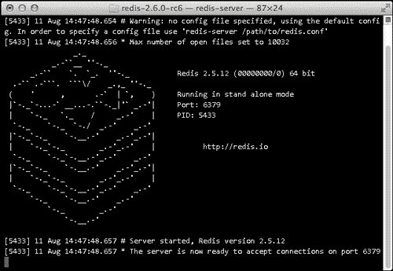

# 第五章 Spring Data Redis 入门

在 SpringDataRedis 项目诞生之前，与 Redis 通信的一种正常方式是使用可与关系数据库的 JDBC 驱动程序相比较的客户端库。不同之处在于，这些客户机没有实现标准 API，因此很难从一个连接器切换到另一个连接器。显然，百万美元的问题是，SpringDataRedis 如何让我们的生活更轻松？

Spring Data Redis 将不同客户端库的 API 隐藏在一个干净易用的 API 后面。理论上，这确保了我们可以在不更改应用程序的情况下更改使用过的 Redis 连接器。即使如果我们必须更改使用的连接器，这确实是一个有用的特性，但如果说我们应该仅因为这个特性而开始使用 SpringDataRedis，那就太天真了。我们必须记住，在应用程序的整个生命周期中，我们很可能只使用一个 Redis 连接器。

但是，我们必须记住，应用程序基本上是通过将不同的组件组合在一起构建的。SpringDataRedis 提供了与 SpringFramework 的无缝集成，SpringFramework 是一种用于创建企业应用程序的流行工具。对于任何正在编写使用 Redis 的 Spring 驱动的应用程序的开发人员来说，这自然是一个巨大的好处。

### 注

有关 Spring Data Redis 及其功能的更多信息，请访问[http://www.springsource.org/spring-data/redis/](http://www.springsource.org/spring-data/redis/) 。

本章将指导我们完成初始配置阶段，并帮助我们建立一个使用 SpringDataRedis 的 web 应用程序项目。在本章中，我们将介绍以下主题：

*   如何在运行类 Unix 操作系统的计算机上安装 Redis
*   如何使用 Maven 获得 Spring 数据 Redis 所需的依赖关系
*   如何使用编程配置来配置应用程序的应用程序上下文
*   如何在应用程序上下文配置类中配置 Redis 连接

# 安装 Redis

Spring Data Redis 要求使用 Redis 2.0 及以上版本，建议使用 Redis 2.2。然而，即使新功能可能还不受支持，也可以使用更新的 Redis 版本。本书假设我们使用的是 Redis 版本 2.6.0-rc6。

目前 Redis 还没有正式支持 Windows，但有一些非官方的端口可用。如果要将 Redis 安装到 Windows 计算机上，请下载一个非官方的源程序包，并按照其安装说明进行操作。非官方 Windows 端口的下载链接位于[http://redis.io/download](http://redis.io/download) 。

### 注

Redis 唯一的依赖项是一个工作的 GCC 编译器和 libc。安装这些依赖项的最佳方法是使用所用 Linux 发行版的软件包管理器。如果 Redis 是在使用 OSX 操作系统的计算机上编译的，那么应该确保 Xcode 及其命令行工具都已安装。

我们可以通过以下步骤将 Redis 安装到运行类 Unix 操作系统的计算机上：

1.  下载 Redis 源代码包。我们使用名为`wget`的命令行实用程序来检索源包。
2.  解压缩源程序包。
3.  编译 Redis。

我们可以通过在命令行中运行以下命令来完成安装过程：

```java
wget http://redis.googlecode.com/files/redis-2.6.0-rc6.tar.gz
tar xzf redis-2.6.0-rc6.tar.gz
cd redis-2.6.0-rc6
make

```

### 注

目前，源程序包托管在 Google 代码上。如果将包移动到其他主机或安装了不同的 Redis 版本，则必须相应修改这些命令。

编译成功完成后，我们可以在命令提示符下运行以下命令来启动我们的 Redis 服务器：

```java
./src/redis-server

```

如果安装成功，我们将看到如下屏幕截图所示的输出：



### 注

Redis 官方主页有一个全面的文档，提供了有关 Redis 使用和配置的更多信息。本文件可在[上查阅 http://redis.io/documentation](http://redis.io/documentation) 。

# 获取所需的依赖项

获取 Spring Data Redis 所需的依赖项相当容易。唯一需要的依赖项是 Spring Data Redis，我们可以通过在`pom.xml`文件中添加以下依赖项声明来获得：

```java
<dependency>
  <groupId>org.springframework.data</groupId>
  <artifactId>spring-data-redis</artifactId>
  <version>1.0.1.RELEASE</version>
</dependency>
```

# 配置 Spring 应用程序上下文

我们将使用 Java 配置来配置应用程序的应用程序上下文。我们的应用上下文配置类的名称为`ApplicationContext`，其实现说明如下：

1.  `@Configuration`注释用于将该类标识为应用程序上下文配置类。
2.  `@ComponentScan`注释用于配置我们控制器的基本包。
3.  `@EnableWebMvc`注释用于启用 Spring MVC。
4.  配置参数的值从使用`@PropertySource`注释导入的属性文件中获取。`Environment`接口用于访问存储在此文件中的属性值。
5.  `redisConnectionFactory()`方法用于配置 Redis 连接工厂 bean。此方法的实现取决于使用的 Redis 连接器。

我们的应用程序上下文配置框架类的源代码如下所示：

```java
@Configuration
@ComponentScan(basePackages = {
        "com.packtpub.springdata.redis.controller"
})
@EnableWebMvc
@PropertySource("classpath:application.properties")
public class ApplicationContext extends WebMvcConfigurerAdapter {

    @Resource
    private Environment env;

    @Bean
    public RedisConnectionFactory redisConnectionFactory() {
      //Add implementation
    }

    //Add other configuration here   
}
```

文件`application.properties`的内容如下：

```java
redis.host = localhost
redis.port = 6379
```

# 配置 Redis 连接

Spring Data Redis 支持四个不同的连接器，可以与 Redis 服务器交互。下表介绍了这些接头：

<colgroup><col style="text-align: left"> <col style="text-align: left"></colgroup> 
| 

连接器

 | 

描述

 |
| --- | --- |
| 绝地 | 绝地是一个与 Redis 2.0.0 命令完全兼容的 Redis 连接器。该项目位于 GitHub，更多信息请参见[https://github.com/xetorthio/jedis](https://github.com/xetorthio/jedis) 。 |
| JRedis | JRedis 是一个 Redis 连接器，它尚未正式支持 Redis 2.x。但是，也可以使用这个库的分叉版本来增加对 Redis2.x 的支持。JRedis 库的分叉版本位于 GitHub，其主页位于[https://github.com/anthonylauzon/jredis](https://github.com/anthonylauzon/jredis) 。 |
| RJC | RJC 是一种与 Redis 2.X 兼容的 Redis 连接器。有关 RJC 连接器的更多信息，请参见[https://github.com/e-mzungu/rjc](https://github.com/e-mzungu/rjc) 。 |
| SRP | SRP 是一个支持 Redis 2.6 命令的 Redis 连接器。项目主页位于[的 https://github.com/spullara/redis-protocol](https://github.com/spullara/redis-protocol) 。 |

不幸的是，目前一些受支持的连接器处于开发的早期阶段，它们不支持 Redis 的所有可用功能。如果基础连接器不支持执行的操作，则抛出异常`UnsupportedOperationException`。

此外，我们可以使用 SpringDataRedis 的配置选项取决于所使用的连接器。下表说明了受支持的 Redis 连接器之间的差异（X 表示支持配置选项，-表示不支持配置选项）：

<colgroup><col style="text-align: left"> <col style="text-align: left"> <col style="text-align: left"></colgroup> 
| 

连接器

 | 

暗语

 | 

连接池

 |
| --- | --- | --- |
| 绝地 | X | X |
| JRedis | X | X |
| RJC | X | X |
| SRP | - | - |

Jedis 是 Spring Data Redis 的默认连接器，目前它应该是我们的首选，因为它是受支持连接器中最成熟的，并且正在积极开发中。但是，我们将查看每个受支持连接器的配置过程，因为将来情况可能会发生变化，如果发生变化，我们应该知道我们还有其他选择。

每个受支持的 Redis 连接器的配置始终包含以下两个步骤：

1.  配置正确的 Maven 依赖项。
2.  在`ApplicationContext`类的`redisConnectionFactory()`方法中配置正确的 Redis 连接工厂 bean。

## 配置绝地连接器

因为绝地是 Spring Data Redis 的默认连接器，所以我们不需要对`pom.xml`文件进行任何更改。我们必须做的唯一一件事是在应用程序上下文配置中添加 Redis 连接工厂 bean。绝地连接器的正确 Redis 连接工厂 bean 类是`JedisConnectionFactory` 类，它具有以下配置属性：

<colgroup><col style="text-align: left"> <col style="text-align: left"></colgroup> 
| 

所有物

 | 

描述

 |
| --- | --- |
| `dataBase` | 所用数据库的索引。 |
| `hostName` | 使用的 Redis 服务器的主机名。 |
| `password` | 用于与 Redis 服务器进行身份验证的密码。 |
| `poolConfig` | 使用`redis.clients.jedis.JedisPoolConf``ig`类给出的连接池配置。 |
| `port` | 使用过的 Redis 服务器的端口。 |
| `shardInfo` | 配置`JedisConnectionFactory` 对象的替代方法。通过使用`redis.clients.jedis.JedisShardInfo`类给出配置。此方法优先于其他冲突配置属性。 |
| `timeout` | 连接超时。 |
| `usePool` | 描述是否使用连接池的`boolean`值。 |

我们将在`ApplicationContext`类的`redisConnectionFactory()`方法中配置 Redis connection 工厂 bean。我们的实施包括以下步骤：

1.  创建一个新的`JedisConnectionFactory`对象。
2.  配置 Redis 连接工厂 bean。
3.  返回创建的对象。

实现的`redisConnectionFactory()`方法的源代码如下：

```java
@Bean
public RedisConnectionFactory redisConnectionFactory() {
  JedisConnectionFactory cf = new JedisConnectionFactory();

  cf.setHostName(env.getRequiredProperty("redis.host"));
  cf.setPort(Integer.parseInt(env.getRequiredProperty("redis.port")));

  return cf;
}
```

## 配置 JRedis 连接器

第一步是配置 JRedis 的 Maven 依赖项。我们可以通过以下步骤配置所需的依赖项：

1.  从我们的构建中排除可传递的绝地依赖。
2.  添加分叉 JRedis 连接器作为依赖项。

在我们按照所描述的步骤之后，`pom.xml`文件中应该有以下依赖声明：

```java
<dependency>
    <groupId>org.springframework.data</groupId>
    <artifactId>spring-data-redis</artifactId>
    <version>1.0.1.RELEASE</version>
    <exclusions>
        <exclusion>
            <groupId>redis.clients</groupId>
            <artifactId>jedis</artifactId>
        </exclusion>
    </exclusions>
</dependency>
<dependency>
    <groupId>org.jredis</groupId>
    <artifactId>jredis-anthonylauzon</artifactId>
    <version>03122010</version>
</dependency>
```

第二步是配置使用过的 Redis 连接工厂 bean。因为我们想要使用 JRedis 连接器，所以我们必须使用`JRedisConnectionFactory`类。该类配置属性如下表所示：

<colgroup><col style="text-align: left"> <col style="text-align: left"></colgroup> 
| 

所有物

 | 

描述

 |
| --- | --- |
| `dataBase` | 所用数据库的索引。 |
| `hostName` | 所用 Redis 服务器的主机名。 |
| `password` | 用于与 Redis 服务器进行身份验证的密码用户。 |
| `poolSize` | 连接池的大小。 |
| `port` | 所用 Redis 服务器的端口。 |
| `usePool` | 描述是否使用连接池的`boolean`值。 |

为了配置 Redis 连接器，我们必须将`redisConnectionFactory()`方法的实现添加到`ApplicationContext`类中。我们可以通过以下步骤来实现这一点：

1.  创建一个新的`JRedisConnectionFactory`对象。
2.  配置 Redis 连接工厂 bean。
3.  返回创建的对象。

我们的 Redis 连接工厂 bean 配置的源代码如下：

```java
@Bean
public RedisConnectionFactory redisConnectionFactory() {
    JredisConnectionFactory cf = new JredisConnectionFactory();

    cf.setHostName(env.getRequiredProperty("redis.host"));   
    cf.setPort(Integer.parseInt(env.getRequiredProperty("redis.port")));

    return cf;
}
```

## 配置 RJC 连接器

首先，我们必须配置所需的 Maven 依赖项。此过程包括以下步骤：

1.  从我们的构建中排除可传递的绝地依赖。
2.  将 RJC 连接器添加为依赖项。

我们必须将依赖项声明添加到`pom.xml`文件的依赖项部分，如下所示：

```java
<dependency>
    <groupId>org.springframework.data</groupId>
    <artifactId>spring-data-redis</artifactId>
    <version>1.0.1.RELEASE</version>
    <exclusions>
        <exclusion>
            <groupId>redis.clients</groupId>
            <artifactId>jedis</artifactId>
        </exclusion>
    </exclusions>
</dependency>
<dependency>
    <groupId>org.idevlab</groupId>
    <artifactId>rjc</artifactId>
    <version>0.7</version>
</dependency>
```

最后一步是将使用过的 Redis 连接工厂 bean 的配置添加到我们的应用程序上下文配置类中。因为我们使用的是 RJC 连接器，所以正确的 Redis 连接工厂等级为`RjcConnectionFactory`。此类具有以下配置属性：

<colgroup><col style="text-align: left"> <col style="text-align: left"></colgroup> 
| 

所有物

 | 

描述

 |
| --- | --- |
| `dataBase` | 所用数据库的索引。 |
| `hostName` | 所用 Redis 服务器的主机名。 |
| `password` | 用于与 Redis 服务器进行身份验证的密码。 |
| `port` | 所用 Redis 服务器的端口。 |
| `timeout` | 连接超时的值。 |
| `usePool` | 描述是否使用连接池的`boolean`值。 |

我们对`redisConnectionFactory()`方法的实现包括以下步骤：

1.  创建一个新的`RjcConnectionFactory`对象。
2.  配置 Redis 连接工厂 bean。
3.  返回创建的对象。

我们的 Redis 连接工厂 bean 配置的源代码如下所示：

```java
@Bean
public RedisConnectionFactory redisConnectionFactory() {
    RjcConnectionFactory cf = new RjcConnectionFactory();

    cf.setHostName(env.getRequiredProperty("redis.host"));    
    cf.setPort(Integer.parseInt(env.getRequiredProperty("redis.port")));

    return cf;
}
```

## 配置 SRP 连接器

第一步是配置 SRP Redis 连接器的 Maven 依赖项。我们可以通过以下步骤配置所需的依赖项：

1.  从我们的构建中排除可传递的绝地依赖。
2.  将 SRP 连接器添加为依赖项。

这将导致以下依赖项声明：

```java
<dependency>
    <groupId>org.springframework.data</groupId>
    <artifactId>spring-data-redis</artifactId>
    <version>1.0.1.RELEASE</version>
    <exclusions>
        <exclusion>
            <groupId>redis.clients</groupId>
            <artifactId>jedis</artifactId>
        </exclusion>
    </exclusions>
</dependency>
<dependency>
    <groupId>com.github.spullara.redis</groupId>
    <artifactId>client</artifactId>
    <version>0.2</version>
</dependency>
```

第二步是配置 Redis 连接工厂 bean。SRP 连接器的正确连接工厂 bean 类为`SrpConnectionFactory`、，它具有以下配置属性：

<colgroup><col style="text-align: left"> <col style="text-align: left"></colgroup> 
| 

所有物

 | 

描述

 |
| --- | --- |
| `hostName` | 所用 Redis 服务器的主机名。 |
| `port` | 所用 Redis 服务器的端口。 |

我们可以通过向`redisConnectionFactory()`方法写入实现来配置 SRP 连接器。我们的实施包括以下步骤：

1.  创建一个新的`SrpConnectionFactory`对象。
2.  配置 Redis 连接工厂 bean。
3.  返回创建的对象。

我们的 Redis 连接工厂 bean 配置的源代码如下所示：

```java
@Bean
public RedisConnectionFactory redisConnectionFactory() {
    SrpConnectionFactory cf = new SrpConnectionFactory();

    cf.setHostName(env.getRequiredProperty("redis.host"));
    cf.setPort(Integer.parseInt(env.getRequiredProperty("redis.port")));

    return cf;
}
```

# 总结

在本章中，我们了解到：

*   Redis 没有复杂的依赖关系，将 Redis 安装到运行类 Unix 操作系统的计算机上很容易
*   一些受支持的连接器还不支持 Redis 的所有功能
*   配置 Redis 连接时可以使用的配置选项取决于使用的连接器
*   当我们使用 SpringDataRedis 编写应用程序时，应该使用 Jedis 连接器

我们现在已经了解了如何使用 SpringDataRedis 建立一个 web 应用程序项目。在下一章中，我们将编写一些代码，并使用 SpringDataRedis 实现一个联系人管理器应用程序。