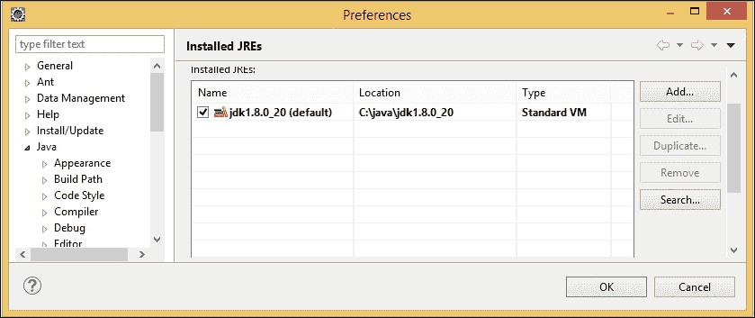
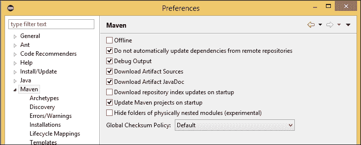
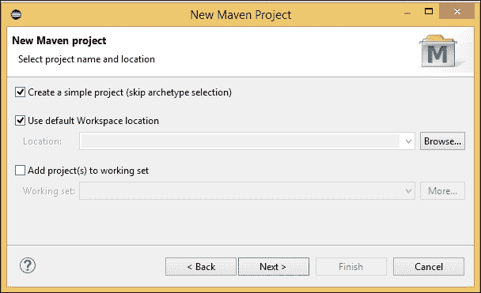
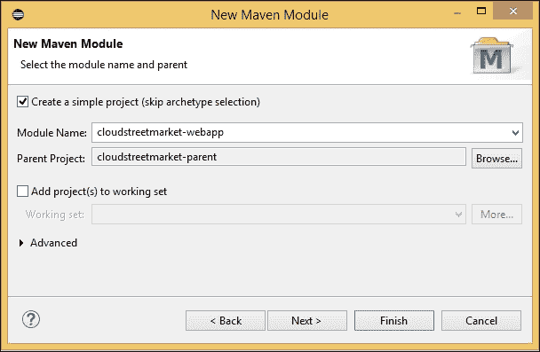
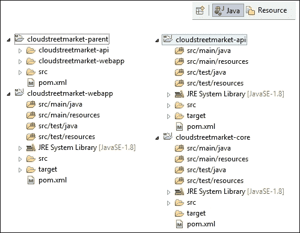
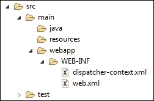
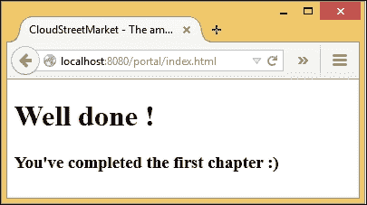

# 八、企业级 Spring 应用的设置例程

本章所涵盖的主题与以下四步程序相对应：

*   为 JEE 开发者和 JavaSE8 安装 Eclipse
*   为 JavaSE8、Maven3 和 Tomcat8 配置 Eclipse
*   用 Maven 定义项目结构
*   安装 Spring、Spring MVC 和 web 结构

# 导言

在我们开始这个初始化开发的例行程序之前，作为介绍，我们将回答几个问题，这些问题将帮助您更好地理解这个例行程序。

请记住，本章的结果也将构成所有后续章节的最低起点。

### 注

**让我们玩得开心点！**

在本书中，我们将代表 ZipCloud 公司行事。ZipCloud 旨在打造社会和金融行业的不同产品。我们将打造公司的第一个产品：`cloudstreetmarket.com`，这将是一个具有社会功能的精彩证券交易平台。这个项目一定是这个小 ZipCloud 初创公司的最佳开端！

## 为什么要这样例行公事？

无论您最初的目标是什么，都必须确保设计不会遭受早期失败。这套程序应该能让你避免这种风险。

除了常规之外的想法是分享一种引导方法，以启动您现在需要的项目基础，并支持您明天的需求。该程序也是促使您的产品思想朝着易于重构和维护的可持续体系结构发展的关键。

为企业级架构建立新项目不会扼杀兴奋和创造力！

## 为什么要使用 Eclipse IDE？

在这个领域存在着竞争，但是 Eclipse 作为一个活跃的开源解决方案在 Java 社区中很受欢迎；因此，任何人都可以不受限制地在线访问。除其他用途外，它还为 web 实现，特别是 MVC web 实现提供了非常好的支持。

## 为什么使用 Maven？

**Maven**是一款*软件项目管理和理解工具*。它是 Apache 社区和 Apache 软件基金会支持的开源项目。近 10 年来，Maven 给了我们巨大的利益。它还形成了 Java 项目的标准结构。通过其**项目对象模型**（**POM**）方法，它为任何人（可能是任何第三方软件）提供了一种统一而彻底的方式，来理解和构建 Java 项目层次结构及其所有依赖项。

在早期的体系结构中，考虑下面的决定是至关重要的：

*   向可能不同的开发环境和持续集成工具开放项目定义
*   监视依赖项，并可能保护它们的访问
*   在项目层次结构中实施统一的目录结构
*   使用自检组件构建自检软件

选择 Maven 可以保护这些点，并满足项目的需要，使项目可重用、安全和可测试（在自动化下）。

## Spring 框架带来了什么？

十多年来，Spring 框架及其社区为 Java 平台的发展做出了贡献。详细介绍整个框架需要我们写的不仅仅是一本书。然而，基于**控制反转**（**IOC**）和**依赖注入**（**DI**）的原则的核心功能通过对 bean 存储库的性能访问允许相当大的可重用性。保持轻量级，它保证了强大的扩展能力，可能适合所有现代体系结构。

# 为 JEE 开发者和 JavaSE8 安装 Eclipse

下面是关于为 JEE 开发人员下载和安装 EclipseIDE 以及下载和安装 JDK8OracleHotSpot 的方法。

## 准备好了吗

就你的教育或经验而言，第一个秘籍可能显得多余或不必要。然而，在本书中始终具有统一的配置将为您提供许多好处。

例如，您肯定会避免未识别的 bug（集成或开发）。您还将体验与屏幕截图中相同的界面。此外，因为第三方产品是活的，所以您不会意外地遇到意外的屏幕或窗口。

## 怎么做。。。

总的来说，整个第一章需要一步一步的合作。从下一章开始，我们将使用 GIT，您的积极参与将变得轻松。

1.  Download a distribution of the Eclipse IDE for Java EE developers:
    *   在本书中，我们将使用 EclipseLuna 发行版。我们建议您安装此版本，以便完全符合我们的指导原则和屏幕截图。从[下载供您选择的操作系统和环境使用的 Luna 发行版 https://www.eclipse.org/downloads/packages/eclipse-ide-java-ee-developers/lunasr1](https://www.eclipse.org/downloads/packages/eclipse-ide-java-ee-developers/lunasr1) 。

    要下载的产品不是已编译的安装程序，而是 zip 存档。

    *   If you feel confident enough to use another version (more recent) of the Eclipse IDE for Java EE Developers, all of them can be found at [https://www.eclipse.org/downloads](https://www.eclipse.org/downloads).

        ### 提示

        对于即将进行的安装，建议在 Windows 上的根目录（`C:\`中有几个目标位置）。为了避免与权限相关的问题，最好将 Windows 用户配置为本地管理员。如果您不能成为此组的一部分，请随意选择您有写入权限的安装目录。

2.  按照以下步骤将下载的归档文件解压缩到`eclipse`目录中：
    *   `C:\Users\{system.username}\eclipse`：如果您在 Windows 上，请在此提取
    *   `/home/usr/{system.username}/eclipse`：如果您在 Linux 上，请在此提取
    *   `/Users/{system.username}/eclipse`：如果您使用 Mac OS X，请在此处提取
3.  Select and download JDK 8:
    *   我们建议您下载 Oracle Hotspot JDK。Hotspot 是最初由 Sun Microsystems 构建的高性能 JVM 实现。Hotspot JRE 和 JDK 现已归 Oracle 所有，可免费下载。
    *   然后，通过 Oracle 网站的链接[选择您机器对应的产品 http://www.oracle.com/technetwork/java/javase/downloads/jdk8-downloads-2133151.html](http://www.oracle.com/technetwork/java/javase/downloads/jdk8-downloads-2133151.html) 。

    ### 注

    为了避免以后出现兼容性问题，请务必与您之前为 Eclipse 归档所做的架构选择（32 位或 64 位）保持一致。

4.  Install JDK 8 on the operating system of your choice using the following instructions:

    在 Windows 上，这是使用可执行文件启动的受监视安装：

    1.  执行下载的文件并等待，直到进入下一个安装步骤
    2.  在安装步骤窗口中，注意目标目录并将其更改为`C:\java\jdk1.8.X_XX`（`X_XX`指的是此处的最新版本。本书中我们将使用 jdk1.8.0_25。此外，无需安装外部 JRE，因此取消选中公共 JRE 功能。）

    在 Linux/Mac 上，执行以下步骤：

    1.  下载与您的环境对应的`tar.gz`档案
    2.  将当前目录更改为要安装 Java 的目录。为了便于说明，让我们就`/usr/java`目录达成一致
    3.  将下载的`tar.gz`档案移到此当前目录
    4.  使用以下针对归档文件名称的命令行解压缩归档文件：`tar zxvf jdk-8u25-linux-i586.tar.gz`（此示例适用于对应于 Linux x86 机器的二进制归档文件）

您必须以包含`/bin`、`/db`、`/jre`、`/include`子目录的`/usr/java/jdk1.8.0_25`目录结构结束。

## 它是如何工作的…

在本节中，我们将提供更多关于我们使用的 Eclipse 版本以及如何选择这个特定版本的 JVM 的见解。

### 面向 JavaEE 开发人员的 Eclipse

我们已经在这里成功地为 JavaEE 开发人员安装了 EclipseIDE。与面向 Java 开发人员的 Eclipse IDE 相比，还有一些附加包，如*Java EE 开发工具*、*数据工具平台*和*JavaScript 开发工具*。此版本因其作为 IDE 本身的一部分管理开发服务器的能力、自定义项目方面的能力以及支持 JPA 的能力而受到赞赏。Luna 版本正式与 JavaSE8 兼容；在撰写本文时，这是一个决定性因素。

### 选择 JVM

JVM 实现的选择可以讨论性能、内存管理、垃圾收集和优化功能。

有很多不同的 JVM 实现，包括两个开源解决方案，如 OpenJDK 和 IcedTea（RedHat）。JVM 的选择实际上取决于应用的需求。我们从经验和在生产中部署的参考实现中选择了*Oracle 热点*；这种 JVM 实现可以在广泛的通用用途中得到信任。如果您有运行 Java UI 应用，则*热点*的表现也很好。Eclipse 就是其中之一。

### 爪哇 SE8

如果你还没有玩过 Scala 或 Clojure，那么是时候用 Java 来进行函数编程训练了！使用 Java SE 8，*Lambda 表达式*显著减少了代码量，提高了*可读性和可维护性*。我们不会实现这个 Java8 特性，但因为它可能是最流行的，所以必须强调它，因为它为范式的改变提供了巨大的功劳。如今，熟悉这些模式很重要。

# 为 Java 8、Maven 3 和 Tomcat 8 配置 Eclipse

这个配方需要配置技术，以便使用 Java、Maven 和 Tomcat 在 Eclipse 上高效地开发。

## 准备好了吗

一旦安装了不同的产品，我们需要遵循两个步骤，主要是让 Eclipse 与 JavaSE8、Maven 3 和 Tomcat8 正常工作。在这个配方中，我们还将了解如何定制 Eclipse 配置文件（`Eclipse.ini`，以充分利用运行 Java 的平台，并确保它能够应对应用的任何显著增长。

## 怎么做。。。

让我们看看下面的步骤，在桌面上配置 Eclipse：

1.  您可以从在桌面上创建指向 Eclipse 可执行文件的快捷方式开始：
    *   在 Windows 上，可执行文件为`Eclipse.exe`，位于`eclipse`根目录下
    *   在 Linux/Mac 上，文件名为`Eclipse`，也位于`eclipse`根目录下
2.  Then, we need to customize the `eclipse.ini` file:

    在 Eclipse 目录中您之前提取了 Eclipse 档案，您可以找到`eclipse.ini`文件。*它是一个包含一些命令行选项的文本文件，用于控制 Eclipse 启动*。

    *   Eclipse 社区建议在这里指定 JVM 的路径。因此，根据您的系统，在文件顶部添加以下两行：

    对于 Windows，添加以下内容：

    ```java
    -vm 
    C:\java\jdk1.8.0_25\jre\bin\server\jvm.dll

    ```

    对于 Linux/Mac，添加以下内容：

    ```
    -vm 
    /usr/java/jdk1.8.0_25/jre/lib/{your.architecture}/server/libjvm.so

    ```

    以下是您可以考虑的可选设置：

    *   If your development machine has at least 2 GB of RAM, you can enter the following options to make Eclipse run faster than the default settings. *This section is optional because Eclipse's default settings are already optimized to suit most users' environment*:

        ```
        -vmargs
        -Xms128m
        -Xmx512m
        -Xverify:none
        -Dosgi.requiredJavaVersion=1.6
        -XX:MaxGCPauseMillis=10
        -XX:MaxHeapFreeRatio=70
        -XX:+UseConcMarkSweepGC
        -XX:+CMSIncrementalMode
        -XX:+CMSIncrementalPacing

        ```

        如果您的机器的 RAM 小于 2GB，您仍然可以输入这组选项，而无需覆盖默认的`–Xms`和`–Xmx`参数。

        ### 提示

        `-vmargs`下的所有选项都是将在启动时传递给 JVM 的参数。重要的是不要把 Eclipse 选项（文件的顶部）和 VM 参数（底部）弄乱。

3.  After this we will go through the following steps to start Eclipse and set the workspace:

    启动步骤*2*中描述的可执行文件。

    *   对于我们的项目，指定路径：`<home-directory>/workspace`

    此路径对于每个操作系统都是不同的：

    *   `C:\Users\{system.username}\workspace`：这是 Windows 上的路径
    *   `/home/usr/{system.username}/workspace`：这是在 Linux 上
    *   `/Users/{system.username}/workspace`：这是在 Mac 操作系统上
    *   点击**确定**让 Eclipse 程序启动

    ### 注

    工作区是您管理 Java 项目的地方。它可以特定于一个应用，但不一定。

4.  Then, we need to check the JRE definitions:

    这里，需要在 Eclipse 中验证两个设置：

    1.  打开**窗口**下的**首选项**菜单（在 Mac OS X 上**首选项**菜单在**Eclipse**菜单下）。
    2.  在左侧的导航面板中，打开 Java 层次结构，点击**Java**下的**已安装的 JRE**。
    3.  在中央屏幕上，删除您可能已经拥有的任何现有 JRE。
    4.  点击**添加…**按钮添加标准 JVM。
    5.  输入`C:\java\jdk1.8.0_25`（或`/usr/java/...`作为**JRE home**。
    6.  并将`jdk1.8.0_25`输入为**JRE 名称**。

    ### 注

    我们告诉 Eclipse 使用 JDK 8 的 Java 运行时环境。

    完成这些步骤后，您应完成以下配置：

    

5.  现在，我们将检查编译器符合性级别：
    1.  在导航面板中，点击**Java**下的**编译器**上的。
    2.  在下拉列表中检查是否将**编译器符合性级别**设置为**1.8**。
6.  在此之后，我们需要检查 Maven 配置：
    1.  仍然在**首选项**菜单的导航面板中，打开 Maven 层次结构并导航到**Maven****安装**。
    2.  我们将在这里指定计划使用哪个 Maven 安装。就本书而言，嵌入式 Maven 将是完美的。
    3.  回到导航面板，进入**Maven****用户设置**。
    4.  Set the local repository to `<home-directory>/.m2/repository`.

        ### 注

        在这个本地存储库中，将驻留所需工件的本地缓存版本。这将避免我们的环境在每次构建时都必须下载它们。

    5.  对于**用户设置**字段，在`.m2`目录`<home-directory>/.m2/settings.xml`中创建一个`settings.xml`文件。
    6.  Edit the `settings.xml` file and add the following block:

        （您也可以从`chapter_1/source_code/.m2`目录复制/粘贴）：

        ```
        <settings  xmlns:xsi="http://www.w3.org/2001/XMLSchema-instance"
          xsi:schemaLocation="http://maven.apache.org/SETTINGS/1.1.0 http://maven.apache.org/xsd/settings-1.1.0.xsd">
          <profiles>
            <profile>
              <id>compiler</id>
                <properties>
                  <JAVA_HOME>C:\java\jdk1.8.0_25</JAVA_HOME>
                </properties>
            </profile>
          </profiles>
          <activeProfiles>
          <activeProfile>compiler</activeProfile>
          </activeProfiles>
        </settings>
        ```

        ### 提示

        如果您是 Windows 计算机上的*而不是*，请将此文件中的`JAVA_HOME`更改为您的 JDK 安装目录（`/usr/java/jdk1.8.0_25`。

    7.  Go back to the navigation panel and click on **Maven**. Follow the configuration given in this screenshot:

        

    8.  点击**确定**保存这些配置更改。
7.  Now we will install Tomcat 8 in the Eclipse IDE. For this, go through these steps:
    1.  从 Tomcat 网站[下载最新核心版本 Tomcat8 的 ZIP 存档文件 http://tomcat.apache.org/download-80.cgi](http://tomcat.apache.org/download-80.cgi) 。
    2.  Extract the downloaded archive to the following directory:
        *   在窗口中，在`C:\tomcat8`提取归档文件
        *   在 Linux 上，在`/home/usr/{system.username}/tomcat8`提取存档
        *   在 Mac OS X 上，在`/Users/{system.username}/tomcat8`处提取存档

        ### 注

        根据您的系统，您必须能够从层次结构访问 bin 目录：`C:\tomcat8\bin, /home/usr/{system.username}/tomcat8/bin or /Users/{system.username}/tomcat8/bin`。

    3.  在 Eclipse 中，选择**窗口**下的**首选项**菜单，在左侧的导航面板中，打开**服务器**层次结构，然后选择**运行时环境**。
    4.  在中央窗口上，单击**添加…**按钮。
    5.  在下一步**新服务器**环境窗口中，导航到**Apache****Apache Tomcat v8.0**。
    6.  另外，选中此选项：**创建一个新的本地服务器**。
    7.  点击**下一步**按钮。
    8.  在窗口中填写详细信息，如以下屏幕截图所示：

    

    ### 注

    如果您在 Linux（或 Mac OS X）上，请将`C:\tomcat8`替换为 Tomcat 安装目录。

## 它是如何工作的。。。

在本节中，我们将回顾该配方带给我们的不同元素和概念。

### eclipse.ini 文件

正如我们已经看到的，文件控制 Eclipse 的启动。它是一个额外的组件，使得 Eclipse 平台非常可配置。您可以在文档中找到可以使用的命令行参数列表

[http://help.eclipse.org/luna/topic/org.eclipse.platform.doc.isv/reference/misc/runtime-options.html](http://help.eclipse.org/luna/topic/org.eclipse.platform.doc.isv/reference/misc/runtime-options.html)

确认本文档中提到的以下警告非常重要：

*   All lines after `-vmargs` are passed as arguments to the JVM; all arguments and options for Eclipse must be specified before `-vmargs` (just like when you use arguments on the command line)

    ### 注

    这解释了为什么我们在文件顶部插入了`–vm`选项。

*   在命令行上使用`-vmargs`将替换`.ini`文件中的所有`-vmargs`设置，除非`.ini`文件或命令行中指定了`--launcher.appendVmargs`

### 设置–vm 选项

设置`-vm`选项可以确保 Eclipse 作为程序运行的 JVM 实现。您可能已经注意到，我们将 JVM 定位为一个库（`*.dll / *.so`。它在启动时具有更好的性能，并且还将程序进程标识为 Eclipse 可执行文件，而不仅仅是 Java 可执行文件。

如果您想知道在未设置`–vm`选项时 Eclipse 使用哪个 JVM，请注意 Eclipse*没有*参考`JAVA_HOME`环境变量。（EclipseWiki）。

相反，Eclipse 执行解析 path 环境变量的 Java 命令。

### 自定义 JVM 参数

建议的 JVM 参数列表来自 Piotr Gabryanczyk 关于 Java 内存管理模型的工作。最初，对于 JetBRAINS IntelliJ 设置，此配置对于 Eclipse 环境也很有用。它有助于完成以下任务：

*   防止垃圾收集器暂停应用超过 10 毫秒（`-XX:MaxGCPauseMillis=10`
*   将垃圾回收器启动的级别降低到占用内存的 30%（`-XX:MaxHeapFreeRatio=70`
*   强制垃圾收集器作为并行线程运行，降低其对应用的干扰（`-XX:+UseConcMarkSweepGC`
*   为垃圾收集器选择增量调整模式，这将在 GC 作业中生成中断，以便应用可以明确停止冻结（`–XX:+CMSIncrementalPacing`

程序生命周期中的实例化对象存储在堆内存中。建议的参数定义了 128 mb 的 JVM 启动堆空间（`-Xms`）和 512 mb 的最大堆空间（`–Xmx`）。堆被划分为两个子空间，如下所示：

*   **年轻一代**：该区域储存了新的物品。对于领先的热点或 OpenJDK JVM，年轻的内存空间分为两部分：
    *   `Eden`：新对象存储在此细分区域。生命周期短的对象将从此处解除分配。
    *   `Survivor`: This is a buffer between the young and old generation. The survivor space is smaller than the Eden and it is also divided in two (the `FROM` and `TO` areas). You can adjust the ratio between `Eden` and `Survivor` objects with `-XX:SurvivorRatio` (here, `-XX: SurvivorRatio=10` means `YOUNG = 12`, `EDEN = 10`, `FROM = 1` and `TO =1`).

        ### 提示

        年轻区域的最小尺寸可通过`-XX:NewSize`进行调整。最大尺寸可通过`-XX:MaxNewSize`调整。

*   **Old generation**: When objects in `Eden` or `Survivor` spaces are still referenced after enough garbage collections, they are moved here. It is possible to set the `Young` area size as a ratio of the `Old` area size with `-XX:NewRatio`. (That is, `-XX:NewRatio=2` means `HEAP = 3, YOUNG = 1` and `OLD =2`).

    ### 提示

    新一代空间`-XX:MaxNewSize`的最大大小必须始终小于堆空间的一半（`-Xmx/2`，因为垃圾收集器可能会将所有`Young`空间移动到`Old`空间。

在 Hotspot 或 OpenJDK 中，永久生成空间用于存储与类定义（结构、字段、方法等）相关的信息。当加载的结构变得太大时，您可能已经遇到了`PermGen space OutOfMemoryError`异常。在这种情况下，解决方案是增加`-XX:MaxPermSize`参数。*JDK8*不再需要。

为此，已将**永久生成**（**永久生成**空间）替换为不是堆的一部分而是本机内存的元数据空间。此空间的默认最大大小是无限的。但是，我们仍然可以用`-XX:MetaspaceSize`或`-XX:MaxMetaspaceSize`来限制它。

### 更改 JDK 合规级别

降低遵从性级别允许我们运行比 JDK 本机识别的版本更低的版本的 Java 编译器。它影响 Eclipse 构建、错误和警告以及 JavaDocs。显然，不可能设置比编译器本机版本更高的编译版本。

### 配置 Maven

在 Eclipse 内部，Maven 配置的大多数来自插件`m2eclipse`（也称为 Eclipse 的 Maven 集成）。默认情况下，该插件包含在 EclipseLuna 中。因此，无需手动下载。在我们经历了 Maven 配置之后，m2eclipse 对于从 IDE 上下文触发 Maven 操作以及为创建 javamaven 项目提供帮助也非常有用。在下一节中，您将了解更多关于 m2eclipse 的信息。

然后我们安装了一个基本的`settings.xml`文件。此文件用于配置 Maven，而不直接绑定到任何项目。`settings.xml`最常见的用途可能是配置文件定义和凭证存储，以访问存储库管理器。

使用 Maven 概要文件，您可以为特定环境运行构建并匹配特定配置（变量值、依赖项集等）。Maven 配置文件可以相互累积。它们可以通过命令行激活，可以在 Maven 设置中声明，也可以从环境配置中激活，例如文件系统中存在或缺少的文件、使用的 JDK 等等。

### 提示

在我们的`settings.xml`文件中，我们定义了一个具有自己`JAVA_HOME`属性的编译器概要文件。编译器配置文件在默认情况下被激活，并在`<activeProfiles>`部分声明性地定义。Maven 将在查找系统变量之前查阅`settings.xml`文件。

### 存储库管理员

存储库管理器是一个第三方应用，它管理开发的应用可能需要的所有必需的二进制文件和依赖项。作为开发环境和公共存储库之间的缓冲代理，存储库管理器提供对关键参数的控制，如构建时间、依赖项的可用性、可见性和访问限制等。

著名的解决方案包括*Apache Archiva*、*Artifactory*、*Sonatype Nexus*。在我们的应用上下文中，我们不会使用存储库管理器。

### 日食中的 Tomcat 8

针对 JEE 开发人员的 Eclipse 允许 Tomcat 与开发环境中的其他应用服务器集成。这是通过提供的**Web 工具平台**（**WTP**插件实现的，该插件可以管理 Web 人工制品、其编译以及在 Web 服务器中的部署。

在`servers`选项卡（前面可见）中，双击创建的 Tomcat v8.0 服务器，打开一个配置窗口，可以设置通常在`server.xml`Tomcat 文件中定义的参数，该文件位于`tomcat8\conf`目录中。

默认情况下，WTP 对该配置进行抽象，不会影响正版`server.xml`文件。通过激活**服务器配置**窗口中的**发布模块上下文以分离 XML 文件**选项，可以改变此行为。

## 还有更多。。。

*   在[上了解更多关于 Eclipse 安装的 http://wiki.eclipse.org/Eclipse/Installation](http://wiki.eclipse.org/Eclipse/Installation)
*   在[了解文件的更多信息 http://wiki.eclipse.org/Eclipse.ini](http://wiki.eclipse.org/Eclipse.ini)
*   在[了解更多关于 m2eclipse 插件的信息 https://maven.apache.org/plugins/maven-eclipse-plugin/](https://maven.apache.org/plugins/maven-eclipse-plugin/)
*   要了解如何使用存储库管理器，请参阅[http://maven.apache.org/repository-management.html](http://maven.apache.org/repository-management.html)
*   PiotrGabryanczyk 关于 IDE 垃圾收集优化的文章可以在[找到 http://piotrga.wordpress.com/2006/12/12/intellij-and-garbage-collection](http://piotrga.wordpress.com/2006/12/12/intellij-and-garbage-collection)
*   您可以在[了解更多关于内存优化的一般信息 http://pubs.vmware.com/vfabric52/topic/com.vmware.vfabric.em4j.1.2/em4j/conf-heap-management.html](http://pubs.vmware.com/vfabric52/topic/com.vmware.vfabric.em4j.1.2/em4j/conf-heap-management.html) 和[https://blog.codecentric.de/en/2012/08/useful-jvm-flags-part-5-young-generation-garbage-collection](https://blog.codecentric.de/en/2012/08/useful-jvm-flags-part-5-young-generation-garbage-collection)

# 用 Maven 定义项目结构

在本配方中，我们将重点使用 Maven 定义我们的应用所需的项目结构。

## 准备好了吗

我们最初将创建两个 Eclipse 项目：一个用于应用，另一个用于 ZipCloud 公司稍后可以与其他项目共享的组件。请看下图，其中展示了我们将要构建的项目组件：


应用项目**cloudstreetmarket 母公司**将有三个模块。其中两个将打包为 web 存档（**war**）：主 web 应用和 REST API。其中一个将打包为一个**jar**依赖项（cloudstreetmarket 核心）。

公司特定项目**zipcloud 父项**将只有一个子模块-**zipcloud 核心**，将打包为**jar**。

## 怎么做。。。

以下步骤将帮助我们创建 Maven 父项目：

1.  从 Eclipse 导航到**文件****新****其他**。
2.  A **New** wizard opens up wherein you can select the type of project within a hierarchy. Then, open the **Maven** category, select **Maven Project**, and click on **Next**.

    新 Maven 项目向导将打开，如以下屏幕截图所示：

    

3.  确保选中**创建简单项目**选项。点击**下一步**。
4.  Fill up the next wizard as follows:
    *   `edu.zipcloud.cloudstreetmarket` 作为**组 Id**
    *   `cloudstreetmarket-parent`作为**工件 Id**
    *   `0.0.1-SNAPSHOT`为**版本**
    *   `pom`作为**包装**
    *   `CloudStreetMarket Parent`作为**名称**
    *   然后，点击**完成**按钮

    父项目必须出现在仪表板左侧的包资源管理器中。

    

    我们现在必须告诉 m2eclipse 您计划在这个项目中使用哪个 Java 编译器版本，以便它自动将正确的 JRE 系统库添加到我们即将创建的子模块中。这是通过`pom.xml`文件完成的。

5.  编辑`pom.xml`文件以指定 Java 编译器版本：
    *   双击**pom.xml**文件。默认显示**m2eclipse****概览**选项卡。您必须单击最后一个选项卡**pom.xml**，才能访问完整的 xml 定义。
    *   In this definition, add the following block at the end but still as part of the **<project>** node. (*You can also copy/paste this piece of code from the cloudstreetmarket-parent's* `pom.xml` *of the* `chapter_1` *source code):*

        ```
        <build>
          <plugins>
            <plugin>
              <groupId>org.apache.maven.plugins</groupId>
              <artifactId>maven-compiler-plugin</artifactId>
              <version>3.1</version>
              <configuration>
                  <source>1.8</source>
                  <target>1.8</target>
                  <verbose>true</verbose>
                  <fork>true</fork>
                  <executable>${JAVA_HOME}/bin/javac</executable>
                  <compilerVersion>1.8</compilerVersion>
              </configuration>
            </plugin>
            <plugin>
              <groupId>org.apache.maven.plugins</groupId>
              <artifactId>maven-surefire-plugin</artifactId>
              <version>2.4.2</version>
              <configuration>
                <jvm>${JAVA_HOME}/bin/java</jvm>
                <forkMode>once</forkMode>
               </configuration>
            </plugin>
          </plugins>
        </build>
        ```

        ### 注

        您可能也注意到了**maven surefire 插件**声明。我们会尽快检讨,；它允许我们在构建期间运行单元测试。

6.  Now, we will create submodules:

    作为母项目的子模块，我们已经看到，我们需要一个 web 模块来处理和呈现站点的屏幕，一个 web 模块用于 REST API，另一个模块将用于打包第一个产品`cloudstreetmarket.com`特定的所有业务逻辑（服务、数据访问等】：

    1.  从主 Webapp 模块：在 Eclipse 中，导航到**文件****新****其他**。此时会打开一个**新建**向导，您可以通过该向导选择层次结构中的项目类型。打开**Maven**类别，选择**Maven 模块**，点击**下一步**。
    2.  The New Maven Module wizard opens up after this; fill it up as follows:

        选中“创建简单项目”。

        输入`cloudstreetmarket-webapp`作为**模块名称**。

        输入`cloudstreetmarket-parent`作为**父项目**。

        

    3.  Click on the **Next** button after which the next step shows up. Enter the following entries in that new window:

        输入`edu.zipcloud.cloudstreetmarket`作为**组 Id**。

        输入`0.0.1-SNAPSHOT`为**版本**。

        选择**war**作为**包装**。

        输入`CloudStreetMarket Webapp`作为**名称**。

        然后点击**完成**按钮。

7.  Now we will go ahead to create and REST API module:

    我们将使用不同的参数重复前面的操作。

    1.  在 Eclipse 中，导航到**文件【新的****其他**。当你去那里时，选择向导会弹出。之后，打开**Maven**类别，选择**Maven 模块**，点击**下一步**：
    2.  In the **New Maven Module** wizard, enter the following entries:

        选中**创建简单项目**选项。

        输入`cloudstreetmarket-api`作为**模块名称**。

        输入`cloudstreetmarket-parent`作为**父项目**。

    3.  Click on the **Next** button to proceed to the next step. Enter the following entries in that window:

        输入`edu.zipcloud.cloudstreetmarket`作为**组 Id**。

        输入`0.0.1-SNAPSHOT`为**版本**。

        选择**war**作为**包装**。

        输入`CloudStreetMarket API`作为**名称**。

        然后单击 Finish 按钮。

8.  Now, we will create the core module:

    为此，请导航到**文件****新****其他**。执行此操作时，将弹出选择向导。打开**Maven**类别，选择**Maven 模块**，点击**下一步**。

    1.  In the **New Maven Module** wizard, enter the following entries:

        选中**创建简单项目**选项。

        输入`cloudstreetmarket-core`作为**模块名称**。

        输入`cloudstreetmarket-parent`作为**父项目**。

    2.  Click on the **Next** button to go to the next step. Fill in the fields with the following:

        输入`edu.zipcloud.cloudstreetmarket`作为**组 Id**。

        输入`0.0.1-SNAPSHOT`为**版本**。

        本次选择**罐**作为**包装**。

        输入`CloudStreetMarket Core`作为**名称**。

        然后单击 Finish 按钮。

    如果您激活了 Java 透视图（在右上角），您应该会看到整体创建的结构与此处的屏幕截图相匹配：

    

9.  Now, we will create a company-specific project and its module(s):

    让我们假设许多不同类别的依赖项（核心、消息传递、报告等）将在以后成为公司业务项目的一部分。

    1.  我们需要一个父项目，所以从 Eclipse 导航到**文件****新****其他**。选择向导弹出。打开 Maven 类别，选择 Maven 项目，然后单击 Next。
    2.  在新建 Maven 项目向导的第一步中，对于我们之前创建的父项目，只有选中**创建简单项目**和**使用默认工作区位置**选项。
    3.  Click on the **Next** button and fill in the next wizard as follows:

        输入`edu.zipcloud`作为**组 Id**。

        输入`zipcloud-parent`作为**工件 Id**。

        输入`0.0.1-SNAPSHOT`为**版本**。

        选择**pom**作为**包装**。

        输入`ZipCloud Factory Business Parent`作为**名称**。

    同样，在创建的`pom.xml`文件中，在`<project>`节点中添加以下块，以正确创建底层模块并启用自动测试执行。（*您也可以从 zipcloud 父代的第 1 章源代码*的 pom.xml 文件中复制/粘贴这段代码）：

    ```
    <build>
      <plugins>
        <plugin>
        <groupId>org.apache.maven.plugins</groupId>
          <artifactId>maven-compiler-plugin</artifactId>
          <version>3.1</version>
          <configuration>
            <source>1.8</source>
            <target>1.8</target>
              <verbose>true</verbose>
              <fork>true</fork>
            <executable>${JAVA_HOME}/bin/javac</executable>
          <compilerVersion>1.8</compilerVersion>
          </configuration>
        </plugin>
        <plugin>
        <groupId>org.apache.maven.plugins</groupId>
          <artifactId>maven-surefire-plugin</artifactId>
            <version>2.4.2</version>
            <configuration>
            <jvm>${JAVA_HOME}/bin/java</jvm>
            <forkMode>once</forkMode>
          </configuration>
        </plugin>
      </plugins>
    </build>
    ```

    现在我们将创建一个公司业务核心模块，它将是我们刚刚创建的父项目的子模块。

    为此，请导航到**文件****新****其他**。选择向导弹出。打开**Maven**类别，选择**Maven 模块**，点击**下一步**。

    1.  In the **New Maven Module** wizard, enter the following details:

        选中**创建简单项目**选项。

        输入`zipcloud-core`作为**模块名称**。

        输入`zipcloud-parent`作为**父项目**。

    2.  Click on the **Next** button and go to the next step. Here, enter the following details:

        输入`edu.zipcloud`作为**组 Id**。

        输入`0.0.1-SNAPSHOT`为**版本**。

        选择**罐**作为**包装**。

        选择`ZipCloud Factory Core Business`作为**名称**。

10.  Now, build the two projects:

    如果结构正确，则可以成功运行以下 Maven 命令：

    ```
    mvn clean install

    ```

    ### 提示

    如果开发机器上安装了 Maven，则可以在终端中启动此命令。

    在我们的研究案例中，我们现在将使用 m2eclipse 修改的**运行方式**菜单启动它：右键单击 zipcloud 父项目，然后单击**运行方式****Maven Clean**。

    ### 注

    在 Maven 控制台中，您现在应该可以在底部看到这条漂亮的线：

    [信息]建立成功

    现在，对安装构建阶段重复操作。现在，您应该在控制台中看到以下输出：

    ```
    [INFO] ZipCloud Parent .......................SUCCESS [  0.313 s]
    [INFO] ZipCloud Core .........................SUCCESS [  1.100 s]
    [INFO] ----------------------------------------------------------
    [INFO] BUILD SUCCESS
    [INFO] ----------------------------------------------------------

    ```

    好的，现在你也应该能够构建`cloudstreetmarket-parent`。

    为此，右键单击**cloudstreetmarket-parent**项目，然后单击**以**运行**Maven Clean**。在此步骤之后，Maven 控制台应打印以下内容：

    ```
    [INFO] BUILD SUCCESS

    ```

    再次，右键单击**cloudstreetmarket**-父项目，然后单击**作为****Maven 安装**运行。Maven 控制台现在应该打印以下内容：

    ```
    [INFO] CloudStreetMarket Parent ..............SUCCESS [  0.313 s]
    [INFO] CloudStreetMarket Webapp ..............SUCCESS [  6.129 s]
    [INFO] CloudStreetMarket Core ................SUCCESS [  0.922 s]
    [INFO] CloudStreetMarket API .................SUCCESS [  7.163 s]
    [INFO] ----------------------------------------------------------
    [INFO] BUILD SUCCESS
    [INFO] ----------------------------------------------------------

    ```

    向上滚动一点应显示以下跟踪：

    ```
    -------------------------------------------------------
     T E S T S
    -------------------------------------------------------
    There are no tests to run.
    Results :
    Tests run: 0, Failures: 0, Errors: 0, Skipped: 0

    ```

    ### 注

    Maven 在这里，借助我们手动添加的 Maven surefire 插件，解析`src/test/java`目录中遇到的所有类。同样，可以自定义此路径。

    在检测到的测试类中，Maven 还将运行用 JUnit`@Test`注释注释的方法。项目中需要 JUnit 依赖项。

## 它是如何工作的。。。

在本节中，我们将介绍一些关于 Maven 的概念，以便您更好地理解其标准。

### 新 Maven 项目，新 Maven 模块

我们刚刚通过的项目创建屏幕也来自 m2eclipse 插件。这些屏幕用于使用预配置的`pom.xml`文件和标准目录结构初始化 Java 项目。

m2eclipse 插件还提供了一组快捷方式来运行 Maven 构建阶段，以及一些方便的选项卡（已经看到）来管理项目依赖关系和可视化`pom.xml`配置。

### 标准项目层次结构

在创建的项目中导航时，您应该能够注意到由以下目录组成的循环层次结构：`src/main/java`、`src/main/resource`、`src/test/java`和`src/test/resource`。这个结构是 Maven 引导我们通过的默认结构。*该车型如今已成为标准*。但是，我们仍然可以覆盖它（在`pom.xml`文件中）并创建我们自己的层次结构。

如果您还记得父项目的`pom.xml`文件中添加的**maven 编译器插件**定义，我们使用了以下四行代码：

```
<verbose>true</verbose>
<fork>true</fork>
<executable>${JAVA_HOME}/bin/javac</executable>
<compilerVersion>1.8</compilerVersion>
```

这些行允许 Maven 为编译器使用外部 JDK。最好控制 Maven 使用的编译器，尤其是在管理不同环境时。

此外，以下两行可能看起来像过度配置：

```
<source>1.8</source>
<target>1.8</target>
```

从严格的 Maven 角度来看，当使用指定的编译器定义外部 JDK 时，这些行是可选的。最初，通过这两行代码，我们可以控制编译默认代码的 Java 版本。在维护较旧的系统时，现有代码可能仍在以前版本的 Java 中编译。

实际上，m2eclipse 特别希望这两行代码能够将`JRE System Library [JavaSE-1.8]`添加到`jar`和`war`模块的构建路径中。现在，通过这些行，Eclipse 以 Maven 的方式编译这些项目：在 JavaSE8 中。

### 提示

如果此依赖项仍然显示为不同版本的 Java，您可能需要右键单击该模块，然后导航到**Maven****更新项目**。

### IDE 中的项目结构

关于 Eclipse 项目层次结构中的父项目；您是否注意到创建的子模块似乎作为独立项目和父模块的直接子模块复制？这是因为 Eclipse 在 Luna 中还没有处理项目的层次结构。因此，模块显示为单独的项目。这可能有点让人困惑，因为源代码似乎位于父项目旁边。*事实并非如此，这只是它们的呈现方式，因此我们可以将所有工具正常绑定到项目级别*。

### 注

此时，JetBRAINS IntelliJ IDEA 已经支持项目的可视化层次结构。

最后，如果您打开父项目的`pom.xml`文件，您应该会看到`<modules>`节点填充了创建的子模块。这也是由 m2eclipse 自动完成的。我们建议您注意这个特性，因为 m2eclipse 并不总是根据您改变项目层次结构的方式来更新这些`<modules>`节点。

### Maven 的构建生命周期

Maven 中的构建生命周期是一个特定的预定义操作序列（和一组），称为阶段。Maven 中有三个现有生命周期：默认生命周期、清理生命周期和站点生命周期。

让我们看看所有包括默认和干净生命周期（可能是开发人员最常用的生命周期）的阶段。

#### 清洁生命周期

Maven**清洁**阶段起着核心作用。它从 Maven 的角度重置项目构建。它通常是关于删除 Maven 在构建过程中创建的目标目录。以下是关于**清洁**生命周期中包含的阶段的一些详细信息。这些详细信息来自 Maven 文档：

<colgroup><col> <col></colgroup> 
| 

阶段

 | 

描述

 |
| --- | --- |
| `pre-clean` | 此执行实际项目清理之前所需的流程 |
| `clean` | 此将删除以前生成的所有文件 |
| `post-clean` | 此执行完成项目清理所需的流程 |

#### 默认生命周期

在默认生命周期中，您可以找到最有趣的构建阶段，这些阶段涉及源代码生成、编译、资源处理、测试、集成测试和人工制品部署。以下是有关默认生命周期中包含的阶段的一些详细信息：

<colgroup><col> <col></colgroup> 
| 

阶段

 | 

描述

 |
| --- | --- |
| `validate` | 此验证项目是否正确，以及所有必要信息是否可用。 |
| `initialize` | 此初始化构建状态，例如，设置属性或创建目录。 |
| `generate-sources` | 此生成源代码以包含在编译中。 |
| `process-sources` | 这个处理源代码，例如，过滤任何值。 |
| `generate-resources` | 此生成要包含在包中的资源。 |
| `process-resources` | 此将资源复制并处理到目标目录中，以便打包。 |
| `compile` | 此编译项目的源代码。 |
| `process-classes` | 此 post 处理编译生成的文件，例如，对 Java 类执行字节码增强。 |
| `generate-test-sources` | 此生成任何要包含在编译中的测试源代码。 |
| `process-test-sources` | 此处理测试源代码，例如，过滤任何值。 |
| `generate-test-resources` | 这个为测试创建了资源。 |
| `process-test-resources` | 此将资源复制并处理到测试目标目录中。 |
| `test-compile` | 此将测试源代码编译到测试目标目录中。 |
| `process-test-classes` | 这篇文章处理测试编译生成的文件，例如，对 Java 类执行字节码增强。适用于 Maven 2.0.5 及以上版本。 |
| `test` | 此使用合适的单元测试框架运行测试。这些测试不应要求打包或部署代码。 |
| `prepare-package` | 此执行在实际包装之前准备包装所需的操作。这通常会导致包的未打包、已处理版本。（Maven 2.1 及以上版本） |
| `package` | 这个将编译好的代码打包成可分发的格式，比如 JAR。 |
| `pre-integration-test` | 此执行集成测试执行前所需的操作。这可能涉及设置所需环境等事项。 |
| `integration-test` | 此处理包并在必要时将其部署到可以运行集成测试的环境中。 |
| `post-integration-test` | 此执行集成测试执行后所需的操作。这可能包括清理环境。 |
| `verify` | 此运行检查以验证包装是否有效并符合质量标准。 |
| `install` | 此将包安装到本地存储库中，作为本地其他项目的依赖项。 |
| `deploy` | 此将最终包复制到远程存储库，以便与其他开发人员和项目共享（在集成或发布环境中完成）。 |

#### 插件目标

凭借插件的概念，Maven 获得了更广泛的维度。Maven 本机提供内置插件，但可以像其他依赖项（由 GroupID 和 ArtefactID 标识）一样引入外部插件。

每个构建阶段可以附加到零个、一个或多个插件目标。目标代表一项具体的任务，负责以某种方式构建或处理项目。默认情况下，某些阶段通过本机插件将目标绑定到它们。

#### 内置生命周期绑定

现在我们已经了解了所述两个生命周期中每个阶段的目的，我们必须说，对于默认生命周期，根据我们选择的模块封装类型，只有这些阶段中的一部分可能被激活以执行目标。

让我们看看我们在不同包装类型的默认生命周期中跳过的阶段：

<colgroup><col> <col> <col> <col> <col></colgroup> 
|   | 

默认生命周期

 |
| --- | --- |
| 

包装类型

 | 

jar/war/ejb/ejb3/rar

 | 

耳朵

 | 

maven 插件

 | 

聚甲醛

 |
| --- | --- | --- | --- | --- |
| 激活相 |   | 产生资源 | 产生资源 |   |
| 过程资源 | 过程资源 | 过程资源 |   |
| 编写 |   | 编写 |   |
| 过程测试资源 |   | 过程测试资源 |   |
| 测试编译 |   | 测试编译 |   |
| 测验 |   | 测验 |   |
| 包裹 | 包裹 | 包裹 | 包裹 |
| 安装 | 安装 | 安装 | 安装 |
| 部署 | 部署 | 部署 | 部署 |

### 提示

在[第 9 章](12.html#aid-3L9L61 "Chapter 9. Testing and Troubleshooting")、*测试和故障排除*中，我们将实际将外部插件目标绑定到确定的构建阶段。

总之，在 jar 打包模块上调用：mvnclean install 将导致执行以下阶段：clean、processresources、compile、processtestresources、testcompile、test、package 和 install。

#### 关于 Maven 命令

当 Maven 被告知要针对特定项目的`pom.xml`文件执行一个或多个阶段时，它将为其每个模块执行请求的阶段。

然后，对于每个请求的阶段，Maven 将执行以下操作：

*   确定阶段所属的生命周期
*   查找当前模块的包装并确定正确的生命周期绑定
*   执行已标识生命周期绑定的层次结构中的所有阶段，这些阶段位于层次结构中请求的阶段之前

### 注

术语“执行所有阶段”是指执行所有检测到的和附加的插件目标（本地插件或非本地插件）。

综上所述，在`jar`封装模块上调用`mvn clean install`将执行以下阶段：`clean`、`process-resources`、`compile`、`process-test-resources`、`test-compile`、`test`、`package`、`install`。

## 还有更多。。。

您可能想知道为什么我们创建了这些与我们的应用相关的项目和模块。

### 我们是如何选择 jar 模块的名称的？

关于 Maven 结构，不可部署模块的最佳名称通常强调功能目的、由业务创建的特定概念或由产品驱动（cloudstreetmarket 聊天、cloudstreetmarket 报告、cloudstreetmarket 用户管理等）。这种策略使依赖关系管理更容易，因为我们可以推断一个新模块是否需要另一个模块。在这个阶段，在宏观尺度上考虑控制器、服务和 DAO 层并没有真正意义，它可能导致设计干扰或循环依赖。根据需要，这些技术子组件（服务、DAO 等）将以 Java 包的形式存在于每个功能模块中，而不是作为 JAR 包的依赖项。

### 我们如何选择可部署模块的名称？

为可部署模块（`war`选择名称与为 JAR 封装模块选择名称略有不同。必须将可部署归档视为可扩展的，并且具有潜在的负载平衡。可以公平地假设，以应用为目标检索 HTML 内容的请求可以与返回 REST 内容的请求区分开来。

基于这个假设，在我们的例子中，我们希望将`war`一分为二。这样做可能会引发一个问题，即两个 webapp 之间如何维护*web 会话*。我们稍后会回答这一点。

### 我们为什么要创建核心模块？

我们创建了核心模块，首先，因为可以确定，在`cloudstreetmarket`应用和公司共享项目中，我们将有 POJO、异常、常量、枚举和一些服务，几乎所有模块或应用都将水平使用这些服务。如果某个概念特定于所创建的功能模块，则该概念不得成为核心模块的一部分。

然后，可能更好的方法是*开始大粒度*到*再*细化，而不是考虑可能实现不同甚至根本没有实现的模块。在我们的例子中，我们是一家初创企业，如果说我们将要实现的 5 到 10 个功能可以构成此应用的核心业务，这并不愚蠢。

## 另见。。。

*   我们还建议您安装**代码样式格式化程序**。通过**保存事件**触发，我们可以使用这些格式化程序，以统一的预定义自动重新设置代码的样式。在团队中使用这样的格式化程序是非常值得赞赏的，因为它可以保证在使用版本控制工具比较两个文件时呈现相同的效果。

# 安装弹簧、弹簧 MVC 和腹板结构

在此配方中，我们将使用继承向`pom.xml`文件添加第三方依赖项。我们将加载`Spring application contexts`并创建我们应用的第一个控制器。最后，我们将在 Tomcat 中部署并启动 web 应用。

## 准备好了吗

现在我们已经准备好了 Eclipse 并正确配置了 Maven，乐趣就可以开始了。我们需要在`pom.xml`文件中指定所有必要的 Spring 依赖项，并且我们需要设置 Spring，以便它加载并检索每个模块的上下文。

我们还需要组织并有选择地公开 web 资源，如 JSP、JavaScript 文件、CSS 文件等。如果您已经完成了这个配置，那么我们应该会看到一个由 Tomcat 服务器提供的静态欢迎页面，它毫无例外地启动！

## 怎么做。。。

我们的第一组变更与父项目有关：

1.  我们将为这些父项目定义依赖项和构建选项。让我们按照以下步骤进行操作：
    1.  Open the cloudstreetmarket-parent `pom.xml` from the `chapter_1` source code directory and select the **pom.xml** tab (underneath the main window).

        将`<properties>`、`<dependencyManagement>`和`<build>`块复制并粘贴到 cloudstreetmarket 父公司的**pom.xml**文件中。

        现在，对 zipcloud 父级重复该操作。

    2.  从**章节**源代码中打开 zipcloud 父级的`pom.xml`文件，点击**pom.xml**选项卡。
    3.  将`<properties>`和`<dependencyManagement>`块复制并粘贴到 zipcloud 父级的**pom.xml**中。您应该已经复制了*第三个配方*中的`<build>`部分。
2.  现在，我们将为 web 模块定义依赖项并构建选项：
    1.  打开**第 1 章**源代码中的 cloudstreetmarket api 的`pom.xml`，选择**pom.xml**选项卡。
    2.  复制并粘贴到 cloudstreetmarket api 的`pom.xml`中的`<build>`和`<dependencies>`块。
    3.  现在，对 cloustreetmarket webapp 重复此操作。
    4.  从**第 1 章**源代码目录中打开 cloudstreetmarket webapp 的`pom.xml`，点击**pom.xml**选项卡。
    5.  将`<build>`和`<dependencies>`块复制并粘贴到 cloudstreetmarket Web App 的**pom.xml**文件中。
3.  在此之后，我们定义 jar 模块的依赖项：
    1.  从**章节**源代码中打开 cloudstreetmarket 核心的`pom.xml`，点击**pom.xml**选项卡。
    2.  将整个`<dependencies>`块复制并粘贴到 cloudstreetmarket 核心的**pom.xml**中。
4.  Then, we place the web resources:
    1.  From the **chapter_1** source code, copy and paste the entire **src/main/webapp/*** directory into your **cloudstreetmarket-webapp** project. You need to end up with the same **webapp** directory structure as the **chapter_1** source code:

        

    2.  现在，对**cloudstreetmarket api**执行相同的操作。从**第 1 章**源代码复制并粘贴整个**src/main/webapp/***分支到您的**cloudstreetmarket api**项目中。您需要得到与**第 1 章**源代码相同的 webapp 节点和子节点：

    

5.  Now, we target a runtime for the web modules:
    1.  在 Eclipse 中，右键单击**cloudmarket api**项目。
    2.  选择**属性**菜单。
    3.  在导航面板上，选择**目标运行时**。
    4.  在中央窗口上，选中**服务器 Apache Tomcat v8.0**选项。
    5.  点击**确定**并在**云端街市 webapp**上重复第五个操作。

    ### 注

    在此之后，**index.jsp**文件中的一些 Eclipse 警告肯定消失了。

    如果项目中仍然存在警告，则 EclipseMaven 配置可能与本地存储库不同步。

6.  This step should clean your existing project warnings (if any):

    在这种情况下，请执行以下步骤：

    1.  Select all the projects in the project hierarchy, except the servers, as follows:

        

    2.  右键单击选择中的某个位置，然后单击**Maven**下的**更新项目**。此阶段的**警告**窗口应消失！
7.  Let's deploy the `wars` and start Tomcat:

    在 Eclipse 中添加**服务器**视图。为此，请执行以下操作：

    1.  导航至**窗口****显示视图****其他**。
    2.  打开**服务器**目录，选择服务器。您应该看到在仪表板上创建的以下选项卡：

    

8.  要部署 web 存档，请执行以下操作：
    1.  在我们刚刚创建的视图中，右键单击本地主机服务器上的**Tomcat v8.0 服务器，然后选择**添加和删除…**。**
    2.  在下一步，即**添加和删除**窗口中，选择两个可用档案，点击**添加**，然后点击**完成**。
9.  要在 Tomcat 中启动应用，我们需要完成以下步骤：
    1.  在的**服务器**视图中，右键点击本地主机服务器上的**Tomcat v8.0 服务器，点击**启动**。**
    2.  在**控制台**视图中，您应该在末尾有以下内容：

        ```
        INFO: Starting ProtocolHandler ["http-nio-8080"]
        Oct 20, 2014 11:43:44 AM org.apache.coyote.AbstractProtocol start
        INFO: Starting ProtocolHandler ["ajp-nio-8009"]
        Oct 20, 2014 11:43:44 AM org.apache.catalina.startup.Cata.. start
        INFO: Server startup in 6898 ms

        ```

### 注

如果你浏览这些日志，你不应该有任何例外！

最后，如果您尝试使用浏览器访问`http://localhost:8080/portal/index.html`，您将收到以下 HTML 内容：



### 注

对 HTML 页面的静态访问对于本章来说仍然是一个适度的视觉成就。在这本书中，您会发现我们并没有降低 SpringMVC 所处环境和环境的重要性。

## 它是如何工作的。。。

通过这个配方，我们已经跨越了与 Spring、Spring MVC 和 web 环境相关的 web 资源和 Maven 依赖项。现在，我们将介绍执行 Maven 依赖项和插件管理的方法。然后我们将讨论 SpringWeb 应用上下文，最后讨论 web 资源的组织和打包。

### Maven 依赖项的继承

父项目和子模块之间依赖关系的继承有两种策略。它们都是从父项目实现的。一方面，我们可以选择直接从`<dependencies>`节点定义这些依赖项，以这种方式形成基本继承。另一方面，为了建立托管继承，我们可以将`<dependencies>`节点定义为`<dependencyManagement>`的子节点。让我们看看两者之间的区别。

#### 基本遗传

使用基本继承，父`pom.xml`文件中指定的所有依赖项将自动继承到具有相同属性（范围、版本、打包类型等）的子模块中，除非您覆盖它们（使用相同的耦合`groupId`/`artifactId`重新定义这些依赖项）。

一方面，它提供了在我们想要的模块中使用我们想要的依赖项版本的选项。另一方面，我们可以在子模块中使用非常复杂的依赖关系模式和巨大的`pom.xml`文件。此外，管理与外部可传递依赖项的版本冲突可能是一件痛苦的事情。

### 提示

可传递依赖项是具有所需依赖项的必需依赖项。自 Maven 2.0 以来，可传递依赖项已自动导入。

此继承类型中没有外部依赖项的标准。

#### 托管继承

通过`< dependencyManagement>`机制，父`pom.xml`中定义的依赖项不会自动继承到子模块中。但是，依赖项属性（范围、版本、打包类型等）是从父依赖项的定义中提取的，因此，这些属性的重新定义是可选的。

这个过程促使我们朝着一个集中的依赖项定义发展，在这个定义中，所有子模块都使用相同版本的依赖项，除非特定的依赖项需要自定义的依赖项。

### 包括第三方依赖关系

在复制过来的依赖项中，您可能已经注意到一些 Spring 模块、一些测试、web、日志和实用程序依赖项。

我们的想法是从一个基本的 web 开发工具箱开始，它通过所有 Spring 模块得到了增强。当我们面对特定情况时，我们将访问实际包含的大多数依赖项。

#### Spring 框架依赖模型

如在[spring.io](http://spring.io)网站的下图中所示，目前，spring 框架由 20 个模块组成，这些模块分为不同的区域：


这些模块已作为托管依赖项包含在父 POM 中。这将允许我们以后快速挑选所需的，缩小我们`wars`的选择范围。

#### Spring 对 MVC 的依赖

Spring MVC 模块独立于`spring-webmvc`jar 中。web 应用中的 SpringMVC 是一个基本元素，因为它处理传入的客户端请求，并平滑地监视来自控制器的业务操作。它最终提供了许多工具和接口，能够以客户期望的格式准备响应。

所有这些工作流都与 SpringWebMVCJAR 输出 HTML 内容或 web 服务一起提供。

SpringMVC 完全集成在 Spring 框架中，其所有组件都是 Spring 架构选择的标准组件。

#### 使用 Maven 属性

在每个父`pom.xml`文件中，我们定义了一个`<properties>`块作为`<project>`部分的一部分。这些属性是绑定到项目的用户定义属性，但我们也可以在**Maven Profile**选项中定义此类属性。与变量一样，属性在 POM 中被引用，其名称由**${…}**包围。

使用句点作为单词分隔符定义属性名有一个标准。它不仅仅是一个标准，它是一个统一的符号，用于访问用户定义的变量和构成 Maven 模型的对象的属性。Maven 模型是 Maven 的公共接口，从项目级别开始。

POM**XML 模式定义**（**xsd**就是从这个 Maven 模型生成的。这听起来很抽象，但最终，Maven 模型只是一组带有 getter 和 setter 的 POJO。从下面的 URL 查看 Maven 模型的 JavaDoc，以确定特定于 pom.xml 文件（构建、依赖、插件等）的概念：

[http://maven.apache.org/ref/3.0.3/maven-model/apidocs/index.html](http://maven.apache.org/ref/3.0.3/maven-model/apidocs/index.html)

总之，我们可以检索 POM 中定义的节点值，并使用以 getter 为目标的基于句点的表达式语言导航 Maven 模型层次结构。

例如，`${project.name}`引用电流`project.getName()`、`${project.parent.groupId}`、电流`project.getParent().getGroupId()`等。

定义与 Maven 模型的现有路径匹配的用户属性是覆盖其值的一种方法。这就是我们为`project.build.sourceEncoding`所做的。

Maven 还提供了访问`settings.xml`文件中定义的属性的可能性，例如`${settings.localRepository}`；但也包括环境变量，如`${env.JAVA_HOME}`；以及 Java 系统属性，如`${java.class.path}`、`${java.version}`、`${user.home}`或`${user.name}`。

### 网络资源

如果您还记得，我们从`chapter_1`源代码复制/粘贴了整个`src/main/webapp`目录。`webapp`目录名是 Maven 标准。Eclipse 中的`webapp`文件夹不需要标记为构建路径的源文件夹，因为它会为静态文件创建一个复杂而无用的包层次结构。最好将其显示为普通目录树。

`webapp`目录必须被视为应用的文档根目录，并位于 WAR 的根目录级别。`webapp`下的公共静态 web 资源，如 HTML 文件、Javascript、CSS 和图像文件，可以放置在我们选择的子目录和结构中。但是，如*Servlet 3.0 规范*所述，`WEB-INF`目录是应用层次结构中的一个特殊目录。其所有内容永远无法从应用外部访问；其内容可从调用`ServletContext`上的`getResource`或`getResourceAsStream`的 servlet 代码访问。规范还告诉我们，`WEB-INF`目录的内容由以下内容组成：

*   `/WEB-INF/web.xml`部署描述符。
*   servlet 和实用程序类的`/WEB-INF/classes/`目录。此目录中的类必须可供应用类装入器使用。
*   用于 Java 归档文件的`/WEB-INF/lib/*.jar`区域。这些文件包含封装在 JAR 文件中的 servlet、bean、静态资源和 JSP，以及对 web 应用有用的其他实用程序类。web 应用类加载器必须能够从这些归档文件中加载类。

在`WEB-INF`文件夹中创建`jsp`目录是一种很好的做法，这样`jsp`文件在没有经过明确定义的控制器的情况下就不能直接作为目标。

JSP 应用确实存在，根据定义，它们不会遵循这种做法。这些类型的应用可能适合于某些需求，但它们也没有特别促进 MVC 模式的使用，也没有很好地分离关注点。

要在 web 应用中使用 JSP，必须在`web.xml`中启用该功能，并将`org.apache.jasper.servlet.JspServlet`类型的 servlet 定义映射到 JSP 文件位置。

#### 目标运行时环境

在`index.jsp`文件中，我们遇到了警告。我们通过向项目中添加目标运行时对它们进行了分类。我们还看到 Tomcat 附带了 Eclipse 编译器 for Java 作为 JAR 库。要执行 JSP 编译，`tomcat8\lib`目录必须包括以下 JAR 库：`jsp-api`、`servlet-api`和`el-api`等等。在 Eclipse 中为项目指定目标运行时模拟并预测应用将从外部 Tomcat 容器（使用这些库设置）运行的情况。这也解释了为什么在父 POM 中定义了`jsp-api`和`el-api`依赖项，并提供了*范围*。

#### SpringWeb 应用上下文

在`web.xml`文件中，我们定义了一种特殊类型的 Servlet，Spring MVC`DispatcherServlet`，并将其命名为`spring`。这个 servlet 涵盖了最广泛的`/*`URL 模式。我们将在下一章中重新讨论`DispatcherServlet`。

`DispatcherServlet`有自己的发现算法，建立`WebApplicationContext`。提供了指向`dispatcher-context.xml`文件的可选`contextConfigLocation`初始化参数。此参数覆盖在`DispatcherServlet`发现逻辑中定义的`WebApplicationContext`的默认预期文件名和路径（`/WEB-INF/{servletName}-servlet.xml`。

当`load-on-startup`属性设置为`1`时，一旦 servlet 容器准备就绪，就会加载一个新的`WebApplicationContext`并仅为启动 servlet 确定范围。现在，*我们不再等待第一个客户端请求加载 WebApplicationContext*。

Spring`WebApplicationContext`文件通常定义或覆盖 Spring MVC 提供给 web 应用的配置和 bean。

仍然在`web.xml`文件中，设置了`org.sfw.web.context.ContextLoaderListener`侦听器。此侦听器的目的是启动和关闭另一个 Spring`ApplicationContext`，它将是容器生命周期后的根 Spring。

要轻松加载多个 spring 上下文文件，这里的技巧是在资源路径中使用类路径表示法（相对）和星形（`*`）字符：

```
<context-param>
  <param-name>contextConfigLocation</param-name>
  <param-value>classpath*:/META-INF/spring/*-config.xml</param-value>
</context-param>
```

这样做允许我们*加载类路径中遇到的所有上下文文件，这些文件与标准符号和位置*匹配。这种方法因其带来的一致性而受到赞赏，但也因其针对底层 JAR 中的上下文文件的方式而受到赞赏。

所有匹配上下文文件的聚合将创建一个范围更广的`ApplicationContext`根目录，`WebApplicationContext`继承它。我们在根上下文中定义的 bean 对`WebApplicationContext`上下文可见。如果需要，我们可以覆盖它们。但是，`DispatcherServlet`上下文的 bean 对根上下文不可见。

#### 插件

Maven 首先是一个插件的执行框架。Maven 运行的每个任务都对应一个插件。插件有一个或多个与生命周期阶段相关的目标。与依赖项一样，插件也由`groupId`、`artifactId`和版本标识。当 Maven 遇到不在本地存储库中的插件时，它会下载它。另外，默认情况下，特定版本的 Maven 以许多与生命周期阶段相匹配的插件为目标。这些插件在固定版本上被冻结，因此在定义的行为上，您需要覆盖它们的定义以获得更新的版本或更改它们的默认行为。

##### Maven 编译器插件

maven 编译器插件是一个 maven 核心插件。核心插件之所以这样命名，是因为它们的目标是在 Maven 核心阶段（清理、编译、测试等）触发的。非核心插件与打包、报告、实用程序等相关。重新定义 maven 编译器插件以控制要使用的编译器版本或触发某些外部工具的操作（实际上是 m2eclipse 项目管理工具）是一种很好的做法。

顾名思义，maven 编译器插件编译 Java 源代码。为此，它使用了`javax.tools.JavaCompiler`类，并有两个目标：`compiler:compile`（作为编译阶段的一部分触发编译`java/main`源类）和`compiler:testCompile`（作为测试编译阶段的一部分触发编译`java/test`源类）。

##### Maven surefire 插件

maven surefire 插件也是一个 maven 核心插件，它只有一个目标：`surefire:test`。这是作为默认生命周期（测试阶段）的一部分调用的，以运行应用中定义的单元测试。默认情况下，在`${basedir}/target/surefire-reports`位置下生成`(*.txt`或`*.xml`报告。

##### Maven enforcer 插件

maven enforcer 插件对于将环境条件定义为项目的*关键*非常有用。它有两个目标：`enforcer:enforce`（默认情况下，绑定到验证阶段，每个模块执行一次定义的规则）和`enforcer:display-info`（显示执行规则时检测到的信息）。

最有趣的标准规则可能是`DependencyConvergence`：它为我们分析所有使用的依赖项（直接的和可传递的）。如果某个版本出现分歧，它将突出显示该版本并停止构建。当我们面对这种冲突时，很容易在以下两种情况之间做出决定：

*   从类路径中排除最低版本
*   不升级依赖项

我们还快速讨论了与 maven enforcer 插件相关的`<pluginManagement>`部分。在本例中，这是因为 m2eclipse 不支持此插件。因此，为了避免 Eclipse 中出现警告，有必要添加此部分，以便 m2eclipse 跳过强制目标。

##### Maven 战争插件

使用 maven war 插件，我们在 web POM 中重新定义了。我们再次重写了用于打包 web 模块的插件的默认行为。如果您有一个非 Maven 标准的项目结构，这是绝对必要的。

我们可能想要以一种不同于 IDE 中的组织方式来打包我们的 web 资源。出于某种原因，我们可能需要从 war 包中排除一些资源，或者我们甚至可能想要为构建的 war 命名，以便它可以被与应用 URL`(/api`、`/app`等中的特定上下文路径匹配的 servlet 容器使用。过滤、移动 web 资源以及管理生成的 war 是此插件的目的。

### 提示

默认情况下，web 资源被复制到 WAR 根目录。要覆盖默认目标目录，请指定目标路径`*`。

## 还有更多。。。

这是一个相当广泛的概念概述，自然需要更深入的兴趣：

*   About the way Maven manages its dependencies, we would suggest you to go through the Maven documentation on this topic at:

    [http://maven.apache.org/guides/introduction/introduction-to-dependency-mechanism.html](http://maven.apache.org/guides/introduction/introduction-to-dependency-mechanism.html)

*   Sonatype 电子书很好地介绍了 Maven 的特性。您可以在以下网址找到本电子书：[https://books.sonatype.com/mvnref-book/reference/resource-filtering-sect-properties.html#resource-过滤分区设置属性](https://books.sonatype.com/mvnref-book/reference/resource-filtering-sect-properties.html#resource-filtering-sect-settings-properties)
*   The Maven model API documentation can again be found at:

    [http://maven.apache.org/ref/3.0.3/maven-model/apidocs/index.html](http://maven.apache.org/ref/3.0.3/maven-model/apidocs/index.html)

*   关于我们前面提到的 servlet 3.0 规范，可以在以下位置找到更多关于`web.xml`文件定义和 WebArchive 结构的信息：[http://download.oracle.com/otn-pub/jcp/servlet-3.0-fr-eval-oth-JSpec/servlet-3_0-final-spec.pdf](http://download.oracle.com/otn-pub/jcp/servlet-3.0-fr-eval-oth-JSpec/servlet-3_0-final-spec.pdf)
*   最后，关于 Maven 插件的更多信息；我们绝对建议您访问位于[的 Maven 列表 http://maven.apache.org/plugins](http://maven.apache.org/plugins)

## 另见

*   Pivotal 的[spring.io](http://spring.io)网站，特别是 spring 框架概述页面，也可以更新，或者介绍一些关键概念。按照地址：[http://docs.spring.io/spring-framework/docs/current/spring-framework-reference/html/overview.html](http://docs.spring.io/spring-framework/docs/current/spring-framework-reference/html/overview.html)

### Maven checkstyle 插件

另一个有趣的插件也可以在中突出显示，这就是 maven checkstyle 插件。当团队成长时，我们有时需要保证维护某些开发实践，或者我们可能需要维护特定的安全相关编码实践。与 maven enforcer 插件一样，maven checkstyle 插件使我们的构建对这种类型的冲突具有断言性。

有关此插件的更多信息，请参见 Maven 文档，网址为：[http://maven.apache.org/plugins/maven-checkstyle-plugin](http://maven.apache.org/plugins/maven-checkstyle-plugin) 。