# 第二章利用 Spring MVC 设计微服务架构

在本章中，我们将介绍以下主题：

*   使用简单 URL 映射配置控制器
*   使用 ViewResolver 配置回退控制器
*   使用 Bootstrap 设置和自定义响应性单页 Web 设计
*   使用 JSTL 在视图中显示模型
*   定义通用 WebContentInterceptor
*   用 AngularJS 设计客户端 MVC 模式

# 导言

在开始新的一章之前，你需要完成第一章。第一章为我们正在构建的交易平台安装基础知识。它还创建了一个模块化工具包，每个配方都将使用它。

第二章将产品设置在加速坡道上。它将塑造整个责任链，并勾勒出微服务架构的大图。我们将再次为接下来的章节建立必要的结构，但在另一个层面上。

## 用户体验范式

几年来，我们帮助了一场非常活跃的前端革命。自从 HTML5 和 CSS3 的兴起，加上通用的移动开发平台（iOS、Android 等），以及大量的连接设备，开发者社区已经打开了许多大门和机会。新的 JavaScript 库频繁出现在开源领域，这让我们很难跟上。

但这是一场永远的革命！它以客户和用户体验为目标。如今，客户希望与台式机、笔记本电脑、电视、平板电脑、移动设备等品牌或产品进行互动，很快就会与汽车进行互动。网络连接速度也各不相同，从每秒超过 150 兆字节到每秒极少字节不等。客户还可以期待离线功能或至少是良好的用户体验。很明显，在改善用户体验方面，这种复杂性带来了新的挑战。

随着我们通过不同方式获得信息的能力大大提高，我们对垃圾邮件、直接征集、广告和营销的接触程度也从未如此之高。有趣的是，我们现在对每一条在线关注的信息都更加敏感和自信。由于我们需要几分之一秒来决定某件东西是否值得，我们出于同样的原因拒绝了一个糟糕的设计。我们的目标要求更高、更饱和，每个品牌都必须遵循最新的用户体验标准，让我们与他们互动。

## 微服务架构

我们已经看到互联网组织通过向公众开放 API（Facebook、Twitter、Amazon 等）在沟通、形象和发展方面带来的巨大好处。IT 基础设施的这种根本性变化现在正成为小型公司和初创企业的常态。

现代体系结构为其客户提供了有文档记录的公共 API 和特定于设备的安装包：移动应用程序或在特定快照下交付的响应式 HTML 内容。REST API 也是**物联网****物联网**（**物联网**的更多自主模块的可导航维度。

也许主要的关注点仍然是如何处理服务器端的负载，但是更多的计算被转移到客户端设备，并且 REST 架构根据定义是无状态的，因此是对可伸缩性的良好支持。

# 使用简单 URL 映射配置控制器

此配方介绍了 Spring MVC 控制器及其最简单的实现。

## 准备好了吗

稍后我们将发现，特别是在[第 3 章](10.html#aid-2MP361 "Chapter 3. Working with Java Persistence and Entities")*中，使用 Java 持久性和实体*时，Spring MVC 是构建 REST API 的一个很好的工具。这里，我们将重点介绍如何创建一个控制器，在响应中打印一些内容。

从这个配方开始，我们将使用 GIT 跟踪开发`cloudstreetmarket`应用程序的每个迭代。初始设置完成后，您将了解升级的顺利程度。

## 怎么做。。。

这个配方附带了两个初始部分，用于安装和配置 GIT。

### 下载并安装 GIT

1.  要下载 GIT，请转到位于[的 GIT 下载页面 https://git-scm.com/download](https://git-scm.com/download) 。选择与您的环境（Mac OS X、Windows、Linux、或 Solaris）对应的正确产品。
2.  要安装 GIT for Linux 和 Solaris，请使用系统的本机软件包管理器执行建议的安装命令。

对于 Mac OS X，双击下载的`dmg`文件以提取硬盘上的软件包。导航到提取的目录并双击`pkg`文件。依次选择所有默认选项，直到**成功安装**屏幕。关闭屏幕。

对于 Windows，执行下载的程序，并按照以下屏幕上每一步的默认选项进行操作：

*   **调整路径环境**：在 Windows 命令提示符选项中选择**使用 Git**
*   **选择 SSH 可执行文件**：选择**使用 OpenSSH**选项
*   **配置行尾转换**：选择**签出窗口样式**和**提交 Unix 样式行尾**选项
*   **配置终端仿真器使用 Git Bash**：选择**使用 Windows 默认控制台窗口**
*   **配置实验性性能调整**：不要勾选**启用文件系统缓存**复选框

让安装完成，点击**完成**按钮。

要进行验证，请打开终端并输入以下命令：

```
git –version

```

此命令应显示已安装的版本。介绍的安装指南与`GIT 2.6.3`相关。

### 在 Eclipse 中配置 GIT

1.  We will first initialize the local repository from the terminal. Go to your workspace location: `cd <home-directory>/workspace`.

    将`<home-directory>`替换为您自己的回家路径。

2.  输入以下命令在此位置创建本地 Git 存储库：

    ```
    git init

    ```

3.  输入以下命令：

    ```
    git remote add origin https://github.com/alex-bretet/cloudstreetmarket.com

    ```

4.  然后，输入`git fetch`命令。
5.  Select both your parent projects and right-click on one of them. Go to **Team** | **Add to index**:

    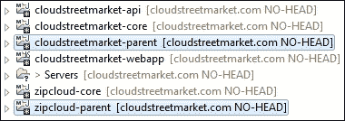

6.  From the top-right panel, click on the **Git** **perspective**:

    

    如果您还没有使用按钮添加此透视图。

7.  从左侧的层次结构（即**Git**透视图）中，选择**添加现有的本地 Git 存储库**。
8.  将打开一个上下文窗口。目标是我们刚刚创建的本地 Git 存储库的位置（它应该是当前的工作区目录）。
9.  新的存储库现在应该出现在**Git**透视图中。
10.  As shown in the following screenshot, right-click and select **Checkout** to see the latest version of the branch **origin/v1.x.x**.

    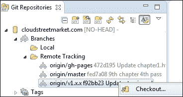

11.  When prompted, Checkout as **New Local Branch**:

    

12.  The actual workspace should now be synchronized with the branch v1.x.x. This branch reflects the state of the environment at the end of [Chapter 1](08.html#aid-2BASE1 "Chapter 1. Setup Routine for an Enterprise Spring Application"), Setup *Routine for an Enterprise Spring Application.*

    

13.  右键点击**zipcloud 父项**执行**以| Maven clean**的方式运行，以及**以| Maven install**的方式运行。然后，在`cloudstreetmarket-parent`上执行相同的操作。你每次都要观察`BUILD SUCCESS`。
14.  最后，右键点击一个项目，进入**Maven****更新项目**。选择工作区的所有项目，点击**确定**。
15.  如果您的一个项目中仍有红色警告（如前一个屏幕截图所示），您可能需要将目标运行时环境重新连接到**cloudstreetmarket api**和**cloustreetmarket webapp**（根据[第 1 章](01.html#aid-BE6O1 "Chapter 1. Getting Started with Spring Core")*企业级 Spring 应用程序的设置例程*，*第二个配方，第七步*。
16.  从终端转到本地 GIT 存储库：

    ```
     cd <home-directory>/workspace 

    ```

17.  输入以下命令：

    ```
     git pull origin v2.2.1

    ```

18.  重申步骤 13 和 14。（每次拉取新更改后，请准备好重复这两个步骤。）
19.  在**cloudstreetmarket webapp**模块中，现在出现了一个新的包：

    ```
     edu.zipcloud.cloudstreetmarket.portal.controllers.

    ```

20.  在这个包中，已经创建了一个`InfoTagController`类：

    ```
    @Controller
    @RequestMapping("/info")
    public class InfoTagController {
      @RequestMapping("/helloHandler")
      @ResponseBody
      public String helloController(){
        return "hello";
      }
    }
    ```

21.  Make sure the two `wars` are deployed in the Tomcat server. Start the Tomcat server and access the `http://localhost:8080/portal/info/helloHandler` URL with your browser.

    ### 注

    您应该会看到一个简单的 hello 显示为 HTML 内容*。*

22.  在`cloudstreetmarket-webapp/src/main/webapp/WEB-INF/dispatcher-context.xml`文件中增加了以下 bean 定义：

    ```
    <bean id="webAppVersion" class="java.lang.String">
      <constructor-arg value="1.0.0"/>
    </bean>
    ```

23.  还增加了以下方法和`InfoTagController`类中的成员：

    ```
    @Autowired
    private WebApplicationContext webAppContext;
    private final static LocalDateTime startDateTime = LocalDateTime.now();
    private final static DateTimeFormatter DT_FORMATTER =  DateTimeFormatter.ofPattern("EEE, d MMM yyyy h:mm a");
    @RequestMapping("/server")
    @ResponseBody
    public String infoTagServer(){
      return new StringJoiner("<br>")
        .add("-------------------------------------")
        .add(" Server: "+ 
        webAppContext.getServletContext().getServerInfo())
        .add(" Start date: "+ 
        startDateTime.format(DT_FORMATTER))
        .add(" Version: " + 
        webAppContext.getBean("webAppVersion"))
        .add("--------------------------------------")
        .toString();
    }
    ```

24.  Now, access the `http://localhost:8080/portal/info/server` URL with your browser.

    ### 注

    您应该看到以下内容呈现为 HTML 文档：

    ```
    --------------------------------------------------
    Server: Apache Tomcat/8.0.14
    Start date: Sun, 16 Nov 2014 12:10 AM
    Version: 1.0.0
    ---------------------------------------------------

    ```

## 它是如何工作的。。。

我们将起草一份 SpringMVC 框架概述。然后，我们将回顾如何从`DispatcherServlet`、控制器级别注释和方法处理程序签名配置控制器。

### Spring MVC 概述

Spring MVC 实现了两种常见的设计模式：前端控制器设计模式和 MVC 设计模式。

#### 前端控制器

设计为前端控制器的系统为所有传入请求公开一个入口点。在 JavaWeb 环境中，这个入口点通常是一个 servlet——一个唯一的 servlet，用于分派和委托给其他组件。

### 注

在 SpringMVC 中，这个独特的 servlet 是`DispatcherServlet`。

servlet 是 JavaWeb 中的标准。它们与预定义的 URL 路径相关联，并在部署描述符（即`web.xml`文件）中注册。通过解析部署描述符，servlet 容器（如 ApacheTomcat）标识声明的 servlet 及其 URL 映射。在运行时，servlet 容器拦截每个 HTTP 客户端请求，并为每个请求创建一个新线程。这些线程将使用 Java 转换的请求和响应对象调用匹配的相关 servlet。

#### MVC 设计模式

MVC 设计模式更像是一种建筑风格。它从整体上描述了应用程序。它鼓励在请求线程必须通过的三个不同层之间清晰地分离关注点：**模型**、**视图**和**控制器**——控制器、模型，然后是视图，以确保准确。

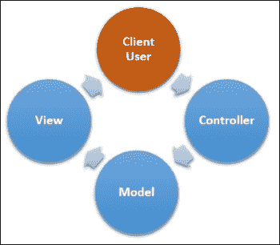

当 servlet 容器截获客户机请求时，它被路由到`DispatcherServlet`。`DispatcherServlet` 将请求发送到一个控制器（一个控制器方法处理程序），该控制器具有与请求状态匹配的配置（如果找到匹配）。

控制器协调业务逻辑、模型生成，并最终为模型和响应选择一个视图。在这个透视图中，模型表示由控制器处理并提供给视图用于可视化目的的填充数据结构。

但这三个组件（模型、视图和控制器）也可以作为独立的静态层在宏观尺度上可视化。这些组件中的每一个都是一个图层和一个占位符，用于类别的每个单独组成部分。**控制器层**包含所有注册的控制器以及 Web 拦截器和转换器；模型生成层（和业务逻辑层）包含业务服务和数据访问组件。视图层包含模板（例如 JSP）和其他 web 客户端组件。

#### 弹簧 MVC 流量

弹簧 MVC 流程可以用下图表示：


我们前面提到 SpringMVC 实现了一个前端控制器模式。入口点是`DispatcherServlet`。此`DispatcherServlet`依赖于`HandlerMapping`实现。通过不同的策略和特殊性，`HandlerMapping`为请求解析控制器方法处理程序。

一旦`DispatcherServlet`有了控制器方法处理程序，它就会将请求发送给它。方法处理程序将视图名称（或直接返回视图本身）以及填充的模型对象返回给`DispatcherServlet`。

使用视图名称，`DispatcherServlet`要求`ViewResolver`实现查找并选择一个视图。

有了请求、视图和模型，`DispatcherServlet` 就有了构建客户机响应的一切。使用所有这些元素处理视图，并最终将响应返回到 servlet 容器。

### DispatcherServlet–Spring MVC 入口点

如前所述，`DispatcherServlet`是 Spring MVC 的核心部分。它拦截以应用程序预定义 URL 路径为目标的客户端请求。它将它们映射到属于业务逻辑操作符（控制器、拦截器、过滤器等）的处理程序。它还提供了一组工具，作为 bean 提供，用于解决反复出现的 web 开发问题和技术，如为集中化和模块化视图层提供服务、处理国际化、主题、处理异常等。

首先，`DispatcherServlet`是一个 servlet，在`web.xml`文件中定义为 servlet，并带有 servlet 配置及其 servlet 映射。代码如下：

```
<servlet>
  <servlet-name>spring</servlet-name>
   <servlet-class>
      org.springframework.web.servlet.DispatcherServlet
  </servlet-class>
  <load-on-startup>1</load-on-startup>
</servlet>
<servlet-mapping>
   <servlet-name>spring</servlet-name>
   	<url-pattern>/*</url-pattern>
</servlet-mapping>
```

在我们的应用程序中，在**cloudstreetmarket webapp**中，`DispatcherServlet`被命名为 spring，覆盖了应用程序的完整上下文路径：`/*`。

我们已经看到，每个`DispatcherServlet`都有一个从根`ApplicationContext`继承豆子的受限范围`WebApplicationContext`。

默认情况下，对于`WebApplicationContext`，Spring MVC 在`/WEB-INF`目录中查找名为`{servletName}-servlet.xml`的配置文件。但是，我们已通过初始化参数`contextConfigLocation`覆盖了此默认名称和位置：

```
<servlet>
 <servlet-name>spring</servlet-name>
   <servlet-class>
    org.springframework.web.servlet.DispatcherServlet
  </servlet-class>
   <init-param>
    <param-name>contextConfigLocation</param-name>
    <param-value>/WEB-INF/dispatcher-context.xml</param-value>
   </init-param>
   <load-on-startup>1</load-on-startup>
</servlet>
<servlet-mapping>
    <servlet-name>spring</servlet-name>
    <url-pattern>/*</url-pattern>
</servlet-mapping>
```

仍然在`web.xml`中，您可以看到根应用程序上下文（`classpath*:/META-INF/spring/*-config.xml`以`ContextLoaderListener`开头：

```
<listener>
  <listener-class>
    org.springframework.web.context.ContextLoaderListener
  </listener-class>
</listener>
```

### 注释定义的控制器

Spring MVC 控制器是客户机请求真正开始由业务特定代码处理的地方。自*Spring2.5*以来，我们已经能够在控制器上使用注释，因此我们不必在配置中将它们显式声明为 bean。这使得它们的实现更易于扩展和理解。

#### @控制器

`@Controller`注释将类标记为 Web 控制器。它仍然是表示层的 Spring 原型。定义 Spring 原型的主要目的是在 Spring 类路径扫描期间发现目标类型或方法，该扫描由包使用以下命令激活：

```
<context:component-scan base-package="edu.zipcloud.cloudstreetmarket.portal"/>
```

与此注释相关的自定义逻辑不多。如果我们不想让应用程序变得更干净，我们可以使用其他原型注释（`@Component`或`@Service`运行一个控制器。

#### @RequestMapping

`@RequestMapping`注释将处理程序定义到控制器类和/或控制器方法上。这些注释由`DispatcherServlet`在原型类中查找。`@RequestMapping`注释背后的主要思想是在类级别定义主路径映射，并缩小 HTTP 请求方法、头、参数和方法上的媒体类型。

为了实现这种窄化，`@RequestMapping`注释接受括号内逗号分隔的参数。

考虑下面的例子：

```
@RequestMapping(value="/server", method=RequestMethod.GET)
```

`@RequestMapping`可用参数汇总如下表：

<colgroup><col> <col></colgroup> 
| 

参数和类型

 | 

使用/说明（来自 JavaDoc）

 |
| --- | --- |
| `name (String)` | 为映射指定一个名称。 |
| `value (String[])` | 路径映射 URI（例如，`/myPath.do`）。还支持 Ant 样式的路径模式（例如，`/myPath/*.do`）。 |
| 路径映射 URI 可能包含针对本地属性和/或系统属性和环境变量的占位符（例如，`/${connect}`。 |
| 路径实现 URI 模板，通过模式、变量、占位符和矩阵变量访问 URL 的选定部分（请参见 URI 模板一节）。 |
| 在方法级别，在类型级别表示的主映射中支持相对路径（例如，`edit.do`。 |
| `method``(RequestMethod[])` | 获取、发布、标题、选项、放置、修补、删除、跟踪。 |
| `params (String[])` | 一系列`myParam=myValue`风格的表达。 |
| 表达式可以使用`!=`运算符进行求反，如在`myParam!=myValue`中。 |
| `headers (String[])` | 一系列`My-Header=myValue`风格的表达。 |
| 只支持指定头名称（例如，`My-Header`）（允许有任何值）。 |
| 还支持否定标头名称（例如，“！My header”）（指定的标头不应出现在请求中）。 |
| 还支持媒体类型通配符（`*`），用于诸如 Accept 和 Content type 之类的标头。 |
| `consumes (String[])` | 映射请求的可消耗介质类型。 |
| 仅当`{@code Content-Type}`与这些媒体类型之一匹配时才映射。 |
| 还支持对表达式求反（例如，`!text/xml`）。 |
| `produces (String[])` | 映射请求的可生产媒体类型。 |
| 仅当`{@code Accept}`与这些媒体类型之一匹配时才映射。 |
| 还支持对表达式求反（例如，`!text/plain`）。它将所有请求与除“text/plain”之外的`{@code Accept}`匹配。 |

所有这些参数都可以在类型和方法级别使用。在类型级使用时，所有方法级参数都继承父级窄化。

### 控制器方法处理程序签名

几个成分组成一个控制器方法处理程序。下面是使用 Spring MVC 的此类处理程序的另一个示例：

```
@RequestMapping(value="/index")
public ModelAndView getRequestExample(ServletRequest request){
    ModelAndView mav = new ModelAndView();
    mav.setViewName("index");
    mav.addObject("variable1", new ArrayList<String>());
    return mav;
}
```

我们刚才讨论了如何使用`@RequestMapping` 注释。关于方法签名，此注释只能放在返回类型之前。

#### 支持的方法参数类型

为处理程序方法声明特定类型的参数可以让 Spring 自动将外部对象的引用注入其中。与请求生命周期、会话或应用程序配置相关的对象。由于方法的作用域是有限的，这些参数类型如下表所示：

<colgroup><col> <col> <col></colgroup> 
| 

支持的参数

 | 

使用/说明

 | 

包装

 |
| --- | --- | --- |
| `ServletRequest /``HttpServletRequest` | 注入 servlet 请求/响应。 | `javax.servlet.http.*` |
| `ServletResponse /``HttpServletResponse` |
| `HttpSession` | 注入绑定到 servlet 请求的 HTTP 会话。如果为 null，Spring 将创建一个新的。如果需要共享会话，则必须在`AbstractController`或`RequestMappingHandlerAdapter`中设置`synchronizeOnSession`跨多个请求并发执行。 |
| `WebRequest / NativeWebRequest` | 仅为访问请求参数和请求/会话属性注入包装器。 | `org.springframework.web.context.request.*` |
| `Locale` | 使用配置的`LocaleResolver`注入请求的本地 e。 | `java.util.*` |
| `InputStream / Reader` | 提供对请求/响应有效负载的直接访问。 | `java.io.*` |
| `OutputStream / Writer` |
| `HttpMethod` | 注入请求的当前方法。 | `org.springframework.http.*` |
| `Principal` | 它使用 Spring 安全上下文注入经过身份验证的帐户。 | `java.security.*` |
| `HttpEntity<?>` | Spring 使用`HttpMessageConverter`将入站请求转换并注入到自定义类型。它还提供对请求头的访问。 | `org.springframework.http.*` |
| `Map` | 为我们实例化一个要在视图中使用的`BindingAwareModelMap`。 | `java.util.*` |
| `Model` | `org.springframework.ui.*` |
| `ModelMap` |
| `RedirectAttributes` | 注入并重新填充通过请求重定向维护的属性和闪存属性的映射 | `org.springframework.web.servlet.mvc.support.*` |
| `Errors` | 注入参数列表中位于前面的参数的验证结果。 | `org.springframework.validation.*` |
| `BindingResult` |
| `SessionStatus` | 允许使用`setComplete`（布尔值）标记，以完成会话。此方法清除在类型级别使用@SessionAttributes 定义的会话属性。 | `org.springframework.web.bind.support.*` |
| `UriComponentsBuilder` | 注入 Spring URL 生成器 UriComponentsBuilder。 | `org.springframework.web.util.*` |

#### 支持的方法参数注释

已经为方法处理程序参数设计了一组本机注释。它们必须被视为句柄，用于针对传入请求或尚未构建的响应配置控制器方法的 web 行为。

他们为方便的 Spring MVC 函数识别抽象，如请求参数绑定、URI 路径变量绑定、请求有效负载的注入参数、HTML 表单参数绑定等。

<colgroup><col> <col> <col></colgroup> 
| 

支持的注释参数

 | 

使用/说明

 | 

包裹

 |
| --- | --- | --- |
| `@PathVariable` | 将 URI 模板变量注入参数。 | `org.springframework.web.bind.annotation.*` |
| `@MatrixVariable` | 将 URI 路径段中的名称-值对注入参数。 |
| `@RequestParam` | 将特定的请求参数注入参数。 |
| `@RequestHeader` | 将特定的请求 HTTP 头插入到参数中。 |
| `@RequestBody` | 允许直接访问将其注入参数的请求有效负载。 |
| `@RequestPart` | 将多部分/表单数据编码请求的特定部分（元数据、文件数据…）的内容注入匹配类型（元数据、多部分文件…）的参数中 |
| `@ModelAttribute` | 使用 URI 模板自动填充模型的属性。此绑定在方法处理程序处理之前操作。 |

必须将这些注释放置在要填充的方法参数之前：

```
@RequestMapping(value="/index")
public ModelAndView getRequestExample(@RequestParam("exP1") String exP1){
   ModelAndView mav = new ModelAndView();
   mav.setViewName("index");
   mav.addObject("exP1", exP1);
   return mav;
}
```

#### 支持的返回类型

SpringMVC 具有不同的可能控制器方法返回类型，允许我们指定发送回客户端的响应，或者为中间视图层指定目标或填充变量所需的配置。根据我们想要做什么或实际的应用程序状态，我们可以从以下选项中进行选择：

<colgroup><col> <col> <col></colgroup> 
| 

支持的返回类型

 | 

使用/说明

 | 

包装

 |
| --- | --- | --- |
| `Model` | SpringMVC 为 handler 方法创建模型接口的实现。模型对象在 handler-method 中手动填充或使用`@ModelAttribute`填充。要呈现的视图需要使用 RequestToViewNameTranslator 映射到请求。 | `org.springframework.ui.*` |
| `ModelAndView` | 具有视图和视图名称的模型包装器对象。如果提供了视图名称，SpringMVC 将尝试解析关联的视图。否则，将渲染嵌入的视图。模型对象在方法中手动填充或使用`@ModelAttribute`填充。 |
| `Map` | 允许自定义模型实现。要呈现的视图需要映射到带有`RequestToViewNameTranslator`的请求。 | `java.util.*` |
| `View` | 允许渲染自定义视图对象。SpringMVC 为 handler 方法创建模型接口的实现。模型的对象在方法中手动填充或在`@ModelAttribute`的帮助下填充。 | `org.springframework.web.servlet.*` |
| `String` | 如果未在处理程序方法上指定`@ResponseBody`注释，则返回的字符串将作为视图名称（视图标识符）处理。 | `java.lang.*` |
| `HttpEntity<?> / ResponseEntity<?>` | 两个包装器对象，用于轻松管理响应头，并由 Spring body 转换（带`HttpMessageConverters`）。 | `org.springframework.http.*` |
| `HttpHeaders` | 为头部响应提供包装器对象。 | `org.springframework.http .*` |
| `Callable<?>` | 当线程由 SpringMVC 控制时，可以异步生成类型化对象。 | `java.util.concurrent.*` |
| `DeferredResult<?>` | 当线程不受 SpringMVC 控制时，可以异步生成类型化对象。 | `org.springframework.web.context.request.async.*` |
| `ListenableFuture<?>` | `org.springframework.util.concurrent.*` |
| `void` | 当视图通过`RequestToViewNameTranslator`进行外部解析时，或当方法直接在响应中打印时。 |   |

## 还有更多。。。

在`InfoTagController.infoTagServer()`方法处理程序中，我们在返回类型之前使用了`@ResponseBody`注释。此注释是从 REST 特定工具借用的。当您不需要处理视图时，`@ResponseBody`指令将使用已注册的 Spring 转换器将返回的对象封送为预期的格式（XML、JSON 等）。然后，它将封送的内容写入响应主体（作为响应有效负载）。

对于没有更多配置的字符串对象，它将在响应主体中打印出来。我们本可以使用`ResponseEntity<String>`返回类型来实现相同的目标。

# 使用 ViewResolver 配置回退控制器

这个配方引入了一些与控制器相关的高级概念和工具，如`ViewResolvers`、URI 模板模式和 Spring MVC 的注入作为参数。菜谱很简单，但还有很多要说的。

## 准备好了吗

我们将继续从与上一个配方相同的代码基状态工作，在该配方中，我们从远程存储库中提取了 v2.2.1 标记。它只涉及使用其处理程序方法创建一个控制器。

## 怎么做。。。

1.  In the **cloudstreetmarket-webapp** module and in the package `edu.zipcloud.cloudstreetmarket.portal.controllers`, the following `DefaultController` has been created:

    ```
    @Controller
    public class DefaultController {
      @RequestMapping(value="/*", method={RequestMethod.GET,RequestMethod.HEAD})
      public String fallback() {
        return "index";
      }
    }
    ```

    ### 注

    我们将详细解释此方法处理程序如何用作回退拦截器。

2.  Access the `http://localhost:8080/portal/whatever` or `http://localhost:8080/portal/index` URL with your browser.

    您还应该收到我们之前看到的 HTML 内容：

    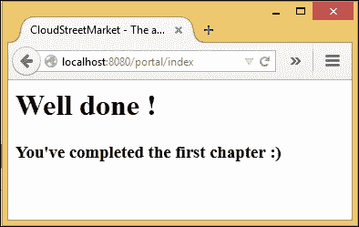

## 它是如何工作的。。。

第二个方法是重新使用`@RequestMapping`注释。不再使用固定 URI 作为路径值，而是使用开放模式（回退）。该配方还使用了我们以前没有使用过的已配置视图解析器。

### URI 模板模式

模板词在 Spring 术语中反复出现。它通常是指要实例化的通用支持 SpringAPI，以填充特定的实现或定制（REST 模板用于发出 RESTHTTP 请求，JMS 模板用于发送 JMS 消息，WS 模板用于发出 SOAP Web 服务请求，JDBC 模板，等等）。它们是开发人员与 Spring 核心特性之间的桥梁。

在这种情况下，URI 模板允许为控制器端点配置带有模式和变量的通用 URI。可以实例化将实现 URI 模板的 URI 构建器，但开发人员可能主要使用 URI 模板来支持`@RequestMapping`注释。

#### 蚂蚁式路径模式

我们已经使用这些类型的模式为我们的回退处理程序方法定义了路径值：

```
@RequestMapping(value="/*", ...)

```

这个带有`*`通配符的特定情况允许应用程序显示名称后以`/`开头的请求 URI 符合此方法的处理条件。

通配符可以匹配字符、单词或单词序列。考虑下面的例子：

```
/portal/1, /portal/foo, /portal/foo-bar
```

限制是在最后一个序列中使用另一个斜杠：

```
/portal/foo/bar
```

记住此处表格的区别：

<colgroup><col> <col></colgroup> 
| `/*` | 级别上的所有资源和目录 |
| `/**` | 级别和子级别的所有资源和目录 |

我们一直在`cloudstreetmarket-webapp`应用程序中故意使用单个通配符。其他类型的应用程序可能更适合将每个不匹配的 URI 重定向到默认 URI。在我们的例子中，对于一个将强烈面向 REST 的单页应用程序，当没有找到资源时，最好通知客户机一个`404`错误。

在路径模式的末尾使用通配符并不是唯一的选择。如果需要，我们可以实现以下类型的模式：

```
/portal/**/foo/*/bar  	
```

（不过，并非出于备用目的）。

我们将看到 SpringMVC（选择一个处理程序）会比较所有匹配的路径模式，并选择其中最具体的模式。

### 提示

在控制器类型级别，我们没有指定一个`@RequestMapping`。如果我们这样做了，那么方法级别的指定路径将连接到类型级别 1（实现缩小）。

例如，下面的定义将为我们的回退控制器定义路径模式`/portal/default/*`：

```
@RequestMapping(value="/default"...)
@Controller
public class DefaultController…{
      @RequestMapping(value="/*"...)
      public String fallback(Model model) {...}
}
```

#### 路径模式比较

当给定的 URL 与多个注册的路径模式匹配时，SpringMVC 会进行 pathpattern 比较，以选择请求将映射到哪个处理程序。

### 注

将选择被认为最具体的模式。

第一个标准是比较路径模式中已计数的变量和通配符的数量：变量和通配符数量最少的模式被认为是最具体的模式。

要区分具有相同累计变量数和通配符数的两种路径模式，请记住，通配符数最少的路径将是最具体的，然后最长的路径将是最具体的。

最后，带有双通配符的模式总是比没有任何通配符的模式更不具体。

为了说明这一点，我们考虑下面的层次结构，从最具体到最不具体：

`/portal/foo`

`/portal/{foo}`

`/portal/*`

`/portal/{foo}/{bar}`

`/portal/default/*/{foo}`

`/portal/{foo}/*`

`/portal/**/*`

`/portal/**`

#### 视图分解器

在**cloudstreetmarket webapp**的`dispatcher-context.xml`中，我们定义了`viewResolver`bean：

```
<bean id="viewResolver" class="org.springframework.web.servlet.view.InternalResourceViewResolver">
  <property name="viewClass" value="org.springframework.web.servlet.view.JstlView" />
  <property name="prefix" value="/WEB-INF/jsp/" />
  <property name="suffix" value=".jsp" />
</bean>
```

`viewResolver`bean 是一个预定义类的特定实例，用于为一组有组织、统一的视图层提供服务。在我们已经配置的情况下，`viewResolver`bean 是`InternalResourceViewResolver`的一个实例，它可以服务于 JSP 页面，处理 JSTL 和 tile。此类还继承了可导航应用程序资源并可将逻辑视图名称绑定到视图资源文件的`UrlBasedViewResolver`。此功能可防止创建外部映射。

在我们的配置中，我们已经定义了视图库`(/WEB-INF/jsp/*.jsp)`，可以用字符串`index`直接引用`index.jsp`。

更好的做法是在`/WEB-INF`下设置 JSP 存储库，这样这些 JSP 就不会成为公开的目标。我们可以使用 Velocity 或 Freemarker，分别使用视图解析器`VelocityViewResolver`或`FreeMarkerViewResolver`，而不是 JSP 模板。

另外，我们将在稍后构建 RESTAPI 时讨论`ContentNegotiatingViewResolver`。

## 还有更多。。。

本节特别强调@PathVariable 注释。此注释是控制器方法处理程序参数的注释（我们在前面的配方中介绍了所有这些参数）。

### @PathVariable 读取 URI 模板模式中的变量

稍后，您将在几个示例中找到方法级别的`@RequestMapping`注释。这些注释有时与方法处理程序参数上的`@PathVariable`注释相关。现在，让我们考虑下面的例子：

```
@RequestMapping(value="/example/{param}")
public HttpEntity<String> example(@PathVariable("param") String parameter) {
  return new HttpEntity<>(parameter);
}
```

如前所述，`@PathVariable`告诉 Spring MVC 在何处以及如何从请求 URI 中实现其作为参数的注入。框架将解析当前 URI 模板模式以提取名为`param`的变量，并将当前 URI 中的匹配值注入目标方法参数。

我们还声明返回一个`HTTPEntity`作为响应。此`HTTPEntity`将是字符串泛型类型的包装器。在方法处理程序中，我们用必要的字符串元素实例化这个包装器。

如果我们调用`/portal/example/foo`URI，它将显示为返回的`HTTPEntity`：字符串`foo`主体的响应。

有了另一个有趣的特性，我们本可以用以下`@PathVariable`声明构建最后一个场景：

```
@RequestMapping(value="/example/{param}")
public HttpEntity<String> example(@PathVariable String param) {
  return new HttpEntity<>(param);
}
```

### 提示

SpringMVC 不向注释提供值，默认情况下，它将在 URI 模板模式中查找与目标参数同名的变量。

我们将探讨关于`@RequestMapping`和`@PathVariable`的其他特性。

# 使用 Bootstrap 设置和定制响应性单页网页设计

Bootstrap 是一个 UI 框架，最初由 Mark Otto 和 Jacob Thornton 在 Twitter 上创建。它是样式、图标和行为的惊人来源，抽象为定义和丰富组件。Bootstrap 为定义样式提供了一组简单、合理和统一的模式。它以前没有同类产品。如果您从未使用过它，您将很高兴从 DOM 的快速定义中获得如此多的视觉反馈。

2014 年 6 月，它是 GitHub 上的头号项目，拥有 73000 多颗星星和 27000 多个叉子。他们的文档非常流畅，易于阅读。

## 准备好了吗

在本食谱中，我们将使用 Bootstrap 从现有的 Bootstrap 主题为我们的 CloudStreet 市场项目设置 web 设计基础。我们将重新制作`index.jsp`页面，以呈现一个外观更好的欢迎页面，可以使用以下屏幕截图进行预览。

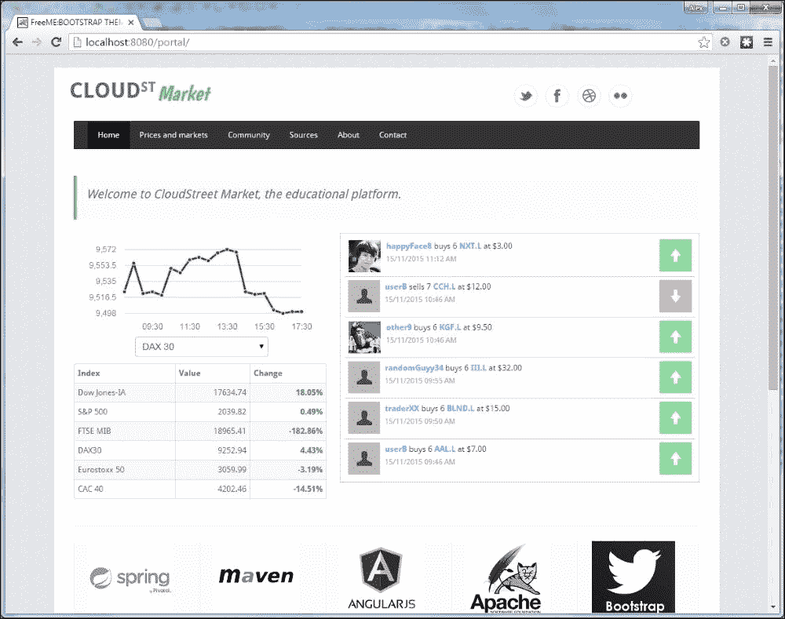

## 怎么做。。。

这个配方有三个主要的步骤：

*   安装引导主题
*   自定义引导主题
*   创建响应性内容

从 Eclipse 中的 Git 透视图，签出分支的最新版本`v2.x.x`：

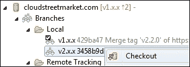

### 安装引导主题

1.  在的`chapter_2`目录中，您可以找到一个`freeme.zip`档案。这是一个可免费下载的响应引导模板。此邮政编码来自[bootstrapmaster.com](http://bootstrapmaster.com)网站。
2.  Inside this archive, you'll see a `css` directory, a `js` directory, an `img` directory, and finally an `index.html` file. Opening the `index.html` file with a web browser should render the following home page:

    

    我们使用此模板作为 webapp 模块的基础。

3.  位于`freeme/js`目录中的所有 JavaScript 文件都已复制到`/cloudstreetmarket-webapp/src/main/webapp/js`目录。
4.  位于`freeme/css`目录中的所有 CSS 文件都已复制到`/cloudstreetmarket-webapp/src/main/webapp/css`目录。
5.  位于`freeme/img`中的所有图片都已复制到`/cloudstreetmarket-webapp/src/main/webapp/img` 目录中。
6.  `freeme/index.html`文件的内容已复制粘贴到`/cloudstreetmarket-webapp/src/main/webapp/WEB-INF/jsp/index.jsp`文件中，如 UTF-8。
7.  而且，`freeme/licence.txt`已经复制粘贴到`/cloudstreetmarket-webapp/src/main/webapp/WEB-INF/jsp`目录。
8.  此时，使用 web 浏览器调用`http://localhost:8080/portal/index`显示与您之前看到的完全相同的视觉效果，但由我们的应用程序提供服务。

### 定制引导主题

我们将在本节中详细说明为使下载的模板适应我们的用例所做的工作。

1.  之前位于`cloudstreetmarket-webapp\src\main\webapp\img\logos`中的所有图像都已删除，并替换为六个代表我们在本应用程序和本书中一直使用的技术产品品牌的新图像。
2.  在`cloudstreetmarket-webapp`模块中的`index.jsp`文件中，已经实现了以下更改：
    1.  顶部增加了以下两行：

        ```
        <%@ page contentType="text/html;charset=UTF-8" language="java" %>
        <%@ page isELIgnored="false" %>
        ```

    2.  `<!-- start: Meta -->`部分已替换为以下内容：

        ```
        <!-- start: Meta -->
        <meta charset="utf-8">
        <title>Spring MVC: CloudST Market</title> 
        <meta name="description" content="Spring MVC CookBook: Cloud Street Market"/>
        <meta name="keywords" content="spring mvc, cookbook, packt publishing, microservices, angular.js" />
        <meta name="author" content="Your name"/>
        <!-- end: Meta -->
        ```

    3.  `<!--start: Logo -->`部分已替换为以下内容：

        ```
        <!--start: Logo -->
        <div class="logo span4">
          CLOUD<span class="sub">ST</span><span>Market</span>
        </div>
        <!--end: Logo -->
        ```

    4.  导航菜单定义已更改：

        ```
        <ul class="nav">
          <li class="active"><a href="index">Home</a></li>
          <li><a href="markets">Prices and markets</a></li>
          <li><a href="community">Community</a></li>
          <li><a href="sources">Sources</a></li>
          <li><a href="about">About</a></li>
          <li><a href="contact">Contact</a></li>
        </ul>
        ```

    5.  已移除`<!-- start: Hero Unit -->`和`<!-- start: Flexslider -->`部分，并清空导航菜单（`<!--end: Navigation-->`后出现的`<div class="row">`：

        ```
        <!-- start: Row -->
        <div class="row"></div>
        <!-- end: Row -->
        ```

    6.  位于`<!-- end Clients List -->`之后的`<!-- start: Row -->`段至`<!-- end: Row -->`段，已与紧随其后的`<hr>`一起拆除。
    7.  页脚部分`<!-- start: Footer Menu -->`至`<!-- end: Footer Menu -->`已替换为以下内容：

        ```
        <!-- start: Footer Menu -->
        <div id="footer-menu" class="hidden-tablet hidden-phone">
          <!-- start: Container -->
          <div class="container">
            <!-- start: Row -->
            <div class="row">
              <!-- start: Footer Menu Logo -->
              <div class="span1">
              <div class="logoSmall">CLOUD<span class="sub">ST</span><span>M!</span>
                </div>
                </div>
              <!-- end: Footer Menu Logo -->
              <!-- start: Footer Menu Links-->
              <div class="span10" >
              <div id="footer-menu-links">
              <ul id="footer-nav" style="margin-left:35pt;">
                <li><a href="index">Home</a></li>
                <li><a href="markets">Prices and markets</a></li>
              <li><a href="community">Community</a></li>
                <li><a href="sources">Sources</a></li>
                <li><a href="about">About</a></li>
                <li><a href="contact">Contact</a></li>
                </ul>
                </div>
                </div>
                <!-- end: Footer Menu Links-->
                <!-- start: Footer Menu Back To Top -->
                <div class="span1">
                <div id="footer-menu-back-to-top">
                  <a href="#"></a>
                  </div>
                </div>
                <!-- end: Footer Menu Back To Top -->
            </div>
            <!-- end: Row -->
            </div>
          <!-- end: Container  -->	
        </div>	
        <!-- end: Footer Menu -->
        ```

    8.  `<!-- start: Photo Stream -->`至`<!-- end: Photo Stream -->`部分已替换为：

        ```
        <!-- start: Leaderboard -->
        <div class="span3">
          <h3>Leaderboard</h3>
          <div class="flickr-widget">
            <script type="text/javascript" src=""></script>
            <div class="clear"></div>
          </div>
        </div>
        <!-- end: Leaderboard -->
        ```

    9.  作为`index.jsp`文件的最后更改，版权部分已经修改。
3.  在之前复制的`cloudstreetmarket-webapp/src/main/webapp/css/style.css`文件中，增加了类：

    ```
    .logo{
      font-family: 'Droid Sans';	font-size: 24pt; color: 	#666; width:157pt; font-weight:bold; margin-top:18pt; 	margin-left:10pt; height:30pt;
    }
    .logo span{
      position:relative;float:right; margin-top: 3pt;	font-weight:normal; font-family: 'Boogaloo'; font-	style:italic;	color: #89C236; padding-right: 3pt;
    }
    .logo .sub {
      vertical-align: super;	font-style:normal;font-size: 16pt; font-family: 'Droid Sans';	font-weight:bold; position: absolute;	color: #888; 	margin:-4pt 0 -4pt 0;
    }
    .logoSmall{
      font-family: 'Droid Sans';	font-size: 16pt; color: #888;width:80pt;	font-weight:bold; margin-top:10pt;height:20pt; margin-right:30pt;
    }
    .logoSmall span{
      position:relative;	float:right; margin-top: 3pt;
      font-weight:normal;font-family: 'Boogaloo';	font-style:italic;color: #89C236;
    }
    .logoSmall .sub {
      vertical-align: super;
      font-style:normal;	font-size: 10pt;font-family: 'Droid Sans';font-weight:bold;position: absolute; color: #666;margin:-2pt 0 -4pt 0;
    }
    ```

4.  At this point, after all these changes, restarting Tomcat and calling the same URL `http://localhost:8080/portal/index` resulted in the following state:

    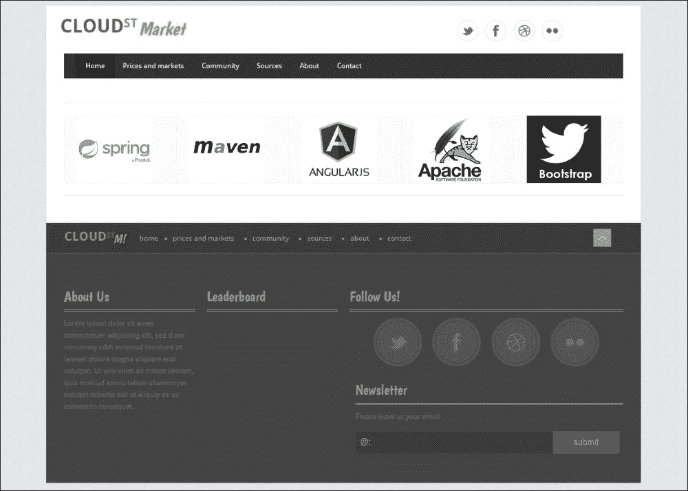

### 创建响应性内容

我们将在本节中重点介绍为使欢迎页面充满响应性内容所做的更改。通过响应，了解内容将以适合设备大小和方向的样式呈现。

1.  在`index.jsp`文件中：
    1.  The `<div class="row">` has been added the following content:

        ```
        <div class='span12'>
          <div class="hero-unit hidden-phone"><p>Welcome to CloudStreet Market, the educational platform.</p></div>
        </div>
        <div class='span5'>
            <div id='landingGraphContainer'></div>
            <div id='tableMarketPrices'>
              <table class="table table-hover table-condensed table-bordered table-striped">
                <thead>
                  <tr>
                    <th>Index</th>
                    <th>Value</th>
                    <th>Change</th>
                  </tr>
                 </thead>
                 <tbody>
               <tr>
                   <td>Dow Jones-IA</td><td>17,634.74</td>
                   <td class='text-success'><b>-18.05</b></td>
                    </tr>
                    ...
                    <tr>
                      <td>FTSE MIB</td><td>18,965.41</td>
                      <td class='text-error'><b>-182.86</b></td>
                    </tr>
                    ...
                </tbody>
                </table>
              </div>
        </div>
        <div id="containerCommunity" class='span7'>
            <div id="divRss3"></div>
        </div>
        ```

        ### 注

        在之前添加的*着陆图容器*中，我们插入了一个生成的图形，该图形呈现了上一开放日特定市场的演变。图中使用了`morris.js`库（[http://morrisjs.github.io/morris.js](http://morrisjs.github.io/morris.js) ），也依赖`raphael.js`库（[https://cdnjs.com/libraries/raphael](https://cdnjs.com/libraries/raphael) 。

    2.  在文件的底部，`<!-- start: Java Script -->`部分到`<!-- end: Java Script -->`部分增加了以下内容：

        ```
        <script src="js/jquery-1.8.2.js"></script>
        <script src="js/bootstrap.js"></script>
        <script src="js/flexslider.js"></script>
        <script src="js/carousel.js"></script>
        <script def src="js/custom.js"></script>
        <script src="js/FeedEk.js"></script>
        <script src="js/raphael.js"></script>
        <script src="js/morris.min.js"></script>
        <script>
        $(function () {
            var financial_data = [
             {"period": "08:00", "index": 66},{"period": "09:00", "index": 62},
        	 {"period": "10:00", "index": 61},{"period": "11:00", "index": 66},
             {"period": "12:00", "index": 67},{"period": "13:00", "index": 68},
             {"period": "14:00", "index": 62},{"period": "15:00", "index": 61},
             {"period": "16:00", "index": 61},{"period": "17:00", "index": 54}
            ];
            Morris.Line({
              element: 'landingGraphContainer',
              hideHover: 'auto', data: financial_data,
              ymax: 70, ymin: 50,
              pointSize: 3, hideHover:'always',
              xkey: 'period', xLabels: 'month',
              ykeys: ['index'], postUnits: '',
              parseTime: false, labels: ['Index'],
              resize: true, smooth: false,
              lineColors: ['#A52A2A']
            });
        });
        </script>
        ```

2.  在`cloudstreetmarket-webapp\src\main\webapp\js` 目录中，`morris.min.js`和`raphael.js`库已从各自的网站复制和粘贴。
3.  返回到`index.jsp`文件：
    1.  先前创建的`<div id='containerCommunity'>`已填充以下内容：

        ```
        <div id="divRss3">
          <ul class="feedEkList">
            <li>
            <div class="itemTitle">
              <div class="listUserIco">
                
              </div>
              <span class="ico-white ico-up-arrow   listActionIco 	actionBuy"></span>
                <a href="#">happyFace8</a> buys 6 <a href="#">NXT.L</a> at $3.00
                <p class="itemDate">15/11/2014 11:12 AM</p>
            </div>
            </li>
            <li>
            <div class="itemTitle">
              <div class="ico-user listUserIco"></div>
              <span class="ico-white ico-down-arrow listActionIco actionSell"></span>
              <a href="#">actionMan9</a> sells 6 <a href="#">CCH.L</a> at $12.00
              <p class="itemDate">15/11/2014 10:46 	AM</p>
            </div>
            </li>
              ...
          </ul>
        </div>
        ```

    2.  这里的部分使用 feedEk jQuery 插件。它有自己的 CSS 和 JavaScript 文件。
4.  `cloudstreetmarket-webapp\src\main\webapp\js`目录包含与 feedEk jQuery 插件相关的`FeedEk.js`文件。此插件可以在网上找到（[http://jquery-plugins.net/FeedEk/FeedEk.html](http://jquery-plugins.net/FeedEk/FeedEk.html) ）。
5.  `cloudstreetmarket-webapp\src\main\webapp\css`目录中也有相关的`FeedEk.css`文件。
6.  仍在`index.jsp`中，在`<!-- start: CSS -->` 注释下增加了`FeedEk css`文件：

    ```
    <link href="css/FeedEk.css" rel="stylesheet">
    ```

7.  在`style.css`文件中，在第一个媒体查询定义`(@media only screen and (min-width: 960px)`之前，增加了以下样式定义：

    ```
    .listUserIco {
        background-color:#bbb;
        float:left;
        margin:0 7px 0 0;
    }
    .listActionIco {
        float:right; 
        margin-top:-3px;
    }
    .actionSell {
        background-color:#FC9090;
    }
    .actionBuy {
        background-color:#8CDBA0;
    }
    #landingGraphContainer{
        height:160px;
        padding: 0px 13px 0 10px;
    }
    .tableMarketPrices{
        padding: 13px 13px 0 15px;
    }
    ```

8.  最后，在`cloudstreetmarket-webapp\src\main\webapp\img`中添加了两张新图片（个人资料图片）。
9.  Try to dynamically resize a browser window that renders: `http://localhost:8080/portal/index`. You should observe a responsive and adaptive style as in the following picture:

    

## 它是如何工作的。。。

为了理解我们的引导部署，我们现在将回顾它是如何作为预先设计的主题安装的。然后，我们将发现 Bootstrap 框架的一些关键特性，而不仅仅是实现的特性，因为从逻辑上讲，在一个单页示例中只能直观地使用框架的一些特性。

### 主题装置

我们得到的主题只不过是一个经典的静态主题，你可以在互联网上找到数千个。它们由网页设计师制作，免费或商业发行。这一个由 HTML 文件的基本结构、JS 目录、CSS 目录和 IMG 目录组成。

主题安装非常容易理解，因为我们刚刚将 JavaScript 文件、CSS 文件和图像放置在应用程序的预期位置。

### 提示

引导核心功能在`bootstrap.js`、`bootstrap.css`和`bootstrap-responsive.css`中是独立的。您不应该直接调整这些文件。

### 引导亮点

实现的主题（FreeME）使用 Bootstrap 2。我们将回顾模板中已经实现的几个特性，以及我们项目的需求。

#### 自举支架

Bootstrap 脚手架有助于设计通常从网格模型构建的 HTML 结构。以下各节将介绍此主题的引导策略。

##### 网格系统及响应性设计

Bootstrap 提供了一个样式框架来处理特定于页面的网格系统。关键点在于默认网格系统，该系统由 12 列组成，设计用于 940px 宽的无响应容器。

引导响应功能通过使用`<meta name="viewport"…>`标记和导入`boostrap-responsive.css`文件激活。在这种情况下，容器宽度可以从 724px 扩展到 1170px。

### 提示

此外，在 767px 以下，色谱柱变为流体并垂直堆叠。

这些 Bootstrap 规范定义了一组非常严格的约束，但 Bootstrap 以某种方式为其实现创建了易于理解的设计一致性。

对于我们的模板，视口元标记如下所示：

```
<meta name="viewport" content="width=device-width, initial-scale=1, maximum-scale=1">
```

### 注

如果您不熟悉此标记，则其主要用途是在文档中定义特定于设备的大小。根据这些大小，可以为特定于方向和特定于设备的渲染定义规则。这些绑定到样式定义的规则称为 mediaqueries。您可以在 style.css 文件中找到 mediaquery 的示例：

```
/* Higher than 960 (desktop devices)
================================================================ */
@media only screen and (min-width: 960px) {
...
  #footer-menu {
    padding-left: 30px;
    padding-right: 30px;
    margin-left: -30px;
    margin-right: -30px;
  }
...
}
```

仅当设备显示的宽度大于 960px 时，此媒体查询才会覆盖特定于 id 页脚菜单的样式。

##### 定义列

为了在网格系统中定义列，Bootstrap 促使我们使用标记为`row`类元素的`row`div。然后，我们的想法是定义用自定义`span*`类元素标记的 subdiv，`*`字符表示我们必须处理的 12 列网格的细分。

例如，考虑以下两种可能的设计：

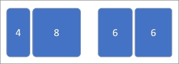

左例中的两列可以从 DOM 定义中呈现：

```
<div class="row">
  <div class="span4">...</div>
  <div class="span8">...</div>
</div>
```

右侧示例中的两列可以从 DOM 定义中呈现：

```
<div class="row">
  <div class="span6">...</div>
  <div class="span6">...</div>
</div>
```

考虑到这一点，我们欢迎页面的网格实际上如下所示：

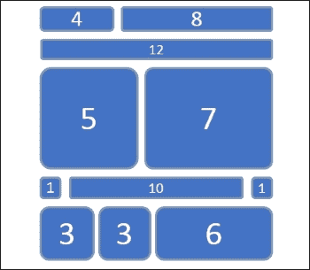

##### 偏移和嵌套

偏移列可以创建与一个或多个不可见列相对应的固定大小的衰减。例如，考虑下面的片段：

```
<div class="row">
    <div class="span6">...</div>
    <div class="span4 offset2">...</div>
</div>
```

此 DOM 定义将对应于以下列：


一列也可以嵌套在另一列中，重新定义新行。新创建的列的总和必须与父列的大小相对应：

```
<div class="row">
   <div class="span6">
      <div class="row">
        <div class="span2">...</div>
        <div class="span4">...</div>
      </div>
   </div>
</div>
```

##### 流体网格化

我们之前说过使用 Boostrap2，在 767px*以下，色谱柱变为流体并垂直堆叠*。模板网格可以从静态变为流体，将`.row`类变为`.row-fluid`。该系统将使用百分比，而不是固定像素大小的列。

#### 引导 CSS 实用程序

Bootstrap 还提供一些预先设计的元素，如按钮、图标、表格、表单，以及支持排版或图像的实用程序。

##### 统一按钮

默认样式的按钮可以从`<a>`和`<button>`标记创建，只需添加`.btn`类元素。创建的带有渐变的默认灰色按钮可以在不同的颜色变化中被拒绝。例如，**默认为**，以下类别组合：

*   `.btn .btn-primary`：这会产生一个深蓝色群青按钮，用于识别其他按钮中的主要动作
*   `.btn .btn-info`：这会产生一个中等的蓝绿色按钮
*   `.btn .btn-success`：这会产生一个正绿色按钮
*   `.btn .btn-warning`：这会产生一个橙色警告按钮
*   `.btn .btn-danger`：这会产生一个危险的红色按钮
*   `.btn .btn-inverse`：这会生成一个带有白色文本的黑色按钮
*   `.btn .btn-link`：此在保持按钮行为的同时生成链接

通过添加`.btn-large`类、添加`.btn-small`类或添加`.btn-mini`类，这些按钮也可以声明性地调整大小：

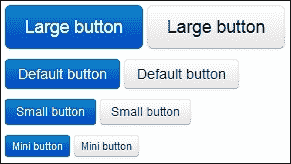

可以通过将按钮添加为**禁用**属性来禁用按钮。类似地，`<a>`标记的按钮可以通过添加`.disabled`类来禁用。我们还没有使用按钮，但是这是一个很好的特性。

##### 图标

Bootstrap 2 附带了一组令人印象深刻的 140 个深灰色图标，可作为精灵使用，由 Glyphicons 提供：

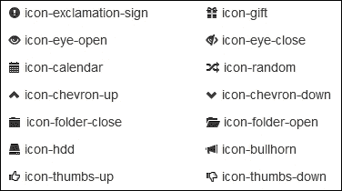

### 提示

这些图标通常可以在市场上买到，但也可以作为引导产品的一部分免费使用。然而，Bootstrap 要求我们提供到[的可选反向链接 http://glyphicons.com](http://glyphicons.com) 。

所有这些图标都可以通过`<i>`标记中的一个简单类`<i class="icon-search"></i>`从 DOM 中提取。

令人惊奇的是，您可以将这些图标嵌入到每个合适的引导组件中。例如，按钮定义：`<a class="btn btn-mini" href="#"><i class="icon-star"></i> Star</a>`产生以下内容：


##### 表格

我们已经为市场活动概述实施了一个引导表。我们基本上形成了下表：

```
<table class="table table-hover table-condensed table-bordered table-striped">
  <thead>
    <tr><th>Index</th>
       <th>Value</th>
       <th>Change</th></tr>
  </thead>
  <tbody>
      <tr><td>...</td>
       <td>...</td>
       <td>...</td>
    </tr>
  </tbody>
</table>
```

正如我们可以定义一个被自定义类覆盖的按钮类一样，我们已经用类`.table`定义了一个通用引导表，然后我们使用了以下自定义类：

*   `.table .table-hover`：启用`<tbody>`中表行的悬停状态
*   `.table .table-condensed`：这使得桌子更加紧凑
*   `.table .table-bordered`：这会在表格中添加边框和圆角
*   `.table .table-striped`：此将斑马条纹添加到`<tbody>`中的任何表格行中

#### 引导组件

该框架具有其他预先设计的元素，这些元素被标识为组件。其中包括下拉列表、按钮组、面包屑、分页、导航栏、标签和徽章、缩略图、警报、进度条等。这里我们只介绍其中的一些：

##### 导航条

引导导航栏支持基本导航菜单。默认情况下，它们不会固定在页面顶部；它们必须包含在`.container`中。代码如下：

```
<div class="navbar navbar-inverse">
  <div class="navbar-inner">
  ...
  <ul class="nav">
    <li class="active"><a href="index">Home</a></li>
    <li><a href="markets">Prices and markets</a></li>
    <li><a href="community">Community</a></li>
    <li><a href="sources">Sources</a></li>
    <li><a href="about">About</a></li>
    <li><a href="contact">Contact</a></li>
  </ul>
...
```

导航栏中最基本的功能是可激活链接：


可以根据以下 DOM 定义设计上述示例：

```
<ul class="nav">
     <li class="active"><a href="#">Home</a></li>
     <li><a href="#">Link</a></li>
</ul>
```

我们强烈建议阅读引导文档。可以找到有关如何实现其他功能的更多详细信息。例如，引导提供了以下工具：

*   表单元素，如输入文本、搜索字段和提交按钮。
*   不同的定位变化，例如固定在顶部（使用`.navbar-fixed-top`），固定在底部（使用`.navbar-fixed-bottom`），在与页面滚动的全宽导航栏的对面（使用`.navbar-static-top`）。
*   可折叠响应导航条（`.nav-collapse.collapse`），可显著节省空间。通过使用 data toggle HTML5 属性，可以在不使用额外 JavaScript 配置的情况下执行动态处理。

##### 英雄单位

在提供的模板中定义了一个英雄单位。我们只是稍微移动了一下，以满足我们的响应需求。

它是一个轻量级、灵活的组件，用于在站点上展示关键内容。


可以根据以下 DOM 定义设计上述示例：

```
<div class="hero-unit"><p>Welcome to CloudStreet Market, the educational platform.</p></div>
```

##### 警报

引导警报非常适合快速生成警告消息或其他上下文消息的预定义样式。引导警报带有一个**可选**关闭按钮（该按钮将隐藏警报，无需额外的 JavaScript 配置）。代码如下：

```
<div class="alert">
    <button type="button" class="close" data-dismiss="alert">&times;</button>
    <strong>Warning!</strong> Best check yo self, you're not looking too good.
</div>
```

此定义生成此处显示的输出：


警报由`<div>`标记上的`.alert` 类定义，可以从中设置上下文颜色变化，提供额外的覆盖类，如`.alert-success`、`.alert-info`或。`alert-error`。

##### 徽章和标签

引导标签非常适合丰富内容。它们在列表或表格中表现得特别好。在这里找到可能的上下文变化的概述：


此处的标签将定义为：

```
<span class="label">Default</span>
<span class="label label-success">Success</span>
<span class="label label-important">Important</span>
…
```

徽章将定义为：

```
<span class="badge">1</span>
<span class="badge badge-warning">4</span>
<span class="badge badge-important">6</span>
…
```

## 还有更多。。。

除了这个*微小的*概述之外，还需要引导更多内容来丰富官方文档。同样，官方文件做得很好，很容易理解。

访问[http://getbootstrap.com](http://getbootstrap.com) 获取与框架最新支持版本相关的文档。转到[http://getbootstrap.com/2.3.2](http://getbootstrap.com/2.3.2) 用于与我们在项目中使用的版本相关的文档。

我们将在接下来的章节中实现更多功能，并尽可能小心地突出它们。

## 另见

如果你喜欢 Bootstrap 并觉得你想在你的项目中使用它，你必须考虑版本 3。

### 提示

Bootstrap 3 与 Bootstrap 2 不直接兼容，但它实现了一个非常相似的网格系统和稍微不同的标记。

*   **Bootstrap 3 新功能**：这里是从 Bootstrap 2 到 Bootstrap 3 的重要变化预览。
*   **全新的平面风格设计**：新的设计很容易被注意到，按钮、导航栏和其他菜单上的 3D 和纹理结束。他们现在选择了一种新的没有坡度的平面样式。这当然符合实际的全球设计趋势。
*   **列命名 span*重命名为 col-***：除了不再可用的 row fluid 类（所有行现在自动变为 fluid）以减少混淆外，还重新考虑了列命名模式以提高一致性。
*   **Mobile first**：框架的响应特性现在本机包含在`bootstrap.js`和`bootstrap.css`文件中（不再有`bootstrap-responsive.js`或`bootstrap-responsive.css`）。现在可以使用一组新的特定于设备的类直接从 DOM 驱动媒体查询任务。

# 使用 JSTL 在视图中显示模型

这个配方展示了如何用数据填充 Spring MVC 视图，以及如何在视图中呈现这些数据。

## 准备好了吗

在这一点上，我们没有任何真实的数据显示在我们的视图中。为此，我们创建了三个 DTO 和两个服务层，它们从接口注入控制器。

有两个虚拟服务实现被设计用来产生一组伪造的数据。我们将使用 Java 服务器标签库（**JSTL**）和**JSP 表达式语言**（**JSP EL**）在 JSP 中正确的位置呈现服务器数据。

## 怎么做。。。

1.  After checking out the `v2.x.x` branch (in the previous recipe), a couple of new components are now showing-up in the **cloudstreetmarket-core** module: two interfaces, two implementations, one enum, and three DTOs. The code is as follows:

    ```
    public interface IMarketService {
      DailyMarketActivityDTO getLastDayMarketActivity(String string);
      List<MarketOverviewDTO> getLastDayMarketsOverview();
    }
        public interface ICommunityService {
        List<UserActivityDTO> getLastUserPublicActivity(int number);
    }
    ```

    如所示，它们指的是创建的三个 DTO：

    ```
    public class DailyMarketActivityDTO {
      String marketShortName;
      String marketId;
      Map<String, BigDecimal> values;
      Date dateSnapshot;
      ... //and constructors, getters and setters
    }
    public class MarketOverviewDTO {
      private String marketShortName;
      private String marketId;
      private BigDecimal latestValue;
      private BigDecimal latestChange;
      ... //and constructors, getters and setters
    }
    public class UserActivityDTO {
      private String userName;
      private String urlProfilePicture;
      private Action userAction;
      private String valueShortId;
      private int amount;
      private BigDecimal price;
      private Date date;
      ... //and constructors, getters and setters
    }
    ```

    此最后一个 DTO 指的是`Action`枚举：

    ```
    public enum Action {
      BUY("buys"), SELL("sells");
      private String presentTense;
        Action(String present){
      presentTense = present;
      }
        public String getPresentTense(){
        return presentTense;
      }
    }
    ```

    此外，先前在`cloudstreetmarket-webapp`中创建的`DefaultController`中的也被修改为如下所示：

    ```
    @Controller
    public class DefaultController {
      @Autowired
      private IMarketService marketService;
      @Autowired
      private ICommunityService communityService;
      @RequestMapping(value="/*", method={RequestMethod.GET,RequestMethod.HEAD})
      public String fallback(Model model) {
        model.addAttribute("dailyMarketActivity", marketService.getLastDayMarketActivity("GDAXI"));
        model.addAttribute("dailyMarketsActivity", marketService.getLastDayMarketsOverview());
        model.addAttribute("recentUserActivity", communityService.getLastUserPublicActivity(10));
        return "index";
      }
    }
    ```

    有两种虚拟实现：

    ```
    @Service
    public class DummyMarketServiceImpl implements IMarketService {
        private DateTimeFormatter formatter = DateTimeFormatter.ofPattern("yyyy-MM-dd HH:mm");
        public DailyMarketActivityDTO 
        getLastDayMarketActivity(String string){
        Map<String, BigDecimal> map = new HashMap<>();
        map.put("08:00", new BigDecimal(9523));
        map.put("08:30", new BigDecimal(9556));
        ...
        map.put("18:30", new BigDecimal(9758));
        LocalDateTime ldt = LocalDateTime.parse("2015-04-10 17:00", formatter);
        return new DailyMarketActivityDTO("DAX 30","GDAXI", map, Date.from(ldt.toInstant(ZoneOffset.UTC)));
      }
        @Override
      public List<MarketOverviewDTO> getLastDayMarketsOverview() {
          List<MarketOverviewDTO> result = Arrays.asList(
          new MarketOverviewDTO("Dow Jones-IA", "DJI", new BigDecimal(17810.06), new BigDecimal(0.0051)),
          ...
          new MarketOverviewDTO("CAC 40", "FCHI", new BigDecimal(4347.23), new BigDecimal(0.0267))
        );
        return result;
      }
    }
      @Service
    public class DummyCommunityServiceImpl implements ICommunityService {
      private DateTimeFormatter formatter = DateTimeFormatter.ofPattern("yyyy-MM-dd HH:mm");
        public List<UserActivityDTO> getLastUserPublicActivity(int number){
          List<UserActivityDTO> result = Arrays.asList(
          new UserActivityDTO("happyFace8", "img/young-lad.jpg", Action.BUY, "NXT.L", 6, new BigDecimal(3), LocalDateTime.parse("2015-04-10 11:12", formatter)),
          ...
           new UserActivityDTO("userB", null, Action.BUY, "AAL.L", 7, new BigDecimal(7), LocalDateTime.parse("2015-04-10 13:29", formatter))
          );
        return result;
      }
    }
    ```

    `index.jsp`已修改，在图形容器下方添加了以下部分：

    ```
    <div class='morrisTitle'>
      <fmt:formatDate value="${dailyMarketActivity.dateSnapshot}" pattern="yyyy-MM-dd"/>
    </div>
    <select class="form-control centeredElementBox">
      <option value="${dailyMarketActivity.marketId}"> ${dailyMarketActivity.marketShortName}
      </option>
    </select> 
    ```

    增加了市场概况表，特别是车身：

    ```
    <c:forEach var="market" items="${dailyMarketsActivity}">
      <tr>
        <td>${market.marketShortName}</td>
        <td style='text-align: right'>
          <fmt:formatNumber type="number" maxFractionDigits="3" value="${market.latestValue}"/>
      </td>
       <c:choose>
          <c:when test="${market.latestChange >= 0}">
          <c:set var="textStyle" scope="page" value="text-success"/>
          </c:when>
          <c:otherwise>
            <c:set var="textStyle" scope="page" value="text-error"/>
          </c:otherwise>
        </c:choose>        
          <td class='${textStyle}' style='text-align: right'>
            <b><fmt:formatNumber type="percent" maxFractionDigits="2" value="${market.latestChange}"/>
        </b>
      </td>
      </tr>
    </c:forEach>
    ```

    已添加社区活动的容器：

    ```
    <c:forEach var="activity" items="${recentUserActivity}">
       <c:choose>
         <c:when test="${activity.userAction == 'BUY'}">
           <c:set var="icoUpDown" scope="page" value="ico-up-arrow actionBuy"/>
         </c:when>
         <c:otherwise>
           <c:set var="icoUpDown" scope="page" value="ico-down-	arrow actionSell"/>
         </c:otherwise>
        </c:choose>
        <c:set var="defaultProfileImage" scope="page" value=""/>
        <c:if test="${activity.urlProfilePicture == null}">
        <c:set var="defaultProfileImage" scope="page" value="ico-user"/>
        </c:if>
      <li>
      <div class="itemTitle">
        <div class="listUserIco ${defaultProfileImage}">
          <c:if test="${activity.urlProfilePicture != 	null}">
        
    </c:if>
    </div>
      <span class="ico-white ${icoUpDown} listActionIco"></span>
    <a href="#">${activity.userName}</a> 
    ${activity.userAction.presentTense} ${activity.amount} 
      <a href="#">${activity.valueShortId}</a> 
      at $${activity.price}
        <p class="itemDate">
          <fmt:formatDate value="${activity.date}" pattern="dd/MM/yyyy hh:mm aaa"/>
        </p>
        </div>
      </li>
    </c:forEach>
    ```

    在文件的底部，现在从服务器填充一组硬编码的 JavaScript 数据：

    ```
    <script>
      var financial_data = [];
      <c:forEach var="dailySnapshot" items="${dailyMarketActivity.values}">
      financial_data.push({"period": '<c:out value="${dailySnapshot.key}"/>', "index": <c:out value='${dailySnapshot.value}'/>});
      </c:forEach>
    </script>
    <script>
      $(function () {
        Morris.Line({
          element: 'landingGraphContainer',
          hideHover: 'auto', data: financial_data,
          ymax: <c:out value="${dailyMarketActivity.maxValue}"/>,
          ymin: <c:out value="${dailyMarketActivity.minValue}"/>,
          pointSize: 3, hideHover:'always',
          xkey: 'period', xLabels: 'month',
          ykeys: ['index'], postUnits: '',
          parseTime: false, labels: ['Index'],
          resize: true, smooth: false,
          lineColors: ['#A52A2A']
        });
    });
    </script>
    ```

## 它是如何工作的。。。

这些更改不会产生基本的 UI 改进，但它们会为我们的视图层提供数据。

### 处理我们数据的方法

我们将在这里回顾数据供应实现的服务器端。

#### 通过接口注入服务

预测应用程序需要向 frontpage 提供动态数据，选择向控制器中注入两个服务层`marketService`和`communityService`。问题是我们还没有一个合适的数据访问层。（这将在[第 4 章](11.html#aid-2QJ5E1 "Chapter 4. Building a REST API for a Stateless Architecture")、*为无状态架构构建 REST API*中介绍！）。我们需要连接控制器来呈现头版。

连接控制器需要松耦合到其服务层。根据本章中创建虚拟服务实现的思想，布线是使用接口设计的。然后，我们依靠 Spring 将预期的实现注入到服务依赖项中，并使用相关接口键入。

```
@Autowired
private IMarketService marketService;
@Autowired
private ICommunityService communityService;
```

注意类型`IMarketService`和`ICommunityService`，它们不是`DummyCommunityServiceImpl`或`DummyMarketServiceImpl`。否则，在切换到实际实现时，我们将被绑定到这些类型。

#### Spring 如何选择虚拟实现？

在**cloudstreetmarket 核心**Spring 上下文文件`csmcore-config.xml`中选择这些实现。我们在前面定义了 bean：

```
<context:annotation-config/>
<context:component-scan base-package="edu.zipcloud.cloudstreetmarket.core" />  
```

Spring 扫描与根包`edu.zipcloud.cloudstreetmarket.core` 匹配的所有类型，以找到原型和配置注释。

与`DefaultController`用`@Controller` 注释标记相同，我们的两个虚拟实现类用`@Service`标记，这是一个 Spring 原型。在检测到的原型和 bean 中，虚拟实现是唯一可用于注入配置的实现：

```
@Autowired
private IMarketService marketService;

@Autowired
private ICommunityService communityService;
```

每个字段只有一个对应的匹配项，Spring 将在不进行任何额外配置的情况下拾取它们。

#### 视图层中使用的 DTO

我们已经对 JSP 中获取的变量使用了 DTO。当涉及到同时维护多个版本时，公开的 DTO 在 web 服务中特别有用。更一般地说，当目标对象和目标对象显著不同时，就会实现 DTO。

我们稍后将实现**实体**。最好不要在渲染或版本特定逻辑中使用这些**实体**，而是将它们延迟到专用于此目的的层。

尽管如此，必须指定创建 DTO 层会产生大量与类型转换相关的样板代码（影响双方、其他层、测试等）。

#### 虚拟服务实现

使用`getLastDayMarketActivity`方法的`DummyMarketServiceImpl`实现构建了一个活动图（由与市场价值、指数相关联的静态每日时间组成）。它返回一个新的`DailyMarketActivityDTO`实例（根据此地图构建），它最终是一个包装器，包含单个市场或指数（如 DAX 30）的日常活动。

`getLastDayMarketsOverview`方法返回同样由硬编码数据构造的 `MarketOverviewDTOs`列表。它模拟了几个市场（指数）的日常活动概况。

`DummyCommunityServiceImpl`实现及其`getLastUserPublicActivity` 方法返回实例化的`UserActivityDTO`列表，该列表模拟最后六个记录的用户活动。

### 在控制器中填充模型

在本章的第一个配方中介绍了可能的方法处理程序参数，我们已经看到它可以作为参数注入模型。这个模型可以用方法中的数据填充，它将透明地传递给预期的视图。

这就是我们在`fallback`方法处理程序中所做的。我们已经将来自服务层的三个结果传递到三个变量`dailyMarketActivity`、`dailyMarketsActivity`和`recentUserActivity`，因此它们可以在视图中使用。

### 使用 JSP EL 呈现变量

JSP 表达式语言允许我们访问**JavaBeans 组件**中存储的应用程序数据。用于访问变量（如`${recentUserActivity}`或`${dailyMarketActivity.marketShortName}`的符号`${…}`通常是 JSP EL 符号。

当我们想要访问一个对象的属性时（比如`dailyMarketActivity`的`marketShortName`）需要记住的一点是，对象类必须为目标属性提供 JavaBeans 标准 getter。

换句话说，`dailyMarketActivity.marketShortName` 在`MarketOverviewDTO`类中指预期的：

```
public String getMarketShortName() {
  return marketShortName;
}
```

#### 隐式对象

JSPEL 还提供了隐式对象，可以作为 JSP 中的快捷方式使用，而无需在模型中进行任何声明或预填充。在这些隐式对象中，不同的作用域 pageScope、requestScope、sessionScope 和 applicationScope 反映了相关作用域中的属性映射。

例如，考虑 Apple T0.下列属性：

```
request.setAttribute("currentMarket", "DAX 30");
request.getSession().setAttribute("userName", "UserA");
request.getServletContext().setAttribute("applicationState", "FINE");
```

可通过以下方式在 JSP 中分别访问：

```
${requestScope["currentMarket"]}
${sessionScope["username"]}
${applicationScope["applicationState"]}
```

其他有用的隐式对象是请求头的映射：`header`（即`${header["Accept-Encoding"]}`），请求 cookie 的映射：`cookies`（即`${cookie["SESSIONID"].value}`），请求参数的映射：`param`（即`${param["paramName"]}`）或上下文初始化参数的映射（来自`web.xml``initParam`（即`${initParam["ApplicationID"]}`）。

最后，JSP EL 提供了两个基本运算符：

*   **算术**：`+`、`-` （二进制）、`*`、`/`和`div`、`%`和`mod`、`-`（一元数）。
*   **逻辑**：`and`、`&&`、`or`、`||`、`not`、`!`。
*   **关系型**：`==`、`eq`、`!=`、`ne`、`<`、`lt`、`>`、`gt`、`<=`、`ge`、`>=`、`le`。

可以与其他值或布尔值、字符串、整数或浮点文字进行比较。

*   **Empty**：空运算符是一种前缀操作，可用于确定值是 null 还是空。
*   **条件**：`A ? B : C`。

根据`A`的评估结果，评估`B`或`C`。

这个操作符的描述来自 JavaEE5 教程。

### 使用 JSTL 呈现变量

**JSP 标准标记库**（**JSTL**是 JSP 页面工具的集合。这并不是 Java web 的一个全新的特性，但它仍然被使用。

当我们需要显示逻辑时，或者当我们需要格式化数据或在视图层中构建层次结构时，最常用的标记可能是 Core 和 I18N。

<colgroup><col> <col> <col> <col></colgroup> 
| 

地区

 | 

作用

 | 

标签

 | 

描述

 |
| --- | --- | --- | --- |
| `Core` | `Variable support` | `c:set``c:remove` | 从作用域设置/取消设置变量。 |
| `Flow control` | `c:choose``c:when``c:otherwise` | 实现条件块 IF/THEN/ELSE。 |
| `c:if` | 实现条件 IF 块。 |
| `c:forEach` | 迭代集合类型。 |
| `c:forTokens` | 迭代标记，由提供的分隔符分隔。 |
| `URL management` | `c:import``c:param` | 解析 URL，将其内容导入页面、变量（var）或变量读取器（varReader）。可以使用 param 将参数传递给基础资源。 |
| `c:redirect``c:param` | 重定向到 URL。可以传递参数。 |
| `c:url``c:param` | 创建一个 URL。可以指定参数。 |
| `Miscellaneous` | `c:catch` | 捕捉其所在区域内发生的任何可丢弃物。 |
| `c:out` | 获取表达式或变量。 |
| `I18N` | `Setting Locale` | `fmt:setLocale``fmt:requestEncoding` | 在特定范围内存储区域设置。设置页面的 HTTP 请求的编码类型。 |
| `Messaging` | `fmt:bundle``fmt:message``fmt:param``fmt:setBundle` | 为特定标记或范围设置捆绑包。检索消息，输出其内容，传递可选参数。 |
| `Number and Date Formatting` | `fmt:formatNumber``fmt:formatDate``fmt:parseDate``fmt:parseNumber``fmt:setTimeZone``fmt:timeZone` | 以不同的格式输出不同的内容。解析日期和数字。设置特定标记或范围的时区。 |

这些标记不是 JSTL 的唯一功能，请访问 JavaEE 教程了解更多详细信息：

[http://docs.oracle.com/javaee/5/tutorial/doc/bnakc.html](http://docs.oracle.com/javaee/5/tutorial/doc/bnakc.html)

#### JSP 中的 Taglib 指令

如果我们计划使用上述一个或另一个标记，我们首先需要在 JSP 页面中包含合适的指令：

```
<%@ taglib uri="http://java.sun.com/jsp/jstl/core" prefix="c" %>
<%@ taglib uri="http://java.sun.com/jsp/jstl/fmt" prefix="fmt" %>
```

## 还有更多。。。

### 关于 JSP EL 的更多信息

jspel 还包含了更多的特性。请随意阅读 Oracle 教程，如[http://docs.oracle.com/javaee/5/tutorial/doc/bnahq.html](http://docs.oracle.com/javaee/5/tutorial/doc/bnahq.html) 。

### 更多关于 JavaBeans 标准的信息

我们已经讨论了在使用 JSPEL 时预期的 JavaBean 标准。有关 JavaBeans 的更多信息，请参见 Oracle 教程：

[http://docs.oracle.com/javaee/5/tutorial/doc/bnair.html](http://docs.oracle.com/javaee/5/tutorial/doc/bnair.html)

### 关于 JSTL 的更多信息

正如所宣布的，您可以在 Java EE 教程中发现更多 JSTL 模块：

[http://docs.oracle.com/javaee/5/tutorial/doc/bnakc.html](http://docs.oracle.com/javaee/5/tutorial/doc/bnakc.html)

# 定义一个通用的 WebContentInterceptor

在这个配方中，我们将重点介绍如何为控制器实现`WebContentInterceptor`超类。

## 准备好了吗

我们将展示一个控制器超类，它具有注册为`WebContentInterceptor`的特殊性。这个超类允许我们全局控制会话并管理缓存选项。

它将帮助我们了解整个框架中的请求生命周期以及其他潜在的拦截器。

## 怎么做。。。

1.  Registering a default `WebContentInterceptor` with its specific configuration can be done entirely with the configuration approach:

    ```
    <mvc:interceptors>
      <bean id="webContentInterceptor" class="org.sfw.web.servlet.mvc.WebContentInterc	eptor">
        <property name="cacheSeconds" value="0"/>  
        <property name="requireSession" value="false"/>  
        ...
      </bean>
    <mvc:interceptors>
    ```

    ### 提示

    在我们的应用程序中，我们注册了 custom`WebContentInterceptors`来覆盖默认的行为。

2.  在代码库中，仍然来自之前签出的`v2.x.x`分支，在`cloudstreetmarket-api`：

    ```
    public class CloudstreetApiWCI extends WebContentInterceptor {
      public CloudstreetApiWCI(){
        setRequireSession(false);
        setCacheSeconds(0);
      }
      @Override
      public boolean preHandle(HttpServletRequest request, HttpServletResponse response, Object handler) throws ServletException {
          super.preHandle(request, response, handler);
          return true;
      }
      @Override
      public void postHandle(HttpServletRequest request, HttpServletResponse response, Object handler, 	ModelAndView modelAndView) throws Exception {
      }
      @Override
      public void afterCompletion(HttpServletRequest request, HttpServletResponse response, Object handler, Exception ex) throws Exception {
      }
    }
    ```

    中可以找到一个新的`cloudstreetApiWCI`类
3.  类似的`CloudstreetWebAppWCI`也出现在**cloudstreetmarket 网络应用**:

    ```
    public class CloudstreetWebAppWCI extends WebContentInterceptor {
      public CloudstreetWebAppWCI(){
        setRequireSession(false);
        setCacheSeconds(120);
        setSupportedMethods("GET","POST", "OPTIONS", "HEAD");
      }
      @Override
      public boolean preHandle(HttpServletRequest request, HttpServletResponse  response, Object handler) throws ServletException {
          super.preHandle(request, response, handler);
          return true;
      }
      @Override
      public void postHandle(HttpServletRequest request, HttpServletResponse response, Object handler, ModelAndView 	modelAndView) throws Exception {
      }
      @Override
      public void afterCompletion(HttpServletRequest request, HttpServletResponse response, Object handler, Exception ex) throws Exception {
      }
    }
    ```

    中
4.  在**云街市 webapp**中，`DefaultController`和`InfoTagController`现在都继承了`CloudstreetWebAppWCI`：

    ```
    public class InfoTagController extends CloudstreetWebAppWCI {
    ...
    }
    public class DefaultController extends CloudstreetWebAppWCI {
    ...
    }
    ```

5.  在**cloudstreetmarket webapp**中`dispatcher-context.xml`上下文文件注册了拦截器：

    ```
    <mvc:interceptors>
      <bean 	class="edu.zc...controllers.CloudstreetWebAppWCI">
        <property name="cacheMappings">
          <props>
            <prop key="/**/*.js">86400</prop>
            <prop key="/**/*.css">86400</prop>
            <prop key="/**/*.png">86400</prop>
            <prop key="/**/*.jpg">86400</prop>
          </props>
        </property>
      </bean> 
    </mvc:interceptors>
    ```

6.  在**cloudstreetmarket api**、`dispatcher-context.xml`中，另一个拦截器也已注册：

    ```
      <mvc:interceptors>
        <bean class="edu.zc...controllers.CloudstreetApiWCI"/>
      </mvc:interceptors>
    ```

7.  最后，在两个`dispatcher-context.xml`中，`RequestMappingHandlerAdapter`bean 都被赋予了`synchronizeOnSession`属性：

    ```
    <bean class="org.sfw...annotation.RequestMappingHandlerAdapter">
        <property name="synchronizeOnSession" value="true"/>
        </bean>
    ```

## 它是如何工作的。。。

在每个 web 模块中，我们为控制器创建了一个超类。例如，在**cloudstreetmarket webapp**模块中，`InfoTagController`和`DefaultController`现在都继承了`CloudstreetWebAppWCI`超类。

### 控制器的常见行为

除了`WebContentInterceptor`功能之外，如果控制器与配置（应用程序或业务）相关，那么在控制器之间共享公共逻辑和属性不仅仅是一种好的做法；这样做的目的是避免创建另一个服务层。通过进一步的实现，我们将看到它是定义用户上下文的好地方。

`WebContentInterceptor`通过其`WebContentGenerator`超类提供了有用的请求和会话管理工具，我们现在将介绍这些工具。作为拦截器，它必须以声明方式注册。这就是为什么我们在上下文文件中添加了两个`<mvc:interceptors>`条目的原因。

### 全局会话控制

`WebContentInterceptor`处理请求提供了控制应用程序应如何响应 HTTP 会话的能力。

#### 需要会话

`WebContentInterceptor`至`WebContentGenerator` 提供`setRequireSession(boolean)`方式。这允许定义在处理请求时是否需要会话。

如果没有与请求绑定的会话（例如，如果会话已过期），控制器将抛出一个`SessionRequiredException`方法。在这种情况下，最好定义一个全局`ExceptionHandler`。在构建 RESTAPI 时，我们将设置一个全局异常映射器。默认情况下，这些会话不是必需的。

#### 同步会话

另一个有趣的特性是我们在`RequestMappingHandlerAdapter`定义中设置为 true 的`synchronizeOnSession`属性。将其设置为 true 时，将序列化会话对象，并在同步块中对其进行访问。这允许并发访问相同的会话，避免了在使用多个浏览器窗口或选项卡时有时出现的问题。

### 缓存头管理

我们在`CloudstreetWebAppWCI`和`CloudstreetApiWCI`施工人员中使用的方法；带有`WebContentGenerator`的`WebContentInterceptor`可以管理几个与缓存相关的 HTTP 响应头。

设置为零，它会在响应中添加额外的头，例如 Pragma、Expires、Cache control 等。

我们还在配置级别为静态文件定义了自定义缓存：

```
<props>
  <prop key="/**/*.js">86400</prop>
  <prop key="/**/*.css">86400</prop>
  <prop key="/**/*.png">86400</prop>
  <prop key="/**/*.jpg">86400</prop>
</props>
```

由于本机的`WebContentInterceptor.preHandle`方法，我们所有的静态资源都以这种方式缓存了 24 小时。

### HTTP 方法支持

我们还定义了 HTTP 方法的高级限制。可以通过控制器级别的`@RequestMapping`方法属性缩小范围。访问不允许的方法将导致`405 HTTP error: Method not supported`。

### 高层拦截器

在`dispatcher-context.xml`中的拦截器注册中，我们没有定义拦截器操作的路径映射。这是因为在默认情况下，Spring 在此类独立拦截器定义上应用了双通配符运算符`/**`。

并不是因为我们做了`DefaultController`，扩展了一个拦截器，拦截器在控制器`@RequestMapping`路径上起作用。拦截器的注册仅通过配置完成。如果需要修改覆盖路径映射，我们可以通过以下方式覆盖注册：

```
  <mvc:interceptors>
    <mvc:interceptor>
    <mvc:mapping path="/**"/>
    <bean class="edu.zc.csm.portal...CloudstreetWebAppWCI">
    <property name="cacheMappings">
      <props>
      <prop key="/**/*.js">86400</prop>
      <prop key="/**/*.css">86400</prop>
      <prop key="/**/*.png">86400</prop>
      <prop key="/**/*.jpg">86400</prop>
      </props>
    </property>
    </bean>
    </mvc:interceptor>
  </mvc:interceptors>
```

我们已经也覆盖了`WebContentInterceptor`方法的`preHandle`、`postHandle`和`afterCompletion`。它将允许我们在控制器请求处理前后定义常见的业务相关操作。

### 请求生命周期

在整个拦截器中，每个请求都按照以下生命周期进行处理：

*   准备请求的上下文
*   找到控制器的处理程序
*   执行拦截器的预处理方法
*   调用控制器的处理程序
*   执行拦截器的`postHandle`方法
*   处理异常
*   处理视图
*   执行拦截器的`afterCompletion`方法

为了更好地理解顺序，特别是在发生异常时，以下工作流非常有用：


*参考文献：Santosh Kumar K 的《春天与冬眠》*

从这个图可以看出：

*   除非某个拦截器的`preHandle`方法引发异常，否则将调用控制器处理程序。
*   当控制器的处理程序完成而未引发异常，并且之前的`postHandler`方法未引发异常时，将调用拦截器的`postHandle`方法。
*   拦截器的`afterCompletion`总是被调用，除非前面的`afterCompletion`抛出异常。

显然，如果没有注册拦截器，则应用相同的序列，跳过拦截器的步骤。

## 还有更多。。。

关于`WebContentGenerator`课程还有更多的话要说。

### WebContent Generator 提供更多功能

同样，`WebContentGenerator`是`WebContentInterceptor`的超类。从其 JavaDoc 页面：[http://docs.spring.io/spring/docs/current/javadoc-api/org/springframework/web/servlet/support/WebContentGenerator.html](http://docs.spring.io/spring/docs/current/javadoc-api/org/springframework/web/servlet/support/WebContentGenerator.html) 您可以找到以下示例：

*   三个常数（字符串）`METHOD_GET`、`METHOD_POST`和`METHOD_HEAD`表示值`GET`、`POST`和`HEAD`
*   一些缓存特定方法，如`setUseExpiresHeader`、`setUseCacheControlHeader`、`setUseCacheControlNoStore`、`setAlwaysMustRevalidate`和`preventCaching`

另外，`WebContentGenerator` 通过`WebApplicationObjectSupport`提供：

*   通过`getServletContext()`从请求或响应对象中访问`ServletContext`。
*   通过`getTempDir()`访问 servlet 容器提供的当前 web 应用程序的临时目录。
*   通过`getWebApplicationContext()`访问`WebApplicationContext` 。
*   此外，还有两个用于设置和初始化`ServletContext` 和`WebApplicationContext`的工具，即使这些工具最初用于框架本身。

## 另见。。。

我们很快就通过了 web 缓存。在这个领域有很多定制和标准。此外，Spring MVC 3.1 还创建了一个新的`RequestMappingHandlerAdapter`。了解这一变化将有所帮助。

### 网络缓存

通过这个非常完整的缓存教程了解更多关于 web 缓存的信息：

[https://www.mnot.net/cache_docs](https://www.mnot.net/cache_docs)

### 自 Spring MVC 3.1 以来对@RequestMapping 的新支持类

我们在`dispatcher-context.xml`中使用了`RequestMappingHandlerAdapter`及其 bean 定义。这个 bean 是 SpringMVC 3.1 的一个新特性，它取代了以前的`AnnotationMethodHandlerAdapter`。此外，支持等级`DefaultAnnotationHandlerMapping`现在已被`RequestMappingHandlerMapping`取代。

我们将在[第 4 章](11.html#aid-2QJ5E1 "Chapter 4. Building a REST API for a Stateless Architecture")中深入探讨`RequestMappingHandlerAdapter`，为无状态架构构建 REST API。

在此期间，您可以阅读官方变更通知：

[http://docs.spring.io/spring-framework/docs/3.1.x/spring-framework-reference/html/mvc.html#mvc-ann-31-vs-30](http://docs.spring.io/spring-framework/docs/3.1.x/spring-framework-reference/html/mvc.html#mvc-ann-requestmapping-31-vs-30)

# 用 AngularJS 设计客户端 MVC 模式

此配方解释了 AngularJS 的安装和配置，以管理单页 web 应用程序。

## 准备好了吗

在这个配方中，我们将解释如何摆脱先前在 JSP 中引入的用于构建 DOM 的呈现逻辑。我们现在将依靠 AngularJS 完成这项工作。

即使我们还没有前端可以查询的 RESTAPI，我们也会临时让 JSP 构建所需的 JavaScript 对象，就好像它们是由 API 提供的一样。

AngularJS 是一个开源的 Web 应用程序框架。它支持构建能够直接满足微服务体系结构需求的单页应用程序。AngularJS 的第一个版本于 2009 年发布。它现在由谷歌和一个开源社区维护。

AngularJS 本身就是一个完整的主题。作为一个框架，它既深又广。试图将其作为一个整体呈现会使我们超出本书的范围，并且不会真正适合我们的方法。

出于这个原因，我们将重点介绍框架的细节、特性和特征，以便为应用程序发挥优势。

## 怎么做。。。

### 设置 DOM 并创建模块

1.  还是从之前签出的分支，`index.jsp`文件已经向 HTML 标记

    ```
    <HTML ng-app="cloudStreetMarketApp">
    ```

    添加了一个角度指令
2.  The AngularJS JavaScript library (angular.min.js from [https://angularjs.org](https://angularjs.org)) has been placed in the `cloudstreetmarket-webapp/src/main/webapp/js` directory.

    `index.jsp`文件在`landingGraphContainer`周围添加了一个包装器`landingGraphContainerAndTools`div、一个选择框和一个`ng-controller="homeFinancialGraphController"`：

    ```
    <div id='landingGraphContainer' ng-controller="homeFinancialGraphController">
        <select class="form-control centeredElementBox">
          <option value="${dailyMarketActivity.marketId}"> 
          ${dailyMarketActivity.marketShortName}</option>
        </select> 
      </div>
    ```

    整个 tableMarketPrices 部门已按以下方式进行了重组：

    ```
    <div id='tableMarketPrices'>
        <script>
          var dailyMarketsActivity = [];
          var market;
        </script>
        <c:forEach var="market" items="${dailyMarketsActivity}">
        <script>
          market = {};
          market.marketShortName = '${market.marketShortName}';
          market.latestValue = (${market.latestValue}).toFixed(2);
          market.latestChange = 	(${market.latestChange}*100).toFixed(2);
          dailyMarketsActivity.push(market);
        </script>
        </c:forEach>
    <div>
    <table class="table table-hover table-condensed table-bordered table-striped" data-ng-controller='homeFinancialTableController'>
        <thead>
          <tr>
            <th>Index</th>
            <th>Value</th>
            <th>Change</th>
          </tr>
        </thead>
        <tbody>
            <tr data-ng-repeat="value in financialMarkets">
            <td>{{value.marketShortName}}</td>
            <td style="text-	align:right">{{value.latestValue}}</td>
            <td class='{{value.style}}' style="text-align:right">
            <strong>{{value.latestChange}}%</strong>
            </td>
          </tr>
        </tbody>
        </table>
        </div>
    </div>	
    ```

    然后，`<div id="divRss3">`div 进行了重大重构：

    ```
    <div id="divRss3">
      <ul class="feedEkList" data-ng-controller='homeCommunityActivityController'>
        <script>
          var userActivities = [];
          var userActivity;
         </script>
          <c:forEach var="activity" items="${recentUserActivity}">
          <script>
            userActivity = {};
            userActivity.userAction = '${activity.userAction}';
             userActivity.urlProfilePicture = '${activity.urlProfilePicture}';
               userActivity.userName = '${activity.userName}';
               userActivity.urlProfilePicture = 	'${activity.urlProfilePicture}';
            userActivity.date = '<fmt:formatDate ="${activity.date}" pattern="dd/MM/yyyy hh:mm aaa"/>';
            userActivity.userActionPresentTense = '${activity.userAction.presentTense}';
            userActivity.amount = ${activity.amount};
            userActivity.valueShortId = '${activity.valueShortId}';
            userActivity.price = (${activity.price}).toFixed(2);
            userActivities.push(userActivity);
          </script>
           </c:forEach>
        <li data-ng-repeat="value in communityActivities">
        <div class="itemTitle">
        <div class="listUserIco {{value.defaultProfileImage}}">
          
        </div>
        <span class="ico-white {{value.iconDirection}} listActionIco"></span>
          <a href="#">{{value.userName}}</a> 
          {{value.userActionPresentTense}} {{value.amount}} 
          <a href="#">{{value.valueShortId}}</a> at {{value.price}}
          <p class="itemDate">{{value.date}}</p>
          </div>
        </li>
      </ul>
    </div>
    ```

    图形生成部分已消失，现替换为：

    ```
    <script>
      var cloudStreetMarketApp = 
        angular.module('cloudStreetMarketApp', []);
      var tmpYmax = <c:out 
        value="${dailyMarketActivity.maxValue}"/>;
      var tmpYmin = <c:out 	
        value="${dailyMarketActivity.minValue}"/>;
    </script>
    ```

    此图形生成已在三个自定义 JavaScript 文件之一中具体化，包括声明：

    ```
    <script src="js/angular.min.js"></script>

    <script src="js/home_financial_graph.js"></script>
    <script src="js/home_financial_table.js"></script>
    <script src="js/home_community_activity.js"></script>
    ```

接下来我们将看到这三个自定义 JavaScript 文件。

### 定义模块的组件

1.  正如所介绍的，三个自定义 JavaScript 文件位于`cloudstreetmarket-webapp/src/main/webapp/js`目录中。
2.  The first one, `home_financial_graph.js`, relates to the graph. It creates a factory whose ultimate role is to pull and provide data:

    ```
    cloudStreetMarketApp.factory("financialDataFactory", function () {
        return {
            getData: function (market) {
              return financial_data;
            },
            getMax: function (market) {
              return tmpYmax;
            },
            getMin: function (market) {
              return tmpYmin;
            }
        }
    });
    ```

    该文件还创建了一个控制器：

    ```
    cloudStreetMarketApp.controller('homeFinancialGraphController', function ($scope, financialDataFactory){
      readSelectValue();
      drawGraph();
      $('.form-control').on('change', function (elem) {
        $('#landingGraphContainer').html('');
        readSelectValue()
        drawGraph();
      });
      function readSelectValue(){
      $scope.currentMarket = $('.form-control').val();
      }
      function drawGraph(){
        Morris.Line({
          element: 'landingGraphContainer',
            hideHover: 'auto',
            data:financialDataFactory.getData($scope.currentMarket),
            ymax: financialDataFactory.getMax($scope.currentMarket),
            ymin: financialDataFactory.getMin($scope.currentMarket),
            pointSize: 3,
            hideHover:'always',
            xkey: 'period', xLabels: 'time',
            ykeys: ['index'], postUnits: '',
            parseTime: false, labels: ['Index'],
            resize: true, smooth: false,
            lineColors: ['#A52A2A']
          });
      }
    });
    ```

    第二个文件：`home_financial_table.js`与市场概况表相关。就像`home_financial_graph.js`一样，它创建了一个工厂：

    ```
    cloudStreetMarketApp.factory("financialMarketsFactory", function () {
      var data=[];
        return {
            fetchData: function () {
              return data;
            },
            pull: function () {
            $.each( dailyMarketsActivity, function(index, el ) {
              if(el.latestChange >=0){
                dailyMarketsActivity[index].style='text-success';
              }
              else{
                dailyMarketsActivity[index].style='text-error';
              }
            });
            data = dailyMarketsActivity;
            }
        }
    });
    ```

    `home_financial_table.js`文件也有自己的控制器：

    ```
    cloudStreetMarketApp.controller('homeFinancialTableController', function ($scope, financialMarketsFactory){
       financialMarketsFactory.pull();
       $scope.financialMarkets = financialMarketsFactory.fetchData();
    });
    ```

3.  The third and last file, `home_community_activity.js` relates to the community activity table. It defines a factory:

    ```
    cloudStreetMarketApp.factory("communityFactory", function () {
      var data=[];
        return {
            fetchData: function () {
              return data;
            },
            pull: function () {

            $.each( userActivities, function(index, el ) {
            if(el.userAction =='BUY'){
              userActivities[index].iconDirection='ico-up-arrow actionBuy';
              }
              else{
              userActivities[index].iconDirection='ico-down-arrow actionSell';
            }
            userActivities[index].defaultProfileImage='';
            if(!el.urlProfilePicture){
              userActivities[index].defaultProfileImage='ico-	user';
            }
            userActivities[index].price='$'+el.price;
            });
            data = userActivities;
            }
        }
    });
    ```

    及其控制器：

    ```
    cloudStreetMarketApp.controller('homeCommunityActivityController', function ($scope, communityFactory){
       communityFactory.pull();
       $scope.communityActivities = communityFactory.fetchData();
    });
    ```

## 它是如何工作的。。。

为了更好地理解我们的 AngularJS 部署是如何工作的，我们将了解 AngularJS 是如何启动的，以及 AngularJS 模块（应用程序）是如何启动的。然后，我们将发现 AngularJS 控制器和工厂，最后是实现的 Angular 指令。

### 每个 HTML 文档一个应用程序

AngularJS 在加载 DOM 时自动初始化。

### 注

**文档对象模型**（**DOM**是与 HTML、XHTML 对象交互的跨平台约定。浏览器加载网页时，会创建该网页的文档对象模型。

AngularJS 在 DOM 中查找`ng-app`声明，以便根据 DOM 元素绑定模块并启动（autobootstrap）该模块。每个 HTML 文档只能捕获一个应用程序（或模块）。

但是，如果需要，我们仍然可以为每个文档定义多个应用程序并手动引导它们。但是 AngularJS 社区驱使我们将应用程序绑定到 HTML 或 BODY 标记。

#### 模块自动脚踏板

我们的应用程序是 autobootstrapped，因为它在 HTML 标记中引用：

```
<HTML ng-app="cloudStreetMarketApp">
```

另外，由于模块已经创建（直接在 HTML 文档的`<script>`元素中）：

```
var cloudStreetMarketApp= angular.module('cloudStreetMarketApp', []);
```

### 提示

注意模块创建中的空数组；它允许将依赖项注入模块。我们将很快详细介绍 AngularJS 依赖项注入。

#### 手动模块引导

如前所述，我们可以手动引导一个应用程序，特别是如果我们想要控制初始化流程，或者如果我们每个文档有多个应用程序。代码如下：

```
angular.element(document).ready(function() {
      angular.bootstrap(document, ['myApp']);
});
```

### AngularJS 控制器

AngularJS 控制器是框架的核心部分。它们监视前端上发生的所有数据更改。控制器绑定到 DOM 元素，并对应于屏幕的功能和可视区域。

目前，我们已经为市场图、市场列表和社区活动提要定义了三个控制器。我们还需要菜单和页脚元素的控制器。

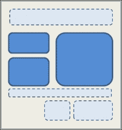

DOM 绑定由指令的 ng 控制器操作：

```
<div ng-controller="homeFinancialGraphController">
  <table data-ng-controller='homeFinancialTableController'>
  <ul data-ng-controller='homeCommunityActivityController'>
```

每个控制器都有一个作用域，该作用域作为控制器声明上的函数参数传递。我们可以将其作为对象进行读取和更改：

```
cloudStreetMarketApp.controller('homeCommunityActivityController', function ($scope, communityFactory){
  ...
  $scope.communityActivities = communityFactory.fetchData();
  $scope.example = 123;
}
```

#### 双向 DOM 作用域绑定

作用域与控制器绑定到的 DOM 区域同步。AngularJS 管理 DOM 和控制器作用域之间的双向数据绑定。这可能是需要了解的最重要的 AngularJS 特性。

### 提示

AngularJS 模型是控制器的范围对象。例如，与 Backbone.js 不同的是，由于模型直接反映在 DOM 中，因此实际上没有角度视图层。

范围变量的内容可以使用`{{…}}`符号在 DOM 中呈现。例如，`$scope.example`变量可以通过`{{example}}`在 DOM 中获取。

### AngularJS 指令

指令也是 AngularJS 的一个著名特征。它们提供了直接连接到 DOM 的能力。我们可以创建自己的指令或使用内置指令。

我们将在本书中尽可能多地访问指令。目前，我们使用了以下方法。

#### ng 重复

为了迭代`communityActivities`和`financialMarkets`集合，我们定义了一个局部变量名作为循环的一部分，并使用`{{…}}`符号分别访问每个项。代码如下：

```
<li data-ng-repeat="value in communityActivities">
  <div class="itemTitle">
    <div class="listUserIco {{value.defaultProfileImage}}">
     
    </div>
    ...
  </div>
</li>
```

#### 如果

此指令允许根据条件删除、创建或重新创建整个 DOM 元素或 DOM 层次结构。

在下一个示例中，`{{value.defaultProfileImage}}`变量仅在用户没有自定义配置文件图像时呈现 CSS 类`".ico-user"` （以显示默认的通用配置文件图像）。

当用户有配置文件图片时，因此填充`value.urlProfilePicture`变量，满足`ng-if`条件，并且在 DOM 中创建``元素。代码如下：

```
<div class="listUserIco {{value.defaultProfileImage}}">
  
</div>
```

### 安格拉斯工厂

工厂用于获取新的对象实例。我们使用工厂作为数据发生器。我们还将使用它们作为服务协调器和服务与控制器之间的中间层。这些服务将从服务器 API 中提取数据。代码如下：

```
cloudStreetMarketApp.factory("communityFactory", function () {
  var data=[];
    return {
        fetchData: function () {
        return data;
        },
        pull: function () {
        $.each( userActivities, function(index, el ) {
          if(el.userAction =='BUY'){
            userActivities[index].iconDirection='ico-up-arrow     actionBuy';
          }
          else{
          userActivities[index].iconDirection='ico-down-arrow actionSell';
          }
          userActivities[index].defaultProfileImage='';
          if(!el.urlProfilePicture){
          userActivities[index].defaultProfileImage='ico-user';
          }
          userActivities[index].price='$'+el.price;
        });
        data = userActivities;
        }
    }
});
```

在这个工厂中，我们定义了两个函数：`pull()`和`fetchData()`来填充和检索数据：

```
cloudStreetMarketApp.controller('homeCommunityActivityController', function ($scope, communityFactory){
   communityFactory.pull();
   $scope.communityActivities = communityFactory.fetchData();
});
```

控制器加载后，将`pull()`和`fetchData()`放入`$scope.communityActivities`中。在这种情况下，这些操作只执行一次。

### 提示

我们的工厂作为依赖项注入控制器声明：

cloudStreetMarketApp.controller（`'homeCommunityActivityController'`、功能`($scope`、`communityFactory`）

#### 依赖注入

在我们的工厂、控制器和模块定义中，我们使用 AngularJS 依赖项注入来处理组件的生命周期及其依赖项。

AngularJS 使用喷油器执行配置的喷油。有三种注释依赖项的方法使其符合注入条件：

*   使用内联数组注释：

    ```
    cloudStreetMarketApp.controller('homeCommunityActivityController', ['$scope', 'communityFactory', function ($scope, 
    communityFactory){
       communityFactory.pull();
       $scope.communityActivities = communityFactory.fetchData();
    }]);
    ```

*   使用`$inject`属性注释：

    ```
    var homeCommunityActivityController = function ($scope, 
    communityFactory){
       communityFactory.pull();
       $scope.communityActivities = communityFactory.fetchData();
    }
    homeCommunityActivityController.$inject = ['$scope', 'communityFactory'];
    cloudStreetMarketApp.controller('homeCommunityActivityController', homeCommunityActivityController);
    ```

*   使用函数参数名称中的隐式注释模式：

    ```
    cloudStreetMarketApp.controller('homeCommunityActivityController', function ($scope, communityFactory){
        communityFactory.pull();
        $scope.communityActivities = communityFactory.fetchData();
    });
    ```

虽然我们主要使用隐式注释样式和内联数组注释样式，但我们必须强调一个事实，即隐式注释依赖项注入在使用 JavaScript 缩小时无法工作。

## 还有更多。。。

您可以想象，这是 AngularJS 的快速介绍。当我们在应用程序中拥有 RESTAPI 和更多功能时，我们将在现场发现更多。

AngularJS 变得非常流行，一个活跃的社区正在支持它。它的核心思想和实现基于显式 DOM，提供了一种与应用程序取得联系的根本和简化的方法。

文档非常详细：[https://docs.angularjs.org](https://docs.angularjs.org) 。

网上有大量教程和视频：

*   [http://www.w3schools.com/angular](http://www.w3schools.com/angular)
*   [http://tutorials.jenkov.com/angularjs](http://tutorials.jenkov.com/angularjs)
*   [https://egghead.io](https://egghead.io)