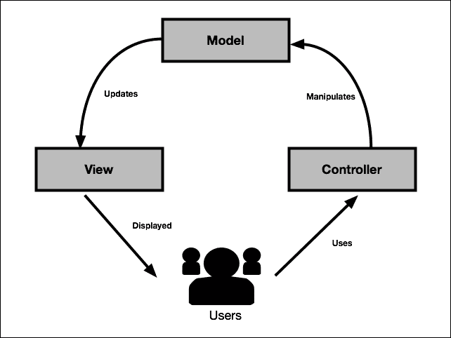
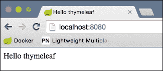
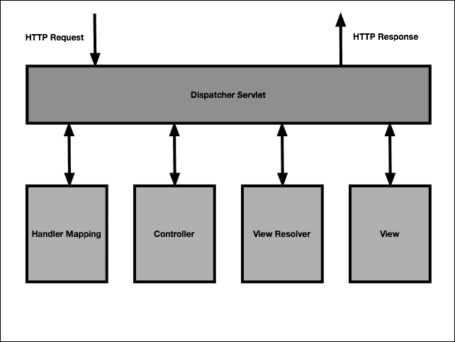
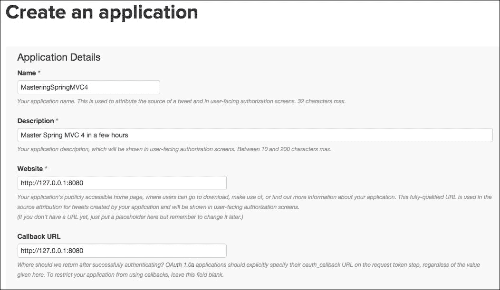
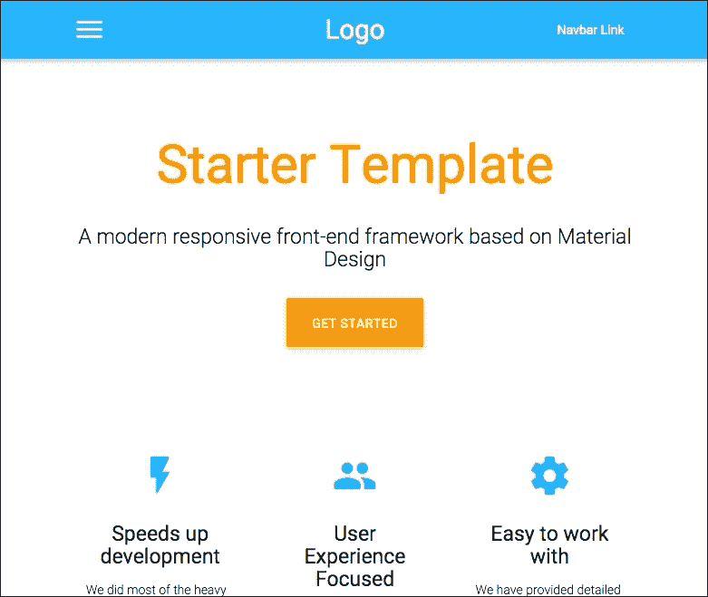
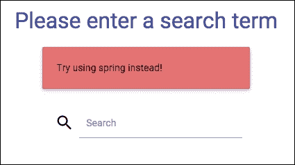
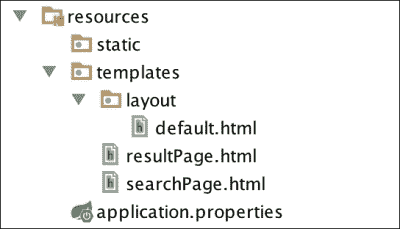

# 第一章掌握 MVC 架构

在本章中，我们将讨论 MVC 体系结构原则，并了解 SpringMVC 如何实现这些原则。

我们的目标是设计一个简单的页面，用户可以在其中搜索符合特定条件的 tweet，并将其显示给用户。

为了实现这一点，我们将使用 Spring 社交推特项目，该项目可在[上获得 http://projects.spring.io/spring-social-twitter/](http://projects.spring.io/spring-social-twitter/) 。

我们将看到如何使 SpringMVC 与现代模板引擎 Thymeleaf 一起工作，并尝试理解框架的内部机制。我们将通过不同的视图引导我们的用户，最后，我们将使用 WebJars 和 Materialize（[来展示我们的应用程序 http://materializecss.com](http://materializecss.com) 。

# MVC 架构

我希望大多数人都熟悉 MVC 首字母缩略词的含义。它代表模型-视图-控制器，被认为是通过解耦数据层和表示层来构建用户界面的一种非常流行的方法。



MVC 模式在从 Smalltalk 的世界中崛起并在 RubyonRails 框架中登陆之后变得非常流行。

建筑模式具有三个层：

*   **模型**：这个由应用程序所知道的数据的各种表示形式组成。
*   **视图**：这是由几个数据表示组成，这些数据将显示给用户。
*   **控制器**：这是应用程序中处理用户交互的部分。它是模型和视图之间的桥梁。

MVC 背后的思想是将视图与模型解耦。模型必须是自包含的，并且不知道 UI。这基本上允许在多个视图中重用相同的数据。这些视图是查看数据的不同方式。深入研究或使用不同的渲染器（HTML、PDF）就是这一原理的很好的例证。

控制器充当用户和数据之间的中介。它的作用是控制最终用户可用的操作，以及通过应用程序的不同视图进行路由。

# MVC 评论家和最佳实践

尽管 MVC 仍然是设计 UI 的首选方法，但随着它的流行，许多批评也随之产生。大多数批评家实际上都在指责这种模式的错误使用。

## 贫血域模型

Eric Evans 有影响力的著作*领域驱动设计*，也缩写为**DDD**，定义了一套架构规则，从而更好地将业务领域集成到代码中。

核心思想之一是利用域对象内部的面向对象范例。违背这一原则有时被称为**贫血域模型**。在 Martin Fowler 的博客（[上可以找到关于这个问题的一个很好的定义 http://www.martinfowler.com/bliki/AnemicDomainModel.html](http://www.martinfowler.com/bliki/AnemicDomainModel.html) ）。

贫血模型通常表现出以下症状：

*   该模型是由非常简单的**普通旧 Java 对象**（**POJO**s）构成的，只有 getter 和 setter
*   所有的业务逻辑都在服务层内处理
*   该模型的验证可在此模型之外找到，例如，在控制器中

根据业务领域的复杂性，这可能是一种不好的做法。一般来说，DDD 实践需要额外的努力来将域与应用程序逻辑隔离开来。

架构总是一种权衡。值得注意的是，设计 Spring 应用程序的典型方法可能会导致道路沿线某处的复杂维护。

如何避免领域性贫血的解释如下：

*   服务层适合于应用程序级抽象，如事务处理，而不是业务逻辑。
*   您的域应始终处于有效状态。使用验证器或 JSR-303 的验证注释将验证留在表单对象中。
*   将输入转换为有意义的域对象。
*   从带有域查询的存储库的角度考虑您的数据层（例如，请参阅 Spring 数据规范）
*   将域逻辑与底层持久性框架解耦
*   尽量使用真实的物体。例如，操纵`FirstName`类而不是字符串。

DDD 的远不止这些简单规则：实体、值类型、无处不在的语言、有界上下文、洋葱架构和反腐败层。我强烈鼓励你们自己学习这些原则。就我们而言，在编写 web 应用程序时，在本书中，我们将尽量记住前面列出的指导原则。随着本书的深入，您将更加熟悉这些问题。

## 从源头上学习

如果你熟悉 Spring，你可能已经登陆 Spring 的网站[http://spring.io](http://spring.io) 。它完全是用 Spring 制作的，好消息是它是开源的。

本项目代号为萨根。它有许多有趣的特点：

*   gradle 多模块项目
*   安全集成
*   Github 集成
*   弹性搜索积分
*   JavaScript 前端应用程序

与该项目相关联的 GitHub wiki 非常详细，可以帮助您轻松开始该项目。

### 注

如果您对真实世界应用程序的 Spring 架构感兴趣，请访问以下 URL：

[https://github.com/spring-io/sagan](https://github.com/spring-io/sagan)

# 弹簧 MVC 1-0-1

在 SpringMVC 中，模型是封装在 SpringMVC 的`Model`或`ModelAndView`类中的简单映射。它可以来自数据库、文件、外部服务等。由您定义如何获取数据并将其放入模型中。与数据层交互的推荐方式是通过 Spring 数据库：Spring 数据 JPA、Spring 数据 MongoDB 等等。有十几个项目与 Spring 数据相关，我鼓励您看看[http://projects.spring.io/spring-data](http://projects.spring.io/spring-data) 。

Spring MVC 的控制器端通过使用`@Controller`注释进行处理。在 web 应用程序中，控制器的角色是响应 HTTP 请求。用`@Controller`注释注释的类将在 Spring 之前获得，并有机会处理即将到来的请求。

通过`@RequestMapping`注释，控制器根据其 HTTP 方法（例如`GET`或`POST`方法）及其 URL 声明处理特定请求。然后，控制器决定直接在 web 响应中写入内容，或者将应用程序路由到视图并将属性注入该视图。

纯 RESTful 应用程序将选择第一种方法，并使用`@ResponseBody`注释直接在 HTTP 响应中公开模型的 JSON 或 XML 表示。对于 web 应用程序，这种类型的体系结构通常与前端 JavaScript 框架（如 Backbone.js、AngularJS 或 React）相关联。在这种情况下，Spring 应用程序将只处理 MVC 模型的模型层。我们将在[第 3 章](15.html#aid-4C62M2 "Chapter 3. File Upload and Error Handling")、*文件上传和错误处理*中研究这种架构。

第二种方法是将模型传递给视图，视图由模板引擎呈现，然后写入响应。

视图通常与模板方言相关联，这将允许在模型内部进行导航。模板化的流行方言是 JSP、FreeMarker 或 Thymeleaf。

混合方法可以利用模板引擎与应用程序的某些方面交互，然后将视图层委托给前端框架。

# 使用百里香

Thymeleaf 是一个模板引擎，受到 Spring 社区的特别关注。

它的成功主要归功于其友好的语法（它看起来几乎像 HTML）和易于扩展。

提供了各种扩展，并与 Spring Boot 集成：

<colgroup><col> <col></colgroup> 
| 

支持

 | 

附属国

 |
| --- | --- |
| 布局 | `nz.net.ultraq.thymeleaf:thymeleaf-layout-dialect` |
| HTML5 数据-*属性 | `com.github.mxab.thymeleaf.extras:thymeleaf-extras-data-attribute` |
| Internet Explorer 条件注释 | `org.thymeleaf.extras:thymeleaf-extras-conditionalcomments` |
| 支持 spring 安全性 | `org.thymeleaf.extras:thymeleaf-extras-springsecurity3` |

关于 Thymeleaf 与 Spring 集成的非常好的教程可以在[上找到 http://www.thymeleaf.org/doc/tutorials/2.1/thymeleafspring.html](http://www.thymeleaf.org/doc/tutorials/2.1/thymeleafspring.html) 。

在没有进一步 ado 的情况下，我们添加`spring-boot-starter-thymeleaf`依赖项来引导 thymeleaf 模板引擎：

```
buildscript {
    ext {
        springBootVersion = '1.2.5.RELEASE'
    }
    repositories {
        mavenCentral()
    }
    dependencies {
        classpath("org.springframework.boot:spring-boot-gradle-plugin:${springBootVersion}") 
        classpath("io.spring.gradle:dependency-management-plugin:0.5.1.RELEASE")
    }
}

apply plugin: 'java'
apply plugin: 'eclipse'
apply plugin: 'idea'
apply plugin: 'spring-boot' 
apply plugin: 'io.spring.dependency-management' 

jar {
    baseName = 'masterSpringMvc'
    version = '0.0.1-SNAPSHOT'
}
sourceCompatibility = 1.8
targetCompatibility = 1.8

repositories {
    mavenCentral()
}

dependencies {
    compile 'org.springframework.boot:spring-boot-starter-web'
    compile 'org.springframework.boot:spring-boot-starter-thymeleaf'
    testCompile 'org.springframework.boot:spring-boot-starter-test'
}

eclipse {
    classpath {
         containers.remove('org.eclipse.jdt.launching.JRE_CONTAINER')
         containers 'org.eclipse.jdt.launching.JRE_CONTAINER/org.eclipse.jdt.internal.debug.ui.launcher.StandardVMType/JavaSE-1.8'
    }
}

task wrapper(type: Wrapper) {
    gradleVersion = '2.3'
}
```

## 我们的第一页

我们将现在将第一页添加到我们的应用程序中。将位于`src/main/resources/templates`中。我们把这个文件称为`resultPage.html`：

```
<!DOCTYPE html>
<html xmlns:th="http://www.thymeleaf.org">
<head lang="en">
    <meta charset="UTF-8"/>
    <title>Hello thymeleaf</title>
</head>
<body>
    <span th:text="|Hello thymeleaf|">Hello html</span>
</body>
</html>
```

我们从一开始就可以看到，Thymeleaf 与 html 完美集成，其语法几乎让人感觉自然。

`th:text`值放在管道之间。这意味着文本中的所有值都将被连接。

一开始可能看起来有点尴尬，但实际上，文本很少在我们的页面中硬编码；所以，Thymeleaf 在这里做出了一个固执己见的设计决策。

Thymeleaf 对 web 设计师来说有一个很大的优势：如果在没有运行服务器的情况下打开模板，那么模板中的所有动态内容都可以返回到默认值。可以相对地指定资源 URL，并且每个标记都可以包含占位符。在前面的示例中，在应用程序的上下文中呈现视图时，不会显示文本“Hello html”，但如果直接使用 web 浏览器打开文件，则会显示文本“Hello html”。

要加快开发速度，请将此属性添加到您的`application.properties`文件中：

```
spring.thymeleaf.cache=false
```

这将禁用视图缓存，并导致每次访问模板时都重新加载模板。

当然，当我们投入生产时，需要禁用此设置。我们将在[第 7 章](19.html#aid-5IAP61 "Chapter 7. Optimizing Your Requests")中看到*优化您的请求*。

### 提示

**重新加载视图**

禁用缓存后，只需使用 eclipse 保存视图，或使用 IntelliJ 中的`Build > Make Project`操作在更改后刷新视图。

最后，我们需要修改`HelloController`类。它现在必须路由到新创建的视图，而不是显示纯文本。为此，我们将删除`@ResponseBody`注释。这样做并且仍然返回一个字符串将告诉 SpringMVC 将这个字符串映射到一个视图名称，而不是直接在响应中显示一个特定的模型。

下面是我们的控制器现在的样子：

```
@Controller
public class HelloController {

    @RequestMapping("/")
    public String hello() {
        return "resultPage";
    }
}
```

在本例中，控制器将用户重定向到视图名称`resultPage`。然后，`ViewResolver`界面会将此名称与我们的页面关联。

让我们再次启动我们的应用程序并转到`http://localhost:8080`。

您将看到以下页面：



# Spring MVC 架构

让我们从这个壮观的新“Hello World”中退一步，试着了解我们的 Web 应用程序中发生了什么。为此，我们将追溯浏览器发送的 HTTP 请求和从服务器得到的响应的过程。

## 调度员服务

每个 Spring web 应用程序的入口点是`DispatcherServlet`。下图说明了 Dispatcher Servlet 架构：



这是一个经典的`HttpServlet`类，它向 HandlerMapping 发送 HTTP 请求。**HandlerMapping**是资源（URL）和控制器的关联。

然后在控制器上调用用`@RequestMapping`注释注释的适当方法。在这种方法中，控制器设置模型数据并将视图名称返回给调度器。

然后，`DispatcherServlet`将询问`ViewResolver`接口，以找到视图的相应实现。

在我们的例子中，`ThymeleafAutoConfiguration`类为我们设置了视图解析器。

您可以在`ThymeleafProperties`类中看到，我们视图的默认前缀是`classpath:/templates/`，默认后缀是`.html`。

这意味着，给定视图名称`resultPage`，视图解析器将在类路径的 templates 目录中查找名为`resultPage.html`的文件。

在我们的应用程序中，我们的`ViewResolver`接口是静态的，但是更高级的实现可以根据请求头或用户的区域设置返回不同的结果。

视图将最终呈现，并将结果写入响应。

## 向视图传递数据

我们的第一页是完全静态的；它并没有真正利用 SpringMVC 的强大功能。让我们把事情变得有趣一点。如果“Hello World”字符串不是硬编码的，而是来自服务器，该怎么办？

你说这仍然是一个蹩脚的“你好世界”吗？是的，但它会带来更多的可能性。让我们更改`resultPage.html`文件以显示来自模型的消息：

```
<!DOCTYPE html>
<html xmlns:th="http://www.thymeleaf.org">
<head lang="en">
    <meta charset="UTF-8"/>
    <title>Hello thymeleaf</title>
</head>
<body>
    <span th:text="${message}">Hello html</span>
</body>
</html>
```

然后，让我们修改控制器，使其将此消息放入此模型中：

```
@Controller
public class HelloController {

    @RequestMapping("/")
    public String hello(Model model) {
        model.addAttribute("message", "Hello from the controller");
        return "resultPage";
    }
}
```

我知道，悬念要了你的命！让我们看看`http://localhost:8080`是什么样子。


首先要注意的是，我们向控制器的方法传递了一个新参数，`DispatcherServlet`为我们提供了正确的对象。事实上，有许多对象可以注入控制器的方法中，例如`HttpRequest`或`HttpResponse`、`Locale`、`TimeZone`和`Principal`，它们表示经过身份验证的用户。这些物体的完整列表可在文件中找到，可在[上找到 http://docs.spring.io/spring/docs/current/spring-framework-reference/html/mvc.html#mvc-安的论点](http://docs.spring.io/spring/docs/current/spring-framework-reference/html/mvc.html#mvc-ann-arguments)。

# 弹簧表达语言

当使用`${}`语法时，实际上您使用的是**Spring 表达式语言**（**SpEL**。野生环境中有几种 EL 变体；SpEl 是最强大的变体之一。

以下是其主要功能的概述：

<colgroup><col> <col> <col></colgroup> 
| 

特色

 | 

语法

 | 

解释

 |
| --- | --- | --- |
| 访问列表元素 | `list[0]` |   |
| 访问地图条目 | `map[key]` |   |
| 三元运算符 | `condition ? 'yes' : 'no'` |   |
| 埃尔维斯操作员 | `person ?: default` | 如果 person 的值为 null，则返回`default` |
| 安全航行 | `person?.name` | 如果人员或她的姓名为空，则返回`null` |
| 模板 | `'Your name is #{person.name}'` | 将值注入到字符串中 |
| 投影 | `${persons.![name]}` | 提取所有人员的姓名并将其放入列表中 |
| 选择 | `persons.?[name == 'Bob']'` | 检索列表中名为 Bob 的人员 |
| 函数调用 | `person.sayHello()` |   |

### 注

完整的参考，请查看[处的手册 http://docs.spring.io/spring/docs/current/spring-framework-reference/html/expressions.html](http://docs.spring.io/spring/docs/current/spring-framework-reference/html/expressions.html) 。

SpEl 用法不限于视图。您还可以在 Spring 框架内的各个地方使用它，例如，在 bean 中注入带有`@Value`注释的属性时。

## 使用请求参数获取数据

我们能够在视图中显示来自服务器的数据。但是，如果我们想从用户那里获得输入，该怎么办？对于 HTTP 协议，有多种方法可以做到这一点。最简单的方法是将查询参数传递到我们的 URL。

### 注

**查询参数**

您当然知道查询参数。它们位于 URL 中的`?`字符之后。它们由一系列名称和值组成，这些名称和值由&符号（与符号）分隔，例如`page?var1=value1&var2=value2`。

我们可以利用这种技术询问用户的姓名。让我们再次修改`HelloController`类：

```
@Controller
public class HelloController {

    @RequestMapping("/")
    public String hello(@RequestParam("name") String userName, Model model) {
        model.addAttribute("message", "Hello, " + userName);
        return "resultPage";
    }
}
```

如果我们导航到`localhost:8080/?name=Geoffroy`，我们可以看到以下内容：


默认情况下，请求参数是必需的。这意味着，如果我们导航到`localhost:8080`，我们将看到一条错误消息。

查看的`@RequestParam`代码，我们可以看到除了 value 参数之外，还有两个其他可能的属性：`required`和`defaultValue`。

因此，我们可以更改代码并为参数指定默认值，或指示不需要该值：

```
@Controller
public class HelloController {

    @RequestMapping("/")
    public String hello(@RequestParam(defaultValue = "world") String name, Model model) {
        model.addAttribute("message", "Hello, " + name);
        return "resultPage";
    }
}
```

### 提示

在 Java8 中，可以不指定 value 参数。在这种情况下，将使用带注释的方法参数的名称。

# 够了，大家好，我们去推特吧！

好吧，这本书的名字毕竟不是“掌握 Hello Worlds”。有了 Spring，查询 Twitter 的 API 真的很容易。

## 注册您的申请

在开始之前，您必须在 Twitter 开发者控制台中注册您的应用程序。

转到[https://apps.twitter.com](https://apps.twitter.com) 并创建一个新的应用程序。

请给它取个名字。在网站和回调 URL 部分下，只需输入`http://127.0.0.1:8080`。这将允许您在本地机器上测试正在开发的应用程序。



现在，导航到密钥，访问令牌，复制**消费者密钥**和**消费者秘密**。我们马上就用这个。请看以下屏幕截图：


默认情况下，我们的应用程序具有只读权限。这对于我们的应用程序来说已经足够了，但如果您愿意，可以对其进行调整。

## 建立 Spring 社交推特

我们将在`build.gradle`文件中添加以下依赖项：

```
compile 'org.springframework.boot:spring-boot-starter-social-twitter'
```

### 注

**Spring Social**是一组提供各种社交网络公共 API 接入的项目。SpringBoot 提供了与 Twitter、Facebook 和 LinkedIn 的即时集成。Spring Social 包括约 30 个项目，可在[找到 http://projects.spring.io/spring-social/](http://projects.spring.io/spring-social/) 。

将以下两行添加到`application.properties`中：

```
spring.social.twitter.appId= <Consumer Key>
spring.social.twitter.appSecret= <Consumer Secret>
```

这些是与我们刚刚创建的应用程序相关联的键。

您将在[第 5 章](17.html#aid-506UG2 "Chapter 5. Securing Your Application")、*保护您的应用程序*中了解更多关于 OAuth 的信息。现在，我们将仅使用这些凭据代表我们的应用程序向 Twitter 的 API 发出请求。

## 访问 Twitter

我们现在可以在控制器中使用 Twitter。让我们将其名称更改为`TweetController`作为一个变量，以更好地反映其新职责：

```
@Controller
public class HelloController {

    @Autowired
    private Twitter twitter;

    @RequestMapping("/")
    public String hello(@RequestParam(defaultValue = "masterSpringMVC4") String search, Model model) {
        SearchResults searchResults = twitter.searchOperations().search(search);
        String text = searchResults.getTweets().get(0).getText();
        model.addAttribute("message", text);
        return "resultPage";
    }
}
```

如您所见，代码搜索与请求参数匹配的 tweet。如果一切顺利，您将在屏幕上看到第一个的文本：


当然，如果搜索没有产生任何结果，我们笨拙的代码将以`ArrayOutOfBoundException`失败。所以，不要犹豫，发推来解决问题吧！

如果我们想显示 tweet 列表呢？让我们修改`resultPage.html`文件：

```
<!DOCTYPE html>
<html xmlns:th="http://www.thymeleaf.org">
<head lang="en">
    <meta charset="UTF-8"/>
    <title>Hello twitter</title>
</head>
<body>
    <ul>
 <li th:each="tweet : ${tweets}" th:text="${tweet}">Some tweet</li>
 </ul>
</body>
</html>
```

### 注

`th:each`是 Thymeleaf 中定义的标记，它允许遍历集合并将每个值分配给循环中的变量。

我们还需要更换控制器：

```
@Controller
public class TweetController {

    @Autowired
    private Twitter twitter;

    @RequestMapping("/")
    public String hello(@RequestParam(defaultValue = "masterSpringMVC4") String search, Model model) {
        SearchResults searchResults = twitter.searchOperations().search(search);
        List<String> tweets =
 searchResults.getTweets()
 .stream()
 .map(Tweet::getText)
 .collect(Collectors.toList());
 model.addAttribute("tweets", tweets);
        return "resultPage";
    }
}
```

请注意，我们使用 Java8 流仅收集推文中的消息。`Tweet`类包含许多其他属性，如发送者、转发计数等。但是，我们现在将保持简单，如以下屏幕截图所示：


# Java 8 流和 lambda

您可能还不熟悉 lambdas。在 Java8 中，每个集合都会获得一个默认方法`stream()`，该方法允许访问函数式操作。

这些操作可以是返回流的中间操作，因此允许链接，也可以是返回值的终端操作。

最著名的中间操作如下：

*   `map`：对列表的每个元素应用方法，并返回结果列表
*   `filter`：返回与谓词匹配的每个元素的列表
*   `reduce`：使用操作和累加器将列表投影为单个值

lambda 是函数表达式的简写语法。它们可以强制转换为一个抽象方法，一个只有一个函数的接口。

例如`Comparator`接口可以实现如下：

```
Comparator<Integer> c = (e1, e2) -> e1 - e2;
```

在 lambdas 中，return 关键字隐式地是它的最后一个表达式。

我们前面使用的双冒号运算符是获取类上函数引用的快捷方式，

```
Tweet::getText
```

上述内容相当于以下内容：

```
(Tweet t) -> t.getText()
```

`collect`方法允许我们调用终端操作。`Collectors`类是一组终端操作，将结果放入列表、集合或映射中，允许分组、连接等。

调用`collect(Collectors.toList())`方法将生成一个包含流中每个元素的列表；在我们的例子中，推特的名字。

# 使用 WebJars 进行材料设计

我们的应用已经很好了，但它在美学方面仍有一些不足之处。你可能听说过材料设计。这是谷歌对平面设计的态度。

我们将使用物化（[http://materializecss.com](http://materializecss.com) ），一个外观非常好、响应迅速的 CSS 和 JavaScript 库，就像 Bootstrap 一样。



我们现在将开始使用 webjar。将 jQuery 和具体化 CSS 添加到我们的依赖项中：

```
compile 'org.webjars:materializecss:0.96.0'
compile 'org.webjars:jquery:2.1.4'
```

WebJar 的组织方式是完全标准化的。您可以在`/webjars/{lib}/{version}/*.js`中找到任何库的 JS 和 CSS 文件。

例如，要将 jQuery 添加到我们的页面，请将以下内容添加到 web 页面：

```
<script src="/webjars/jquery/2.1.4/jquery.js"></script>
```

让我们修改控制器，使其提供所有 tweet 对象的列表，而不是简单的文本：

```
package masterSpringMvc.controller;

import org.springframework.beans.factory.annotation.Autowired;
import org.springframework.social.twitter.api.SearchResults;
import org.springframework.social.twitter.api.Tweet;
import org.springframework.social.twitter.api.Twitter;
import org.springframework.stereotype.Controller;
import org.springframework.ui.Model;
import org.springframework.web.bind.annotation.RequestMapping;
import org.springframework.web.bind.annotation.RequestParam;

import java.util.List;

@Controller
public class TweetController {

    @Autowired
    private Twitter twitter;

    @RequestMapping("/")
    public String hello(@RequestParam(defaultValue = "masterSpringMVC4") String search, Model model) {
        SearchResults searchResults = twitter.searchOperations().search(search);
        List<Tweet> tweets = searchResults.getTweets();
        model.addAttribute("tweets", tweets);
        model.addAttribute("search", search);
        return "resultPage";
    }
}
```

在我们看来，让我们包括物化 CSS：

```
<!DOCTYPE html>
<html xmlns:th="http://www.thymeleaf.org">
<head lang="en">
    <meta charset="UTF-8"/>
    <title>Hello twitter</title>

    <link href="/webjars/materializecss/0.96.0/css/materialize.css" type="text/css" rel="stylesheet" media="screen,projection"/>
</head>
<body>
<div class="row">

    <h2 class="indigo-text center" th:text="|Tweet results for ${search}|">Tweets</h2>

    <ul class="collection">
        <li class="collection-item avatar" th:each="tweet : ${tweets}">
            
            <span class="title" th:text="${tweet.user.name}">Username</span>
            <p th:text="${tweet.text}">Tweet message</p>
        </li>
    </ul>

</div>

<script src="/webjars/jquery/2.1.4/jquery.js"></script>
<script src="/webjars/materializecss/0.96.0/js/materialize.js"></script>
</body>
</html>
```

结果看起来已经好多了！


## 使用布局

我们最不想做的事情是将 UI 的可重用块放入模板中。为此，我们将使用`thymeleaf-layout-dialect`依赖项，它包含在我们项目的`spring-boot-starter-thymeleaf`依赖项中。

我们将在`src/main/resources/templates/layout`中创建一个名为`default.html`的新文件。它将包含我们将逐页重复的代码：

```
<!DOCTYPE html>
<html xmlns:th="http://www.thymeleaf.org"
      xmlns:layout="http://www.ultraq.net.nz/thymeleaf/layout">
<head>
    <meta http-equiv="Content-Type" content="text/html; charset=UTF-8"/>
    <meta name="viewport" content="width=device-width, initial-scale=1, maximum-scale=1.0, user-scalable=no"/>
    <title>Default title</title>

    <link href="/webjars/materializecss/0.96.0/css/materialize.css" type="text/css" rel="stylesheet" media="screen,projection"/>
</head>
<body>

<section layout:fragment="content">
    <p>Page content goes here</p>
</section>

<script src="/webjars/jquery/2.1.4/jquery.js"></script>
<script src="/webjars/materializecss/0.96.0/js/materialize.js"></script>
</body>
</html>
```

我们现在将修改`resultPage.html`文件，使其使用布局，从而简化其内容：

```
<!DOCTYPE html>
<html xmlns:th="http://www.thymeleaf.org"
      xmlns:layout="http://www.ultraq.net.nz/thymeleaf/layout"
      layout:decorator="layout/default">
<head lang="en">
    <title>Hello twitter</title>
</head>
<body>
<div class="row" layout:fragment="content">

    <h2 class="indigo-text center" th:text="|Tweet results for ${search}|">Tweets</h2>

    <ul class="collection">
        <li class="collection-item avatar" th:each="tweet : ${tweets}">
            
            <span class="title" th:text="${tweet.user.name}">Username</span>

            <p th:text="${tweet.text}">Tweet message</p>
        </li>
    </ul>
</div>
</body>
</html>
```

`layout:decorator="layout/default"`将指示我们的布局位置。然后我们可以将内容注入布局的不同`layout:fragment`部分。请注意，每个模板都是有效的 HTML 文件。您还可以很容易地覆盖标题。

## 导航

我们有一个很好的小 tweet 显示应用程序，但是我们的用户应该如何确定他们需要提供一个“搜索”请求参数呢？

如果我们在申请表上加上一点表格就好了。

让我们这样做：


首先，我们需要修改我们的`TweetController`，为我们的应用程序添加第二个视图。当点击`search`字段中的 enter 键时，搜索页面将直接位于我们应用程序的根目录下，结果页面也将可用：

```
@Controller
public class TweetController {

    @Autowired
    private Twitter twitter;

    @RequestMapping("/")
    public String home() {
        return "searchPage";
    }

    @RequestMapping("/result")
    public String hello(@RequestParam(defaultValue = "masterSpringMVC4") String search, Model model) {
        SearchResults searchResults = twitter.searchOperations().search(search);
        List<Tweet> tweets = searchResults.getTweets();
        model.addAttribute("tweets", tweets);
        model.addAttribute("search", search);
        return "resultPage";
    }
}
```

我们将在`templates`文件夹中添加另一个页面，称为`searchPage.html`文件。它将包含一个简单的表单，通过`get`方法将搜索词传递到结果页面：

```
<!DOCTYPE html>
<html xmlns:th="http://www.w3.org/1999/xhtml"
      xmlns:layout="http://www.ultraq.net.nz/thymeleaf/layout"
      layout:decorator="layout/default">
<head lang="en">
    <title>Search</title>
</head>
<body>

<div class="row" layout:fragment="content">

    <h4 class="indigo-text center">Please enter a search term</h4>

    <form action="/result" method="get" class="col s12">
        <div class="row center">
            <div class="input-field col s6 offset-s3">
                <i class="mdi-action-search prefix"></i>
                <input id="search" name="search" type="text" class="validate"/>
                <label for="search">Search</label>
            </div>
        </div>
    </form>
</div>

</body>
</html>
```

这是非常简单的 HTML，它可以完美地工作。你现在可以试试。

如果我们想禁止某些搜索结果怎么办？假设我们希望在用户输入`struts`时显示一条错误消息。

实现这一点的最佳方法是修改表单以发布数据。在控制器中，我们可以截获发布的内容并相应地实现此业务规则。

首先，我们需要修改`searchPage`中的表单，如下所示：

```
<form action="/result" method="get" class="col s12">
```

现在，我们将表单更改为：

```
<form action="/postSearch" method="post" class="col s12">
```

我们还需要在服务器上处理这篇文章。将此方法添加到`TweetController`中：

```
@RequestMapping(value = "/postSearch", method = RequestMethod.POST)
public String postSearch(HttpServletRequest request,
    RedirectAttributes redirectAttributes) {
        String search = request.getParameter("search");
        redirectAttributes.addAttribute("search", search);
        return "redirect:result";
}
```

这里有几个新奇之处：

*   在请求映射注释中，我们指定了要处理的 HTTP 方法，即`POST`。
*   我们直接注入两个属性作为方法参数。它们是请求和`RedirectAttributes`。
*   我们检索发布在请求上的值，并将其传递给下一个视图。
*   我们不返回视图的名称，而是重定向到 URL。

`RedirectAttributes`是一个 Spring 模型，专门用于在重定向场景中传播值。

### 注

**重定向/转发**是 Java web 应用程序上下文中的经典选项。它们都更改用户浏览器上显示的视图。不同之处在于`Redirect`将发送一个 302 头，该头将触发浏览器内部的导航，而`Forward`不会导致 URL 更改。在 SpringMVC 中，只需在方法返回字符串前面加上`redirect:`或`forward:`即可使用这两个选项。在这两种情况下，返回的字符串不会像我们前面看到的那样解析为视图，而是会触发到特定 URL 的导航。

前面的示例有点做作，我们将在下一章中看到更智能的表单处理。如果您在`postSearch`方法中放置断点，您将看到它将在我们表单中的一篇文章之后被调用。

那么错误消息呢？

让我们改变`postSearch`方法：

```
@RequestMapping(value = "/postSearch", method = RequestMethod.POST)
public String postSearch(HttpServletRequest request,
    RedirectAttributes redirectAttributes) {
        String search = request.getParameter("search");
        if (search.toLowerCase().contains("struts")) {
                redirectAttributes.addFlashAttribute("error", "Try using spring instead!");
                return "redirect:/";
        }
        redirectAttributes.addAttribute("search", search);
        return "redirect:result";
}
```

如果用户的搜索词包含“struts”，我们将它们重定向到`searchPage`并使用 flash 属性添加一条小错误消息。

这些特殊类型的属性仅在请求时有效，并在刷新页面时消失。这在我们使用`POST-REDIRECT-GET`模式时非常有用，就像我们刚才做的那样。

我们需要在`searchPage`结果中显示此消息：

```
<!DOCTYPE html>
<html xmlns:th="http://www.w3.org/1999/xhtml"
      xmlns:layout="http://www.ultraq.net.nz/thymeleaf/layout"
      layout:decorator="layout/default">
<head lang="en">
    <title>Search</title>
</head>
<body>

<div class="row" layout:fragment="content">

    <h4 class="indigo-text center">Please enter a search term</h4>

 <div class="col s6 offset-s3">
 <div id="errorMessage" class="card-panel red lighten-2" th:if="${error}">
 <span class="card-title" th:text="${error}"></span>
 </div>

        <form action="/postSearch" method="post" class="col s12">
            <div class="row center">
                <div class="input-field">
                    <i class="mdi-action-search prefix"></i>
                    <input id="search" name="search" type="text" class="validate"/>
                    <label for="search">Search</label>
                </div>
            </div>
        </form>
    </div>
</div>

</body>
</html>
```

现在，如果用户尝试搜索“struts2”推文，他们将得到一个有用且合适的答案：



# 检查点

在本章末尾，您应该在`src/main/java`目录中有一个控制器`TweetController`，处理搜索和未触及的生成配置类`MasterSpringMvcApplication`：


在`src/main/resources`目录中，您应该有一个默认布局和两个使用它的页面。

在`application.properties`文件中，我们添加了 Twitter 应用程序凭据以及一个属性告诉 Spring 不要缓存模板以简化开发：



# 总结

在本章中，您学习了如何创建一个好的 MVC 体系结构。我们看到了 SpringMVC 的一些内部工作，并使用了 SpringSocialTwitter，但配置很少。多亏了 WebJars，我们现在可以设计一个漂亮的 web 应用程序了。

在下一章中，我们将要求用户填写他们的个人资料，以便我们能够自动获取他们可能喜欢的推文。这将使您有机会了解有关表单、格式、验证和国际化的更多信息。