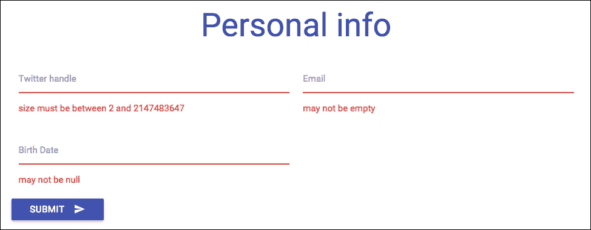
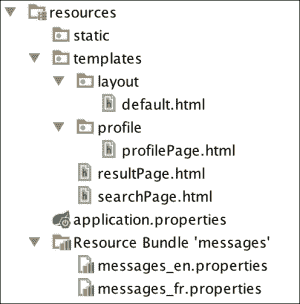

# 第 2 章处理表单和复杂的 URL 映射

我们的应用程序看起来很漂亮，但会从更多关于用户的信息中受益。

我们可以帮助他们提供他们感兴趣的主题。

在本章中，我们将构建一个配置文件页面。它将提供服务器端和客户端验证，以及个人资料图片的文件上传。我们将在用户会话中保存这些信息，并通过将应用程序翻译成多种语言来确保我们的受众尽可能多。最后，我们将显示符合用户口味的 Twitter 活动摘要。

听起来不错？让我们开始吧，我们有一些工作要做。

# 个人资料页–表格

表单是每个 web 应用程序的基石。从互联网一开始，他们就一直是获取用户输入的主要方式！

我们在这里的第一个任务是创建一个类似这样的配置文件页面：


它将允许用户输入一些个人信息以及口味列表。这些口味将被输入我们的搜索引擎。

让我们在`templates/profile/profilePage.html`中创建一个新页面：

```
<!DOCTYPE html>
<html xmlns:th="http://www.thymeleaf.org"
      xmlns:layout="http://www.ultraq.net.nz/thymeleaf/layout"
      layout:decorator="layout/default">
<head lang="en">
    <title>Your profile</title>
</head>
<body>
<div class="row" layout:fragment="content">

    <h2 class="indigo-text center">Personal info</h2>

    <form th:action="@{/profile}" method="post" class="col m8 s12 offset-m2">

        <div class="row">
            <div class="input-field col s6">
                <input id="twitterHandle" type="text"/>
                <label for="twitterHandle">Last Name</label>
            </div>
            <div class="input-field col s6">
                <input id="email" type="text"/>
                <label for="email">Email</label>
            </div>
        </div>
        <div class="row">
            <div class="input-field col s6">
                <input id="birthDate" type="text"/>
                <label for="birthDate">Birth Date</label>
            </div>
        </div>
        <div class="row s12">
            <button class="btn waves-effect waves-light" type="submit" name="save">Submit
                <i class="mdi-content-send right"></i>
            </button>
        </div>
    </form>
</div>
</body>
</html>
```

请注意，`@{}`语法将通过在其参数前面加上服务器上下文路径（在本例中为`localhost:8080`来构造资源的完整路径。

我们还将在`profile`包中创建名为`ProfileController`的关联控制器：

```
package masterspringmvc4.profile;

import org.springframework.stereotype.Controller;
import org.springframework.web.bind.annotation.RequestMapping;

@Controller
public class ProfileController {

    @RequestMapping("/profile")
    public String displayProfile() {
        return "profile/profilePage";
    }
}
```

现在，你可以去`http://localhost:8080`观看一个美丽的形体，它什么也不做。这是因为我们没有将任何操作映射到 post URL。

让我们在与控制器相同的包中创建一个**数据传输对象**（**DTO**）。我们将把它命名为。其作用是映射 web 表单的字段并描述验证规则：

```
package masterSpringMvc.profile;

import java.time.LocalDate;
import java.util.ArrayList;
import java.util.List;

public class ProfileForm {
    private String twitterHandle;
    private String email;
    private LocalDate birthDate;
    private List<String> tastes = new ArrayList<>();

    // getters and setters
}
```

这是一个常规的**普通旧 Java 对象**（**POJO**）。不要忘记生成 getter 和 setter，如果没有，我们的数据绑定将无法正常工作。请注意，我们有一个口味列表，我们现在不会填充，但稍后会填充。

由于我们使用的是 Java 8，因此我们用户的出生日期将使用新的 Java 日期时间 API（JSR 310）。此 API 比旧的`java.util.Date`API 好得多，因为它对人类日期的所有细微差别进行了强烈区分，并使用了流畅的 API 和不变的数据结构。

在我们的例子中，`LocalDate`类是简单的一天，没有时间关联。它可以与表示一天内某个时间的`LocalTime`类、表示两者的`LocalDateTime`类或使用时区的`ZonedDateTime`类区分开来。

### 注

如果您希望了解更多关于 Java 8 日期时间 API 的信息，请参阅[上的 Oracle 教程 https://docs.oracle.com/javase/tutorial/datetime/TOC.html](https://docs.oracle.com/javase/tutorial/datetime/TOC.html) 。

### 提示

好的建议是始终生成数据对象的`toString`方法，如此表单。它对于调试非常有用。

为了指示 Spring 将我们的字段绑定到此 DTO，我们必须在`profilePage`中添加一些元数据：

```
<!DOCTYPE html>
<html xmlns:th="http://www.thymeleaf.org"
      xmlns:layout="http://www.ultraq.net.nz/thymeleaf/layout"
      layout:decorator="layout/default">
<head lang="en">
    <title>Your profile</title>
</head>
<body>
<div class="row" layout:fragment="content">

    <h2 class="indigo-text center">Personal info</h2>

    <form th:action="@{/profile}" th:object="${profileForm}" method="post" class="col m8 s12 offset-m2">

        <div class="row">
            <div class="input-field col s6">
                <input th:field="${profileForm.twitterHandle}" id="twitterHandle" type="text"/>
                <label for="twitterHandle">Last Name</label>
            </div>
            <div class="input-field col s6">
                <input th:field="${profileForm.email}" id="email" type="text"/>
                <label for="email">Email</label>
            </div>
        </div>
        <div class="row">
            <div class="input-field col s6">
                <input th:field="${profileForm.birthDate}" id="birthDate" type="text"/>
                <label for="birthDate">Birth Date</label>
            </div>
        </div>
        <div class="row s12">
            <button class="btn waves-effect waves-light" type="submit" name="save">Submit
                <i class="mdi-content-send right"></i>
            </button>
        </div>
    </form>
</div>
</body>
</html>
```

你会注意到两件事：

*   表单中的`th:object`属性
*   所有字段中的`th:field`属性

第一个将根据对象的类型将其绑定到控制器。第二个将实际字段绑定到表单 bean 属性。

为了使`th:object`字段起作用，我们需要在请求映射方法中添加一个类型为`ProfileForm`的参数：

```
@Controller
public class ProfileController {

    @RequestMapping("/profile")
    public String displayProfile(ProfileForm profileForm) {
        return "profile/profilePage";
    }

    @RequestMapping(value = "/profile", method = RequestMethod.POST)
    public String saveProfile(ProfileForm profileForm) {
        System.out.println("save ok" + profileForm);
        return "redirect:/profile";
    }
}
```

我们还为提交表单时将调用的`POST`方法添加了一个映射。此时，如果您尝试提交带有日期的表单（例如，1980 年 10 月 10 日），它将完全不起作用，并给您一个错误 400，并且没有有用的日志信息。

### 提示

**登录弹簧靴**

使用 Spring Boot，日志记录配置非常简单。只需将`logging.level.{package} = DEBUG`添加到`application.properties`文件中，其中`{package}`是应用程序中某个类或包的完全限定名。当然，您可以用您想要的任何日志记录级别替换调试。您还可以添加一个经典的日志记录配置。参见[http://docs.spring.io/spring-boot/docs/current/reference/html/howto-logging.html](http://docs.spring.io/spring-boot/docs/current/reference/html/howto-logging.html) 了解更多信息。

我们需要稍微调试一下应用程序，以了解发生了什么。将此行添加到您的文件`application.properties`：

```
logging.level.org.springframework.web=DEBUG
```

`org.springframework.web`包是 Spring MVC 的基本包。这将允许我们查看 SpringWeb 生成的调试信息。如果再次提交表单，您将在日志中看到以下错误：

```
Field error in object 'profileForm' on field 'birthDate': rejected value [10/10/1980]; codes [typeMismatch.profileForm.birthDate,typeMismatch.birthDate,typeMismatch.java.time.LocalDate,typeMismatch]; … nested exception is org.springframework.core.convert.ConversionFailedException: Failed to convert from type java.lang.String to type java.time.LocalDate for value '10/10/1980'; nested exception is java.time.format.DateTimeParseException: Text '10/10/1980' could not be parsed, unparsed text found at index 8]
```

为了了解发生了什么，我们需要看看`DateTimeFormatterRegistrar`类的 Spring。

在这个类中，您将看到 JSR310 的半打解析器和打印机。他们都会采用短样式的日期格式，如果您居住在美国，则为`MM/dd/yy`，否则为`dd/MM/yy`。

这将指示 Spring Boot 在应用程序启动时创建一个`DateFormatter`类。

在我们的案例中，我们需要做同样的事情，并创建我们自己的格式化程序，因为用两位数写一年有点困难。

Spring 中的 A`Formatter`是一个既可以`print`也可以`parse`作为对象的类。它将用于解码和打印字符串中的值。

我们将在名为`USLocalDateFormatter`的`date`包中创建一个非常简单的格式化程序：

```
public class USLocalDateFormatter implements Formatter<LocalDate> {
    public static final String US_PATTERN = "MM/dd/yyyy";
    public static final String NORMAL_PATTERN = "dd/MM/yyyy";

    @Override public LocalDate parse(String text, Locale locale) throws ParseException {
        return LocalDate.parse(text, DateTimeFormatter.ofPattern(getPattern(locale)));
    }

    @Override public String print(LocalDate object, Locale locale) {
        return DateTimeFormatter.ofPattern(getPattern(locale)).format(object);
    }

    public static String getPattern(Locale locale) {
        return isUnitedStates(locale) ? US_PATTERN : NORMAL_PATTERN;
    }

    private static boolean isUnitedStates(Locale locale) {
        return Locale.US.getCountry().equals(locale.getCountry());
    }
}
```

这个小类允许我们根据用户的区域设置以更常见的格式解析日期（年份为四位数字）。

让我们在`config`包中创建一个名为`WebConfiguration`的新类：

```
package masterSpringMvc.config;

import masterSpringMvc.dates.USLocalDateFormatter;
import org.springframework.context.annotation.Configuration;
import org.springframework.format.FormatterRegistry;
import org.springframework.web.servlet.config.annotation.WebMvcConfigurerAdapter;

import java.time.LocalDate;

@Configuration
public class WebConfiguration extends WebMvcConfigurerAdapter {

    @Override public void addFormatters(FormatterRegistry registry) {
        registry.addFormatterForFieldType(LocalDate.class, new USLocalDateFormatter());
    }
}
```

这个类扩展了`WebMvcConfigurerAdapter`，这是一个非常方便的类，用于定制 Spring MVC 配置。它提供了许多公共扩展点，您可以通过重写方法（如`addFormatters()`方法）来访问这些扩展点。

这一次，提交我们的表单不会导致任何错误，除非您键入的日期格式不正确。

目前，用户不可能看到他们输入出生日期的格式，所以让我们将这些信息添加到表单中。

在`ProfileController`中，我们添加一个`dateFormat`属性：

```
@ModelAttribute("dateFormat")
public String localeFormat(Locale locale) {
    return USLocalDateFormatter.getPattern(locale);
}
```

`@ModelAttribute`注释将允许我们向网页公开一个属性，就像我们在上一章中看到的`model.addAttribute()`方法一样。

现在，我们可以通过在日期字段中添加占位符，在页面中使用此信息：

```
<div class="row">
    <div class="input-field col s6">
        <input th:field="${profileForm.birthDate}" id="birthDate" type="text" th:placeholder="${dateFormat}"/>
        <label for="birthDate">Birth Date</label>
    </div>
</div>
```

此信息现在将显示给用户：


# 验证

我们不希望用户输入无效或空的信息，这就是为什么我们需要在`ProfileForm`中添加一些验证逻辑。

```
package masterspringmvc4.profile;

import org.hibernate.validator.constraints.Email;
import org.hibernate.validator.constraints.NotEmpty;

import javax.validation.constraints.NotNull;
import javax.validation.constraints.Past;
import javax.validation.constraints.Size;
import java.util.ArrayList;
import java.util.Date;
import java.util.List;

public class ProfileForm {
    @Size(min = 2)
    private String twitterHandle;

    @Email
    @NotEmpty
    private String email;

   @NotNull
    private Date birthDate;

    @NotEmpty
    private List<String> tastes = new ArrayList<>();
}
```

如您所见，我们添加了一些验证约束。这些注释来自 JSR-303 规范，该规范指定了 bean 验证。此规范最流行的实现是`hibernate-validator`，它包含在 Spring Boot 中。

您可以看到，我们使用来自`javax.validation.constraints`包（在 API 中定义）的注释，还有一些来自`org.hibernate.validator.constraints`包（附加约束）。这两种方法都很有效，我鼓励您看看罐子`validation-api`和`hibernate-validator`中的包装中有什么可用的。

您还可以在[的文档中查看 hibernate 验证器中可用的约束 http://docs.jboss.org/hibernate/stable/validator/reference/en-US/html_single/#section-内置约束](http://docs.jboss.org/hibernate/stable/validator/reference/en-US/html_single/#section-builtin-constraints)。

我们还需要添加一些验证工作。首先，控制器需要说明它需要表单提交的有效模型。将`javax.validation.Valid`注释添加到表示表单的参数中只会执行以下操作：

```
@RequestMapping(value = "/profile", method = RequestMethod.POST)
public String saveProfile(@Valid ProfileForm profileForm, BindingResult bindingResult) {
    if (bindingResult.hasErrors()) {
        return "profile/profilePage";
    }

    System.out.println("save ok" + profileForm);
    return "redirect:/profile";
}
```

请注意，如果表单包含任何错误，我们不会重定向用户。这将允许我们在同一网页上显示它们。

说到，我们需要在网页上添加一个地方，在那里将显示这些错误。

在`profilePage.html`中表格标签的开头添加以下行：

```
<ul th:if="${#fields.hasErrors('*')}" class="errorlist">
    <li th:each="err : ${#fields.errors('*')}" th:text="${err}">Input is incorrect</li>
</ul>
```

这将遍历表单中发现的每个错误，并将它们显示在列表中。如果您尝试提交一个空表单，您将看到一系列错误：


注意，`@NotEmpty`对口味的检查将阻止表单提交。事实上，我们还没有办法提供它们。

## 自定义验证消息

这些错误消息对我们的用户还不是很有用。我们需要做的第一件事是将它们正确地关联到各自的字段。我们修改一下`profilePage.html`：

```
<!DOCTYPE html>
<html xmlns:th="http://www.thymeleaf.org"
      xmlns:layout="http://www.ultraq.net.nz/thymeleaf/layout"
      layout:decorator="layout/default">
<head lang="en">
    <title>Your Profile</title>
</head>
<body>
<div class="row" layout:fragment="content">

    <h2 class="indigo-text center">Personal info</h2>

    <form th:action="@{/profile}" th:object="${profileForm}" method="post" class="col m8 s12 offset-m2">

        <div class="row">
            <div class="input-field col s6">
                <input th:field="${profileForm.twitterHandle}" id="twitterHandle" type="text" th:errorclass="invalid"/>
                <label for="twitterHandle">Twitter handle</label>

                <div th:errors="*{twitterHandle}" class="red-text">Error</div>
            </div>
            <div class="input-field col s6">
                <input th:field="${profileForm.email}" id="email" type="text" th:errorclass="invalid"/>
                <label for="email">Email</label>

                <div th:errors="*{email}" class="red-text">Error</div>
            </div>
        </div>
        <div class="row">
            <div class="input-field col s6">
                <input th:field="${profileForm.birthDate}" id="birthDate" type="text" th:errorclass="invalid" th:placeholder="${dateFormat}"/>
                <label for="birthDate">Birth Date</label>

                <div th:errors="*{birthDate}" class="red-text">Error</div>
            </div>
        </div>
        <div class="row s12">
            <button class="btn indigo waves-effect waves-light" type="submit" name="save">Submit
                <i class="mdi-content-send right"></i>
            </button>
        </div>
    </form>
</div>
</body>
</html>
```

您会注意到，我们在表单中的每个字段下面添加了一个`th:errors`标记。我们还为每个字段添加了一个`th:errorclass`标记。如果该字段包含错误，则关联的 css 类将添加到 DOM 中。

验证看起来已经好多了：



我们需要做的下一件事是定制错误消息，以更好地反映应用程序的业务规则。

还记得 SpringBoot 负责为我们创建消息源 bean 吗？此消息源的默认位置在`src/main/resources/messages.properties`中。

让我们创建这样一个捆绑包，并添加以下文本：

```
Size.profileForm.twitterHandle=Please type in your twitter user name
Email.profileForm.email=Please specify a valid email address
NotEmpty.profileForm.email=Please specify your email address
PastLocalDate.profileForm.birthDate=Please specify a real birth date
NotNull.profileForm.birthDate=Please specify your birth date

typeMismatch.birthDate = Invalid birth date format.
```

### 提示

在开发中，将消息源配置为总是重新加载我们的包是非常方便的。将以下属性添加到`application.properties`：

`spring.messages.cache-seconds=0`

0 表示始终重新加载，而-1 表示从不重新加载。

Spring 中负责解决错误消息的类为`DefaultMessageCodesResolver`。在字段验证的情况下，此类尝试按给定顺序解析以下消息：

*   代码+“+”对象名称+“+”字段
*   代码+“+”字段
*   代码+“+”字段类型
*   密码

在前面的规则中，代码部分可以是两种类型：注释类型，如`Size`或`Email`，或者异常代码，如`typeMismatch`。还记得我们因为日期格式不正确而发生异常的时候吗？关联的错误代码确实是`typeMismatch`。

在前面的信息中，我们选择了非常具体的方式。一个好的做法是按如下方式定义默认消息：

```
Size=the {0} field must be between {2} and {1} characters long
typeMismatch.java.util.Date = Invalid date format.
```

注意占位符；每个验证错误都有许多与之关联的参数。

声明错误消息的最后一种方法是直接在验证注释中定义错误消息，如下所示：

```
@Size(min = 2, message = "Please specify a valid twitter handle")
private String twitterHandle;
```

然而，这种方法的缺点是它与国际化不兼容。

## 用于验证的自定义注释

对于 Java 日期，有一个名为`@Past`的注释，它确保日期来自过去。

我们不希望我们的用户假装他们来自未来，所以我们需要验证出生日期。为此，我们将在`date`包中定义我们自己的注释：

```
package masterSpringMvc.date;

import javax.validation.Constraint;
import javax.validation.ConstraintValidator;
import javax.validation.ConstraintValidatorContext;
import javax.validation.Payload;
import java.lang.annotation.*;
import java.time.LocalDate;

@Target({ElementType.FIELD})
@Retention(RetentionPolicy.RUNTIME)
@Constraint(validatedBy = PastLocalDate.PastValidator.class)
@Documented
public @interface PastLocalDate {
    String message() default "{javax.validation.constraints.Past.message}";

    Class<?>[] groups() default {};

    Class<? extends Payload>[] payload() default {};

    class PastValidator implements ConstraintValidator<PastLocalDate, LocalDate> {
        public void initialize(PastLocalDate past) {
        }

        public boolean isValid(LocalDate localDate, ConstraintValidatorContext context) {
            return localDate == null || localDate.isBefore(LocalDate.now());
        }
    }
}
```

很简单，不是吗？此代码将验证我们的日期是否确实来自过去。

我们现在可以将其添加到配置文件表单中的`birthDate`字段中：

```
@NotNull
@PastLocalDate
private LocalDate birthDate;
```

# 国际化

国际化，通常缩写为 i18n，是设计可翻译成多种语言的应用程序的过程。

这通常涉及将翻译放在属性包中，其名称以目标语言环境为后缀，例如，`messages_en.properties`、`messages_en_US.properties`和`messages_fr.properties`文件。

正确的属性包是通过首先尝试最特定的区域设置，然后返回到不太特定的区域设置来解决的。

对于美国英语，如果您试图从名为`x`的包中获取翻译，应用程序将首先查看`x_en_US.properties`文件，然后是`x_en.properties`文件，最后是`x.properties`文件。

我们要做的第一件事是将错误信息翻译成法语。为此，我们将现有的`messages.properties`文件重命名为`messages_en.properties`。

我们还将创建第二个名为`messages_fr.properties`的捆绑包：

```
Size.profileForm.twitterHandle=Veuillez entrer votre identifiant Twitter
Email.profileForm.email=Veuillez spécifier une adresse mail valide
NotEmpty.profileForm.email=Veuillez spécifier votre adresse mail
PastLocalDate.profileForm.birthDate=Veuillez donner votre vraie date de naissance
NotNull.profileForm.birthDate=Veuillez spécifier votre date de naissance

typeMismatch.birthDate = Date de naissance invalide.
```

默认情况下，Spring Boot 使用固定的`LocaleResolver`接口。`LocaleResolver`是一个简单的接口，有两种方式：

```
public interface LocaleResolver {

    Locale resolveLocale(HttpServletRequest request);

    void setLocale(HttpServletRequest request, HttpServletResponse response, Locale locale);
}
```

Spring 提供了该接口的一系列实现，例如`FixedLocaleResolver`。这个局部解析器非常简单；我们可以通过属性配置应用程序区域设置，一旦定义了，就不能更改它。要配置应用程序的区域设置，我们将以下属性添加到`application.properties`文件中：

```
spring.mvc.locale=fr
```

这将添加我们的法语验证消息。

如果我们看一看 Spring MVC 中捆绑的不同`LocaleResolver`接口，我们将看到以下内容：

*   `FixedLocaleResolver`：修复配置中定义的区域设置。一旦修复，它就无法更改。
*   `CookieLocaleResolver`：这允许检索区域设置并将其保存在 cookie 中。
*   `AcceptHeaderLocaleResolver`：使用用户浏览器发送的 HTTP 头查找区域设置。
*   `SessionLocaleResolver`：在 HTTP 会话中查找并存储区域设置。

这些实现涵盖了许多用例，但在更复杂的应用程序中，可以直接实现`LocaleResolver`以允许更复杂的逻辑，例如从数据库获取区域设置并返回到浏览器区域设置。

## 更改区域设置

在我们的应用程序中，区域设置链接到用户。我们将在会话中保存他们的配置文件。

我们将允许用户使用一个小菜单更改网站的语言。这就是我们将使用`SessionLocaleResolver`的原因。让我们再次编辑`WebConfiguration`：

```
package masterSpringMvc.config;

import masterSpringMvc.date.USLocalDateFormatter;
import org.springframework.context.annotation.Bean;
import org.springframework.context.annotation.Configuration;
import org.springframework.format.FormatterRegistry;
import org.springframework.web.servlet.LocaleResolver;
import org.springframework.web.servlet.config.annotation.InterceptorRegistry;
import org.springframework.web.servlet.config.annotation.WebMvcConfigurerAdapter;
import org.springframework.web.servlet.i18n.LocaleChangeInterceptor;
import org.springframework.web.servlet.i18n.SessionLocaleResolver;

import java.time.LocalDate;

@Configuration
public class WebConfiguration extends WebMvcConfigurerAdapter {

    @Override
    public void addFormatters(FormatterRegistry registry) {
        registry.addFormatterForFieldType(LocalDate.class, new USLocalDateFormatter());
    }

    @Bean
    public LocaleResolver localeResolver() {
        return new SessionLocaleResolver();
    }

    @Bean
    public LocaleChangeInterceptor localeChangeInterceptor() {
        LocaleChangeInterceptor localeChangeInterceptor = new LocaleChangeInterceptor();
        localeChangeInterceptor.setParamName("lang");
        return localeChangeInterceptor;
    }

    @Override
    public void addInterceptors(InterceptorRegistry registry) {
        registry.addInterceptor(localeChangeInterceptor());
    }
}
```

我们声明了一个`LocaleChangeInterceptor`bean 作为 Spring MVC 拦截器。它将截获任何向`Controller`发出的请求，并检查`lang`查询参数。例如，导航到`http://localhost:8080/profile?lang=fr`会导致区域设置发生变化。

### 提示

**Spring MVC 拦截器**可以与 web 应用程序中的 Servlet 过滤器相比较。拦截器允许自定义预处理、跳过处理程序的执行和自定义后处理。过滤器功能更强大，例如，它们允许交换传递链中的请求和响应对象。过滤器在`web.xml`文件中配置，而拦截器在应用程序上下文中声明为 bean。

现在，我们可以通过自己输入正确的 URL 来更改区域设置，但最好添加一个导航栏，允许用户更改语言。我们将修改默认布局（`templates/layout/default.html`，添加一个下拉菜单：

```
<!DOCTYPE html>
<html xmlns:th="http://www.thymeleaf.org"
      xmlns:layout="http://www.ultraq.net.nz/thymeleaf/layout">
<head>
    <meta http-equiv="Content-Type" content="text/html; charset=UTF-8"/>
    <meta name="viewport" content="width=device-width, initial-scale=1, maximum-scale=1.0, user-scalable=no"/>
    <title>Default title</title>

    <link href="/webjars/materializecss/0.96.0/css/materialize.css" type="text/css" rel="stylesheet" media="screen,projection"/>
</head>
<body>

<ul id="lang-dropdown" class="dropdown-content">
    <li><a href="?lang=en_US">English</a></li>
    <li><a href="?lang=fr">French</a></li>
</ul>
<nav>
    <div class="nav-wrapper indigo">
        <ul class="right">
            <li><a class="dropdown-button" href="#!" data-activates="lang-dropdown"><i class="mdi-action-language right"></i> Lang</a></li>
        </ul>
    </div>
</nav>

<section layout:fragment="content">
    <p>Page content goes here</p>
</section>

<script src="/webjars/jquery/2.1.4/jquery.js"></script>
<script src="/webjars/materializecss/0.96.0/js/materialize.js"></script>
<script type="text/javascript">
    $(".dropdown-button").dropdown();
</script>
</body>
</html>
```

这将允许用户在两种受支持的语言之间进行选择。


## 翻译申请文本

为了拥有一个完全双语的应用程序，我们需要做的最后一件事就是翻译我们应用程序的标题和标签。为此，我们将编辑我们的网页并使用`th:text`属性，例如，在`profilePage.html`中：

```
<!DOCTYPE html>
<html xmlns:th="http://www.thymeleaf.org"
      xmlns:layout="http://www.ultraq.net.nz/thymeleaf/layout"
      layout:decorator="layout/default">
<head lang="en">
    <title>Your profile</title>
</head>
<body>
<div class="row" layout:fragment="content">

    <h2 class="indigo-text center" th:text="#{profile.title}">Personal info</h2>

    <form th:action="@{/profile}" th:object="${profileForm}" method="post" class="col m8 s12 offset-m2">

        <div class="row">
            <div class="input-field col s6">
                <input th:field="${profileForm.twitterHandle}" id="twitterHandle" type="text" th:errorclass="invalid"/>
                <label for="twitterHandle" th:text="#{twitter.handle}">Twitter handle</label>

                <div th:errors="*{twitterHandle}" class="red-text">Error</div>
            </div>
            <div class="input-field col s6">
                <input th:field="${profileForm.email}" id="email" type="text" th:errorclass="invalid"/>
                <label for="email" th:text="#{email}">Email</label>

                <div th:errors="*{email}" class="red-text">Error</div>
            </div>
        </div>
        <div class="row">
            <div class="input-field col s6">
                <input th:field="${profileForm.birthDate}" id="birthDate" type="text" th:errorclass="invalid"/>
                <label for="birthDate" th:text="#{birthdate}" th:placeholder="${dateFormat}">Birth Date</label>

                <div th:errors="*{birthDate}" class="red-text">Error</div>
            </div>
        </div>
        <div class="row s12 center">
            <button class="btn indigo waves-effect waves-light" type="submit" name="save" th:text="#{submit}">Submit
                <i class="mdi-content-send right"></i>
            </button>
        </div>
    </form>
</div>
</body>
</html>
```

`th:text`属性将用表达式替换 HTML 元素的内容。这里，我们使用`#{}`语法，这表示我们希望显示来自`messages.properties`等属性源的消息。

让我们将相应的翻译添加到英语包中：

```
NotEmpty.profileForm.tastes=Please enter at least one thing
profile.title=Your profile
twitter.handle=Twitter handle
email=Email
birthdate=Birth Date
tastes.legend=What do you like?
remove=Remove
taste.placeholder=Enter a keyword
add.taste=Add taste
submit=Submit
```

现在请看法国的：

```
NotEmpty.profileForm.tastes=Veuillez saisir au moins une chose
profile.title=Votre profil
twitter.handle=Pseudo twitter
email=Email
birthdate=Date de naissance
tastes.legend=Quels sont vos goûts ?
remove=Supprimer
taste.placeholder=Entrez un mot-clé
add.taste=Ajouter un centre d'intérêt
submit=Envoyer
```

一些翻译还没有被使用，但将在稍后使用。瞧！法国市场已经为推特搜索潮做好了准备。

## 表格中的列表

我们现在希望用户输入一个“口味”列表，实际上，这是一个我们将使用搜索推文的关键字列表。

将显示一个按钮，允许用户输入新的关键字并将其添加到列表中。此列表中的每个项目都将是可编辑的输入文本，并可通过“删除”按钮删除：


在某些框架中，处理表单中的列表数据可能是件麻烦事。然而，当您理解了原理后，使用 SpringMVC 和 Thymeleaf 就相对简单了。

在`profilePage.html`文件中包含出生日期的行正下方的提交按钮上方添加以下行：

```
<fieldset class="row">
    <legend th:text="#{tastes.legend}">What do you like?</legend>
    <button class="btn teal" type="submit" name="addTaste" th:text="#{add.taste}">Add taste
        <i class="mdi-content-add left"></i>
    </button>

    <div th:errors="*{tastes}" class="red-text">Error</div>

    <div class="row" th:each="row,rowStat : *{tastes}">
        <div class="col s6">
            <input type="text" th:field="*{tastes[__${rowStat.index}__]}" th:placeholder="#{taste.placeholder}"/>
        </div>

        <div class="col s6">
            <button class="btn red" type="submit" name="removeTaste" th:value="${rowStat.index}" th:text="#{remove}">Remove
                <i class="mdi-action-delete right waves-effect"></i>
            </button>
        </div>
    </div>
</fieldset>
```

这个片段的目的是迭代我们的`LoginForm`的`tastes`变量。这可以通过`th:each`属性实现，该属性看起来很像 java 中的`for…in`循环。

与我们前面看到的搜索结果循环相比，迭代存储在两个变量中，而不是一个。第一个将实际包含每一行数据。`rowStat`变量将包含关于迭代当前状态的附加信息。

新代码中最奇怪的事情是：

```
th:field="*{tastes[__${rowStat.index}__]}"
```

这是一个相当复杂的语法。你可以自己想出一些简单的办法，比如：

```
th:field="*{tastes[rowStat.index]}"
```

那不行。表示迭代循环的当前索引的`${rowStat.index}`变量需要在表达式的其余部分之前进行求值。为了实现这一点，我们需要使用预处理。

被双下划线包围的表达式将被预处理，这意味着它将在正常处理阶段之前被处理，允许对其进行两次计算。

现在我们的表单上有两个新的提交按钮。他们都有一个名字。我们之前使用的全局提交按钮称为`save`。这两个新按钮被称为`addTaste`和`removeTaste`。

在控制器方面，这将允许我们轻松区分来自表单的不同动作。让我们在`ProfileController`中添加两个新动作：

```
@Controller
public class ProfileController {

    @ModelAttribute("dateFormat")
    public String localeFormat(Locale locale) {
        return USLocalDateFormatter.getPattern(locale);
    }

    @RequestMapping("/profile")
    public String displayProfile(ProfileForm profileForm) {
        return "profile/profilePage";
    }

    @RequestMapping(value = "/profile", params = {"save"}, method = RequestMethod.POST)
    public String saveProfile(@Valid ProfileForm profileForm, BindingResult bindingResult) {
        if (bindingResult.hasErrors()) {
            return "profile/profilePage";
        }
        System.out.println("save ok" + profileForm);
        return "redirect:/profile";
    }

    @RequestMapping(value = "/profile", params = {"addTaste"})
    public String addRow(ProfileForm profileForm) {
        profileForm.getTastes().add(null);
        return "profile/profilePage";
    }

    @RequestMapping(value = "/profile", params = {"removeTaste"})
    public String removeRow(ProfileForm profileForm, HttpServletRequest req) {
        Integer rowId = Integer.valueOf(req.getParameter("removeTaste"));
        profileForm.getTastes().remove(rowId.intValue());
        return "profile/profilePage";
    }
}
```

我们在每个 post 操作中添加了一个`param`参数来区分它们。我们之前的那个现在绑定到了`save`参数。

当点击按钮时，其名称将自动添加到浏览器发送的表单数据中。请注意，我们使用移除按钮指定了一个特定值：`th:value="${rowStat.index}"`。此属性将指示关联参数应具体采用的值。如果此属性不存在，将发送一个空值。这意味着当我们点击移除按钮时，一个`removeTaste`参数将添加到`POST`请求中，包含我们想要移除的行的索引。然后我们可以使用以下代码将其返回到`Controller`：

```
Integer rowId = Integer.valueOf(req.getParameter("removeTaste"));
```

这种方法唯一的缺点是每次单击按钮时都会发送整个表单数据，即使不是严格要求。我们的表单足够小，因此可以接受折衷。

就这样！表单现在已经完成，可以添加一种或多种口味。

# 客户验证

作为一个小小的奖励，现在通过 HTML5 表单验证规范，客户端验证变得非常容易。如果您的目标浏览器是 Internet Explorer 10 或更高版本，添加客户端验证与指定正确的输入类型一样简单，而不仅仅是使用文本。

通过添加客户端验证，我们可以预先验证表单，并避免服务器过载我们知道不正确的请求。有关客户端验证规范的更多信息，请访问[http://caniuse.com/#search=validation](http://caniuse.com/#search=validation) 。

我们可以修改输入以实现简单的客户端验证。以前的输入，如以下代码所示：

```
<input th:field="${profileForm.twitterHandle}" id="twitterHandle" type="text" th:errorclass="invalid"/>
<input th:field="${profileForm.email}" id="email" type="text" th:errorclass="invalid"/>
<input th:field="${profileForm.birthDate}" id="birthDate" type="text" th:errorclass="invalid"/>
<input type="text" th:field="*{tastes[__${rowStat.index}__]}" th:placeholder="#{taste.placeholder}"/>
```

这就变成了：

```
<input th:field="${profileForm.twitterHandle}" id="twitterHandle" type="text" required="required" th:errorclass="invalid"/>
<input th:field="${profileForm.email}" id="email" type="email" required="required" th:errorclass="invalid"/>
<input th:field="${profileForm.birthDate}" id="birthDate" type="text" required="required" th:errorclass="invalid"/>
<input type="text" required="required" th:field="*{tastes[__${rowStat.index}__]}" th:placeholder="#{taste.placeholder}"/>
```

使用此方法，浏览器将检测表单何时提交，并根据其类型验证每个属性。`required`属性强制用户输入非空值。`email`类型在相应字段上强制执行基本的电子邮件验证规则。


其他类型的验证器也存在。请看[http://www.the-art-of-web.com/html/html5-form-validation](http://www.the-art-of-web.com/html/html5-form-validation) 。

这种方法的缺点是，我们的“添加味道”和“删除味道”按钮现在将触发验证。为了解决这个问题，我们需要在默认布局的底部，jQuery 声明之后添加一个脚本。

但是，最好只在个人资料页面中包含它。为此，我们可以在`layout/default.html`页面中，在 body 标签的末尾之前添加一个新的片段部分：

```
<script type="text/javascript" layout:fragment="script">
</script>
```

这将允许我们在需要时在每个页面上添加一个额外的脚本。

现在，我们可以在关闭 body 标记之前，将以下脚本添加到我们的 profile 页面：

```
<script layout:fragment="script">
    $('button').bind('click', function(e) {
        if (e.currentTarget.name === 'save') {
            $(e.currentTarget.form).removeAttr('novalidate');
        } else {
            $(e.currentTarget.form).attr('novalidate', 'novalidate');
        }
    });
</script>
```

当表单上存在`novalidate`属性时，不会触发表单验证。如果表单的动作名为`save`，那么这个小脚本将动态删除`novalidate`属性。如果输入的名称不同，则始终会添加`novalidate`属性。因此，验证将仅由“保存”按钮触发。

# 检查点

在进入下一章之前，让我们检查一下是否所有东西都在正确的位置。

在 Java 源代码中，您应该具有以下内容：

*   新控制器`ProfileController`
*   与日期相关的两个新类：日期格式化程序和用于验证`LocalDate`的注释
*   用于定制 Spring MVC 配置的新`WebConfiguration`文件夹


在参考资料中，您应该在 profile 目录中有一个新模板和两个新包：



# 总结

在本章中，您学习了如何制作完整的表单。我们使用 Java8 日期创建了一个模型，您学习了如何格式化来自用户的信息并相应地显示它。

我们确保表单中填写了有效的信息和验证器注释，包括我们自己的注释。此外，我们还可以很容易地包含一些客户端验证，从而防止明显不正确的信息进入服务器。

最后，我们甚至将整个应用程序翻译成英语和法语，包括日期格式！

在下一章中，我们将构建一个空间，用户将能够上传他们的图片，并了解 SpringMVC 应用程序中错误处理的更多信息。