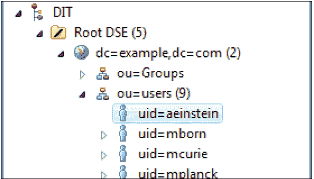
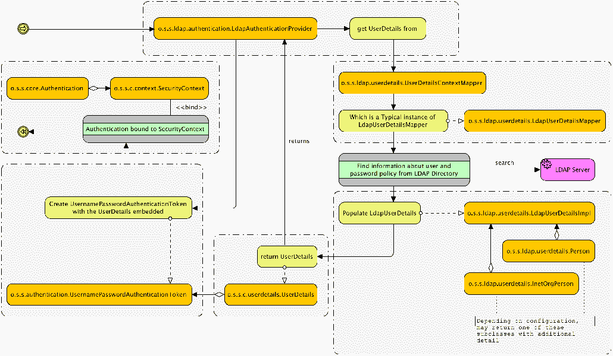
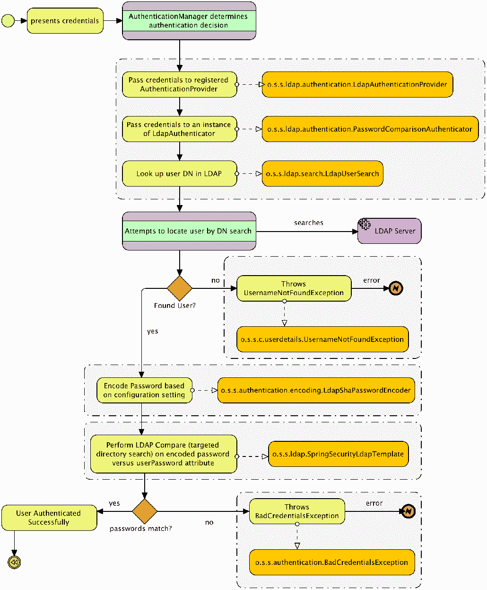
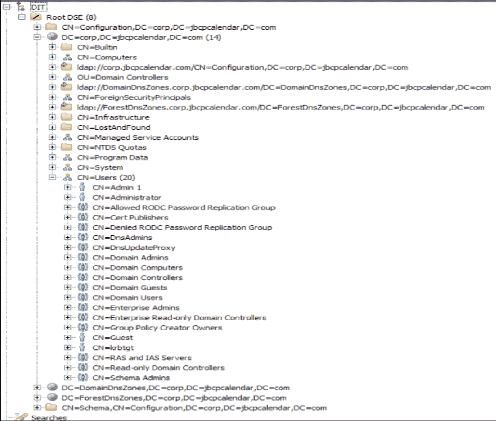

# 六、LDAP 目录服务

在本章中，我们将回顾**轻量级目录访问协议**（**LDAP**），并了解如何将其集成到支持 SpringSecurity 的应用中，为感兴趣的成员提供认证、授权和用户信息服务。

在本章中，我们将介绍以下主题：

*   学习与 LDAP 协议和服务器实现相关的一些基本概念
*   在 Spring Security 中配置自包含的 LDAP 服务器
*   启用 LDAP 认证和授权
*   了解 LDAP 搜索和用户匹配背后的模型
*   从标准 LDAP 结构检索其他用户详细信息
*   区分 LDAP 认证方法并评估每种类型的优缺点
*   使用**Springbean**声明显式配置 SpringSecurity LDAP
*   连接到外部 LDAP 目录
*   探索对 Microsoft AD 的内置支持
*   我们还将探讨如何定制 Spring Security，以便在处理自定义 AD 部署时具有更大的灵活性

# 理解 LDAP

LDAP 起源于逻辑目录模型，可以追溯到 30 多年前，在概念上类似于组织结构图和地址簿的组合。如今，LDAP 越来越多地被用作集中公司用户信息、将数千个用户划分为逻辑组以及允许在许多不同系统之间统一共享用户信息的一种方式。

出于安全目的，LDAP 通常用于促进集中式用户名和密码认证。用户的凭据存储在 LDAP 目录中，并且可以代表用户针对该目录发出认证请求。这简化了管理员的管理，因为用户凭据、登录 ID、密码和其他详细信息存储在 LDAP 目录中的单个位置。此外，组织信息（如组或团队分配、地理位置和公司层次结构成员资格）是根据用户在目录中的位置定义的。

# LDAP

此时，如果您以前从未使用过 LDAP，您可能会想知道它是什么。我们将用 Apache Directory Server 2.0.0-M231.5 示例目录中的一个屏幕演示一个示例 LDAP 模式，如以下屏幕截图所示：



从`uid=admin1@example.com`的特定用户条目开始（在前面的屏幕截图中突出显示），我们可以通过从树中的此节点开始并向上移动来推断`admin1`的组织成员身份。我们可以看到用户`aeinstein`是组织单元`ou=users`的成员，组织单元本身就是域`example.com`的一部分（前面截图中的缩写`dc`代表域组件）。在此之前是 LDAP 树本身的组织元素（`DIT`和`Root DSE`，在 SpringSecurity 的上下文中，它们与我们无关。用户`aeinstein`在 LDAP 层次结构中的位置在语义上和定义上都是有意义的。您可以想象一个更复杂的层次结构，很容易说明一个庞大组织的组织和部门边界。

沿着树向下走到单个叶节点形成的完整的自上而下的路径形成一条由沿途所有中间节点组成的字符串，如节点路径`admin1`，如下所示：

```java
    uid=admin1,ou=users,dc=example,dc=com
```

前面的节点路径是唯一的，称为节点的**可分辨名称**（**DN**）。可分辨名称类似于数据库主键，允许在复杂的树结构中唯一标识和定位节点。我们将看到，通过 SpringSecurityLDAP 集成，节点的 DN 在整个认证和搜索过程中被广泛使用。

请注意，与`admin1`处于同一组织级别的还有其他几个用户。假设所有这些用户都处于与`admin1`相同的组织位置。虽然这个示例组织相对简单且扁平，但 LDAP 的结构是任意灵活的，可以进行多层次的嵌套和逻辑组织。

SpringSecurity LDAP 支持由 Spring LDAP 模块（[提供帮助 http://www.springsource.org/ldap](http://www.springsource.org/ldap) ），这实际上是一个独立于核心 Spring 框架和 SpringSecurity 项目的项目。它被认为是稳定的，并围绕标准 JavaLDAP 功能提供了一组有用的包装器。

# 通用 LDAP 属性名称

树中的每个实际条目都由一个或多个对象类定义。对象类是组织的逻辑单元，对一组语义相关的属性进行分组。通过将树中的一个条目声明为特定对象类（如 person）的实例，LDAP 目录的组织者能够为目录的用户提供目录中每个元素所代表的内容的清晰指示。

LDAP 有一组丰富的标准模式，涵盖可用的 LDAP 对象类及其适用属性（以及大量其他信息）。如果您计划广泛使用 LDAP，强烈建议您阅读一本好的参考指南，如《Zytrax OpenLDAP》（[一书的附录 http://www.zytrax.com/books/ldap/ape/](http://www.zytrax.com/books/ldap/ape/) ），或*互联网 2 联盟的个人相关模式指南*（ [http://middleware.internet2.edu/eduperson/](http://middleware.internet2.edu/eduperson/) 。

在上一节中，我们了解到 LDAP 树中的每个条目都有一个 DN，该 DN 在树中唯一地标识该条目。DN 由一系列属性组成，其中一个（或多个）用于唯一标识 DN 表示的条目树下的路径。由于 DN 描述的路径的每个段都代表一个 LDAP 属性，因此可以参考可用的、定义良好的 LDAP 模式和对象类来确定任何给定 DN 中的每个属性的含义。

下表中包含了一些常见属性及其含义。这些属性往往是组织属性，这意味着它们通常用于定义 LDAP 树的组织结构，并且在典型 LDAP 安装中可能会看到的结构中从上到下排列：

| **属性名称** | **说明** | **示例** |
| --- | --- | --- |
| `dc` | **域组件**：通常是 LDAP 层次结构中组织的最高级别。 | `dc=jbcpcalendar,dc=com` |
| `c` | **国家**：一些 LDAP 层次结构是按国家在较高级别上构建的。 | `c=US` |
| `o` | **组织名称**：是对 LDAP 资源进行分类的上级业务组织。 | `o=Oracle Corporation` |
| `ou` | **组织单元**：是一个部门性的业务组织，一般在一个组织内。 | `ou=Product Development` |
| `cn` | **通用名称**：这是一个通用名称，或者是对象的唯一或人类可读的名称。对于人类，这通常是人的全名，而对于 LDAP 中的其他资源（计算机等），这通常是主机名。 | `cn=Super Visor``cn=Jim Bob` |
| `uid` | **用户 ID**：虽然本质上不是组织性的，`uid`属性通常是 Spring 在用户认证和搜索时寻找的。 | `uid=svisor` |
| `userPassword` | **用户密码**：此属性存储与此属性关联的`person`对象的密码。它通常是使用`SHA`或类似的东西进行单向散列。 | `userPassword=plaintext``userPassword={SHA}cryptval` |

但是，上表中的属性倾向于组织目录树上的属性，因此可能会形成各种搜索表达式或映射，您将使用这些表达式或映射配置 Spring Security 以与 LDAP 服务器交互。

请记住，在与完全填充的 LDAP 服务器集成时，有数百个标准 LDAP 属性，这些属性只代表您可能看到的一小部分。

# 更新我们的依赖关系

我们已经包含了您在本章中需要的所有依赖项，因此您不需要对您的`build.gradle`文件进行任何更新。但是，如果您只是将 LDAP 支持添加到自己的应用中，则需要在`build.gradle`中添加`spring-security-ldap`作为依赖项，如下所示：

```
    //build.gradle

    dependencies {
    // LDAP:
    compile('org.springframework.boot:spring-boot-starter-data-ldap')
    compile("org.springframework.ldap:spring-ldap-core")
    compile("org.springframework.security:spring-security-ldap")
 compile("org.springframework:spring-tx")    compile("com.unboundid:unboundid-ldapsdk")
       ...
    }
```

由于 Gradle 的工件解析问题，`spring-tx`必须被拉入，否则 Gradle 将获取一个不起作用的旧工件。

如前所述，SpringSecurity 的 LDAP 支持构建在 SpringLDAP 之上。Gradle 将自动将此依赖项作为可传递依赖项引入，因此无需显式列出它。

如果您使用**ApacheDS**在 web 应用中运行 LDAP 服务器，就像我们在日历应用中所做的那样，您将需要添加对相关 ApacheDS JAR 的依赖关系。没有必要对我们的示例应用进行这些更新，因为我们已经包含了它们。请注意，如果要连接到外部 LDAP 服务器，则不需要这些依赖项：

```
//build.gradle

    compile 'org.apache.directory.server:apacheds-core:2.0.0-M23'
    compile 'org.apache.directory.server:apacheds-protocol-ldap:2.0.0-M23'
    compile 'org.apache.directory.server:apacheds-protocol-shared:2.0.0
    -M23'
```

配置嵌入式 LDAP 集成

现在让我们启用 JBCP 日历应用以支持基于 LDAP 的认证。幸运的是，这是一个相对简单的练习，使用嵌入式 LDAP 服务器和一个示例 LDIF 文件。在本练习中，我们将使用为本书创建的 LDIF 文件，用于捕获 LDAP 和 SpringSecurity 的许多常见配置场景。我们还包括了几个示例 LDIF 文件，其中一些来自 ApacheDS2.0.0-M23，另一个来自 SpringSecurity 单元测试，您也可以选择使用它们进行实验。

# 配置 LDAP 服务器引用

第一步是配置嵌入式 LDAP 服务器。SpringBoot 将自动配置嵌入式 LDAP 服务器，但我们需要稍微调整配置。对您的`application.yml`文件进行以下更新：

```
      //src/main/resources/application.yml

      spring:
      ## LDAP
 ldap: embedded: 
```

```
 ldif: classpath:/ldif/calendar.ldif base-dn: dc=jbcpcalendar,dc=com port: 33389
```

您应该从`chapter06.00-calendar`的源代码开始。

我们正在从`classpath`加载`calendar.ldif`文件，并使用它填充 LDAP 服务器。`root`属性使用指定的 DN 声明 LDAP 目录的根目录。这应该对应于我们正在使用的 LDIF 文件中的逻辑根 DN。

请注意，对于嵌入式 LDAP 服务器，`base-dn`属性是必需的。如果未指定或指定不正确，则在初始化 Apache DS 服务器时可能会收到几个奇怪的错误。另外，请注意，`ldif`资源应该只加载一个`ldif`，否则服务器将无法启动。Spring Security 需要单个资源，因为使用诸如`classpath*:calendar.ldif`之类的东西不会提供所需的确定性排序。

稍后，当我们声明 LDAP 用户服务和其他配置元素时，我们将在 SpringSecurity 配置文件中重用这里定义的 bean ID。使用嵌入式 LDAP 模式时，`<ldap-server>`声明中的所有其他属性都是可选的。

# 启用 LDAP AuthenticationProviderNext 接口

接下来，我们需要配置另一个`AuthenticationProvider`接口，用于根据 LDAP 提供程序检查用户凭据。只需更新 SpringSecurity 配置以使用`o.s.s.ldap.authentication.LdapAuthenticationProvider`引用，如下所示：

```
    //src/main/java/com/packtpub/springsecurity/configuration/SecurityConfig.java

    @Override
    public void configure(AuthenticationManagerBuilder auth)
    throws Exception {
       auth
 .ldapAuthentication() .userSearchBase("") .userSearchFilter("(uid={0})") .groupSearchBase("ou=Groups") .groupSearchFilter("(uniqueMember={0})") .contextSource(contextSource()) .passwordCompare() .passwordAttribute("userPassword");    }
    @Bean
    public DefaultSpringSecurityContextSource contextSource() {
 return new DefaultSpringSecurityContextSource( Arrays.asList("ldap://localhost:33389/"), "dc=jbcpcalendar,dc=com");
    }
```

稍后我们将进一步讨论这些属性。现在，让应用重新启动并运行，然后尝试使用`admin1@example.com`作为用户名和`admin1`作为密码登录。你应该登录！

您的源代码应该类似于`chapter05.01-calendar`。

# 嵌入式 LDAP 故障排除

您很可能会遇到嵌入式 LDAP 难以调试的问题。ApacheDS 通常对错误消息不是很友好，在 SpringSecurityEmbedded 模式下更是如此。如果您在试图访问浏览器中的应用时出现`404`错误，则很有可能是程序启动不正常。如果无法运行此简单示例，则需要仔细检查以下内容：

*   确保在`configuration`文件中的`DefaultSpringSecurityContextSource`声明上设置了`baseDn`属性，并确保它与启动时加载的 LDIF 文件中定义的根匹配。如果引用缺少的分区时出错，则可能是缺少了`root`属性或与 LDIF 文件不匹配。
*   请注意，启动嵌入式 LDAP 服务器的故障不是致命故障。为了诊断加载 LDIF 文件时的错误，您需要确保启用了适当的日志设置，包括 Apache DS 服务器的日志记录，至少在错误级别启用。LDIF 加载程序在`org.apache.directory.server.protocol.shared.store`包下，应使用它来记录 LDIF 加载错误。
*   如果应用服务器非正常关闭，您可能需要删除临时目录中的一些文件（Windows 系统上为`%TEMP%`，基于 Linux 的系统上为`/tmp`），以便再次启动服务器。关于这一点的错误信息（幸运的是）相当清楚。不幸的是，嵌入式 LDAP 不像嵌入式 H2 数据库那样无缝和易于使用，但它仍然比尝试下载和配置许多免费可用的外部 LDAP 服务器要容易得多。

ApacheDirectoryStudio 项目是一个用于排除故障或访问 LDAP 服务器的优秀工具，它提供了独立和 Eclipse 插件版本。免费下载可在[获得 http://directory.apache.org/studio/](http://directory.apache.org/studio/) 。如果您想继续阅读本书，现在可能需要下载 ApacheDirectoryStudio2.0.0-M23。

# 了解 SpringLDAP 认证的工作原理

我们看到我们能够使用 LDAP 目录中定义的用户登录。但是，当用户在 LDAP 中为用户发出登录请求时，会发生什么情况呢？LDAP 认证过程包括以下三个基本步骤：

1.  根据 LDAP 目录验证用户提供的凭据。
2.  根据用户在 LDAP 中的信息，确定用户拥有的`GrantedAuthority`对象。
3.  将用户的 LDAP 条目中的信息预加载到自定义`UserDetails`对象中，供应用进一步使用。

# 验证用户凭据

对于第一步，针对 LDAP 目录的认证，自定义认证提供程序连接到`AuthenticationManager`。`o.s.s.ldap.authentication.LdapAuthenticationProvider`接口获取用户提供的凭证，并根据 LDAP 目录进行验证，如下图所示：


我们可以看到，`o.s.s.ldap.authentication.LdapAuthenticator`接口定义了一个委托，允许提供者以可定制的方式发出认证请求。到目前为止，我们隐式配置的实现`o.s.s.ldap.authentication.BindAuthenticator`尝试使用用户的凭据绑定（登录）到 LDAP 服务器，就像用户自己进行连接一样。对于嵌入式服务器，这足以满足我们的认证需求；但是，外部 LDAP 服务器可能更严格，在这些服务器中，可能不允许用户绑定到 LDAP 目录。幸运的是，存在另一种认证方法，我们将在本章后面探讨。

如上图所示，请记住，搜索是在由`DefaultSpringSecurityContextSource`引用的`baseDn`属性中指定的凭据创建的 LDAP 上下文下执行的。对于嵌入式服务器，我们不使用此信息，但是对于外部服务器引用，除非提供了`baseDn`，否则将使用匿名绑定。对于需要有效凭证来搜索 LDAP 目录的组织来说，保留对目录中信息的公共可用性的某种控制是非常常见的，因此，在现实场景中几乎总是需要`baseDn`。`baseDn`属性表示具有绑定目录和执行搜索的有效访问权限的用户的完整 DN。

# 使用 Apache Directory Studio 演示认证

我们将通过使用 ApacheDirectoryStudio1.5 连接到我们的嵌入式 LDAP 实例并执行与 SpringSecurity 相同的步骤来演示认证过程是如何工作的。我们将在整个模拟过程中使用`user1@example.com`。这些步骤将有助于确保牢牢掌握幕后发生的事情，并有助于在您难以确定正确配置的情况下提供帮助。

确保日历应用已启动并正常工作。接下来，启动 Apache Directory Studio 1.5 并关闭欢迎屏幕。

# 匿名绑定到 LDAP

第一步是匿名绑定到 LDAP。绑定是匿名完成的，因为我们没有在`DefaultSpringSecurityContextSource`对象上指定`baseDn`和`password`属性。在 Apache Directory Studio 中，使用以下步骤创建连接：

1.  单击文件|新建| LDAP 浏览器| LDAP 连接。
2.  点击下一步。

3.  输入以下信息，然后单击“下一步”：
    *   连接名称：`calendar-anonymous`
    *   主机名：`localhost`
    *   端口：``33389``
4.  我们没有指定`baseDn`，所以选择不认证作为认证方式。
5.  点击 Finish。

您可以安全地忽略指示不存在默认架构信息的消息。现在您应该看到您已连接到嵌入式 LDAP 实例。

# 搜索用户

现在我们有了一个连接，我们可以通过执行以下步骤，使用它来查找希望绑定到的用户 DN：

1.  右键点击`DIT`并选择新建|新建搜索。
2.  输入搜索基数`dc=jbcpcalendar,dc=com`。这对应于我们指定的[对象的`baseDn`属性。](mailto:uid%3Dadmin1@example.com)
3.  输入一个过滤器`uid=user1@example.com`。这对应于我们为`AuthenticationManagerBuilder`的`userSearchFilter`方法指定的值。请注意，我们已经包含了括号，并用`{0}`值替换了我们试图登录的用户名。
4.  点击搜索。
5.  单击搜索返回的单个结果的 DN。您现在可以看到显示了我们的 LDAP 用户。请注意，此 DN 与我们搜索的值匹配。记住这个 DN，因为它将在我们的下一步中使用。

# 以用户身份绑定到 LDAP

现在，我们已经找到了用户的完整 DN，我们需要尝试以该用户的身份绑定到 LDAP 以验证提交的密码。这些步骤与我们已经完成的匿名绑定中的步骤相同，只是我们将指定要验证的用户的凭据。

在 ApacheDS 中，使用以下步骤创建连接：

1.  选择文件|新建| LDAP 浏览器| LDAP 连接。
2.  点击下一步。
3.  输入以下信息并点击下一步**：**
    *   连接名称：`calendar-user1`
    *   主机名：`localhost`
    *   端口：`33389`
4.  将认证方法保留为简单认证。
5.  从我们的搜索结果中输入 DN 作为`Bind DN`。该值应为`uid=admin1@example.com,ou=Users,dc=jbcpcalendar,dc=com`。
6.  `Bind`密码应为登录时提交的密码。在本例中，我们希望使用`admin1`成功进行认证。如果输入了错误的密码，我们将无法连接，Spring Security 将报告错误。
7.  点击 Finish。

Spring Security 将在该用户能够成功绑定所提供的用户名和密码（类似于我们创建连接的方式）时，确定该用户的用户名和密码是否正确。然后，Spring Security 将继续确定用户的角色成员身份。

# 确定用户角色成员身份

在用户成功通过 LDAP 服务器认证后，接下来必须确定授权信息。授权由主体的角色列表定义，并确定 LDAP 认证用户的角色成员身份，如下图所示：


我们可以看到，在根据 LDAP 对用户进行认证之后，`LdapAuthenticationProvider`将委托给`LdapAuthoritiesPopulator`。`DefaultLdapAuthoritiesPopulator`接口将尝试在 LDAP 层次结构中位于另一个条目或其下方的属性中定位经过认证的用户的 DN。在`groupSearchBase`方法中定义了搜索用户角色分配的位置的 DN；在我们的样本中，我们将其设置为`groupSearchBase("ou=Groups")`。当用户的 DN 位于 DN`groupSearchBase`下方的 LDAP 条目中时，将使用找到其 DN 的条目上的属性向其授予角色。

SpringSecurity 角色如何与 LDAP 用户关联可能有点令人困惑，因此让我们看看 JBCP 日历 LDAP 存储库，看看用户与角色的关联是如何工作的。`DefaultLdapAuthoritiesPopulator`界面使用`AuthenticationManagerBuilder`声明的几种方法来管理用户角色的搜索。这些属性大致按以下顺序使用：

1.  `groupSearchBase`：它定义了 LDAP 集成应在其中查找用户 DN 的一个或多个匹配项的基本 DN。默认值从 LDAP 根目录执行搜索，这可能很昂贵。
2.  `groupSearchFilter`：定义 LDAP 搜索过滤器，用于将用户的 DN 与`groupSearchBase`下的条目属性相匹配。此搜索筛选器使用两个参数进行参数化，第一个（`{0}`）是用户的 DN，第二个（`{1}`）是用户的用户名。默认值为`uniqueMember={0}`。
3.  `groupRoleAttribute`：定义匹配条目的属性，用于组成用户的`GrantedAuthority`对象。默认值为`cn`。
4.  `rolePrefix`：将在`groupRoleAttribute`中找到的值前面加前缀，以生成 Spring Security`GrantedAuthority`对象。默认值为`ROLE_`。

这可能有点抽象，新开发人员很难理解，因为它与我们迄今为止在基于 JDBC 和 JPA 的`UserDetailsService`实现中看到的任何东西都有很大的不同。让我们继续在 JBCP calendar LDAP 目录中与`user1@example.com`用户一起完成登录过程。

# 使用 Apache Directory Studio 确定角色

现在，我们将尝试使用 Apache Directory Studio 确定用户的角色。使用我们之前创建的`calendar-user1`连接，执行以下步骤：

1.  右键点击`DIT`并选择新建|新建搜索。
2.  输入搜索基数`ou=Groups,dc=jbcpcalendar,dc=com`。这对应于我们指定的`DefaultSpringSecurityContextSource`对象的`baseDn`属性，加上我们为`AuthenticationManagerBuilder`对象指定的`groupSearchBase`属性。
3.  输入一个过滤器`uniqueMember=uid=user1@example.com,ou=Users,dc=jbcpcalendar,dc=com`。这对应于（`uniqueMember={0}`的默认`groupSearchFilter`属性。请注意，我们已经用上一个练习中找到的用户的完整 DN 替换了`{0}`值。
4.  点击搜索。
5.  您会发现`User`组是我们搜索结果中返回的唯一组。单击搜索返回的单个结果的 DN。您现在可以看到 ApacheDS 中显示的`User`组。请注意，该组有一个带有我们用户和其他用户的完整 DN 的`uniqueMember`属性。

Spring Security 现在为每个结果创建`GrantedAuthority`对象，方法是将找到的组名强制为大写，并在组名前面加上`ROLE_`。伪代码看起来类似于以下代码段：

```
    foreach group in groups:

    authority = ("ROLE_"+group).upperCase()

    grantedAuthority = new GrantedAuthority(authority)
```

SpringLDAP 和您的灰质一样灵活。请记住，尽管这是组织 LDAP 目录以与 Spring Security 兼容的一种方法，但典型的使用场景与 Spring Security 需要连接的 LDAP 目录正好相反。在许多情况下，您将能够重新配置 SpringSecurity 以处理 LDAP 服务器的层次结构；然而，有效地规划并理解 Spring 在查询 LDAP 时如何与 LDAP 一起工作是关键。运用你的大脑，规划出用户搜索和组搜索，并提出你能想到的最佳计划，使搜索范围尽可能小和精确。

您能描述一下我们的`admin1@example.com`用户登录过程的结果会有什么不同吗？如果您对此感到困惑，我们建议您休息一下，尝试使用 ApacheDirectoryStudio 浏览通过运行应用配置的嵌入式 LDAP 服务器。如果您尝试按照前面描述的算法自己搜索目录，则更容易掌握 Spring Security 的 LDAP 配置流程。

# 映射 UserDetails 的其他属性

最后，一旦 LDAP 查找为用户分配了一组`GrantedAuthority`对象，`o.s.s.ldap.userdetails.LdapUserDetailsMapper`将查询`o.s.s.ldap.userdetails.UserDetailsContextMapper`以检索任何其他详细信息，以填充`UserDetails`对象供应用使用。

使用`AuthenticationManagerBuilder`，到目前为止，我们已经配置了`LdapUserDetailsMapper`将用于使用从 LDAP 目录中的用户条目中收集的信息填充`UserDetails`对象：



稍后我们将看到如何配置`UserDetailsContextMapper`以从标准 LDAP`person`和`inetOrgPerson`对象中提取大量信息。使用基线`LdapUserDetailsMapper`，存储的数据略多于`username`、`password`和`GrantedAuthority`。

虽然 LDAP 用户认证和详细信息检索涉及到更多的幕后机制，但您会注意到，整个过程似乎与我们在[第 4 章](04.html)、*基于 JDBC 的认证*（对用户进行认证并填充`GrantedAuthority`中研究的 JDBC 认证有些相似*。与 JDBC 认证一样，它能够执行 LDAP 集成的高级配置。让我们深入了解一下，看看有什么可能！*

 *# 高级 LDAP 配置

一旦我们超越了 LDAP 集成的基础，Spring Security LDAP 模块中还有大量额外的配置功能，这些功能仍然在安全`WebSecurityConfigurerAdapter`风格的配置中。其中包括检索用户个人信息、用户认证的附加选项，以及将 LDAP 与标准的`DaoAuthenticationProvider`类一起用作`UserDetailsService`接口。

# JBCP LDAP 用户示例

我们在 JBCP 日历`LDIF`文件中提供了许多不同的用户。以下快速参考图表可能有助于您进行高级配置练习或自我探索：

| **用户名/密码** | **角色** | **密码编码** |
| `admin1@example.com`/`admin1` | `ROLE_ADMIN`、`ROLE_USER` | 明文 |
| `user1@example.com`/`user1` | `ROLE_USER` | 明文 |
| `shauser@example.com`/`shauser` | `ROLE_USER` | `{sha}` |
| `sshauser@example.com`/`sshauser` | `ROLE_USER` | `{ssha}` |
| `hasphone@example.com`/`hasphone` | `ROLE_USER` | 纯文本（在`telephoneNumber`属性中） |

我们将在下一节解释为什么密码编码很重要。

# 密码比较与绑定认证

一些 LDAP 服务器将被配置为不允许某些单独的用户直接绑定到服务器，或者禁用匿名绑定（直到目前为止，我们一直在使用匿名绑定进行用户搜索）。这往往发生在非常大的组织中，这些组织希望一组有限的用户能够从目录中读取信息。

在这些情况下，标准的 Spring Security LDAP 认证策略将不起作用，必须使用替代策略，由`o.s.s.ldap.authentication.PasswordComparisonAuthenticator`（同级
类`BindAuthenticator`实现）：



`PasswordComparisonAuthenticator`接口绑定到 LDAP 并搜索与用户提供的用户名匹配的 DN。然后将用户提供的密码与存储在匹配 LDAP 条目上的`userPassword`属性进行比较。如果编码的密码匹配，则对用户进行认证，流程继续进行，如`BindAuthenticator`。

# 配置基本密码比较

配置密码比较认证而不是绑定认证非常简单，只需在`AuthenticationManagerBuilder`声明中添加一个方法即可。更新`SecurityConfig.java`文件，如下所示：

```
    //src/main/java/com/packtpub/springsecurity/configuration/SecurityConfig.java

    @Override
    public void configure(AuthenticationManagerBuilder auth)
       throws Exception {
       auth
         .ldapAuthentication()
         .userSearchBase("")
         .userSearchFilter("(uid={0})")
         .groupSearchBase("ou=Groups")
         .groupSearchFilter("(uniqueMember={0})")
         .contextSource(contextSource())
 .passwordCompare() .passwordEncoder(new LdapShaPasswordEncoder()) .passwordAttribute("userPassword");    }
```

用于声明`passwordCompare`方法的`PasswordCompareConfigurer`类使用`PlaintextPasswordEncoder`进行密码编码。要使用`SHA-1`密码算法，我们需要设置一个密码编码器，我们可以使用`o.s.s.a.encoding.LdapShaPasswordEncoder`来支持`SHA`（记得我们在[第 4 章](04.html)、*基于 JDBC 的认证*中详细讨论了`SHA-1`密码算法）。

在我们的`calendar.ldif`文件中，`password`字段设置为`userPassword`。`PasswordCompareConfigurer`类的默认`password`属性为`password`。因此，我们还需要使用`passwordAttribute`方法覆盖`password`属性。

重启服务器后，您可以尝试使用`shauser@example.com`作为`username`登录，`shauser`作为`password`登录。

您的代码应该类似于`chapter06.02-calendar`。

# LDAP 密码编码和存储

LDAP 普遍支持各种密码编码算法，从明文到单向散列算法，类似于我们在上一章中探讨的基于数据库的认证算法。LDAP 密码最常见的存储格式是`SHA`（`SHA-1`单向散列）和`SSHA`（`SHA-1`单向散列，带 salt 值）。*RFC 2307*、*将 LDAP 用作网络信息服务的方法*（[中详细记录了许多 LDAP 实现通常支持的其他密码格式 http://tools.ietf.org/html/rfc2307](http://tools.ietf.org/html/rfc2307) 。*RFC2307*的设计者在密码存储方面做了一件非常聪明的事情。当然，保留在目录中的密码会使用任何合适的算法进行编码（`SHA`等等），但随后，它们会以用于编码密码的算法作为前缀。这使得 LDAP 服务器很容易支持多种密码编码算法。例如，`SHA`编码的密码作为`{SHA}5baa61e4c9b93f3f0682250b6cf8331b7ee68fd8`存储在目录中。

我们可以看到，密码存储算法非常清楚地用`{SHA}`符号表示，并与密码一起存储。

`SSHA`表示法试图将强`SHA-1`哈希算法与密码盐析相结合，以防止字典攻击。与我们在上一章中回顾的密码盐析一样，在计算散列之前，将盐析添加到密码中。当散列密码存储在目录中时，salt 值将附加到散列密码。密码前面加有`{SSHA}`，以便 LDAP 目录知道需要以不同方式比较用户提供的密码。大多数现代 LDAP 服务器使用`SSHA`作为默认密码存储算法。

# 密码比较验证器的缺点

现在您已经了解了 LDAP 如何使用密码，并且我们已经设置了`PasswordComparisonAuthenticator`，如果您使用`sshauser@example.com`用户的密码（以`SSHA`格式存储）登录，您认为会发生什么？

去吧，把书放在一边试一下，然后回来。

你的登录被拒绝了，对吗？但您仍然可以使用 SHA 编码的密码以用户身份登录。为什么？当我们使用绑定认证时，密码编码和存储并不重要。你认为这是为什么？

与绑定认证无关的原因是 LDAP 服务器负责用户密码的认证和验证。通过密码比较认证，Spring Security LDAP 负责以目录所期望的格式编码密码，然后将其与目录匹配以验证认证。

出于安全目的，密码比较认证实际上无法从目录中读取密码（读取目录密码通常被安全策略拒绝）。相反，`PasswordComparisonAuthenticator`执行 LDAP 搜索，以用户的目录条目为根，试图匹配由 Spring Security 编码的密码确定的`password`属性和值。

因此，当我们尝试使用`sshauser@example.com`登录时，`PasswordComparisonAuthenticator`正在使用配置的`SHA`算法对密码进行编码，并尝试进行简单匹配，但失败了，因为该用户的目录密码存储为`SSHA`格式。

我们目前的配置，使用`LdapShaPasswordEncoder`，已经支持`SHA`和`SSHA`，所以目前还不起作用。让我们想想为什么会这样。记住`SSHA`使用 salt 密码，salt 值与密码一起存储在 LDAP 目录中。但是，`PasswordComparisonAuthenticator`被编码为无法从 LDAP 服务器读取任何内容（这通常违反了不允许绑定的公司的安全策略）。因此，当`PasswordComparisonAuthenticator`计算散列密码时，它无法确定要使用什么 salt 值。

总之，`PasswordComparisonAuthenticator`在某些有限的情况下是有价值的，因为目录本身的安全性是一个问题，但它永远不会像直接绑定认证那样灵活。

# 配置 UserDetailsContextMapper 对象

如前所述，`o.s.s.ldap.userdetails.UserDetailsContextMapper`接口的实例用于将用户进入 LDAP 服务器的条目映射到内存中的`UserDetails`对象。默认的`UserDetailsContextMapper`对象的行为类似于`JpaDaoImpl`，考虑到返回的`UserDetails`对象上填充的详细程度，也就是说，除了用户名和密码之外，不会返回很多信息。

但是，LDAP 目录可能包含比用户名、密码和角色更多的关于单个用户的详细信息。Spring Security 附带了另外两种方法，用于从两种标准 LDAP 对象模式中提取更多用户数据—`person`和`inetOrgPerson`。

# UserDetailsContextMapper 的隐式配置

为了配置不同于默认的`UserDetailsContextMapper`实现，我们只需声明希望`LdapAuthenticationProvider`返回的`LdapUserDetails`类。安全命名空间解析器将足够智能，能够根据请求的`LdapUserDetails`接口类型实例化正确的`UserDetailsContextMapper`实现。

让我们重新配置我们的`SecurityConfig.java`文件以使用`inetOrgPerson`版本的映射器。更新`SecurityConfig.java`文件，如下代码所示：

```
    //src/main/java/com/packtpub/springsecurity/configuration/SecurityConfig.java

    @Override
    public void configure(AuthenticationManagerBuilder auth)
    throws Exception {
       auth
           .ldapAuthentication()
           .userSearchBase("")
           .userSearchFilter("(uid={0})")
           .groupSearchBase("ou=Groups")
           .groupSearchFilter("(uniqueMember={0})")
 .userDetailsContextMapper( new InetOrgPersonContextMapper())           .contextSource(contextSource())
           .passwordCompare()
              // Supports {SHA} and {SSHA}
               .passwordEncoder(new LdapShaPasswordEncoder())
               .passwordAttribute("userPassword");
    }
```

如果我们删除`passwordEncoder`方法，那么使用`SHA`密码的 LDAP 用户将无法进行认证。

如果要重新启动应用并尝试以 LDAP 用户身份登录，则不会看到任何更改。事实上，`UserDetailsContextMapper`已经在幕后进行了更改，以便在用户的目录条目中可以使用`inetOrgPerson`模式的属性的情况下读取额外的细节。

尝试使用`admin1@example.com`作为`username`和`admin1`作为`password`进行认证。它应该无法进行认证。

# 查看其他用户详细信息

为了在这方面提供帮助，我们将向 JBCP 日历应用添加查看当前帐户的功能。我们将使用此页面来说明 richer person 和`inetOrgPerson`LDAP 模式如何为支持 LDAP 的应用提供附加（可选）信息。

您可能已经注意到，本章附带了一个名为`AccountController`的附加控制器。您可以看到相关代码，如下所示：

```
    //src/main/java/com/packtpub/springsecurity/web/controllers/AccountController.java

    ...
    @RequestMapping("/accounts/my")
    public String view(Model model) {
    Authentication authentication = SecurityContextHolder.
    getContext().getAuthentication();
    // null check on authentication omitted
    Object principal = authentication.getPrincipal();
    model.addAttribute("user", principal);
    model.addAttribute("isLdapUserDetails", principal instanceof
    LdapUserDetails);
    model.addAttribute("isLdapPerson", principal instanceof Person);
    model.addAttribute("isLdapInetOrgPerson", principal instanceof
    InetOrgPerson);
    return "accounts/show";
    }
    ...
```

前面的代码将通过`LdapAuthenticationProvider`检索`Authentication`对象中存储的`UserDetails`对象（主体），并确定`LdapUserDetailsImplinterface`的类型。页面代码本身将根据绑定到用户认证信息的`UserDetails`对象的类型显示各种详细信息，如下面的 JSP 代码所示。我们已经包括了 JSP：

```
    //src/main/resources/templates/accounts/show.html

    <dl>
       <dt>Username</dt>
       <dd id="username" th:text="${user.username}">ChuckNorris</dd>
       <dt>DN</dt>
       <dd id="dn" th:text="${user.dn}"></dd>
       <span th:if="${isLdapPerson}">
           <dt>Description</dt>
           <dd id="description" th:text="${user.description}"></dd>
           <dt>Telephone</dt>
           <dd id="telephoneNumber" th:text="${user.telephoneNumber}"></dd>
           <dt>Full Name(s)</dt>
           <span th:each="cn : ${user.cn}">
           <dd th:text="${cn}"></dd>
           </span>
       </span>
       <span th:if="${isLdapInetOrgPerson}">
           <dt>Email</dt>
           <dd id="email" th:text="${user.mail}"></dd>
           <dt>Street</dt>
           <dd id="street" th:text="${user.street}"></dd>
       </span>
    </dl>
```

实际需要做的唯一工作是在我们的`header.html`文件中添加一个链接，如下面的代码片段所示：

```
    //src/main/resources/templates/fragments/header.html

    <li>
    <p class="navbar-text">Welcome &nbsp;
 <a id="navMyAccount" th:href="@{/accounts/my}">         <div class="navbar-text" th:text="${#authentication.name}">
         User</div>
 </a>    </p>
    </li>
```

我们又添加了以下两个用户，您可以使用它们来检查可用数据元素中的差异：

| **用户名** | **密码** | **型** |
| `shainet@example.com` | `shainet` | `inetOrgPerson` |
| `shaperson@example.com` | `shaperson` | `person` |

您的代码应该类似于`chapter05.03-calendar`。

重新启动服务器，单击右上角的用户名，检查每种类型用户的帐户详细信息页面。您会注意到，当`UserDetails`类配置为使用`inetOrgPerson`时，尽管返回的是`o.s.s.ldap.userdetails.InetOrgPerson`，但根据目录项中的可用属性，字段可能会填充，也可能不会填充。

事实上，`inetOrgPerson`还有更多的属性，我们已经在这个简单的页面上进行了说明。您可以查看 inetOrgPerson LDAP 对象类（[的*RFC 2798*、*定义中的完整列表 http://tools.ietf.org/html/rfc2798*](http://tools.ietf.org/html/rfc2798) ）。

您可能注意到的一点是，没有任何工具支持在对象条目上指定的附加属性，但这些属性不属于标准模式。标准的`UserDetailsContextMapper`接口不支持任意的属性列表，但仍然可以通过`userDetailsContextMapper`方法参考您自己的`UserDetailsContextMapper`接口对其进行定制。

# 使用备用密码属性

在某些情况下，出于认证目的，可能需要使用备用 LDAP 属性而不是`userPassword`。当公司部署了自定义 LDAP 模式或不需要强大的密码管理时，可能会发生这种情况（可以说，这绝不是一个好主意，但在现实世界中肯定会发生）。

`PasswordComparisonAuthenticator`界面还支持根据备用 LDAP 条目属性而不是标准`userPassword`属性验证用户密码的功能。这很容易配置，我们可以使用明文`telephoneNumber`属性演示一个简单的示例。更新`SecurityConfig.java`，如下所示：

```
    //src/main/java/com/packtpub/springsecurity/configuration/SecurityConfig.java

    @Override
    public void configure(AuthenticationManagerBuilder auth)
    throws Exception {
       auth
         .ldapAuthentication()
         .userSearchBase("")
         .userSearchFilter("(uid={0})")
        .groupSearchBase("ou=Groups")
         .groupSearchFilter("(uniqueMember={0})")
         .userDetailsContextMapper(new InetOrgPersonContextMapper())
         .contextSource(contextSource())
         .passwordCompare()
            .passwordAttribute("telephoneNumber");
    }
```

我们可以重新启动服务器，并尝试以`hasphone@example.com`作为`username`和`0123456789`作为`password`（电话号码）属性登录。

您的代码应该类似于`chapter05.04-calendar`。

当然，这种类型的认证具有我们前面讨论的基于`PasswordComparisonAuthenticator`的认证的所有风险；然而，在它提出 LDAP 实现的可能性很小的时候就意识到这一点是很好的。

# 使用 LDAP 作为 UserDetailsService

需要注意的一点是，LDAP 也可以用作`UserDetailsService`。正如我们将在本书后面讨论的那样，`UserDetailsService`是在 SpringSecurity 基础设施中启用各种其他功能所必需的，包括 RememberMe 和 OpenID 认证功能。

我们将修改我们的`AccountController`对象，使用`LdapUserDetailsService`接口获取用户。在执行此操作之前，请确保删除`passwordCompare`方法，如以下代码段所示：

```
    //src/main/java/com/packtpub/springsecurity/configuration/SecurityConfig.java

    @Override
    public void configure(AuthenticationManagerBuilder auth)
    throws Exception {
       auth
         .ldapAuthentication()
         .userSearchFilter("(uid={0})")
         .groupSearchBase("ou=Groups")
         .userDetailsContextMapper(new InetOrgPersonContextMapper())
         .contextSource(contextSource());
    }
```

# 配置 LdapUserDetailsService

LDAP 作为`UserDetailsService`功能的配置与 LDAP`AuthenticationProvider`的配置非常相似。与 JDBC`UserDetailsService`一样，LDAP`UserDetailsService`接口被配置为`<http>`声明的同级。对`SecurityConfig.java`文件进行以下更新：

```
    //src/main/java/com/packtpub/springsecurity/configuration/SecurityConfig.java

    @Bean
    @Override
    public UserDetailsService userDetailsService() {
       return super.userDetailsService();
   }
```

在功能上，`o.s.s.ldap.userdetails.LdapUserDetailsService`的配置方式几乎与`LdapAuthenticationProvider`完全相同，只是没有尝试使用主体的用户名绑定到 LDAP。相反，`DefaultSpringSecurityContextSource`提供的凭证引用自身，并用于执行用户查找。

如果您打算根据 LDAP 本身对用户进行认证，请不要犯一个非常常见的错误，即将`AuthenticationManagerBuilder`配置为`UserDetailsService`引用`LdapUserDetailsService`！如前所述，由于安全原因，`password`属性通常无法从 LDAP 中检索，这使得`UserDetailsService`无法用于认证。如前所述，`LdapUserDetailsService`使用`DefaultSpringSecurityContextSource`声明提供的`baseDn`属性来获取其信息，这意味着它不会尝试将用户绑定到 LDAP，因此可能不会像您预期的那样进行操作。

# 正在更新 AccountController 以使用 LdapUserDetailsService

我们现在将更新`AccountController`对象，以使用`LdapDetailsUserDetailsService`界面查找它显示的用户：

```
    //src/main/java/com/packtpub/springsecurity/web/controllers/AccountController.java

    @Controller
    public class AccountController {
    private final UserDetailsService userDetailsService;
    @Autowired
    public AccountController(UserDetailsService userDetailsService) {
       this.userDetailsService = userDetailsService;
    }
    @RequestMapping("/accounts/my")
    public String view(Model model) {
       Authentication authentication = SecurityContextHolder.
       getContext().getAuthentication();
       // null check omitted
       String principalName = authentication.getName();
       Object principal = userDetailsService.
       loadUserByUsername(principalName);
       ...
    }
    }
```

显然，这个例子有点傻，但它演示了`LdapUserDetailsService`的用法。继续并重新启动应用，并尝试使用`username`作为`admin1@example.com`和`password`作为`admin1`。你能想出如何修改控制器来显示任意用户的信息吗？

你能想出如何修改安全设置以限制管理员的访问权限吗？

您的代码应该类似于`chapter05.05-calendar`。

# 将 SpringSecurity 与外部 LDAP 服务器集成

一旦您测试了与嵌入式 LDAP 服务器的基本集成，您可能希望与外部 LDAP 服务器进行交互。幸运的是，这非常简单，可以使用稍微不同的语法以及我们为设置嵌入式 LDAP 服务器提供的相同`DefaultSpringSecurityContextSource`指令来完成。

更新 SpringSecurity 配置以连接到端口`33389`上的外部 LDAP 服务器，如下所示：

```
    //src/main/java/com/packtpub/springsecurity/configuration/SecurityConfig.java

    @Override
    public void configure(AuthenticationManagerBuilder auth)
    throws Exception {
       auth
        .ldapAuthentication()
         .userSearchFilter("(uid={0})")
         .groupSearchBase("ou=Groups")
         .userDetailsContextMapper(new InetOrgPersonContextMapper())
         //.contextSource(contextSource())
 .contextSource() .managerDn("uid=admin,ou=system") .managerPassword("secret") .url("ldap://localhost:33389/dc=jbcpcalendar,dc=com");    }
```

这里的显著区别（除了 LDAP URL）是提供了帐户的 DN 和密码。应该允许帐户（实际上是可选的）绑定到目录，并在所有相关 DNs 上搜索用户和组信息。将这些凭据应用于 LDAP 服务器 URL 所产生的绑定用于整个 LDAP 安全系统中的其余 LDAP 操作。

请注意，许多 LDAP 服务器还支持 SSL 加密的 LDAP（LDAPS）——当然，出于安全目的，这是首选的，SpringLDAP 堆栈也支持这一点。只需在 LDAP 服务器 URL 的开头使用`ldaps://`。LDAP 通常在 TCP 端口`636`上运行。请注意，LDAP 有许多商业和非商业实现。您将用于连接、用户绑定和`GrantedAuthoritys`填充的确切配置参数将完全取决于供应商和目录结构。在下一节中，我们将介绍一个非常常见的 LDAP 实现，即 Microsoft AD。

如果您手头没有 LDAP 服务器，并且想尝试一下，请继续向您的`SecurityConfig.java`文件中添加以下代码，以启动我们一直使用的嵌入式 LDAP 服务器：

```
    //src/main/java/com/packtpub/springsecurity/configuration/SecurityConfig.java

    @Override
    public void configure(AuthenticationManagerBuilder auth)
    throws Exception {
       auth
         .ldapAuthentication()
         .userSearchBase("")
         .userSearchFilter("(uid={0})")
         .groupSearchBase("ou=Groups")
         .groupSearchFilter("(uniqueMember={0})")
         .userDetailsContextMapper(new InetOrgPersonContextMapper())
 .contextSource() .managerDn("uid=admin,ou=system") .managerPassword("secret") .url("ldap://localhost:10389/dc=jbcpcalendar,dc=com") .root("dc=jbcpcalendar,dc=com") .ldif("classpath:/ldif/calendar.ldif")           .and()
               .passwordCompare()
                .passwordEncoder(new LdapShaPasswordEncoder())
                .passwordAttribute("userPassword")
       ;
    }
```

如果这不能令人信服，请使用 ApacheDirectory Studio 启动 LDAP 服务器并将`calendar.ldif`导入其中。然后可以连接到外部 LDAP 服务器。继续并重新启动应用，并尝试使用`username`作为`shauser@example.com`和`password`作为`shauser`。

您的代码应该类似于`chapter05.06-calendar`。

# 显式 LDAP bean 配置

在本节中，我们将引导您了解显式配置到外部 LDAP 服务器的连接和支持针对外部服务器的认证所需的`LdapAuthenticationProvider`接口所需的一组 bean 配置。与其他基于 bean 的显式配置一样，您确实希望避免这样做，除非您发现自己处于安全命名空间样式的配置功能不支持您的业务或技术需求的情况下。在这种情况下，请继续阅读！

# 配置外部 LDAP 服务器引用

为了实现此配置，我们假设有一个本地 LDAP 服务器运行在端口`10389`上，其配置与上一节中提供的`DefaultSpringSecurityContextSource`接口示例相同。`SecurityConfig.java`文件中已经提供了所需的 bean 定义。事实上，为了简单起见，我们提供了整个`SecurityConfig.java`文件。查看以下代码段中的 LDAP 服务器引用：

```
    //src/main/java/com/packtpub/springsecurity/configuration/SecurityConfig.java

    @Bean
    public DefaultSpringSecurityContextSource contextSource() {return new    
    DefaultSpringSecurityContextSource(
       Arrays.asList("ldap://localhost:10389/"), 
       "dc=jbcpcalendar,dc=com"){{
          setUserDn("uid=admin,ou=system");
          setPassword("secret");
    }};
    }
```

接下来，我们需要配置`LdapAuthenticationProvider`，这有点复杂。

# 配置 LdapAuthenticationProvider 接口

如果您已经阅读并理解了本章中的解释，描述了 SpringSecurityLDAP 认证在幕后是如何工作的，那么这个 bean 配置将是完全可以理解的，尽管有点复杂。我们将配置`LdapAuthenticationProvider`具有以下特征：

*   用户凭据绑定认证（非密码比较）
*   在`UserDetailsContextMapper`中使用`InetOrgPerson`

请看以下步骤：

1.  让我们开始吧，我们将首先探索已配置的`LdapAuthenticationProvider`接口，如下所示：

```
        //src/main/java/com/packtpub/springsecurity/configuration/
        SecurityConfig.java

        @Bean
        public LdapAuthenticationProvider authenticationProvider 
        (BindAuthenticator ba,LdapAuthoritiesPopulator lap,
         \UserDetailsContextMapper cm){
            return new LdapAuthenticationProvider(ba, lap){{
              setUserDetailsContextMapper(cm);
           }};
        }
```

2.  我们提供的下一个 bean 是`BindAuthenticator`，支持的`FilterBasedLdapUserSearch`bean 用于在绑定之前在 LDAP 目录中定位用户的 DN，如下所示：

```
        //src/main/java/com/packtpub/springsecurity/configuration/
        SecurityConfig.java

        @Bean
        public BindAuthenticator bindAuthenticator
        (FilterBasedLdapUserSearch userSearch)
        {
            return new BindAuthenticator(contextSource()){{
               setUserSearch(userSearch);
           }};
       }
        @Bean
        public FilterBasedLdapUserSearch filterBasedLdapUserSearch(){
           return new FilterBasedLdapUserSearch("", 
           //user-search-base "(uid={0})", //user-search-filter
           contextSource()); //ldapServer
        }
```

最后，`LdapAuthoritiesPopulator`和`UserDetailsContextMapper`扮演我们在本章前面讨论过的角色：

```
            //src/main/java/com/packtpub/springsecurity/configuration/
            SecurityConfig.java

            @Bean
            public LdapAuthoritiesPopulator authoritiesPopulator(){
               return new DefaultLdapAuthoritiesPopulator(contextSource(),
               "ou=Groups"){{
                  setGroupSearchFilter("(uniqueMember={0})");
           }};
        }
        @Bean
        public userDetailsContextMapper userDetailsContextMapper(){
           return new InetOrgPersonContextMapper();
        }
```

3.  在下一步中，我们必须更新 SpringSecurity，以利用显式配置的`LdapAuthenticationProvider`接口。更新`SecurityConfig.java`文件以使用我们的新配置，确保删除旧的`ldapAuthentication`方法，如下所示：

```
        //src/main/java/com/packtpub/springsecurity/configuration/
        SecurityConfig.java

 @Autowired private LdapAuthenticationProvider authenticationProvider;        @Override
        public void configure(AuthenticationManagerBuilder auth)
        throws Exception {
 auth.authenticationProvider(authenticationProvider);        }
```

现在，我们已经用显式 Springbean 表示法完全配置了 LDAP 认证。在 LDAP 集成中使用此技术在某些情况下非常有用，例如，当安全命名空间不公开某些配置属性时，或者当需要自定义实现类来提供针对特定业务场景定制的功能时。在本章后面的部分中，当我们研究如何通过 LDAP 连接到 Microsoft AD 时，我们将探讨一个这样的场景。

4.  继续并启动应用，并尝试使用`username`作为`shauser@example.com`和`password`作为`shauser`进行配置。假设您有一个外部 LDAP 服务器正在运行，或者您保持了已配置的内存中`DefaultSpringSecurityContextSource`对象，那么一切都应该仍然正常。

您的代码应该类似于`chapter05.07-calendar`。

# 将角色发现委派给 UserDetailsService

用于填充可用于显式 bean 配置的用户角色的一种技术是实现支持在`UserDetailsService`中通过用户名查找用户，并从该源获取`GrantedAuthority`对象。配置非常简单，只需将 bean 替换为带有更新的`UserDetailsServiceLdapAuthoritiesPopulator`对象的`ldapAuthoritiesPopulator`ID bean，并引用`UserDetailsService`。对`SecurityConfig.java`文件进行以下更新，确保删除以前的`ldapAuthoritiesPopulator`bean 定义：

```
    //src/main/java/com/packtpub/springsecurity/configuration/SecurityConfig.java

    //@Bean
    //public LdapAuthoritiesPopulator authoritiesPopulator(){
        //return new DefaultLdapAuthoritiesPopulator(contextSource(),
       //"ou=Groups"){{
              //setGroupSearchFilter("(uniqueMember={0})");
        //   }};
      //}
    @Bean
    public LdapAuthoritiesPopulator authoritiesPopulator(
       UserDetailsService userDetailsService){ 
 return new UserDetailsServiceLdapAuthoritiesPopulator
         (userDetailsService);
    }
```

我们还需要确保我们已经定义了`userDetailsService`。为了简单起见，添加内存中的`UserDetailsService`接口，如下所示：

```
    //src/main/java/com/packtpub/springsecurity/configuration/SecurityConfig.java

    @Bean
    @Override
    public UserDetailsManager userDetailsService() {
       InMemoryUserDetailsManager manager = new 
        InMemoryUserDetailsManager();
       manager.createUser(User.withUsername("user1@example.com")
       .password("user1").roles("USER").build());
       manager.createUser(
           User.withUsername("admin1@example.com")
               .password("admin1").roles("USER", "ADMIN").build());
       return manager;
    }
```

您现在应该能够通过`admin1@example.com`作为`username`和`admin1`作为`password`进行认证。当然，我们也可以用这个内存中的`UserDetailsService`接口代替我们在[第 4 章](04.html)、*基于 JDBC 的认证*和[第 5 章](05.html)中讨论的基于 JDBC 或 JPA 的接口，以及在*中使用 SpringData 进行认证*。

您的代码应该类似于`chapter05.08-calendar`。

您可能注意到的后勤和管理问题是，必须在 LDAP 服务器和`UserDetailsService`使用的存储库中管理用户名和角色—对于大型用户群来说，这可能不是一个可扩展的模型。

此场景更常见的用途是当需要 LDAP 认证以确保安全应用的用户是有效的公司用户，但应用本身希望存储授权信息时。这将潜在地将特定于应用的数据保留在 LDAP 目录之外，这可以有效地分离关注点。

# 通过 LDAP 与 Microsoft Active Directory 集成

Microsoft AD 的一个便利功能不仅是它与基于 Microsoft Windows 的网络体系结构的无缝集成，而且它还可以配置为使用 LDAP 协议公开 AD 的内容。如果您在一家高度利用 Microsoft Windows 的公司工作，那么您所做的任何 LDAP 集成都可能会与您的 AD 实例相冲突。

根据您对 Microsoft AD 的配置（以及目录管理员是否愿意将其配置为支持 Spring Security LDAP），您可能会遇到困难，不是认证和绑定过程，而是将 AD 信息映射到 Spring Security 系统中用户的`GrantedAuthority`对象。

LDAP 浏览器中 JBCP calendar corporate 的示例 AD LDAP 树与以下屏幕截图类似：



这里没有看到的是`ou=Groups`，这是我们在前面的示例 LDAP 结构中看到的；这是因为 AD 将组成员身份存储为用户自己的 LDAP 条目上的属性。

让我们使用最近获得的显式 bean 配置知识来编写一个从用户的`memberOf`属性获取`GrantedAuthority`的`LdapAuthoritiesPopulator`实现。在以下部分中，您将找到本章示例代码中提供的`ActiveDirectoryLdapAuthoritiesPopulator.java`文件：

```
    //src/main/java/com/packtpub/springsecurity/ldap/userdetails/ad/
    ActiveDirectoryLdapAuthoritiesPopulator.java

    public final class ActiveDirectoryLdapAuthoritiesPopulator
    implements LdapAuthoritiesPopulator {
       public Collection<? extends GrantedAuthority>
         getGrantedAuthorities(DirContextOperations userData, String
          username) {
           String[] groups = userData.getStringAttributes("memberOf");
           List<GrantedAuthority> authorities = new 
            ArrayList<GrantedAuthority>();
         for (String group : groups) {
           LdapRdn authority = new DistinguishedName(group).removeLast();
           authorities.add(new SimpleGrantedAuthority
           (authority.getValue()));
       }
       return authorities;
    }
    }
```

现在，我们需要改变我们的配置来支持我们的广告结构。假设我们从上一节中详细介绍的 bean 配置开始，进行以下更新：

```
    //src/main/java/com/packtpub/springsecurity/configuration/SecurityConfig.java

    @Bean
    public DefaultSpringSecurityContextSource contextSource() {
       return new DefaultSpringSecurityContextSource(Arrays.asList
       ("ldap://corp.jbcpcalendar.com/"), "dc=corp,dc=jbcpcalendar,
        dc=com"){{     
             setUserDn("CN=Administrator,CN=Users," +                  
             "DC=corp,DC=jbcpcalendar,DC=com");
             setPassword("admin123!");
       }};
    }
    @Bean
    public LdapAuthenticationProvider authenticationProvider(                                    
    BindAuthenticator ba, LdapAuthoritiesPopulator lap){
       // removed UserDetailsContextMapper
       return new LdapAuthenticationProvider(ba, lap);
    }
    @Bean
    public FilterBasedLdapUserSearch filterBasedLdapUserSearch(){
       return new FilterBasedLdapUserSearch("CN=Users", //user-search-base
 "(sAMAccountName={0})", //user-search-filter       contextSource()); //ldapServer
    }
    @Bean
    public LdapAuthoritiesPopulator authoritiesPopulator(){
 return new ActiveDirectoryLdapAuthoritiesPopulator();    }
```

如果您已经定义了它，您将需要删除`SecurityConfig.java`文件中的`UserDetailsService`声明。最后，您需要从`AccountController`中删除对`UserDetailsService`的引用。

`sAMAccountName`属性是我们在标准 LDAP 条目中使用的`uid`属性的 AD 等价物。尽管大多数 AD LDAP 集成可能比本例更复杂，但这应该为您提供一个起点，让您从概念上了解 Spring Security LDAP 集成的内部工作原理；即使支持复杂的集成也会容易得多。

如果要运行此示例，则需要一个与屏幕截图中显示的模式匹配的 AD 启动和运行实例。另一种方法是调整配置以匹配您的广告模式。使用 AD 的一个简单方法是安装**Active Directory 轻型目录服务**，可在[找到该服务 http://www.microsoft.com/download/en/details.aspx?id=14683](http://www.microsoft.com/download/en/details.aspx?id=14683) 。您的代码应该类似于`chapter05.09-calendar`。

# Spring Security 4.2 中的内置广告支持

Spring Security 在 Spring Security 3.1 中添加了广告支持。事实上，上一节中的`ActiveDirectoryLdapAuthoritiesPopulator`类是基于新添加的支持的。为了利用 Spring Security 4.2 中的内置支持，我们可以将整个`SecurityConfig.java`文件替换为以下配置：

```
    //src/main/java/com/packtpub/springsecurity/configuration/SecurityConfig.java

    @Bean
    public AuthenticationProvider authenticationProvider(){
 ActiveDirectoryLdapAuthenticationProvider ap = new 
       ActiveDirectoryLdapAuthenticationProvider("corp.jbcpcalendar.com",
       "ldap://corp.jbcpcalendar.com/");
 ap.setConvertSubErrorCodesToExceptions(true);       return ap;
    }
```

当然，如果您要使用它，您需要确保将其连接到`AuthenticationManager`。我们已经这样做了，但是可以在下面的代码片段中找到配置的提示：

```
    //src/main/java/com/packtpub/springsecurity/configuration/SecurityConfig.java

    @Autowired
    private AuthenticationProvider authenticationProvider;
    @Override
    public void configure(AuthenticationManagerBuilder auth)
    throws Exception {
       auth.authenticationProvider(authenticationProvider);
   }
```

关于所提供的`ActiveDirectoryLdapAuthenticationProvider`类，需要注意以下几点：

*   需要验证的用户必须能够绑定到 AD（没有 manager 用户）。
*   填充用户权限的默认方法是搜索用户的`memberOf`属性。
*   用户必须包含名为`userPrincipalName`的属性，该属性采用`username@<domain>`格式。这里，`<domain>`是`ActiveDirectoryLdapAuthenticationProvider`的第一个构造函数参数。这是因为在绑定发生后，`memberOf`查找的上下文就是这样找到的。

由于现实世界中存在复杂的 LDAP 部署，内置支持很可能会为您提供如何与自定义 LDAP 模式集成的指南。

# 总结

我们已经看到，可以依赖 LDAP 服务器在请求时提供认证和授权信息，以及丰富的用户配置文件信息。在本章中，我们介绍了 LDAP 术语和概念，以及 LDAP 目录通常是如何组织起来以与 SpringSecurity 配合使用的。我们还从 SpringSecurity 配置文件中探讨了独立（嵌入式）和外部 LDAP 服务器的配置。

我们讨论了针对 LDAP 存储库的用户认证和授权，以及到 SpringSecurity 参与者的后续映射。我们还看到了 LDAP 中认证方案、密码存储和安全机制的差异，以及在 SpringSecurity 中如何处理它们。我们还学习了将用户详细信息属性从 LDAP 目录映射到`UserDetails`对象，以便在 LDAP 和支持 Spring 的应用之间进行丰富的信息交换。我们还明确了 LDAP 的 bean 配置，以及这种方法的优缺点。

我们还讨论了与 AD 的集成。

在下一章中，我们将讨论 Spring Security 的**记住我**功能，它允许用户的会话在关闭浏览器后安全地持续。*