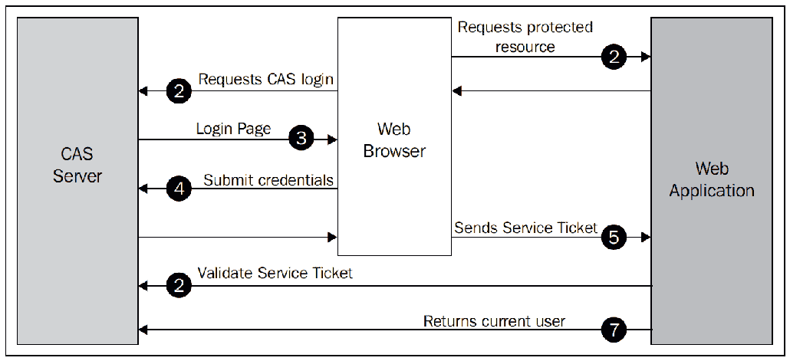
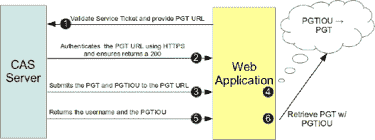

# 使用中央身份验证服务进行单点登录

在本章中，我们将研究如何使用**中央身份验证服务**（**CAS**）作为基于 Spring Security 的应用程序的单一登录门户。

在本章中，我们将介绍以下主题：

*   了解 CAS 及其体系结构，以及它如何使系统管理员和任何规模的组织受益
*   了解如何重新配置 Spring 安全性以处理身份验证请求的拦截并将其重定向到 CAS
*   配置 JBCP 日历应用程序以利用 CAS 单点登录
*   了解如何执行单个注销，并配置应用程序以支持它
*   讨论如何对服务使用 CAS 代理票证身份验证，并将我们的应用程序配置为使用代理票证身份验证
*   讨论如何使用推荐的 war 覆盖方法定制现成的**JA-SIG CAS**服务器
*   将 CAS 服务器与 LDAP 集成，并通过 CAS 将数据从 LDAP 传递给 Spring Security

# 介绍中央认证服务

CAS 是一种开放源代码的单点登录服务器，提供了对组织内基于 web 的资源的集中访问控制和身份验证。CAS 对管理员的好处很多，它支持许多应用程序和不同的用户社区。好处如下：

*   可以在一个位置配置对资源（应用程序）的个人或组访问
*   对各种身份验证存储的广泛支持（以集中用户管理）为广泛的跨机器环境提供了单点身份验证和控制
*   通过 CAS 客户端库为基于 web 和非基于 web 的 Java 应用程序提供了广泛的身份验证支持
*   提供了用户凭证的单一参考点（通过 CAS），因此 CAS 客户端应用程序不需要了解用户凭证，也不需要了解如何验证用户凭证

在本章中，我们将不太关注 CAS 的管理，而是关注身份验证以及 CAS 如何作为站点用户的身份验证点。虽然 CAS 通常出现在企业或教育机构的内部网环境中，但它也可以在索尼在线娱乐面向公众的网站等知名网站上使用。

# 高级 CAS 认证流

在较高级别上，CAS 由 CAS 服务器和一个或多个 CAS 服务组成，前者是确定身份验证的中心 web 应用程序，后者是使用 CAS 服务器进行身份验证的不同 web 应用程序。CAS 的基本身份验证流程通过以下操作进行：

1.  用户尝试访问网站上受保护的资源。
2.  用户通过浏览器从 CAS 服务重定向到 CAS 服务器以请求登录。
3.  CAS 服务器负责用户身份验证。如果用户尚未通过 CAS 服务器的身份验证，则它会向用户请求凭据。在下图中，用户将看到一个登录页面。
4.  用户提交凭据（即用户名和密码）。
5.  如果用户的凭据有效，CAS 服务器将通过浏览器以服务票证重定向来响应。服务票证是用于标识用户的一次性使用令牌。
6.  CAS 服务回调 CAS 服务器以验证票证是否有效、是否已过期等等。请注意，此步骤不会通过浏览器执行。
7.  CAS 服务器响应一个断言，表明信任已建立。如果票据可接受，则信任已建立，用户可通过正常授权检查继续。

从视觉上看，其行为如下图所示：


我们可以看到，CAS 服务器和安全应用程序之间存在高级别的交互，在建立用户信任之前需要进行多次数据交换握手。这种复杂性的结果是单点登录协议很难通过普通技术进行欺骗（假设其他网络安全预防措施，如使用 SSL 和网络监控，已经到位）。

现在我们了解了 CAS 身份验证的一般工作原理，让我们看看它如何应用于 Spring 安全性。

# Spring 安全与 CAS

Spring Security 具有与 CAS 的强大集成能力，尽管它没有像我们在本书后半部分中探讨的 OAuth2 和 LDAP 集成那样紧密集成到安全命名空间样式的配置中。相反，大部分配置依赖于 bean 连接和引用配置，从安全命名空间元素到 bean 声明。

使用 Spring Security 时，CAS 身份验证的两个基本部分涉及以下内容：

*   将标准`AuthenticationEntryPoint`实现（通常处理未经身份验证的用户重定向到登录页面）替换为将用户重定向到 CAS 服务器的实现
*   当用户通过使用自定义 servlet 筛选器从 CAS 服务器重定向回受保护的资源时，处理服务票证

关于 CAS 需要了解的一件重要事情是，在典型部署中，CAS 旨在取代应用程序的所有替代登录机制。因此，一旦我们为 Spring Security 配置了 CAS，我们的用户就必须将 CAS 专门用作应用程序的身份验证机制。在大多数情况下，这不是一个问题；正如我们在上一节中所讨论的，CAS 被设计为将身份验证请求代理到一个或多个身份验证存储（类似于 Spring Security 在委托给数据库或 LDAP 进行身份验证时所做的操作）。从前面的图中，我们可以看到我们的应用程序不再检查自己的身份验证存储来验证用户。相反，它通过使用服务票证来确定用户。然而，正如我们将在后面讨论的，Spring Security 最初仍然需要一个数据存储来确定用户的授权。我们将在本章后面讨论如何取消此限制。

在完成与 Spring Security 的基本 CAS 集成后，我们可以从主页上删除登录链接，并自动重定向到 CAS 的登录屏幕，在那里我们尝试访问受保护的资源。当然，根据应用程序的不同，仍然允许用户显式登录也是有益的（这样他们就可以看到定制的内容，等等）。

# 必需的依赖项

在我们走得太远之前，我们应该确保我们的依赖关系得到更新。可以看到我们添加的依赖项列表，以及关于何时需要它们的注释，如下所示：

```
    //build.gradle

    dependencies {
    // CAS:
    compile('org.springframework.security:spring-security-cas')
    ...
    }
```

# 安装和配置 CAS

CAS 有一个非常敬业的团队支持它，该团队在开发高质量的软件和关于如何使用它的准确、直观的文档方面做了出色的工作。如果您选择遵循本章中的示例，我们鼓励您阅读适用于您的 CAS 平台的入门手册。您可以在[找到本手册 https://apereo.github.io/cas/5.1.x/index.html](https://apereo.github.io/cas/5.1.x/index.html) 。

为了使集成尽可能简单，我们在本章中包括了一个 CAS 服务器应用程序，它可以与日历应用程序一起部署在 Spring 工具套件或 IntelliJ 中。对于本章中的示例，我们假设 CAS 部署在`https://localhost:9443/cas/`处，日历应用程序部署在`https://localhost:8443/`处。为了工作，CAS 需要使用 HTTPS。有关设置 HTTPS 的详细说明，请参阅附录*附加参考资料*。

本章中的示例是使用编写时最新可用的 CAS 服务器版本 5.1.2 编写的。请注意，在 5.x 时间范围内对 CAS 的某些后端类进行了一些重大更改。因此，如果您使用的是早期版本的服务器，则这些说明可能与您的环境略有不同或有显著差异。

让我们继续配置 CAS 身份验证所需的组件。

你应该从`chapter10.00-calendar`和`chapter10.00-cas-server`的来源开始这一章。

# 配置基本 CAS 集成

由于 Spring 安全名称空间不支持 CAS 配置，为了使基本设置正常工作，我们还需要执行很多步骤。为了从更高的层次了解正在发生的事情，您可以参考下图。

现在不必担心理解整个图表，因为我们将把它分成小块，以便于理解：


# 创建 CAS ServiceProperties 对象

Spring 安全设置依赖于`o.s.s.cas.ServiceProperties`bean 来存储有关 CAS 服务的公共信息。`ServiceProperties`对象在协调各种 CAS 组件之间的数据交换中起着重要作用。它被用作数据对象，用于存储由 Spring CAS 堆栈中的不同参与者共享（并期望匹配）的 CAS 配置设置。您可以查看以下代码段中包含的配置：

```
    //src/main/java/com/packtpub/springsecurity/configuration/CasConfig.java

    static{
    System.setProperty("cas.server", "https://localhost:9443/cas");
     System.setProperty("cas.server.login", 
     "https://localhost:9443/cas/login");
    System.setProperty("cas.service", 
     "https://localhost:8443");
    System.setProperty("cas.service.login", 
    "https://localhost:8443/login");
     }
    @Value("#{systemProperties['cas.service.login']}")
    private String calendarServiceLogin;
    @Bean
    public ServiceProperties serviceProperties(){
     return new ServiceProperties(){{
    setService(calendarServiceLogin);
     }};
    }
```

您可能注意到，我们利用系统属性使用名为`${cas.service}`和`${cas.server}`的变量。这两个值都可以包含在应用程序中，Spring 会自动将它们替换为`PropertySources`配置中提供的值。这是部署 CAS 服务时的常见策略，因为随着从开发到生产的过程，CAS 服务器可能会发生变化。在本例中，CAS 服务器默认使用`localhost:9443`，日历应用默认使用`localhost:8443`。当应用程序投入生产时，可以使用系统参数覆盖此配置。或者，可以将配置外部化为 Java 属性文件。这两种机制都允许我们正确地外部化配置。

# 添加 CasAuthenticationEntryPoint 对象

正如我们在本章前面简要提到的，Spring Security 使用`o.s.s.web.AuthenticationEntryPoint`接口向用户请求凭据。通常，这涉及将用户重定向到登录页面。对于 CAS，我们需要重定向 CAS 服务器以请求登录。当我们重定向到 CAS 服务器时，Spring Security 必须包含一个`service`参数，该参数指示 CAS 服务器应该在哪里发送服务票证。幸运的是，Spring Security 提供了`o.s.s.cas.web.CasAuthenticationEntryPoint`对象，它是专门为此目的设计的。示例应用程序中包含的配置如下所示：

```
    //src/main/java/com/packtpub/springsecurity/configuration/CasConfig.java

    @Value("#{systemProperties['cas.server.login']}")
    private String casServerLogin;
    @Bean
    public CasAuthenticationEntryPoint casAuthenticationEntryPoint(){
     return new CasAuthenticationEntryPoint(){{
     setServiceProperties(serviceProperties());
     setLoginUrl(casServerLogin);
     }};
    }
```

`CasAuthenticationEntryPoint`对象使用`ServiceProperties`类指定一旦用户通过身份验证，将服务票证发送到何处。CAS 允许根据配置为每个用户、每个应用程序选择性授予访问权限。稍后，我们将在配置预期处理该 URL 的 servlet 过滤器时检查该 URL 的详细信息。接下来，我们需要更新 Spring 安全性，以利用具有`casAuthenticationEntryPoint`ID 的 bean。对我们的`SecurityConfig.java`文件进行以下更新：

```
    //src/main/java/com/packtpub/springsecurity/configuration/
    SecurityConfig.java

    @Autowired
    private CasAuthenticationEntryPoint casAuthenticationEntryPoint;
    @Override
    protected void configure(HttpSecurity http) throws Exception {
      ...
    // Exception Handling
     http.exceptionHandling()
     .authenticationEntryPoint(casAuthenticationEntryPoint)
     .accessDeniedPage("/errors/403");
    ...
```

最后，我们需要确保`CasConfig.java`文件由 Spring 加载。更新`SecurityConfig.java`文件，如下所示：

```
    //src/main/java/com/packtpub/springsecurity/configuration/
    SecurityConfig.java

    @Configuration
    @EnableWebSecurity(debug = true)
    @EnableGlobalAuthentication
    @Import(CasConfig.class)
    public class SecurityConfig extends WebSecurityConfigurerAdapter {
```

您需要做的最后一件事是删除现有的`UserDetailsService`对象作为`AuthenticationManager`的`userDetailsService`实现，因为`CasAuthenticationEntryPoint`在 SecurityConfig.java 文件中替换了它，所以不再需要它：

```
    src/main/java/com/packtpub/springsecurity/configuration/
    SecurityConfig.java
    @Override
    public void configure(AuthenticationManagerBuilder auth)
    throws Exception {
    super.configure(auth);
    //auth.userDetailsService(userDetailsService)
     // .passwordEncoder(passwordEncoder());
    }
```

如果此时启动应用程序并尝试访问“我的事件”页面，您将立即被重定向到 CAS 服务器进行身份验证。CAS 的默认配置允许对用户名等于密码的任何用户进行身份验证。因此，您应该能够使用用户名`admin1@example.com`和密码`admin1@example.com`（或`user1@example.com`/`user1@example.com`登录。

但是，您会注意到，即使在登录之后，您也会立即被重定向回 CAS 服务器。这是因为，尽管目标应用程序能够接收票据，但无法对其进行验证，因此，`AccessDeniedException`对象由 CAS 处理为票据拒绝。

# 使用 CasAuthenticationProvider 对象证明真实性

如果您在本书的其余部分一直遵循 Spring Security 的逻辑流程，希望您已经知道接下来会发生什么，`Authentication`令牌必须由适当的`AuthenticationProvider`对象进行检查。CAS 也不例外，因此，谜题的最后一块是`AuthenticationManager`中`o.s.s.cas.authentication.CasAuthenticationProvider`对象的配置。

让我们来看看下面的步骤：

1.  首先，我们将在`CasConfig.java`文件中声明 Springbean，如下所示：

```
        //src/main/java/com/packtpub/springsecurity/configuration/
        CasConfig.java

        @Bean
        public CasAuthenticationProvider casAuthenticationProvider() {
           CasAuthenticationProvider casAuthenticationProvider = new
           CasAuthenticationProvider();
           casAuthenticationProvider.setTicketValidator(ticketValidator());
           casAuthenticationProvider.setServiceProperties
           (serviceProperties());
           casAuthenticationProvider.setKey("casJbcpCalendar");
           casAuthenticationProvider.setAuthenticationUserDetailsService(
             userDetailsByNameServiceWrapper);
             return casAuthenticationProvider;
        }
```

2.  接下来，我们将在`SecurityConfig.java`中配置对这个新的`AuthenticationProvider`对象的引用，我们的`AuthenticationManager`声明位于该引用中：

```
        //src/main/java/com/packtpub/springsecurity/configuration/
        SecurityConfig.java

        @Autowired
        private CasAuthenticationProvider casAuthenticationProvider;
        @Override
        public void configure(final AuthenticationManagerBuilder auth)
        throws Exception   
        {
         auth.authenticationProvider(casAuthenticationProvider);
        }
```

3.  如果您在之前的练习中还有任何其他`AuthenticationProvider`参考文献，请记住将其从 CAS 工作中删除。所有这些更改都在前面的代码中进行了说明。现在，我们需要处理`CasAuthenticationProvider`类中的其他属性和 bean 引用。`ticketValidator`属性表示`org.jasig.cas.client.validation.TicketValidator`接口的实现；当我们使用 CAS 3.0 身份验证时，我们将声明一个`org.jasig.cas.client.validation.Cas30ServiceTicketValidator`实例，如下所示：

```
        //src/main/java/com/packtpub/springsecurity/configuration/
        CasConfig.java

        @Bean
        public Cas30ProxyTicketValidator ticketValidator(){
         return new Cas30ProxyTicketValidator(casServer);
        }
```

提供给此类的构造函数参数应该（再次）引用用于访问 CAS 服务器的 URL。您会注意到，此时，我们已经从`org.springframework.security`包转移到`org.jasig`，它是 CAS 客户机 JAR 文件的一部分。在本章后面，我们将看到，`TicketValidator`接口还具有支持 CAS 其他身份验证方法的实现（仍在 CAS 客户端的 JAR 文件中），如代理票证和 SAML 身份验证。

接下来，我们可以看到`key`属性；这只是用来验证`UsernamePasswordAuthenticationToken`的完整性，可以任意定义。

正如我们在[第 8 章](08.html)*中所看到的，TLS*的客户端证书身份验证，`authenticationUserDetailsService`属性是指一个`o.s.s.core.userdetails.AuthenticationUserDetailsService`对象，用于将用户名信息从`Authentication`令牌转换为一个完全填充的`UserDetails`对象。当前实现通过查找 CAS 服务器返回的用户名并使用`UserDetailsService`对象查找`UserDetails`来完成此转换。显然，只有当我们确认`Authentication`令牌的完整性没有受到损害时，才会使用这种技术。我们参考`UserDetailsService`接口的`CalendarUserDetailsService`实现来配置此对象：

```
    //src/main/java/com/packtpub/springsecurity/configuration/CasConfig.java

    @Bean
    public UserDetailsByNameServiceWrapper
    authenticationUserDetailsService(
      final UserDetailsService userDetailsService){
      return new UserDetailsByNameServiceWrapper(){{
      setUserDetailsService(userDetailsService);
      }};
    }
```

您可能想知道`UserDetailsService`接口为什么没有直接引用；这是因为，与 OAuth2 一样，稍后还会有其他高级配置选项，这将允许使用 CAS 服务器的详细信息来填充`UserDetails`对象。

您的代码应该类似于`chapter10.01-calendar`和`chapter10.01-cas-server`。

此时，我们应该能够启动 CAS 服务器和 JBCP 日历应用程序。然后您可以访问`https://localhost:8443/`并选择所有事件，从而将您重定向到 CAS 服务器。然后，您可以使用用户名`admin1@example.com`和密码`admin1@example.com`登录。认证成功后，您将被重定向回 JBCP 日历应用程序。干得好！

如果遇到问题，很可能是由于 SSL 配置不正确造成的。确保您已将信托存储文件设置为`tomcat.keystore`，如附录*附加参考资料*所述。

# 单次注销

您可能会注意到，如果您退出应用程序，您将获得注销确认页面。但是，如果您单击受保护的页面，例如“我的事件”页面，您仍然可以通过身份验证。问题是注销只在本地发生。因此，当您在 JBCP 日历应用程序中请求另一个受保护的资源时，将从 CAS 服务器请求登录。由于用户仍然登录到 CAS 服务器，因此它会立即返回服务票证并将用户重新登录到 JBCP 日历应用程序中。

这还意味着，如果用户已使用 CAS 服务器登录到其他应用程序，它们仍将通过这些应用程序的身份验证，因为我们的日历应用程序对其他应用程序一无所知。幸运的是，CAS 和 Spring 安全性为这个问题提供了解决方案。正如我们可以从 CAS 服务器请求登录一样，我们也可以请求注销。您可以看到 CAS 中注销如何工作的高级图表，如下所示：



以下步骤解释了单个注销是如何发生的：

1.  用户请求注销 web 应用程序。
2.  然后，web 应用程序通过浏览器向 CAS 服务器发送重定向，请求注销 CAS。
3.  CAS 服务器识别用户，然后向每个经过身份验证的 CAS 服务发送注销请求。请注意，这些注销请求不是通过浏览器发出的。
4.  CAS 服务器通过提供用于用户登录的原始服务票证来指示哪个用户应该注销。然后，应用程序负责确保用户已注销。
5.  CAS 服务器向用户显示注销成功页面。

# 配置单次注销

单个注销的配置相对简单：

1.  第一步是在我们的`SecurityConfig.java`文件中指定一个`logout-success-url`属性作为 CAS 服务器的注销 URL。这意味着在本地注销后，我们将自动将用户重定向到 CAS 服务器的注销页面：

```
        //src/main/java/com/packtpub/springsecurity/configuration/
        SecurityConfig.java

        @Value("#{systemProperties['cas.server']}/logout")
        private static String casServerLogout;
        @Override
        protected void configure(final HttpSecurity http)
        throws Exception {
         ...
         http.logout()
        .logoutUrl("/logout")
        .logoutSuccessUrl(casServerLogout)
        .permitAll();
        }
```

由于我们只有一个应用程序，这就是我们所需要的一切，使它看起来好像一个单一的注销正在发生。这是因为我们在重定向到 CAS 服务器注销页面之前注销了日历应用程序。这意味着，当 CAS 服务器向日历应用程序发送注销请求时，用户已经注销。

2.  如果有多个应用程序，并且用户从另一个应用程序注销，CAS 服务器将向日历应用程序发送注销请求，而不处理注销事件。这是因为我们的应用程序没有侦听这些注销事件。解决办法很简单；我们必须创建`SingleSignoutFilter`对象，如下所示：

```
        //src/main/java/com/packtpub/springsecurity/configuration/
        CasConfig.java

        @Bean
        public SingleSignOutFilter singleSignOutFilter() {
           return new SingleSignOutFilter();
        }
```

3.  接下来，我们需要通过将`singleLogoutFilter`对象包含为`<custom-filter>`元素，使 Spring Security 了解`SecurityCOnfig.java`文件中的`singleLogoutFilter`对象。将单个注销过滤器置于常规注销之前，以确保其接收注销事件，如下所示：

```
        //src/main/java/com/packtpub/springsecurity/configuration/
        SecurityConfig.java

        @Autowired
        private SingleSignOutFilter singleSignOutFilter;
        @Override
        protected void configure(HttpSecurity http) throws Exception {
          ...
         http.addFilterAt(casFilter, CasAuthenticationFilter.class);
         http.addFilterBefore(singleSignOutFilter, LogoutFilter.class);
        // Logout
        http.logout()
         .logoutUrl("/logout")
         .logoutSuccessUrl(casServerLogout)
         .permitAll();
        }
```

4.  在正常情况下，我们需要对`web.xml`或`ApplicationInitializer`文件进行一些更新。但是，对于我们的日历应用程序，我们已经对我们的`CasConfig.java`文件进行了如下更新：

```
        //src/main/java/com/packtpub/springsecurity/configuration/
        CasConfig.java

        @Bean
        public ServletListenerRegistrationBean
        <SingleSignOutHttpSessionListener>
        singleSignOutHttpSessionListener() {
          ServletListenerRegistrationBean<SingleSignOutHttpSessionListener> 
          listener = new     
          ServletListenerRegistrationBean<>();
          listener.setEnabled(true);
          listener.setListener(new SingleSignOutHttpSessionListener());
          listener.setOrder(1);
          return listener;
        }
        @Bean
        public FilterRegistrationBean 
        characterEncodingFilterRegistration() {
          FilterRegistrationBean registrationBean = 
          new FilterRegistrationBean
          (characterEncodingFilter());
          registrationBean.setName("CharacterEncodingFilter");
          registrationBean.addUrlPatterns("/*");
          registrationBean.setOrder(1);
          return registrationBean;
        }
        private CharacterEncodingFilter characterEncodingFilter() {
           CharacterEncodingFilter filter = new CharacterEncodingFilter(
             filter.setEncoding("UTF-8");
             filter.setForceEncoding(true);
             return filter;
        }
```

首先，我们添加了`SingleSignoutHttpSessionListener`对象，以确保删除了服务票证到`HttpSession`的映射。我们还按照 JA-SIG 文档的建议添加了`CharacterEncodingFilter`，以确保使用`SingleSignOutFilter`时字符编码正确。

5.  继续并启动应用程序，然后立即尝试注销。您将观察到您实际上已注销。
6.  现在，尝试重新登录并直接访问 CAS 服务器的注销 URL。对于我们的设置，URL 是`https://localhost:9443/cas/logout`。
7.  现在，尝试访问 JBCP 日历应用程序。您将发现，如果不再次验证，您将无法访问应用程序。这表明单次注销是有效的。

您的代码应该类似于`chapter10.02-calendar`和`chapter10.02-cas-server`。

# 集群环境

我们在单个注销的初始图表中没有提到的一件事是如何执行注销。不幸的是，它是通过将服务票证到`HttpSession`的映射存储为内存映射来实现的。这意味着单个注销无法在群集环境中正常工作：


考虑以下情况：

*   用户登录到**集群成员 A**
*   **集群成员 A**验证服务票证
*   然后，它在内存中记住服务票证到用户会话的映射
*   用户请求从**CAS 服务器**注销

**CAS 服务器**向 CAS 服务发送注销请求，**集群成员 B**收到注销请求。它在内存中查找，但没有找到**服务票证 a**的会话，因为它只存在于**集群成员 a**中。这意味着用户尚未成功注销。

寻找此功能的用户可能会考虑查看 JA-Sig-JIRAR 队列和论坛来解决这个问题。事实上，已经在[上提交了一个工作补丁 https://issues.jasig.org/browse/CASC-114](https://issues.jasig.org/browse/CASC-114) 。请记住，在论坛和 JA-SIG JIRA 队列中有许多正在进行的讨论和建议，因此在决定使用哪种解决方案之前，您可能需要四处看看。有关使用 CAS 进行集群的更多信息，请参阅 JA-SIG 在[上的集群文档 https://wiki.jasig.org/display/CASUM/Clustering+CAS](https://wiki.jasig.org/display/CASUM/Clustering+CAS)。

# 无状态服务的代理票证身份验证

使用 CAS 集中身份验证似乎对 web 应用程序相当有效，但如果我们想使用 CAS 调用 web 服务呢？为了支持这一点，CAS 提出了**代理票证**（**PT**的概念。以下是其工作原理图：



在发生以下情况之前，流程与标准 CAS 身份验证相同：

1.  当包含一个称为代理票证回调 URL（**PGT URL**的附加参数时，验证**服务票证**。
2.  **CAS 服务器**通过**HTTPS**调用**PGT URL**，以验证**PGT URL**是否为其声称的内容。与大多数 CA 一样，这是通过执行到适当 URL 的 SSL 握手来完成的。
3.  **CAS 服务器**通过**HTTPS**向**PGT URL**提交**代理授权票证**（**PGT**）和我欠你的（**PGTIOU**的**代理授权票证，以确保票证提交到他们声称的来源。**
4.  **PGT URL**接收两张票据，并且必须存储**PGTIOU**与**PGT**的关联。
5.  **CAS 服务器**最终返回对*步骤 1*中请求的响应，其中包括用户名和**PGTIOU**。
6.  CAS 服务可以使用**PGTIOU**查找**PGT**。

# 配置代理票证身份验证

现在我们了解了 PT 身份验证的工作原理，我们将通过执行以下步骤更新当前配置以获得 PGT：

1.  第一步是添加对`ProxyGrantingTicketStorage`实现的引用。继续并将以下代码添加到我们的`CasConfig.java`文件中：

```
        //src/main/java/com/packtpub/springsecurity/configuration/
        CasConfig.java

       @Bean
       public ProxyGrantingTicketStorage pgtStorage() {
        return new ProxyGrantingTicketStorageImpl();
        }
        @Scheduled(fixedRate = 300_000)
        public void proxyGrantingTicketStorageCleaner(){
          pgtStorage().cleanUp();
        }
```

2.  `ProxyGrantingTicketStorageImpl`实现是 PGTIOU 到 PGT 的内存映射。与注销一样，这意味着在使用此实现的集群环境中会出现问题。请参阅 JA-SIG 文档，以确定如何在集群环境中设置此功能：[https://wiki.jasig.org/display/CASUM/Clustering+中科院。](https://wiki.jasig.org/display/CASUM/Clustering+CAS)

3.  我们还需要通过调用`cleanUp()`方法定期清理`ProxyGrantingTicketStorage`。正如您所看到的，Spring 的任务抽象使得这非常简单。您可以考虑调整配置以清除 OLE T2^，在一个对环境有意义的单独的线程池中。有关更多信息，请参阅 Spring 框架参考文档的[中的*任务执行*和*调度*部分 http://static.springsource.org/spring/docs/current/spring-framework-reference/html/scheduling.html](http://static.springsource.org/spring/docs/current/spring-framework-reference/html/scheduling.html) 。
4.  现在我们需要使用我们刚刚创建的`ProxyGrantingTicketStorage`。我们只需要更新`ticketValidator`方法来引用我们的存储并了解 PGT URL。对`CasConfig.java`进行以下更新：

```
        //src/main/java/com/packtpub/springsecurity/configuration/
        CasConfig.java

        @Value("#{systemProperties['cas.calendar.service']}/pgtUrl")
        private String calendarServiceProxyCallbackUrl;
        @Bean
        public Cas30ProxyTicketValidator ticketValidator(){
          Cas30ProxyTicketValidator tv = new 
          Cas30ProxyTicketValidator(casServer);
          tv.setProxyCallbackUrl(calendarServiceProxyCallbackUrl);
          tv.setProxyGrantingTicketStorage(pgtStorage());
          return tv;
            }
```

5.  我们需要进行的最后一次更新是对`CasAuthenticationFilter`对象进行更新，以便在调用 PGT URL 时将 PGTIOU 存储到`ProxyGrantingTicketStorage`实现中的 PGT 映射。确保`proxyReceptorUrl`属性与`Cas20ProxyTicketValidator`对象的`proxyCallbackUrl`属性相匹配，以确保 CAS 服务器将票据发送到我们的应用程序所列出的 URL，这一点至关重要。对`security-cas.xml`进行以下更改：

```
        //src/main/java/com/packtpub/springsecurity/configuration/
        CasConfig.java

        @Bean
        public CasAuthenticationFilter casFilter() {
           CasAuthenticationFilter caf = new CasAuthenticationFilter();
        caf.setAuthenticationManager(authenticationManager);
        caf.setFilterProcessesUrl("/login");
        caf.setProxyGrantingTicketStorage(pgtStorage());
        caf.setProxyReceptorUrl("/pgtUrl");
         return caf;
        }
```

既然有了 PGT，我们该怎么办？服务票是一次性使用的代币。然而，PGT 可用于生产 PT。让我们看看如何使用 PGT 创建 PT。

您将看到，`proxyCallBackUrl`属性与上下文相对`proxyReceptorUrl`属性路径的绝对路径相匹配。由于我们正在将基础应用程序部署到`https://${cas.service }/`，我们的`proxyReceptor`URL 的完整路径将是`https://${cas.service }/pgtUrl`。

# 使用代理票据

现在，我们可以使用我们的 PGT 创建一个 PT 来向服务验证它。实现这一点的代码在本章中包含的`EchoController`类中进行了非常简单的演示。您可以在下面的代码片段中看到它的相关部分。有关更多详细信息，请参阅示例的源代码：

```
    //src/main/java/com/packtpub/springsecurity/web/controllers/
    EchoController.java

    @ResponseBody
   @RequestMapping("/echo")
    public String echo() throws UnsupportedEncodingException {
      final CasAuthenticationToken token = (CasAuthenticationToken)
     SecurityContextHolder.getContext().getAuthentication();
    final String proxyTicket = token.getAssertion().getPrincipal()
    .getProxyTicketFor(targetUrl);
    return restClient.getForObject(targetUrl+"?ticket={pt}",
    String.class, proxyTicket);
    }
```

此控制器是一个人为的示例，它将获得一个 PT，该 PT 将用于验证 RESTful 调用，以获取当前登录用户的所有事件。然后将 JSON 响应写入页面。可能会让一些用户感到困惑的是，`EchoController`对象实际上正在对同一应用程序中的`MessagesController`对象进行 RESTful 调用。这意味着日历应用程序对自身进行 RESTful 调用[。](https://localhost:8443/calendar/rest-client)

继续访问`https://localhost:8443/echo`查看它的实际操作。该页面看起来很像 CAS 登录页面（除去 CSS）。这是因为控制器试图回显 My Events 页面，而我们的应用程序还不知道如何对 PT 进行身份验证。这意味着它被重定向到 CAS 登录页面。让我们看看如何验证代理票证。

您的代码应该类似于`chapter10.03-calendar`和`chapter10.03-cas-server`。

# 验证代理票据

让我们看看下面的步骤来学习如何认证代理票：

1.  我们首先需要告诉`ServiceProperties`对象，我们想要验证所有票据，而不仅仅是提交给`filterProcessesUrl`属性的票据。对`CasConfig.java`进行以下更新：

```
        //src/main/java/com/packtpub/springsecurity/configuration/
        CasConfig.java

        @Bean
        public ServiceProperties serviceProperties(){
          return new ServiceProperties(){{
             setService(calendarServiceLogin);
             setAuthenticateAllArtifacts(true);
          }};
        }
```

2.  然后，我们需要更新`CasAuthenticationFilter`对象，让它知道我们想要验证所有工件（即票据），而不是只侦听特定的 URL。我们还需要使用一个`AuthenticationDetailsSource`接口，在验证任意 URL 上的代理票证时，该接口可以动态提供 CAS 服务 URL。这一点很重要，因为当 CAS 服务询问票证是否有效时，它还必须提供用于创建票证的 CAS 服务 URL。因为代理票证可以出现在任何 URL 上，所以我们必须能够动态地发现这个 URL。这是通过利用`ServiceAuthenticationDetailsSource`对象实现的，该对象将从 HTTP 请求中提供当前 URL：

```
        //src/main/java/com/packtpub/springsecurity/configuration/
        CasConfig.java

        @Bean
        public CasAuthenticationFilter casFilter() {
          CasAuthenticationFilter caf = new CasAuthenticationFilter();
          caf.setAuthenticationManager(authenticationManager);
          caf.setFilterProcessesUrl("/login");
          caf.setProxyGrantingTicketStorage(pgtStorage());
          caf.setProxyReceptorUrl("/pgtUrl");
          caf.setServiceProperties(serviceProperties());
          caf.setAuthenticationDetailsSource(new        
          ServiceAuthenticationDetailsSource(serviceProperties())
        );
         return caf;
        }
```

3.  我们还需要确保使用的是`Cas30ProxyTicketValidator`对象，而不是`Cas30ServiceTicketValidator`实现，并指出我们要接受哪些代理票证。我们会将我们的配置为接受来自任何 CAS 服务的代理票证。在生产环境中，您将要考虑仅将自己局限于那些被信任的 CAS 服务：

```
        //src/main/java/com/packtpub/springsecurity/configuration/
        CasConfig.java

        @Bean
        public Cas30ProxyTicketValidator ticketValidator(){
          Cas30ProxyTicketValidator tv = new 
          Cas30ProxyTicketValidator(casServer);
          tv.setProxyCallbackUrl(calendarServiceProxyCallbackUrl);
```

```
          tv.setProxyGrantingTicketStorage(pgtStorage());
          tv.setAcceptAnyProxy(true);
          return tv;
        }
```

4.  最后，我们希望为我们的`CasAuthenticationProvider`对象提供一个缓存，这样我们就不需要在每次调用我们的服务时都点击 CAS 服务：

```
        //src/main/java/com/packtpub/springsecurity/configuration/
        CasConfig.java

        @Bean
        public CasAuthenticationProvider casAuthenticationProvider() {
         CasAuthenticationProvider cap = new CasAuthenticationProvider();
         cap.setTicketValidator(ticketValidator());
         cap.setServiceProperties(serviceProperties());
         cap.setKey("casJbcpCalendar");
         cap.setAuthenticationUserDetailsService
         (userDetailsByNameServiceWrapper);
         cap.setStatelessTicketCache(ehCacheBasedTicketCache());
         return cap;
       }
      @Bean
      public EhCacheBasedTicketCache ehCacheBasedTicketCache() {
        EhCacheBasedTicketCache cache = new EhCacheBasedTicketCache();
        cache.setCache(ehcache());
        return cache;
      }
     @Bean(initMethod = "initialise", destroyMethod = "dispose")
     public Cache ehcache() {
       Cache cache = new Cache("casTickets", 50, true, false, 3_600,  900);
       return cache;
     }
```

5.  正如您可能已经怀疑的那样，缓存需要我们在本章开头提到的`ehcache`依赖关系。继续并启动应用程序备份，然后再次访问`https://localhost:8443/echo`。这一次，您应该看到对调用 My Events 页面的 JSON 响应。

您的代码应该类似于`chapter10.04-calendar`和`chapter10.04-cas-server`。

# 自定义 CAS 服务器

本节中的所有更改都将应用于 CAS 服务器，而不是日历应用程序。本节仅介绍如何配置 CAS 服务器，因为详细的设置肯定超出了本书的范围。与日历应用程序的更改一样，我们鼓励您遵循本章中的更改。有关更多信息，您可以参考位于[的 JA-SIG CAS 维基百科页面 https://wiki.jasig.org/display/CAS/Home](https://wiki.jasig.org/display/CAS/Home) 。

# CAS 战争覆盖图

定制 CAS 的首选方法是使用 Maven 或 Gradle War 覆盖。通过这种机制，您可以更改从 UI 到 CAS 服务器进行身份验证的方法的所有内容。战争覆盖的概念很简单。您添加一个 WAR 覆盖`cas-server-webapp`作为依赖项，然后提供将与现有 WAR 覆盖合并的其他文件。有关 CAS WAR 覆盖的更多信息，请参阅[上的 JA-SIG 文档 https://wiki.jasig.org/display/CASUM/Best+练习+-+设置+设置+CAS+本地+使用+Maven2+战争+叠加+方法](https://wiki.jasig.org/display/CASUM/Best+Practice+-+Setting+Up+CAS+Locally+using+the+Maven2+WAR+Overlay+Method)。

# CAS 内部身份验证如何工作？

在进入 CAS 配置之前，我们将简要说明 CAS 身份验证处理的标准行为。下图应帮助您遵循允许 CAS 与嵌入式 LDAP 服务器对话所需的配置步骤：


虽然前面的图描述了 CAS 服务器本身内部的身份验证流程，但如果您正在实现 Spring Security 和 CAS 之间的集成，则可能还需要调整 CAS 服务器的配置。因此，了解 CAS 身份验证在高级别上的工作方式非常重要。

CAS 服务器的`org.jasig.cas.authentication.AuthenticationManager`接口（不要与同名的 Spring 安全接口混淆）负责根据提供的凭证对用户进行身份验证。与 Spring Security 一样，凭证的实际处理被委托给实现`org.jasig.cas.authentication.handler.AuthenticationHandler`接口的一个（或多个）处理类（我们认识到 Spring Security 中的类似接口是`AuthenticationProvider`。

最后，使用`org.jasig.cas.authentication.principal.CredentialsToPrincipalResolver`接口将传递的凭证转换为完整的`org.jasig.cas.authentication.principal.Principal`对象（Spring Security 中类似的行为在`UserDetailsService`的实现过程中发生）。

虽然没有全面回顾 CAS 服务器的幕后功能，但这将有助于您理解接下来几个练习中的配置步骤。我们鼓励您阅读 CAS 的源代码，并查阅 JA-SIG CAS Wikipedia 页面[上的基于 web 的文档 http://www.ja-sig.org/wiki/display/CAS](http://www.ja-sig.org/wiki/display/CAS) 。

# 配置 CAS 以连接到嵌入式 LDAP 服务器

默认情况下，配置了 CAS 的`org.jasig.cas.authentication.principal.UsernamePasswordCredentialsToPrincipalResolver`对象不允许我们传回属性信息并演示 Spring Security CAS 集成的这一功能，因此我们建议使用一个允许这一功能的实现。

一个易于配置和使用的身份验证处理程序是`org.jasig.cas.adaptors.ldap.BindLdapAuthenticationHandler`，它与我们在上一章中使用的嵌入式 LDAP 服务器进行通信（特别是如果您已经完成了上一章的 LDAP 练习）。在下面的指南中，我们将引导您完成返回用户 LDAP 属性的 CAS 的配置。

所有 CAS 配置都将在 CAS 安装的`WEB-INF/deployerConfigContext.xml`文件中进行，并且通常涉及将类声明插入到已经存在的配置文件段中。我们已经从`cas-server-webapp`中提取了默认的`WEB-INF/deployerConfigContext.xml`文件，并将其放置在`cas-server/src/main/webapp/WEB-INF`中。

如果您对该文件的内容很熟悉，那是因为 CAS 使用 Spring 框架进行配置，就像 JBCP 日历一样！如果您想深入了解这些配置设置的作用，我们建议您使用一个好的 IDE，并方便地参考 CAS 源代码。请记住，在本节以及我们提到的所有章节`WEB-INF/deployerConfigContext.xml`中，我们指的是 CAS 安装，而不是 JBCP 日历。

让我们来看看下面的步骤：

1.  首先，我们将添加一个新的`BindLdapAuthenticationHandler`对象来代替`SimpleTestUsernamePasswordAuthenticationHandler`对象，该对象将尝试将用户绑定到 LDAP（就像我们在[第 6 章](06.html)、*LDAP 目录服务*中所做的那样）。
2.  `AuthenticationHandler`接口将放置在`authenticationManager`bean 的`authenticationHandlers`属性中：

```
        //cas-server/src/main/webapp/WEB-INF/deployerConfigContext.xml

        <property name="authenticationHandlers">
        <list>
         ... remove ONLY
        SimpleTestUsernamePasswordAuthenticationHandler ...
        <bean class="org.jasig.cas.adaptors
        .ldap.BindLdapAuthenticationHandler">
        <property name="filter" value="uid=%u"/>
        <property name="searchBase" value="ou=Users"/>
        <property name="contextSource" ref="contextSource"/>
         </bean>
        </list>
        </property>
```

不要忘记删除对`SimpleTestUsernamePasswordAuthenticationHandler`对象的引用，或者至少将其定义移到`BindLdapAuthenticationHandler`对象的引用之后，否则，您的 CAS 身份验证将不会使用 LDAP，而是使用存根处理程序！

3.  您会注意到 bean 引用了一个`contextSource`bean；这定义了`org.springframework.ldap.core.ContextSource`实现，CAS 将使用该实现与 LDAP 交互（是的，CAS 也使用 SpringLDAP）。我们将在文件末尾使用 Spring 安全命名空间定义它，以简化其定义，如下所示：

```
    //cas-server/src/main/webapp/WEB-INF/deployerConfigContext.xml

    <sec:ldap-server id="contextSource"  
     ldif="classpath:ldif/calendar.ldif" root="dc=jbcpcalendar,dc=com" />
    </beans>
```

这将创建一个嵌入式 LDAP 实例，该实例使用本章中包含的`calendar.ldif`文件。当然，在生产环境中，您可能希望指向真正的 LDAP 服务器。

4.  最后，我们需要配置一个新的`org.jasig.cas.authentication.principal.CredentialsToPrincipalResolver`对象。这负责将用户提供的凭证（CAS 已经使用`BindLdapAuthenticationHandler`对象进行了身份验证）转换为完整的`org.jasig.cas.authentication.principal.Principal`身份验证主体。您会注意到这个类中有许多配置选项，我们将略过这些选项。欢迎您在进一步探索 CAS 时深入了解它们。
5.  删除`UsernamePasswordCredentialsToPrincipalResolver`并将以下 bean 定义内联添加到 CAS`authenticationManager`bean 的`credentialsToPrincipalResolvers`属性中：

```
        //cas-server/src/main/webapp/WEB-INF/deployerConfigContext.xml

       <property name="credentialsToPrincipalResolvers">
        <list>
        <!-- REMOVE UsernamePasswordCredentialsToPrincipalResolver -->
        <bean class="org.jasig.cas.authentication.principal
        .HttpBasedServiceCredentialsToPrincipalResolver" />
        <bean class="org.jasig.cas.authentication.principal
        .CredentialsToLDAPAttributePrincipalResolver">
        <property name="credentialsToPrincipalResolver">
        <bean class="org.jasig.cas.authentication.principal
        .UsernamePasswordCredentialsToPrincipalResolver"/>
        </property>
        <property name="filter" value="(uid=%u)"/>
        <property name="principalAttributeName" value="uid"/>
        <property name="searchBase" value="ou=Users"/>
        <property name="contextSource" ref="contextSource"/>
        <property name="attributeRepository" ref="attributeRepository"/>
        </bean>
        </list>
        </property>
```

您会注意到，与 SpringSecurityLDAP 配置一样，CAS 中也存在许多相同的行为，主体根据 DN 在目录子树下的属性匹配上进行搜索。

注意，我们自己还没有配置 ID 为`attributeRepository`的 bean，这应该是`org.jasig.services.persondir.IPersonAttributeDao`的实现。CAS 附带了一个默认配置，其中包括该接口的一个简单实现`org.jasig.services.persondir.support.StubPersonAttributeDao`，在我们在后面的练习中配置基于 LDAP 的属性之前，该配置已经足够了。

您的代码应该类似于`chapter10.05-calendar`和`chapter10.05-cas-server`。

现在，我们已经在 CAS 中配置了基本 LDAP 身份验证。此时，您应该能够重新启动 CAS，启动 JBCP 日历（如果尚未运行），并使用`admin1@example.com`/`admin`或`user1@example.com/user1`对其进行身份验证。继续尝试，看看它是否有效。如果不起作用，请尝试检查日志并将您的配置与示例配置进行比较。

如[第 5 章](05.html)*使用 Spring 数据进行身份验证*中所述，无论名为`apacheds-spring-security`的临时目录是否仍然存在，启动应用程序时可能会遇到问题。如果应用程序似乎不存在，请检查日志并查看是否需要删除`apacheds-spring-security`目录。

# 从 CAS 断言获取 UserDetails 对象

到目前为止，我们一直在通过从`InMemoryUserDetailsManager`对象获取角色来使用 CAS 进行身份验证。但是，我们可以从 CAS 断言创建`UserDetails`对象，就像我们对 OAuth2 所做的那样。第一步是配置 CAS 服务器以返回附加属性。

# 在 CAS 响应中返回 LDAP 属性

我们知道 CAS 可以在 CAS 响应中返回用户名，但也可以在 CAS 响应中返回任意属性。让我们看看如何更新 CAS 服务器以返回其他属性。同样，本节中的所有更改都在 CAS 服务器中，而不是在日历应用程序中。

# 将 LDAP 属性映射到 CAS 属性

第一步要求我们将 LDAP 属性映射到 CAS 断言中的属性（包括`role`属性，我们希望它包含用户的`GrantedAuthority`。

我们将向 CAS`deployerConfigContext.xml`文件添加另一位配置。需要这个新的配置位来指导 CAS 如何将属性从 CAS`Principal`对象映射到 CAS`IPersonAttributes`对象，该对象最终将被序列化为票证验证的一部分。此 bean 配置应替换相同名称的 bean，即`attributeRepository`-如下所示：

```
    //cas-server/src/main/webapp/WEB-INF/deployerConfigContext.xml

    <bean id="attributeRepository" class="org.jasig.services.persondir
    .support.ldap.LdapPersonAttributeDao">
    <property name="contextSource" ref="contextSource"/>
    <property name="requireAllQueryAttributes" value="true"/>
    <property name="baseDN" value="ou=Users"/>
    <property name="queryAttributeMapping">
    <map>
     <entry key="username" value="uid"/>
    </map>
     </property>
    <property name="resultAttributeMapping">
    <map>
    <entry key="cn" value="FullName"/>
    <entry key="sn" value="LastName"/>
    <entry key="description" value="role"/>
    </map>
    </property>
    </bean>
```

这里的幕后功能从本质上来说确实令人困惑，这个类的目的是将`Principal`映射回 LDAP 目录。（这是将`Principal`的`username`字段映射到 LDAP 查询中的`uid`属性的`queryAttributeMapping`属性。）使用 LDAP 查询（`uid=user1@example.com`搜索提供的`baseDN`JavaBean 属性，并从匹配条目中读取属性。使用`resultAttributeMapping`属性中的键/值对将属性映射回`Principal`。我们认识到 LDAP 的`cn`和`sn`属性被映射到有意义的名称，`description`属性被映射到将用于确定用户授权的角色。

部分复杂性来自于这样一个事实，即该功能的一部分被封装在一个名为`Person Directory`（[的单独项目中 http://www.ja-sig.org/wiki/display/PD/Home](http://www.ja-sig.org/wiki/display/PD/Home) ），旨在将一个人的多个信息源聚合到一个视图中。`Person Directory`的设计不直接绑定到 CAS 服务器，可以作为其他应用程序的一部分重用。这种设计选择的缺点是，它使 CAS 配置的某些方面比最初看起来需要的更复杂。

排除 CAS
中的 LDAP 属性映射问题我们希望在 LDAP 中设置与[第 6 章](06.html)、*LDAP 目录服务*中的 Spring Security LDAP 相同的查询类型，以便能够将`Principal`映射到完整的 LDAP 可分辨名称，然后根据`groupOfUniqueNames`条目的`uniqueMember`属性进行匹配，使用该 DN 查找组成员资格。不幸的是，CAS-LDAP 代码还没有这种灵活性，这导致了更高级的 LDAP 映射需要扩展到 CAS 中的基类的结论。

# 授权 CAS 服务访问自定义属性

接下来，我们需要通过 HTTPS 授权任何 CAS 服务来访问这些属性。为此，我们可以更新`RegisteredServiceImpl`，在`InMemoryServiceRegistryDaoImpl`中有`Only Allows HTTPS URLs`的描述，如下所示：

```
    //cas-server/src/main/webapp/WEB-INF/deployerConfigContext.xml

    <bean class="org.jasig.cas.services.RegisteredServiceImpl">
      <property name="id" value="1" />
      <property name="name" value="HTTPS" />
      <property name="description" value="Only Allows HTTPS Urls" />
      <property name="serviceId" value="https://**" />
      <property name="evaluationOrder" value="10000002" />
      <property name="allowedAttributes">
      <list>
        <value>FullName</value>
        <value>LastName</value>
        <value>role</value>
     </list>
    </property>
    </bean>
```

# 从 CAS 获取用户详细信息

当我们第一次使用 Spring Security 设置 CAS 集成时，我们配置了`UserDetailsByNameServiceWrapper`，它只是将提供给 CAS 的用户名从我们引用的`UserDetailsService`转换成`UserDetails`对象（在我们的例子中，它是`InMemoryUserDetailsManager`）。既然 CAS 正在引用 LDAP 服务器，我们可以设置`LdapUserDetailsService`，正如我们在[第 6 章](06.html)末尾所讨论的，*LDAP 目录服务*，一切都会正常进行。请注意，我们已切换回修改日历应用程序，而不是 CAS 服务器。

# GrantedAuthorityFromAssertionAttributesUser 对象

现在我们已经修改了 CAS 服务器以返回自定义属性，我们将试验 Spring Security CAS 集成的另一个功能，即从 CAS 断言本身填充`UserDetails`的功能！这实际上就像将`AuthenticationUserDetailsService`实现切换到`o.s.s.cas.userdetails.GrantedAuthorityFromAssertionAttributesUserDetailsService`对象一样简单，其任务是读取 CAS 断言，查找某个属性，并为用户将该属性的值直接映射到`GrantedAuthority`对象。假设有一个名为 role 的属性将随断言一起返回。我们只需在`CaseConfig.xml`文件中配置一个新的`authenticationUserDetailsService`bean（确保替换先前定义的`authenticationUserDetailsService`bean）：

```
    //src/main/java/com/packtpub/springsecurity/configuration/CasConfig.java

    @Bean
    public AuthenticationUserDetailsService userDetailsService(){
       GrantedAuthorityFromAssertionAttributesUserDetailsService uds
       = new GrantedAuthorityFromAssertionAttributesUserDetailsService(
       new String[]{"role"}
    );
     return uds;
    }
```

您还需要从我们的`SecurityConfig.java`文件中删除`userDetailsService`bean，因为它不再需要了。

# 使用 SAML 1.1 的备选票证身份验证

**安全断言标记语言**（**SAML**是一种标准的跨平台协议，用于使用结构化 XML 断言进行身份验证。SAML 由多种产品支持，包括 CAS（事实上，我们将在后面的一章中讨论 Spring Security 本身对 SAML 的支持）。

虽然可以扩展标准 CAS 协议以返回属性，但 SAML 安全断言 XML 方言使用我们前面描述的 CAS 响应协议解决了属性传递的一些问题。令人高兴的是，在 CAS 票证验证和 SAML 票证验证之间切换就像更改在`CasSecurity.java`中配置的`TicketValidator`实现一样简单。修改`ticketValidator`，如下：

```
    //src/main/java/com/packtpub/springsecurity/configuration/CasConfig.java

    @Bean
    public Saml11TicketValidator ticketValidator(){
      return new Saml11TicketValidator(casServer);
    }
```

您将注意到不再有对 PGT URL 的引用。这是因为`Saml11TicketValidator`对象不支持 PGT。虽然两者都可能存在，但我们选择删除对代理票证身份验证的任何引用，因为我们将不再使用代理票证身份验证。如果你不想从这个练习中删除它，不要担心；只要您的`ticketValidator`bean ID 看起来与前面的代码片段相似，它就不会阻止我们的应用程序运行。

一般来说，建议在 CAS 2.0 票证验证之上使用 SAML 票证验证，因为它增加了更多的不可否认性功能，包括`timestamp`验证，并以标准方式解决属性问题。

重新启动 CAS 服务器和 JBCP 日历应用程序。然后您可以访问`https://localhost:8443`并看到我们的日历应用程序可以从 CAS 响应中获得`UserDetails`。

您的代码现在应该看起来像`chapter10.06-calendar`和`chapter10.06-cas-server`。

# 属性检索如何有用？

请记住，CAS 为我们的应用程序提供了一个抽象层，消除了我们的应用程序直接访问用户存储库的能力，而是强制通过 CAS 作为代理执行所有此类访问。

这是非常强大的！这意味着我们的应用程序不再关心用户存储在什么类型的存储库中，也不必担心如何访问它们的细节。这只是确认了使用 CAS 的身份验证足以证明用户应该能够访问我们的应用程序。对于系统管理员来说，这意味着如果要重命名、移动或以其他方式调整 LDAP 服务器，他们只需要在单个位置重新配置它。通过 CAS 集中访问允许在组织的整体安全体系结构中实现高度的灵活性和适应性。

这个故事讲述了从 CAS 检索属性的有用性；现在，所有通过 CAS 认证的应用程序都具有相同的用户视图，并且可以在任何启用 CAS 的环境中一致地显示信息。

请注意，经过身份验证后，Spring Security CAS 不需要 CAS 服务器，除非用户需要重新身份验证。这意味着在用户的`Authentication`对象中本地存储在应用程序中的属性和其他用户信息可能会随着时间的推移变得过时，并且可能与源 CAS 服务器不同步。注意适当设置会话超时以避免此潜在问题！

# 其他 CAS 功能

除了通过 Spring Security CAS 包装器公开的配置功能外，CAS 还提供了其他高级配置功能。其中一些功能包括以下功能：

*   为在 CAS 服务器上可配置的时间窗口内访问多个 CAS 安全应用程序的用户提供透明的单点登录。应用程序可以通过在`TicketValidator`上将`renew`属性设置为`true`来强制用户对 CAS 进行身份验证；如果用户试图访问应用程序的高度安全区域，您可能希望在自定义代码中有条件地设置此属性。
*   用于获取服务票证的 RESTful API。
*   JA-SIG 的 CAS 服务器也可以充当 OAuth2 服务器。仔细想想，这是有道理的，因为 CAS 与 OAuth2 非常相似。
*   为 CAS 服务器提供 OAuth 支持，以便它可以获得对委托 OAuth 提供者（即 Google）的访问令牌，或者 CAS 服务器可以是 OAuth 服务器本身。

我们鼓励您探索 CAS 客户端和服务器的全部功能，并在 JA-SIG 社区论坛上向有帮助的人提问！

# 总结

在本章中，我们了解了 CAS 单点登录门户以及如何将其与 Spring Security 集成，还介绍了 CAS 体系结构和支持 CAS 的环境中参与者之间的通信路径。我们还看到了支持 CAS 的应用程序对应用程序开发人员和系统管理员的好处。我们还了解了如何配置 JBCP 日历以与基本 CAS 安装交互。我们还介绍了 CAS 的单次注销支持的使用。

我们还了解了代理票证身份验证的工作原理以及如何利用它对无状态服务进行身份验证。
我们还介绍了更新 CAS 以与 LDAP 交互的任务，以及与支持 CAS 的应用程序共享 LDAP 数据的任务。我们甚至学习了如何使用行业标准 SAML 协议实现属性交换。

我们希望本章是对单点登录世界的有趣介绍。市场上还有许多其他单点登录系统，大部分是商用的，但 CAS 绝对是开源 SSO 世界的领导者之一，也是在任何组织中构建 SSO 功能的优秀平台。

在下一章中，我们将了解有关 Spring 安全授权的更多信息。