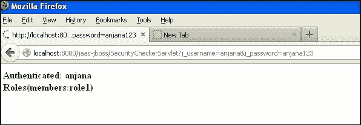
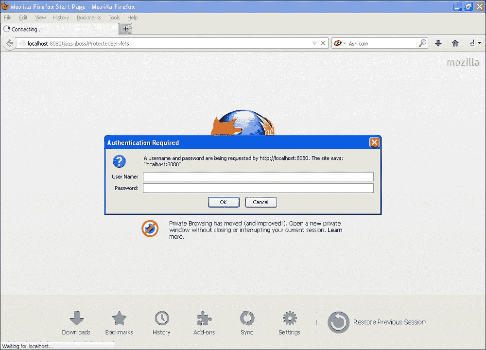
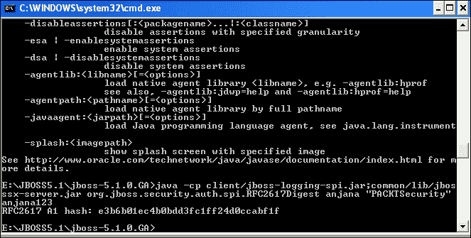

# 第一章基本安全

在本章中，我们将介绍：

*   基于 JAAS 的 JSP 安全认证
*   基于 JAAS 的 servlet 安全认证
*   基于容器的 servlet 基本认证
*   基于 servlet 的表单认证
*   使用开放式 LDAP 和 servlet 进行基于表单的身份验证
*   servlet 上的哈希/摘要身份验证
*   JAX-WS 和 JAX-RS 的基本身份验证
*   启用和禁用文件列表

# 导言

身份验证和授权已成为所有 web 应用程序的主要部分。身份验证包括检查谁正在访问应用程序。授权是检查用户访问权限的过程。在本机方法中，我们通常将用户信息存储在数据库中，并在应用程序中编写代码。我们还为用户创建角色并进行映射。在这里，它与应用程序紧密耦合，因为当我们连接到新数据库或使用任何其他工具（如 LDAP 或 Kerbose）时，我们必须重写整个代码。但是有一些高级选项可以处理身份验证和授权。J2EE 容器通过配置 XML 文件提供了对用户进行身份验证的不同方法。我们可以将身份验证分为两种类型，即基于容器的身份验证和授权以及应用程序级的身份验证和授权。

J2EE 容器提供接口和类来提供身份验证。在本章中，我们可以看到如何使用 JAAS、基本身份验证和基于表单的身份验证对用户进行身份验证。

在本书中，我们使用了 JAAS，因为它是身份验证的标准框架。JAAS 在**PAM**（**可插拔认证模块**框架上工作。

可以通过以下方式提供身份验证和授权：

*   基本身份验证：在这种技术中，应用服务器提供一个带有用户名和密码文本框的登录表单，因此您不必自己创建登录页面。您还将知道呼叫者身份。
*   基于表单的身份验证：在这种技术中，容器处理身份验证，但登录表单由用户作为 JSP 页面提供。
*   基于摘要的身份验证：在这种方法中，用户凭证通过某些算法进行散列。
*   基于证书的身份验证：在这种技术中，客户端和服务器交换证书以验证其身份。获得 SSL 证书可以确保网络上的数据传输安全。

# 基于 JAAS 的 JSP 安全认证

部署描述符是所有 web 应用程序的主配置文件。在启动任何应用程序之前，容器首先查找部署描述符。

部署描述符是一个 XML 文件`web.xml`，位于`WEB-INF`文件夹中。

如果您查看`web.xml`文件的 XSD，您可以看到与安全相关的模式。

可使用以下 URL 访问架构：[http://java.sun.com/xml/ns/j2ee/web-app_2_4.xsd](http://java.sun.com/xml/ns/j2ee/web-app_2_4.xsd) 。

以下是 XSD 中可用的模式元素：

```java
<xsd:element name="security-constraint" type="j2ee:security-constraintType"/>
<xsd:element name="login-config" type="j2ee:login-configType"/>
<xsd:element name="security-role "type="j2ee:security-roleType"/>
```

## 准备好了吗

您需要以下内容来演示身份验证和授权：

*   JBoss7
*   月食靛蓝 3.7
*   创建动态 web 项目并将其命名为`Security Demo`
*   创建一个包，`com.servlets`
*   在`WebContent`文件夹`jboss-web.xml`中创建一个 XML 文件
*   创建两个 JSP 页面`login.jsp`和`logoff.jsp`

## 怎么做。。。

执行以下步骤，实现 JSP 基于 JAAS 的安全：

1.  Edit the `login.jsp` file with the input fields `j_username`, `j_password`, and submit it to `SecurityCheckerServlet`:

    ```java
    <%@ page contentType="text/html; charset=UTF-8" %>
    <%@ page language="java" %>
    <html >
      <HEAD>
        <TITLE>PACKT Login Form</TITLE>
        <SCRIPT>
          function submitForm() {
            var frm = document. myform;
            if( frm.j_username.value == "" ) {
              alert("please enter your username, its empty");
              frm.j_username.focus();
              return ;
            }

            if( frm.j_password.value == "" ) {
              alert("please enter the password,its empty");
              frm.j_password.focus();
              return ;
            }
            frm.submit();
          }
        </SCRIPT>
      </HEAD>
      <BODY>
        <FORM name="myform" action="SecurityCheckerServlet" METHOD=get>
        <TABLE width="100%" border="0" cellspacing="0" cellpadding="1" bgcolor="white">
        <TABLE width="100%" border="0" cellspacing="0" cellpadding="5">
        <TR align="center">
        <TD align="right" class="Prompt"></TD>
        <TD align="left">
          <INPUT type="text" name="j_username" maxlength=20>
        </TD>
        </TR>
        <TR align="center">
        <TD align="right" class="Prompt"> </TD>
        <TD align="left">
        <INPUT type="password"name="j_password" maxlength=20 >
        <BR>
        <TR align="center">
        <TD align="right" class="Prompt"> </TD>
        <TD align="left">
        <input type="submit" onclick="javascript:submitForm();" value="Login">
        </TD>
        </TR>
        </TABLE>
        </FORM>
      </BODY>
    </html>
    ```

    `j_username`和`j_password`是使用基于表单的身份验证的指标。

2.  让我们修改`web.xml`文件以保护所有以`.jsp`结尾的文件。如果您试图访问任何 JSP 文件，您将获得一个登录表单，该表单反过来调用一个`SecurityCheckerServlet`文件来验证用户。您还可以看到显示的角色信息。更新`web.xml`文件，如下代码段所示。我们使用了`2.5 xsd`。以下代码需要放置在`web.xml`文件中的`webapp`标记之间：

    ```java
    <display-name>jaas-jboss</display-name>
     <welcome-file-list>
        <welcome-file>index.html</welcome-file>
        <welcome-file>index.htm</welcome-file>
        <welcome-file>index.jsp</welcome-file>
        <welcome-file>default.html</welcome-file>
        <welcome-file>default.htm</welcome-file>
        <welcome-file>default.jsp</welcome-file>
     </welcome-file-list>

     <security-constraint>
        <web-resource-collection>
         <web-resource-name>something</web-resource-name>
         <description>Declarative security tests</description>
         <url-pattern>*.jsp</url-pattern>
         <http-method>HEAD</http-method>
         <http-method>GET</http-method>
         <http-method>POST</http-method>
         <http-method>PUT</http-method>
         <http-method>DELETE</http-method>
        </web-resource-collection>
        <auth-constraint>
         <role-name>role1</role-name>
        </auth-constraint>
        <user-data-constraint>
         <description>no description</description>
         <transport-guarantee>NONE</transport-guarantee>
        </user-data-constraint>
     </security-constraint>
     <login-config>
        <auth-method>FORM</auth-method>
        <form-login-config>
         <form-login-page>/login.jsp</form-login-page>
         <form-error-page>/logoff.jsp</form-error-page>
        </form-login-config>
     </login-config>
     <security-role>
        <description>some role</description>
        <role-name>role1</role-name>
     </security-role>
     <security-role>
        <description>packt managers</description>
        <role-name>manager</role-name>
     </security-role>
     <servlet>
        <description></description>
        <display-name>SecurityCheckerServlet</display-name>
        <servlet-name>SecurityCheckerServlet</servlet-name>
        <servlet-class>com.servlets.SecurityCheckerServlet</servlet-class>
     </servlet>
     <servlet-mapping>
        <servlet-name>SecurityCheckerServlet</servlet-name>
        <url-pattern>/SecurityCheckerServlet</url-pattern>
     </servlet-mapping>
    ```

3.  JAAS Security Checker and Credential Handler: Servlet is a security checker. Since we are using JAAS, the standard framework for authentication, in order to execute the following program you need to import `org.jboss.security.SimplePrincipal` and `org.jboss.security.auth.callback.SecurityAssociationHandle` and add all the necessary imports. In the following `SecurityCheckerServlet`, we are getting the input from the JSP file and passing it to the `CallbackHandler`.

    然后我们将 Handler 对象传递给`LoginContext`类，该类具有方法来进行身份验证。在认证成功后，将为用户创建`Subject`和`Principal`，并提供用户详细信息。我们正在使用迭代器接口来迭代`LoginContext`对象，以获取检索到的用于身份验证的用户详细信息。

    在`SecurityCheckerServlet`类中：

    ```java
    package com.servlets;
    public class SecurityCheckerServlet extends HttpServlet {
      private static final long serialVersionUID = 1L;

        public SecurityCheckerServlet() {
          super();
        }

        protected void doGet(HttpServletRequest request, HttpServletResponse response) throws ServletException, IOException {
           char[] password = null;
           PrintWriter out=response.getWriter();
           try
           {

             SecurityAssociationHandler handler = new SecurityAssociationHandler();
             SimplePrincipal user = new SimplePrincipal(request.getParameter("j_username"));
             password=request.getParameter("j_password").toCharArray();
             handler.setSecurityInfo(user, password);
             System.out.println("password"+password);

             CallbackHandler myHandler = new UserCredentialHandler(request.getParameter("j_username"),request.getParameter("j_password"));
             LoginContext lc = new LoginContext("other", handler);
             lc.login();

             Subject subject = lc.getSubject();
             Set principals = subject.getPrincipals();

             List l=new ArrayList();
             Iterator it = lc.getSubject().getPrincipals().iterator();
             while (it.hasNext()) {
               System.out.println("Authenticated: " + it.next().toString() + "<br>");
               out.println("<b><html><body><font color='green'>Authenticated: " + request.getParameter("j_username")+"<br/>"+it.next().toString() + "<br/></font></b></body></html>");
                  }
               it = lc.getSubject().getPublicCredentials(Properties.class).iterator();
               while (it.hasNext()) System.out.println(it.next().toString());

               lc.logout();
           }     catch (Exception e) {
                 out.println("<b><font color='red'>failed authenticatation.</font>-</b>"+e);

           }
        }
      protected void doPost(HttpServletRequest request, HttpServletResponse response) throws ServletException, IOException {
       }

    }
    ```

    创建该`UserCredentialHandler`文件：

    ```java
    package com.servlets;
    class UserCredentialHandler implements CallbackHandler {
      private String user, pass;

      UserCredentialHandler(String user, String pass) {
        super();
        this.user = user;
        this.pass = pass;
      }
      @Override
      public void handle(Callback[] callbacks) throws IOException, UnsupportedCallbackException {
          for (int i = 0; i < callbacks.length; i++) {
            if (callbacks[i] instanceof NameCallback) {
              NameCallback nc = (NameCallback) callbacks[i];
              nc.setName(user);
            } else if (callbacks[i] instanceof PasswordCallback) {
              PasswordCallback pc = (PasswordCallback) callbacks[i];
              pc.setPassword(pass.toCharArray());
            } else {
            throw new UnsupportedCallbackException(callbacks[i], "Unrecognized Callback");
          }
        }
      }
     }
    ```

    在`jboss-web.xml`文件中：

    ```java
    <?xml version="1.0" encoding="UTF-8"?>
    <jboss-web>
    <security-domain>java:/jaas/other</security-domain>
    </jboss-web>
    ```

    `Other`是`login-config.xml`文件中定义的应用策略的名称。

    所有这些都将打包成一个`.war`文件。

4.  配置 JBoss 应用服务器。转到 JBoss 中的`jboss-5.1.0.GA\server\default\conf\login-config.xml`。如果查看该文件，您可以看到数据库 LDAP 的各种配置，以及使用属性文件的简单配置，我在下面的代码片段中使用了属性文件：

    ```java
    <application-policy name="other">
      <!-- A simple server login module, which can be used when the number of users is relatively small. It uses two properties files:
      users.properties, which holds users (key) and their password (value).
      roles.properties, which holds users (key) and a comma-separated list of
      their roles (value).
      The unauthenticatedIdentity property defines the name of the principal
      that will be used when a null username and password are presented as is
      the case for an unauthenticated web client or MDB. If you want to allow such users to be authenticated add the property, e.g.,
        unauthenticatedIdentity="nobody"
      -->
      <authentication>
      <login-module code="org.jboss.security.auth.spi.UsersRolesLoginModule"
        flag="required"/>
        <module-option name="usersProperties">users.properties</module-option>
        <module-option name="rolesProperties">roles.properties</module-option>
        <module-option name="unauthenticatedIdentity">nobody</module-option> 
      </authentication>
    </application-policy>
    ```

5.  Create the `users.properties` file in the same folder. The following is the `Users.properties` file with username mapped with role.

    用户属性

    ```java
    anjana=anjana123
    ```

    角色、属性

    ```java
    anjana=role1
    ```

6.  重新启动服务器。

### 提示

**下载示例代码**

您可以下载您在[账户购买的所有 Packt 书籍的示例代码文件 http://www.PacktPub.com](http://www.PacktPub.com) 。如果您在其他地方购买了本书，您可以访问[http://www.PacktPub.com/support](http://www.PacktPub.com/support) 并注册，将文件直接通过电子邮件发送给您。

## 它是如何工作的。。。

JAAS 由一组接口组成，用于处理身份验证过程。他们是：

*   `CallbackHandler`和`Callback`接口
*   `LoginModule`接口
*   `LoginContext`

`CallbackHandler`接口获取用户凭证。它处理凭证并将其传递给`LoginModule`，由`LoginModule`对用户进行身份验证。

JAAS 是特定于容器的。每个容器都有自己的实现，这里我们使用 JBossApplicationServer 来演示 JAAS。

在我前面的示例中，我显式地调用了 JASS 接口。

`UserCredentialHandler`实现`CallbackHandler`接口。

因此，`CallbackHandler`是用户凭证的存储空间，`LoginModule`对用户进行身份验证。

`LoginContext`将`CallbackHandler`接口与`LoginModule`连接起来。将用户凭证传递到`LoginModule`接口进行身份验证：

```java
CallbackHandler myHandler = new UserCredentialHandler(request.getParameter("j_username"),request.getParameter("j_password"));
  LoginContext lc = new LoginContext("other", handler);
  lc.login();
```

`web.xml`文件定义了安全机制，还向我们指出了应用程序中受保护的资源。

以下屏幕截图显示了失败的身份验证窗口：


下面的屏幕截图显示了一个成功的身份验证窗口：



## 另见

*   基于 servlet 配方的*JAAS 安全认证*
*   基于 servlet 配方的*容器基础认证*
*   基于 servlet 配方的*表单认证*
*   基于开放 LDAP 和 servlet 的*表单身份验证*配方
*   servlet 配方上的*哈希/摘要认证*
*   JAX-WS 和 JAX-RS 的*基本身份验证*配方
*   *启用和禁用文件列表*配方

# 基于 JAAS 的 servlet 安全认证

基于 servlet 的基于 JAAS 的安全认证是基于 JAAS 的 JSP 安全认证的扩展。在本节中，我们将演示我们甚至可以在 servlet 上应用安全性。

## 准备好了吗

*   在 Eclipse 中创建新的**Web 项目**
*   创建一个包，`com.packt.security.servlets`
*   创建一个名为`ProtectedServlets`的 Servlet

## 怎么做。。。

以下是基于 JAAS 的 servlet 安全性的步骤：

1.  创建一个 servlet 并将其命名为`ProtectedServlets`：

    ```java
    public class ProtectedServlets extends HttpServlet {
      private static final long serialVersionUID = 1L;

      public ProtectedServlets() {
        super();

      }
      protected void doGet(HttpServletRequest request, HttpServletResponse response) throws ServletException, IOException {
        PrintWriter out=response.getWriter();
        try
        {
          out.println("Hello User");
          out.println("Authtype:"+request.getAuthType());
          out.println("User Principal:"+request.getUserPrincipal());
          out.println("User role:"+request.isUserInRole("role1"));
        }
        catch (Exception e) {
          out.println("<b><font color='red'>failed authenticatation</font>-</b>"+e);

        }
      }

      protected void doPost(HttpServletRequest request, HttpServletResponse response) throws ServletException, IOException {
        // TODO Auto-generated method stub
      }

    }
    ```

2.  现在，编辑`web.xml`文件以保护 servlet:

    ```java
    <web-resource-collection>
    <web-resource-name>Servlet Protection</web-resource-name>
    <description>Declarative security tests</description>
    <url-pattern>/ProtectedServlets</url-pattern>
    <http-method>HEAD</http-method>
    <http-method>GET</http-method>
    <http-method>POST</http-method>
    <http-method>PUT</http-method>
    <http-method>DELETE</http-method>
    </web-resource-collection>
    ```

## 它是如何工作的。。。

重新启动服务器并访问 URL:`http://localhost:8080/jaas-jboss/ProtectedServlets`。

您将获得一个登录表单，该表单将对用户进行身份验证。servlet 是受保护的资源，任何访问 servlet 的人都将被要求登录。身份验证由特定于应用服务器的 JAASAPI 处理。每个应用服务器都有自己的安全实现。

## 另见

*   基于 servlet 配方的*容器基础认证*
*   基于 servlet 配方的*表单认证*
*   基于开放 LDAP 和 servlet 的*表单身份验证*配方
*   servlet 配方上的*哈希/摘要认证*
*   JAX-WS 和 JAX-RS 的*基本身份验证*配方
*   *启用和禁用文件列表*配方

# 基于 servlet 的容器基础认证

在我们前面的示例中，我们使用 JAAS 提供的接口来验证`loginform.jsp`。以前的应用程序有一个自定义的登录表单设计，由应用服务器提供的 JAASAPI 处理身份验证。

## 准备好了吗

*   创建一个简单的 web 应用程序项目
*   创建一个 servlet 类
*   编辑`web.xml`文件进行基本认证
*   添加约束以限制用户访问 servlet

## 怎么做。。。

现在，我们将看到基本的身份验证。容器提供登录表单并对用户进行身份验证，并在身份验证成功后将用户重定向到 servlet。没有涉及任何登录表单。

在`web.xml`文件中进行以下更改：

```java
<login-config>
   <auth-method>BASIC</auth-method>
<form-login-config>  
```

将`.war`导出到 JBoss，重启服务器，访问 servlet。

## 它是如何工作的。。。

在前面的示例中，容器通过读取`web.xml`文件来决定验证 servlet 的机制。这里，`<auth-method>`标签已经将`BASIC`定义为身份验证的模式。当我们访问安全资源时，应该会弹出一个登录对话框。

以下屏幕截图显示了实施的工作流：




## 另见

*   基于 servlet 配方的*表单认证*
*   基于开放 LDAP 和 servlet 的*表单身份验证*配方
*   servlet 配方上的*哈希/摘要认证*
*   JAX-WS 和 JAX-RS 的*基本身份验证*配方
*   *启用和禁用文件列表*配方

# 基于 servlet 的表单认证

在前面的部分中，我们演示了 servlet 和 JSP 上的基本身份验证。现在让我们在 servlet 上使用基于表单的身份验证。

## 准备好了吗

让我们在 servlet 上应用基于表单的身份验证。您将需要一个简单的 web 应用程序，其中包含一个 servlet、一个用于处理身份验证的 web 容器，以及告诉容器要验证什么的`web.xml`文件。

## 怎么做。。。

让我们看看在 servlet 上实现基于表单的身份验证的一些简单步骤：

1.  Create a JSP file named `Containerform.jsp`:

    ```java
    <%@ page language="java" contentType="text/html; charset=ISO-8859-1"
        pageEncoding="ISO-8859-1"%>
    <!DOCTYPE html PUBLIC "-//W3C//DTD HTML 4.01 Transitional//EN" "http://www.w3.org/TR/html4/loose.dtd">
    <html>
    <head>
    <meta http-equiv="Content-Type" content="text/html; charset=ISO-8859-1">
    <title>Insert title here</title>
    </head>
    <body>
    <form method="POST" action="j_security_check">
    Username:<input type="text" name="j_username">
    password:<input type="password" name="j_password">
    <input type=submit>
    </form>
    </body>
    </html>
    ```

    您在前面的代码中观察到了什么？

    `action=j_security_check`是默认 URL，由 web 容器识别。它告诉容器它具有要验证的用户凭据。

2.  现在，编辑`web.xml`文件：

    ```java
    <login-config>
      <auth-method>FORM</auth-method>
      <form-login-config>
        <form-login-page>/Containerform.jsp</form-login-page>
        <form-error-page>/logoff.jsp</form-error-page>
      </form-login-config>
    </login-config>
    ```

构建项目并将`.war`文件导出到 JBoss。

## 它是如何工作的。。。

前面的示例演示了基于表单的身份验证。J2EE 容器读取`web.xml`文件，`<auth-method>`标记设置了`form`属性。然后它进一步查找`login.jsp`文件，需要显示该文件才能进行基于表单的身份验证。`<form-error-page>`和`<form-login-page>`有登录文件名和认证失败时需要显示的错误页面。当用户尝试访问受保护的资源时，J2EE 容器将请求重定向到登录页面。用户凭据将提交到`j_security_check`操作。此操作由容器标识，并进行身份验证和授权；成功时，用户被重定向到安全资源，失败时显示错误页面。

以下是工作流的屏幕截图，其中显示了用户的登录页面，并显示了成功验证的用户信息：


## 另见

*   基于开放 LDAP 和 servlet 的*表单身份验证*配方
*   servlet 配方上的*哈希/摘要认证*
*   JAX-WS 和 JAX-RS 的*基本身份验证*配方
*   *启用和禁用文件列表*配方

# 使用开放 LDAP 和 servlet 的基于表单的身份验证

在部分中，我们将了解如何通过检索 open LDAP 和 JAAS 中存储的用户信息来验证用户。顾名思义，OpenLDAP 是轻量级用户目录协议的免费版本，它允许我们创建组并向其中添加用户。

## 准备好了吗

下载 OpenLDAP，创建角色、组和用户。

在 JBoss 应用服务器中，编辑`login-config.xml`文件。

## 怎么做。。。

执行以下步骤，将应用程序服务器配置为从 Open LDAP 检索用户：

1.  在文件中`login-config.xml`向 LDAP 端口提供 URL、凭证和需要搜索的域，以查找应用程序提供的用户名和密码：

    ```java
    <application-policy name="example">
     <authentication>
     <login-module code="org.jboss.security.auth.spi.LdapExtLoginModule" flag="required" >
     <module-option name="java.naming.factory.initial">com.sun.jndi.ldap.LdapCtxFactory</module-option>
     <module-option name="java.naming.provider.url">ldap://localhost:389</module-option>
     <module-option name="java.naming.security.authentication">simple</module-option>
     <module-option name="bindDN">cn=Manager,dc=maxcrc,dc=com</module-option>
     <module-option name="bindCredential">secret</module-option>
     <module-option name="baseCtxDN">ou=People,dc=maxcrc,dc=com</module-option>
     <module-option name="baseFilter">(uid={0})</module-option>

     <module-option name="rolesCtxDN">ou=Roles,dc=maxcrc,dc=com</module-option>
      <module-option name="rolesCtxDN">ou=Department,dc=maxcrc,dc=com</module-option>
     <module-option name="roleFilter">(member={1})</module-option>
     <module-option name="roleAttributeID">cn</module-option>
     <module-option name="searchScope">ONELEVEL_SCOPE</module-option>
     <module-option name="allowEmptyPasswords">true</module-option>
     </login-module>
    </authentication>
    </application-policy>
    ```

2.  在`jboss-web.xml`文件中，我们将指定 JAAS 的查找名称：

    ```java
    jboss-web.xml
    <?xml version="1.0" encoding="UTF-8"?>
    <jboss-web>
    <security-domain>java:/jaas/example</security-domain>
    </jboss-web>
    ```

## 它是如何工作的。。。

在 JBoss 上构建和部署 WAR，重新启动服务器并访问浏览器。

您将收到登录表单的提示，JBoss 将根据提供的开放式 LDAP 凭证对用户进行身份验证。将检索用户，并使用应用程序策略中提到的角色对其进行授权。容器提供用于身份验证的内置 API。模块`org.jboss.security.auth.spi.LdapExtLoginModule`处理 LDAP 身份验证过程。

## 另见

*   servlet 配方上的*哈希/摘要认证*
*   JAX-WS 和 JAX-RS 的*基本身份验证*配方
*   *启用和禁用文件列表*配方

# servlet 上的哈希/摘要认证

在之前的身份验证机制中，客户端发送用户凭证，容器进行验证。

客户端没有尝试加密密码。

因此，我们的应用程序仍然不安全，容易受到攻击。

本节将向服务器传递加密的用户凭据，并告诉服务器可以使用哪种加密算法解密数据。

JBoss 是我选择用来演示它的应用服务器。

## 准备好了吗

*   修改`Login-config.xml`
*   创建`encrypt-users. properties`
*   创建`encrypt-roles. properties`

## 怎么做。。。。

1.  修改的`web.xml`文件：

    ```java
    <login-config>
        <auth-method>DIGEST</auth-method>
        <realm-name>PACKTSecurity</realm-name>
    </login-config>
    ```

2.  现在，修改文件`jboss-web.xml`。域名用于哈希：

    ```java
    <?xml version="1.0" encoding="UTF-8"?>
    <!-- <jboss-web> -->
    <!-- <security-domain>java:/jaas/other</security-domain> -->
    <!-- </jboss-web> -->
    <jboss-web>
    <security-domain>java:/jaas/encryptme</security-domain>
    </jboss-web>
    ```

3.  修改`login-config.xml`文件

    ```java
    <application-policy name="encryptme">
        <!--this is used to demonstrate DIGEST Authentication
        -->
        <authentication>
          <login-module code="org.jboss.security.auth.spi.UsersRolesLoginModule"
            flag="required"/>
        <module-option name="usersProperties">encrypt-users.properties</module-option>
        <module-option name="rolesProperties">encrypt-roles.properties</module-option>
        <module-option name="hashAlgorithm">MD5</module-option>
        <module-option name="hashEncoding">rfc2617</module-option>
        <module-option name="hashUserPassword">false</module-option>
        <module-option name="hashStorePassword">true</module-option>
        <module-option name="passwordIsA1Hash">true</module-option>
       <module-option name="storeDigestCallback">
                    org.jboss.security.auth.spi.RFC2617Digest
        </module-option>	
        </authentication>
      </application-policy>
    ```

4.  现在，我们需要告诉 JBoss 加密用户的密码。为此，请执行以下步骤：
    *   转到`E:\JBOSS5.1\jboss-5.1.0.GA\common\lib`
    *   打开`jbosssx-server.jar`
    *   进入安装 JBoss 的文件夹。我已经在我的`E:`上安装了 JBoss
    *   现在在命令行上写入`cd E:\JBOSS5.1\jboss-5.1.0.GA>`
    *   And then paste the following command: `java -cp client/jboss-logging-spi.jar;common/lib/jbosssx-server.jar org.jboss.security.auth.spi.RFC2617Digest anjana "PACKTSecurity" role1`

        

    *   现在编辑`Encrypt-users. properties`：

        ```java
        anjana=e3b6b01ec4b0bdd3fc1ff24d0ccabf1f
        ```

    *   加密角色并更新`roles.properties`

## 它是如何工作的。。。

前面的示例演示了摘要身份验证机制。J2EE 容器中给定的密码使用 MD5 算法加密。容器对其进行解密，并根据解密的密码验证用户凭据。认证机制为`digest`，容器弹出摘要机制的登录对话框，类似于基本认证机制。

下面的屏幕截图显示了工作流程：


它的行为类似于基本身份验证，但使用加密密码和域名进行解密。

## 另见

*   JAX-WS 和 JAX-RS 的*基本身份验证*配方
*   *启用和禁用文件列表*配方

# JAX-WS 和 JAX-RS 的基本身份验证

对于 JAX-WS 和 JAX-RS，身份验证配置保持不变。

我们需要在`<web-resource collection>`中给出 JAX-WS 或 JAX-RSURL。

`Auth_type`可以是基本的。容器将附带一个表单，供用户输入用户名和密码。

**集装箱办理认证**

我们将首先创建一个 web 服务，然后让容器处理其上的安全性。

让我们创建一个接口，它将公开`service`方法，然后声明一个`implementation`类。

让我们使用 Tomcat6.0 来演示这一点。

## 准备好了吗

*   在 EclipseIndigo 中，创建一个动态 web 项目
*   服务器：Tomcat6
*   要添加到 Tomcat`lib`文件夹中的 JAR:[https://jax-ws.java.net/2.2.7/](https://jax-ws.java.net/2.2.7/)
*   下载项目并复制`lib`文件夹

## 怎么做。。。

1.  Create an `interface` and an `implementation` class. Add the `@WebService` annotations to it. Create a package named `com.packt.ws`. Create an interface named `EmployeeProfile` and an `implementation` Class:

    接口：

    ```java
    package com.packt.ws;
    import javax.jws.WebMethod;
    import javax.jws.WebService;
    import javax.jws.soap.SOAPBinding;
    import javax.jws.soap.SOAPBinding.Style;
    @WebService
    @SOAPBinding(style = Style.RPC)
    public interface EmployeeProfile {
      @WebMethod
      String getSalary();
    }
    ```

    实施：

    ```java
    package com.packt.ws;
    import javax.jws.WebService;
    import javax.jws.WebMethod;
    import javax.jws.WebService;
    @WebService(endpointInterface = "com.packt.ws.EmployeeProfile")
    public class EmployeeProfileImpl implements EmployeeProfile {
             @Override
    public String getSalary() {
        return "no salary for the month";
    }
    }
    ```

2.  同时在`WEB-INF`

    ```java
    <?xml version="1.0" encoding="UTF-8"?>
    <endpoints

      version="2.0">
      <endpoint
          name="EmployeeProfile"
          implementation="com.packt.EmployeeProfileImpl"
          url-pattern="/employee"/>
    </endpoints>
    ```

    下增加的`sun-jaxws.xml`文件
3.  修改文件，如图所示：

    ```java
    <?xml version="1.0" encoding="UTF-8"?>
    <web-app xmlns:xsi="http://www.w3.org/2001/XMLSchema-instance"  xmlns:web="http://java.sun.com/xml/ns/javaee/web-app_2_5.xsd" xsi:schemaLocation="http://java.sun.com/xml/ns/javaee http://java.sun.com/xml/ns/javaee/web-app_2_5.xsd" id="WebApp_ID" version="2.5">
      <display-name>JAX-WS-Authentication-Tomcat</display-name>
       <listener>
            <listener-class>
               com.sun.xml.ws.transport.http.servlet.WSServletContextListener
            </listener-class>
        </listener>
        <servlet>
            <servlet-name>employee</servlet-name>
            <servlet-class>
            com.sun.xml.ws.transport.http.servlet.WSServlet
            </servlet-class>
            <load-on-startup>1</load-on-startup>
        </servlet>
        <servlet-mapping>
            <servlet-name>employee</servlet-name>
            <url-pattern>/employee</url-pattern>
        </servlet-mapping>
       <security-role>
         <description>Normal operator user</description>
         <role-name>operator</role-name>
       	</security-role>

    <security-constraint>
          <web-resource-collection>
            <web-resource-name>Operator Roles Security</web-resource-name>
            <url-pattern>/employee</url-pattern>
          </web-resource-collection>

          <auth-constraint>
            <role-name>operator</role-name>
          </auth-constraint>
          <user-data-constraint>
              <transport-guarantee>NONE</transport-guarantee>
          </user-data-constraint>
       </security-constraint>

    <login-config>
          <auth-method>BASIC</auth-method>
       </login-config>

    </web-app>
    ```

4.  验证 web 服务。编辑`tomcat-users.xml`文件并将其添加到`server.xml`：

    ```java
    <Realm className="org.apache.catalina.realm.UserDatabaseRealm"
                 resourceName="UserDatabase"/>
    ```

## 它是如何工作的。。。

通过访问以下 URL，应提示您登录。

每个 web 服务 URL 都经过身份验证。

系统将提示您登录页面（`http://localhost:8080/EmployeeProfile/employee`

## 另见

*   *启用和禁用文件列表*配方

# 启用和禁用文件列表

通常不建议在应用程序中启用目录列表。默认目录列表将在 JBoss 上禁用。

如果已启用，请转到 JBoss 安装文件夹。

## 怎么做。。。

以下步骤将有助于禁用和启用应用程序服务器中的文件列表：

1.  浏览到路径`\server\default\deployers\jbossweb.deployer`。
2.  打开`WEB-INF`文件夹中的`web.xml`。
3.  将列表设置为`false`。

    ```java
    <servlet>
          <servlet-name>default</servlet-name>
          <servlet-class>org.apache.catalina.servlets.DefaultServlet</servlet-class>
          <init-param>
             <param-name>debug</param-name>
             <param-value>0</param-value>
          </init-param>
          <init-param>
             <param-name>listings</param-name>
             <param-value>false</param-value>
          </init-param>
          <load-on-startup>1</load-on-startup>
       </servlet>
    ```

## 另见

*   *弹簧安全带支柱 2*配方