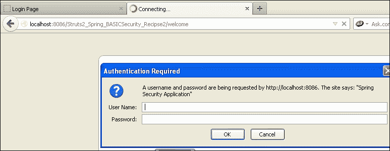
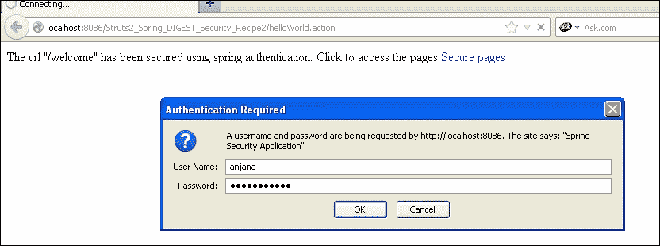
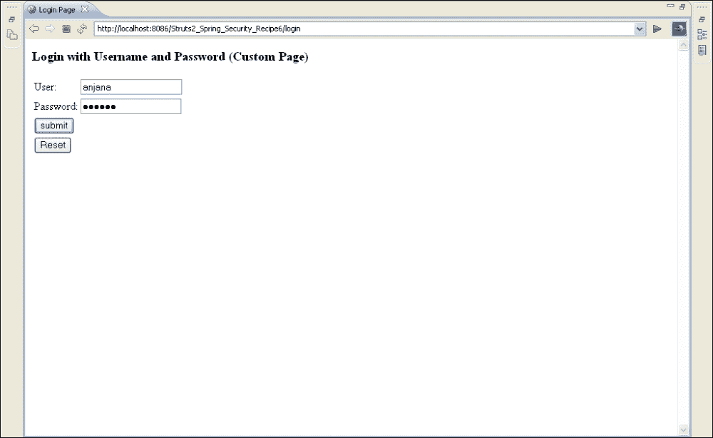
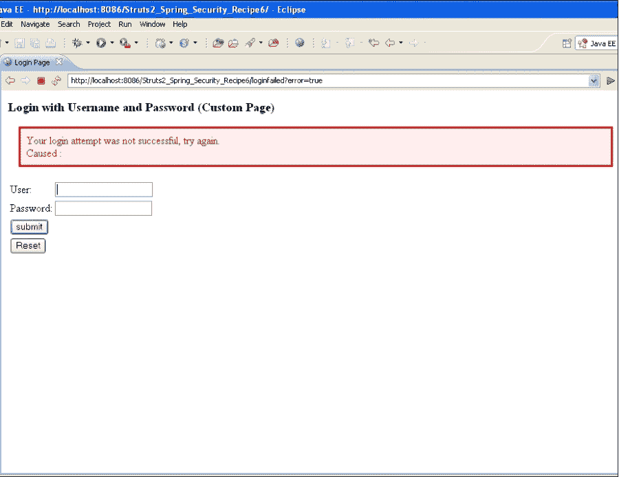

# 二、SpringSecurity 和 Struts2

在本章中，我们将介绍：

*   将 Struts 2 与 Spring Security 集成
*   Struts 2 应用程序具有基本的 SpringSecurity
*   使用 Struts 2 和基于摘要/哈希的 SpringSecurity
*   使用 Struts 2 的 SpringSecurity 注销
*   使用 Struts 2 和 Spring Security 验证数据库
*   使用 Spring Security 在 Struts 2 中获取登录用户信息
*   在 Struts 2 中显示身份验证失败的自定义错误消息
*   使用 ApacheDS 与 Spring Security 和 Struts 2 应用程序进行身份验证

# 导言

我们在[第 1 章](01.html "Chapter 1. Basic Security")、*基础安全*中学习了安全的基础知识，这有助于我们更好地理解 SpringSecurity，以及 Spring 框架中 SpringSecurity 组件的起源。

在本章中，我们将了解如何使用 SpringSecurity 在基于 Struts 2 框架的 web 应用程序中对用户进行身份验证。

ApacheStruts2 可以与 JSF 和 Spring 集成。它是一个非常灵活的基于 POJO 操作的 MVC 框架。POJO 本身执行动作类的角色来满足请求。Struts 2 源自另一个称为 WebWork 的框架，它与 servlet 过滤器一起工作，servlet 过滤器拦截请求和响应。

**探索春季套餐**

您可以直接从 MAVEN 下载 JAR，也可以在 POM 文件中添加依赖项。

我们更喜欢使用[中最新的 JARs 3.1.4http://mvnrepository.com/artifact/org.springframework.security/spring-security-core/](http://mvnrepository.com/artifact/org.springframework.security/spring-security-core/) ：

```java
<dependency>
    <groupId>org.springframework.security</groupId>
    <artifactId>spring-security-core</artifactId>
    <version>3.1.4.RELEASE</version>
 </dependency> 
 <dependency>
    <groupId>org.springframework.security</groupId>
    <artifactId>spring-security-web</artifactId>
    <version>3.1.4.RELEASE</version>
  </dependency> 
  <dependency>
    <groupId>org.springframework.security</groupId>
    <artifactId>spring-security-config</artifactId>
    <version>3.1.4.RELEASE</version>
  </dependency>
```

**春季安防主包**

*   `org.springframework.security.authentication`：这是我们感兴趣的领域
*   `org.springframework.security.crypto`：用于加密和解密
*   `org.springframework.security.util`：这是 SpringSecurity API 使用的通用工具类
*   `org.springframework.security.core`：包含与身份验证和授权相关的安全核心类
*   `org.springframework.security.access`：包含基于投票人的安全访问控制注释和决策界面
*   `org.springframework.security.provisioning`：包含用户和组设置界面

**关键 SpringSecurity 特性**

*   支持 JAAS。
*   支持数据库。
*   支持 MongoDB 身份验证。
*   使用 OpenID 提供身份验证。
*   显示多租户。
*   提供基本身份验证。
*   提供摘要身份验证。
*   SpringSecurity 像一个独立的模块一样工作。身份验证代码由 SpringSecurity 框架独立处理。
*   支持使用 ApacheDS 进行身份验证。
*   支持使用开放式 LDAP 进行身份验证。

**认证机制**

1.  用户向系统提交其凭证；即用户名和密码。
2.  `org.springframework.security.authentication.UsernamePasswordAuthenticationToken`接受凭证并传递给`org.springframework.security.authentication.AuthenticationManager`进行验证。
3.  系统对用户进行身份验证。
4.  凭证流程如下：`UsernamePasswordAuthenticationToken``AuthenticationManager``Authentication`。
5.  最后返回一个完全加载的身份验证实例。
6.  `SecurityContextHolder`接受认证实例。
7.  系统还检查角色或组的授权。
8.  最后，允许用户根据其授权访问系统。

# 将 Struts 2 与 SpringSecurity 集成

让我们首先建立一个 Struts 2 应用程序，并将 Spring Security 与之集成。

## 准备好了吗

*   Eclipse Indigo 或更高版本
*   JBoss 作为服务器
*   Struts 2 JARs:2.1.x
*   弹簧芯罐 3.1.4。释放和 SpringSecurity 3.1.4.1 释放
*   Struts 2 弹簧插件罐

## 怎么做。。。

在这一节中，我们将学习如何使用基于表单的 Spring Security 设置 Struts 2 应用程序：

1.  在 EclipseIDE 中，创建一个动态 web 项目并将其命名为`Spring_Security_Struts2`。
2.  在`src/main/java`处创建一个源文件夹。
3.  在源文件夹`src/main/java`下创建一个`struts.xml`文件。
4.  要将 Struts 2 与 Spring 应用程序集成，请在此处添加`application-context.xml`文件引用。
5.  在`web.xml`中添加 Struts 过滤器映射。Spring listener 还需要添加到`web.xml`文件中。侦听器条目应该位于 Struts 2 筛选器条目之上。
6.  `contextLoaderListener`将告知`servletcontainer`关于`springcontextLoader`的信息，并跟踪事件。这还允许开发人员创建`BeanListeners`，从而允许它跟踪 Bean 中的事件。
7.  在`web.xml`文件中，添加以下代码：

    ```java
    <?xml version="1.0" encoding="UTF-8"?>
    <web-app xmlns:xsi="http://www.w3.org/2001/XMLSchema-instance"  xmlns:web="http://java.sun.com/xml/ns/javaee/web-app_2_5.xsd" xsi:schemaLocation="http://java.sun.com/xml/ns/javaee http://java.sun.com/xml/ns/javaee/web-app_2_5.xsd" id="WebApp_ID" version="2.5">
    <display-name>Struts2x</display-name>
    <listener>  
    <listener-class>org.springframework.web.context.ContextLoaderListener</listener-class>  
    </listener>
    <!—to integrate spring with struts2->
    <context-param>
    <param-name>contextConfigLocation</param-name>
    <param-value>/WEB-INF/applicationContext.xml</param-value>
    </context-param>
    <filter>
    <filter-name>struts2</filter-name>
    <filter-class>org.apache.struts2.dispatcher.FilterDispatcher</filter-class>
    </filter>

    <filter-mapping>
    <filter-name>struts2</filter-name>
    <url-pattern>/*</url-pattern>
    </filter-mapping>

    </web-app>
    ```

8.  为了建立基于表单的安全性，我们需要创建`login.jsp`。形式动作为`j_spring_security_check`：

    ```java
    <%@ taglib prefix="c" url="http://java.sun.com/jsp/jstl/core"%>
    <html>
      <head>
      <title>Login Page</title>
      <style>
        .errorblock {
          color: #ff0000;
          background-color: #ffEEEE;
          border: 3px solid #ff0000;
          padding: 8px;
          margin: 16px;
        }
      </style>
      </head>
      <body onload='document.f.j_username.focus();'>
        <h3>Login with Username and Password (Custom Page)</h3>
        <% String error=request.getParameter("error");

        if(error!=null){
          %>

          <div class="errorblock">
          Your login attempt was not successful, try again.<br /> Caused :

          </div>

        <%} %>
        <form name='f' action="<c:url value='/j_spring_security_check'/>"
        method='POST'>

        <table>
          <tr>
            <td>User:</td>
            <td><input type='text' name='j_username' value=''>
            </td>
          </tr>
          <tr>
            <td>Password:</td>
            <td><input type='password' name='j_password' />
            </td>
          </tr>
          <tr>
            <td colspan='2'><input name="submit" type="submit"
            value="submit" />
            </td>
          </tr>
          <tr>
            <td colspan='2'><input name="reset" type="reset" />
            </td>
          </tr>
        </table>

        </form>
      </body>
    </html>
    ```

9.  创建文件夹并将其命名为`secure/hello.jsp`。
10.  将的`login`动作映射到`login.jsp`。
11.  将`loginfailed`动作映射到`login.jsp?error=true`。
12.  Map the `welcome` action with `secure/hello.jsp` with the action class-`HelloWorld`:

    `struts.xml`：

    ```java
    <!DOCTYPE struts PUBLIC
    "-//Apache Software Foundation//DTD Struts Configuration 2.0//EN"
    "http://struts.apache.org/dtds/struts-2.0.dtd">
    <struts>
      <package name="default" namespace="/" extends="struts-default">
      <action name="helloWorld">
        <result>success.jsp</result>
      </action>

      <action name="login">
        <result>login.jsp</result>
      </action>

      <action name="loginfailed">
        <result>login.jsp?error=true</result>
      </action>

      <action name="welcome" >
        <result>secure/hello.jsp</result>
      </action>

      </package>
    </struts>
    ```

13.  `login page`URL 与 Struts 2 动作`'/login'`映射。
14.  安全性应用于 Struts 2 动作`'/welcome'`。
15.  系统将提示用户登录。
16.  The user with `role_user` will be authorized to access the pages

    `Applicationcontext-security.xml`：

    ```java
    <beans:beans xmlns="http://www.springframework.org
    /schema/security"
       xmlns:beans="http://www.springframework.org
    /schema/beans" 
       xmlns:xsi="http://www.w3.org/2001/XMLSchema-instance"
       xsi:schemaLocation="http://www.springframework.org
    /schema/beans
       http://www.springframework.org/schema/beans/spring-
    beans-3.0.xsd
       http://www.springframework.org/schema/security
       http://www.springframework.org/schema/security/spring-
    security-3.1.xsd">

     <global-method-security pre-post-annotations="enabled">
            <!-- AspectJ pointcut expression that locates our "post" method and applies security that way
            <protect-pointcut expression="execution(* bigbank.*Service.post*(..))" access="ROLE_TELLER"/>
            -->
        </global-method-security>
       <http auto-config="true" use-expressions="true" >
              <intercept-url pattern="/welcome" 
    access="hasRole('ROLE_USER')"/>
              <form-login login-page="/login" default-target-
    url="/welcome" authentication-failure-
    url="/loginfailed?error=true" />
              <logout/>
       </http>
        <authentication-manager>
         <authentication-provider>
           <user-service>
              <user name="anjana" password="packt123" authorities="ROLE_USER" />
           </user-service>
         </authentication-provider>
       </authentication-manager>

    </beans:beans>
    ```

## 它是如何工作的。。。

只需运行应用程序。您将获得一个链接以访问安全页面。单击链接后，系统将提示您登录。这实际上是一个基于表单的登录。

在这里提交时，操作被发送到 Spring 框架，该框架对用户进行身份验证。

成功后，用户将看到经过身份验证的页面。

Struts 2 框架很容易与 Spring 框架及其模块结合，只需稍加修改。


## 另见

*   具有基本 SpringSecurity 的*Struts 2 应用程序*配方
*   *使用 Struts 2 和基于摘要/哈希的 Spring Security*配方
*   *在 Struts 2 中显示认证失败*的自定义错误消息
*   *使用 Struts 2 和 Spring Security*对数据库进行身份验证
*   *使用 ApacheDS 验证 SpringSecurity 和 Struts 2 应用*配方
*   *使用 SpringSecurity 标识和 Struts 2*配方
*   *使用 Spring Security*配方在 Struts 2 中获取登录用户信息

# Struts 2 应用，具有基本的 SpringSecurity

在本节中，我们将演示 Struts 2 的基本 SpringSecurity 认证。我们将创建一个示例 Struts 2 应用程序，并将 SpringSecurity 特性添加到操作中以使其安全。只有经过身份验证的授权用户才能访问它。

## 准备好了吗

*   更新`Applicationcontext-security.xml`文件
*   在 Eclipse 中创建新的动态项目：`Struts2_Spring_BASIC_Security_Recipe2`

## 怎么做。。。

执行以下步骤，将 Struts 2 应用程序与 Spring Security 集成，以实现基本身份验证：

1.  Modify the `applicationcontext-security.xml` file to support basic security:

    `Applicationcontext-security.xml`：

    ```java
    <beans:beans 
       xmlns:beans="http://www.springframework.org/schema/beans" 
       xmlns:xsi="http://www.w3.org/2001/XMLSchema-instance"
       xsi:schemaLocation="http://www.springframework.org/schema/beans
       http://www.springframework.org/schema/beans/spring-beans-3.0.xsd
       http://www.springframework.org/schema/security
       http://www.springframework.org/schema/security/spring-security-3.1.xsd">

     <global-method-security pre-post-annotations="enabled">
            <!-- AspectJ pointcut expression that locates our "post" method and applies security that way
            <protect-pointcut expression="execution(* bigbank.*Service.post*(..))" access="ROLE_TELLER"/>
            -->
        </global-method-security>

      <http>
       <intercept-url pattern="/welcome" access="ROLE_TELLER" />
       <http-basic />
      </http>
       <authentication-manager>
         <authentication-provider>
           <user-service>
             <user name="anjana" password="123456" authorities="ROLE_TELLER" />
           </user-service>
         </authentication-provider>
       </authentication-manager>
    </beans:beans>
    ```

## 它是如何工作的。。。

当用户运行 Struts2 应用程序并尝试访问安全资源时，SpringSecurity 上下文被初始化，Struts 2 操作被 Spring 的登录对话框中断，该对话框将请求用户名和密码。认证成功后，用户将被重定向到 Struts 2 操作页面。

以下是应用程序的工作流程：

浏览器上的 Struts 2 和 Spring 基本安全性：



## 另见

*   *使用 Struts 2 和基于摘要/哈希的 Spring Security*配方

# 使用 Struts 2 和基于摘要/哈希的 SpringSecurity

使用基于表单或基本身份验证并不能保证基于 Struts 2 的应用程序的安全，因为密码以明文形式向用户公开。Spring Security JAR 中有加密包。这个包可以解密加密的密码，但是我们需要告诉 SpringSecurityAPI 用于加密的算法。

## 准备好了吗

*   在 Eclipse 中创建动态 web 项目
*   添加 Struts 2 个罐子
*   添加与 SpringSecurity 相关的 JAR
*   `web.xml`、`struts2.xml`和 JSP 设置与上一个应用程序保持相同

## 怎么做。。。

让我们加密密码：`packt123456`。

我们需要使用一个外部 JAR，`JACKSUM`，这意味着 Java 校验和。它支持 MD5 和 SHA1 加密。

下载的的`jacksum.zip`文件（[http://www.jonelo.de/java/jacksum/#Download](http://www.jonelo.de/java/jacksum/#Download) 和提取 ZIP 文件夹。

```java
packt>java -jar jacksum.jar -a sha -q"txt:packt123456"
```


更新的`applicationcontext-security.xml`文件：

```java
<beans:beans 
   xmlns:beans="http://www.springframework.org/schema/beans" 
   xmlns:xsi="http://www.w3.org/2001/XMLSchema-instance"
   xsi:schemaLocation="http://www.springframework.org/schema/beans
   http://www.springframework.org/schema/beans/spring-beans-3.0.xsd
   http://www.springframework.org/schema/security
   http://www.springframework.org/schema/security/spring-security-3.1.xsd">

 <global-method-security pre-post-annotations="enabled">
        <!-- AspectJ pointcut expression that locates our "post" method and applies security that way
        <protect-pointcut expression="execution(* bigbank.*Service.post*(..))" access="ROLE_TELLER"/>
        -->
    </global-method-security>
  <http>
   <intercept-url pattern="/welcome" access="ROLE_TELLER" />
   <http-basic />
  </http>
   <authentication-manager>
      <authentication-provider>
   <password-encoder hash="sha" />
      <user-service>
         <user name="anjana" password="bde892ed4e131546a2f9997cc94d31e2c8f18b2a" 
          authorities="ROLE_TELLER" />
      </user-service>
   </authentication-provider>
   </authentication-manager>
</beans:beans>
```

## 它是如何工作的。。。

我们需要更新`Applicationcontext-security.xml`文件。观察身份验证的类型是基本的，但密码是使用算法散列的。我们希望 SpringSecurity 使用 SHA 算法对其进行解密，并对用户进行身份验证。

Spring Security 在处理摘要身份验证方面非常灵活。您还可以看到，没有基于容器的依赖关系。

在以下屏幕截图中可以看到来自浏览器的基本身份验证：



Spring 已通过解密密码对用户进行身份验证：


## 另见

*   *在 Struts 2 中显示认证失败*的自定义错误消息
*   *使用 Struts 2 和 Spring Security*对数据库进行身份验证
*   *使用 ApacheDS 验证 SpringSecurity 和 Struts 2 应用*配方
*   *使用 SpringSecurity 标识和 Struts 2*配方
*   *使用 Spring Security*配方在 Struts 2 中获取登录用户信息

# 使用带 Struts 的 SpringSecurity 注销 2

在本节中，让我们实现一个注销场景，其中登录的用户将从应用程序中注销。注销操作将由 SpringSecurity 框架处理。我们需要配置`struts.xml`文件来处理`j_spring_security_logout`操作。

## 准备好了吗

*   在 Eclipse 中创建动态 web 项目
*   添加 Struts 2 相关的 JAR
*   添加与 SpringSecurity 相关的 JAR
*   `web.xml`、`struts2.xml`和 JSP 设置与上一个应用程序保持相同

## 怎么做。。。

1.  让我们更新安全页面，`hello.jsp`：

    ```java
    <%@ taglib prefix="c" uri="http://java.sun.com/jsp/jstl/core"%>
    <%@page import="java.security.Principal" %>
    <html>
    <body>
    Hello .You are seeing a secured Page now.

       <a href="<c:url value="/j_spring_security_logout" />" > Logout</a>
     </body>
    </html>
    ```

2.  Let's map the `j_spring_security_logout` with the `struts.xml` file:

    当用户点击**注销**时，用户将注销并重定向至`index.jsp`。

    ```java
    <!DOCTYPE struts PUBLIC
    "-//Apache Software Foundation//DTD Struts Configuration 2.0//EN"
    "http://struts.apache.org/dtds/struts-2.0.dtd">
    <struts>
       <package name="default" namespace="/" extends="struts-default">
            <action name="helloWorld">
                <result>success.jsp</result>
            </action>

          <action name="login">
                    <result>login.jsp</result>
             </action>

             <action name="loginfailed">
                    <result>login.jsp?error=true</result>
             </action>

             <action name="welcome" >
             <result>secure/hello.jsp</result>
             </action>

       <action name="j_spring_security_logout">
       <result>index.jsp</result>
             </action>
        </package>
    </struts>
    ```

3.  更新的`applicationcontext-security.xml`文件：

    ```java
    <beans:beans 
       xmlns:beans="http://www.springframework.org/schema/beans" 
       xmlns:xsi="http://www.w3.org/2001/XMLSchema-instance"
       xsi:schemaLocation="http://www.springframework.org/schema/beans
       http://www.springframework.org/schema/beans/spring-beans-3.0.xsd
       http://www.springframework.org/schema/security
       http://www.springframework.org/schema/security/spring-security-3.1.xsd">

     <global-method-security pre-post-annotations="enabled">
        </global-method-security>
      <http>
       <intercept-url pattern="/welcome" access="ROLE_TELLER" />
       <logout logout-success-url="/helloWorld" />
       <http-basic />
      </http>
       <authentication-manager>
          <authentication-provider>
       <password-encoder hash="sha" />
          <user-service>
             <user name="anjana" password="bde892ed4e131546a2f9997cc94d31e2c8f18b2a" 
                 authorities="ROLE_TELLER" />
          </user-service>
       </authentication-provider>
       </authentication-manager>
    </beans:beans>
    ```

## 它是如何工作的。。。

SpringSecurity 还提供了处理注销的选项。当用户点击**注销**时，用户被引导到指定页面。

`j_spring_secuurity_logout`为 Struts 2 应用程序提供注销选项。

Struts 2 应用程序具有映射和 URL 及其操作。

注销选项通常在安全页面中给出。

## 还有更多。。。

到为止，我们已经将认证信息存储在`.xml`文件中。我们还对密码进行了哈希运算。在外部系统上存储信息并获取信息如何？让我们在下一节中了解 Struts 2 如何使用这种数据库身份验证。

## 另见

*   *在 Struts 2 中显示认证失败*的自定义错误消息
*   *使用 Struts 2 和 Spring Security*对数据库进行身份验证
*   *使用 ApacheDS 验证 SpringSecurity 和 Struts 2 应用*配方
*   *使用 Spring Security*配方在 Struts 2 中获取登录用户信息

# 使用 Struts 2 和 Spring Security 对数据库进行身份验证

在本节中，让我们授权使用数据库中存储的信息登录 Struts 2 应用程序的用户。SpringSecurity 需要在 Struts 2 应用程序中进行配置，以便它知道需要执行的数据库和 SQL 的位置，以便使用 SpringSecurity 对用户进行身份验证。

## 准备好了吗

*   在 Eclipse:`Struts2_Spring_DBAuthentication_Recipe4`中创建动态 web 项目
*   将文件复制到`src/main/java`
*   将文件添加到`WEB-INF`
*   从上一个配方复制`webContent`文件夹
*   如果您正在使用 maven，请将以下 JAR 添加到`lib`文件夹或更新 POM 文件：
    *   spring-jdbc-3.0.7.0 版本
    *   mysql-connector-java-5.1.17
    *   公共 dbcp
    *   commons-pool-1.5.4

## 怎么做。。。

1.  要使用 Struts 2 和 Spring 执行数据库身份验证，我们需要创建一个文件。`db-beans.xml`文件将包含数据库信息：

    ```java
    <beans 
       xmlns:xsi="http://www.w3.org/2001/XMLSchema-instance"
       xsi:schemaLocation="http://www.springframework.org/schema/beans
       http://www.springframework.org/schema/beans/spring-beans-3.0.xsd">
        <bean id="MySqlDatasource" class="org.springframework.jdbc.datasource.DriverManagerDataSource">
       <property name="driverClassName" value="com.mysql.jdbc.Driver" />
       <property name="url" value="jdbc:mysql://localhost:3306/test1" />
       <property name="username" value="root" />
       <property name="password" value="prdc123" />
       </bean>
     </beans>
    ```

2.  将`db-beans.xml`文件添加到与`applicationcontext-security.xml`相同的位置。更新`web.xml`文件，读取`db-beans.xml`文件：

    ```java
    <?xml version="1.0" encoding="UTF-8"?>
    <web-app xmlns:xsi="http://www.w3.org/2001/XMLSchema-instance"  xmlns:web="http://java.sun.com/xml/ns/javaee/web-app_2_5.xsd" xsi:schemaLocation="http://java.sun.com/xml/ns/javaee http://java.sun.com/xml/ns/javaee/web-app_2_5.xsd" id="WebApp_ID" version="2.5">
      <display-name>SpringStruts2Security</display-name>
     <context-param>
              <param-name>contextConfigLocation</param-name>
              <param-value>
                    /WEB-INF/db-beans.xml,
                    /WEB-INF/applicationContext-security.xml
              </param-value>
       </context-param>

      <filter>
        <filter-name>springSecurityFilterChain</filter-name>
        <filter-class>
                      org.springframework.web.filter.DelegatingFilterProxy
                    </filter-class>
      </filter>
      <filter-mapping>
        <filter-name>springSecurityFilterChain</filter-name>
        <url-pattern>/*</url-pattern>
      </filter-mapping>
      <filter>
        <filter-name>struts2</filter-name>
        <filter-class>org.apache.struts2.dispatcher.ng.filter.StrutsPrepareAndExecuteFilter</filter-class>
      </filter>
      <listener>
        <listener-class>org.springframework.web.context.ContextLoaderListener</listener-class>
      </listener>
      <filter-mapping>
        <filter-name>struts2</filter-name>
        <url-pattern>/*</url-pattern>
      </filter-mapping>
      <error-page>
              <error-code>403</error-code>
              <location>/secure/denied.jsp</location>
       </error-page>

      <welcome-file-list>
        <welcome-file>index.jsp</welcome-file>
      </welcome-file-list>
    </web-app>
    ```

3.  在数据库中运行以下 SQL 脚本：

    ```java
    CREATE TABLE `users1` (  `USER_ID` INT(10) UNSIGNED NOT NULL,
      `USERNAME` VARCHAR(45) NOT NULL,
      `PASSWORD` VARCHAR(45) NOT NULL,
      `ENABLED` tinyint(1) NOT NULL,
      PRIMARY KEY (`USER_ID`)
    ) ENGINE=InnoDB DEFAULT CHARSET=utf8;
    CREATE TABLE `user_roles` (
      `USER_ROLE_ID` INT(10) UNSIGNED NOT NULL,
      `USER_ID` INT(10) UNSIGNED NOT NULL,
      `ROLE` VARCHAR(45) NOT NULL,
      PRIMARY KEY (`USER_ROLE_ID`),
      KEY `FK_user_roles` (`USER_ID`),
      CONSTRAINT `FK_user_roles` FOREIGN KEY (`USER_ID`) REFERENCES `users` (`USER_ID`)
    ) ENGINE=InnoDB DEFAULT CHARSET=utf8;

    INSERT INTO test1.users (USER_ID, USERNAME,PASSWORD, ENABLED)
    VALUES (100, 'anjana', 'packt123456', TRUE);

    INSERT INTO test1.user_roles (USER_ROLE_ID, USER_ID,AUTHORITY)
    VALUES (1, 100, 'ROLE_TELLER');
    ```

4.  将文件更新为读取数据库配置：

    ```java
    <beans:beans 
       xmlns:beans="http://www.springframework.org/schema/beans" 
       xmlns:xsi="http://www.w3.org/2001/XMLSchema-instance"
       xsi:schemaLocation="http://www.springframework.org/schema/beans
       http://www.springframework.org/schema/beans/spring-beans-3.0.xsd
       http://www.springframework.org/schema/security
       http://www.springframework.org/schema/security/spring-security-3.1.xsd">

     <global-method-security pre-post-annotations="enabled">
            <!-- AspectJ pointcut expression that locates our "post" method and applies security that way
            <protect-pointcut expression="execution(* bigbank.*Service.post*(..))" access="ROLE_TELLER"/>
            -->
        </global-method-security>

      <http>
       <intercept-url pattern="/welcome" access="ROLE_TELLER" />
       <logout logout-success-url="/helloWorld" />
       <http-basic />
      </http>

       <authentication-manager> 
          <authentication-provider> 
             <jdbc-user-service data-source-ref="MySqlDS" 

                users-by-username-query=" 
                    select username,password, enabled   
                   from users1 where username=?"  

                authorities-by-username-query=" 
                   select u.username, ur.role from users1 u, user_roles ur  
             where u.user_id = ur.user_id and u.username =?  "  
             /> 
          </authentication-provider>
       </authentication-manager>
    </beans:beans>
    ```

## 它是如何工作的。。。

Struts2 框架提供了访问安全页面的链接。但是 Spring Security 框架中断并给出一个身份验证对话框，身份验证由 Spring Security 框架通过查询数据库完成。身份验证管理器配置了 datasource ref，它将加载安全框架的信息，以便根据查询对用户进行身份验证。

## 还有更多。。。

到目前为止，我们只对一个 JSP 文件应用了安全性，该文件在`struts2.xml`中没有进行任何操作就进行了映射。让我们看看如何用 JSP 映射动作类，然后与 SpringSecurity 集成。理想情况下，它应该以同样的方式工作。让我们在 action 类中获取登录的用户信息，并将其显示在浏览器上。

## 另见

*   *在 Struts 2 中显示认证失败*的自定义错误消息
*   *使用 ApacheDS 验证 SpringSecurity 和 Struts 2 应用*配方
*   *使用 Spring Security*配方在 Struts 2 中获取登录用户信息

# 使用 Spring Security 在 Struts 2 中获取登录用户信息

到目前为止，在我们的示例中，我们还没有使用任何 Struts 2 操作类。

让我们创建一个 action 类，看看这个 action 类的安全性如何。我们将在此配方中使用基于表单的身份验证。

## 准备好了吗

到目前为止在我们的示例中，我们还没有使用任何 Struts 2 动作类。

让我们创建一个 action 类，看看这个 action 类的安全性如何。我们将在此配方中使用基于表单的身份验证：

*   创建动态 web 项目：`Struts2_Spring_Security_Recipe5`
*   创建包：`com.packt.action`
*   从`src/main/java`中的上一个配方复制`struts.xml`文件
*   同时复制`WebContent`文件夹
*   我们需要向包中添加一个 action 类
*   更新`struts.xml`文件

## 怎么做。。。

1.  `HelloAction`文件如下：

    ```java
    package com.packt.action;
    public class HelloAction {
             public String execute(){
             return "SUCCESS";
       }
    }
    ```

2.  将`Struts.xml`文件更新为`HelloAction`。因此，当用户通过身份验证时，它会将请求传递给 action 类，action 类将执行`execute()`方法，然后会重定向到`hello.jsp`：

    ```java
    <!DOCTYPE struts PUBLIC
    "-//Apache Software Foundation//DTD Struts Configuration 2.0//EN"
    "http://struts.apache.org/dtds/struts-2.0.dtd">
    <struts>
       <package name="default" namespace="/" extends="struts-default">
            <action name="helloWorld">
                <result>success.jsp</result>
            </action>

          <action name="login">
                   <result>login.jsp</result>
             </action>

             <action name="loginfailed">
                   <result>login.jsp?error=true</result>
             </action>

             <action name="welcome" class="com.packt.action.HelloAction">
             <result name="SUCCESS">secure/hello.jsp</result>
             </action>

        </package>
    </struts>
    ```

3.  Getting the logged in user:

    我们可以在 action 类中获取登录的用户名，我们可以在页面上显示它，或者在我们的应用程序中进一步使用它。

    我们可以在 action 类中使用`request.getUserPrincipal`来获取登录的用户信息。

4.  对于项目设置：
    *   在 Eclipse 中创建动态 web 项目：`Struts2_Spring_Security_Recipe6`
    *   从上一个配方复制`src/main/java`文件夹
    *   从上一个配方复制`Web content`文件夹
    *   修改`HelloAction.java`文件

        ```java
        package com.packt.action;
        import javax.servlet.http.HttpServletRequest;
        import org.apache.struts2.ServletActionContext;
        public class HelloAction {
           private String name;
                       public String execute(){
                       HttpServletRequest request = ServletActionContext.getRequest();
                       String logged_in_user=request.getUserPrincipal().getName();
                       setName(logged_in_user);
                       return "SUCCESS";
                 }

                 public String getName() {
                       return name;
                 }

                 public void setName(String name) {
                       this.name = name;
                 }
        }
        ```

    *   修改`secure/Hello.jsp`文件：

        ```java
        <%@ taglib prefix="c" uri="http://java.sun.com/jsp/jstl/core"%>
        <%@taglib uri="/struts-tags" prefix="s" %>
        <%@page import="java.security.Principal" %>
        <html>
          <body>
            Hello <h1><s:property value="name" /></h1>.You are seeing a secured Page now.
            <a href="<c:url value="/j_spring_security_logout" />" > Logout</a>
          </body>
        </html>
        ```

## 它是如何工作的。。。

用户信息存储在 principal 中：



在浏览器上显示登录的用户：


## 还有更多。。。

在显示用户信息后，我们可以向用户显示认证失败时的自定义错误消息。

## 另见

*   *在 Struts 2 中显示认证失败*的自定义错误消息
*   *使用 ApacheDS 验证 SpringSecurity 和 Struts 2 应用*配方

# 在 Struts 2 中显示身份验证失败的自定义错误消息

在这一节中，我们将捕获 Struts 2 应用程序中 Spring Security 的身份验证失败消息，并查看如何将其显示给用户。

## 准备好了吗

*   重定向到身份验证失败时的失败操作
*   向用户显示自定义消息

## 怎么做。。。

执行以下步骤，在 JSP 应用程序中捕获 Spring Security 的身份验证失败消息：

1.  在`applicationcontext.xml`文件中，我们可以将 URL 重定向到另一个操作：`Authentication-failure-url="/loginfailed? error=true"`。

    ```java
    <http auto-config="true" use-expressions="true" >
             <intercept-url pattern="/welcome" access="hasRole('ROLE_TELLER')"/>
             <form-login login-page="/login" default-target-url="/welcome" authentication-failure-url="/loginfailed?error=true" />
             <logout/>
       </http>
    ```

2.  使用以下代码更新`login.jsp`页面：

    ```java
    <% String error=request.getParameter("error");

     if(error!=null){
     %>

              <div class="errorblock">
                    Your login attempt was not successful, try again.<br /> Caused :

              </div>

     <%} %>
    ```

## 它是如何工作的。。。

登录失败操作映射到`struts2.xml`中的`login.jsp`文件。`application-context.xml`中增加了`authentication-failure-url`。当用户输入错误的凭据时，身份验证将失败，用户将被重定向到登录页面并显示错误消息。

错误消息配置在 JSP 文件中完成。



## 另见

*   *使用 ApacheDS 验证 SpringSecurity 和 Struts 2 应用*配方

# 使用 ApacheDS 验证 Spring Security 和 Struts 2 应用程序

在这个部分中，我们将在 Apache 目录服务器中存储用户凭据和角色信息。Spring Security 必须找到服务器并登录到服务器。它应该通过比较用户提交的凭据和 Apache 目录服务器中存在的凭据和角色信息来验证用户。

## 准备好了吗

*   在 Eclipse 中创建动态 web 项目
*   `src/main/java`文件夹和`WebContent`文件夹保持不变
*   安装 Apache directory studio:1.5.3
*   安装 Apache 目录服务器：2.0
*   10389 是 apache ds 端口
*   将 LDAP 相关的安全 JAR 添加到`WebContent Lib`文件夹
*   spring-ldap-core-tiger-1.3.X 版本
*   spring-ldap-odm-1.3.X 版本
*   spring-security-ldap-1.3.X 版本
*   spring-ldap-ldif-batch-1.3.X 版本
*   spring-ldap-test-1.3.X 版本
*   spring-ldap-core-1.3.X 版本
*   spring-ldap-ldif-core-1.3.X 版本

## 怎么做。。。

执行以下步骤设置 Apache 目录，使用 Spring Security 对 Struts 2 应用程序中的用户进行身份验证：

1.  在安装上述先决条件后配置 Apache DS 服务器。
2.  使用以下步骤创建分区：
    *   打开`server.xml`文件：`C:\Program Files\Apache Directory Server\instances\default\conf\server.xml`。
    *   添加 JDM 分区：`<jdbmPartition id="packt" suffix="o=packt"/>`。
    *   您可以重新启动 ApacheDS 服务器以查看更改。然后使用 Apache Directory Studio 连接到 Apache DS。右键点击**DIT**。从**划痕**创建**条目**。选择**组织**，选择**o**，在**值**中输入`packt`。选择**完成**并刷新**DIT**以查看更新。
3.  配置 Apache Directory studio。
4.  连接到 Apache 目录服务器。
5.  ApacheDS 在 10389 上运行。
6.  Create two groups `ou=groups` and `ou=user`.

    

    

    

7.  Here, object class is for adding entries to `ou=groups`, since this maintains the role:

    

8.  Here, object class is to add entries to `ou=people`:

    

9.  Assign roles to users by adding `UniqueMember` to `cn=admin`.

    `Spring-security-ldap.xml`：

    ```java
    <beans:beans 
       xmlns:beans="http://www.springframework.org/schema/beans" 
       xmlns:xsi="http://www.w3.org/2001/XMLSchema-instance"
       xsi:schemaLocation="http://www.springframework.org/schema/beans
       http://www.springframework.org/schema/beans/spring-beans-3.0.xsd
       http://www.springframework.org/schema/security
       http://www.springframework.org/schema/security/spring-security-3.1.xsd">

     <global-method-security pre-post-annotations="enabled">
            <!-- AspectJ pointcut expression that locates our "post" method and applies security that way
            <protect-pointcut expression="execution(* bigbank.*Service.post*(..))" access="ROLE_TELLER"/>
            -->
        </global-method-security>
       <http auto-config="true" use-expressions="true" >
              <intercept-url pattern="/welcome" access="hasRole('ROLE_ADMIN')"/>
    <!--            <intercept-url pattern="/admin" access="hasRole('ROLE_admin')"/> -->

             <form-login login-page="/login" default-target-url="/secure/common.jsp" authentication-failure-url="/loginfailed?error=true" />

    <authentication-manager>
               <ldap-authentication-provider 
                                user-search-filter="(mail={0})" 
                                user-search-base="ou=people"
                                group-search-filter="(uniqueMember={0})"
                          group-search-base="ou=groups"
                          group-role-attribute="cn"
                          role-prefix="ROLE_">
               </ldap-authentication-provider>
       </authentication-manager>

       <ldap-server url="ldap://localhost:10389/o=sevenSeas" manager-dn="uid=admin,ou=system" manager-password="secret" />
    </beans:beans>
    ```

## 它是如何工作的。。。

`Spring Security-ldap.xml`将包含服务器位置和域的详细信息。它应该连接以检索用户信息。域为`sevenSeas`。1039 是 LDAP 服务器的端口号。Spring Security 使用`ldap-server`标记提供 LDAP 信息。它还提供密码和它将连接的域。Struts 2 请求将被 Spring Security 中断，为了进行身份验证，将从登录页面接收用户信息。SpringSecurity 要求用户名为 LDAP；成功后，用户被授予访问安全资源的权限。

## 另见

*   [第三章](03.html "Chapter 3. Spring Security with JSF")*JSF SpringSecurity*