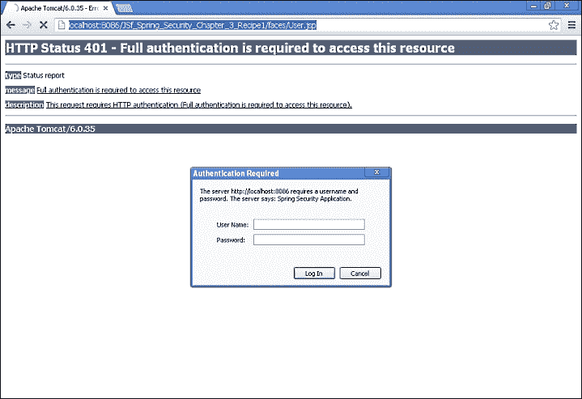
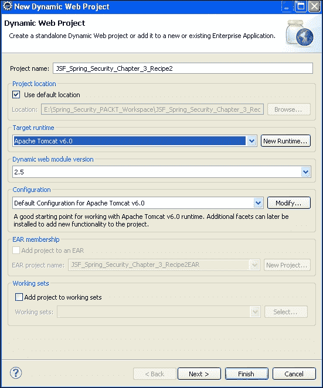
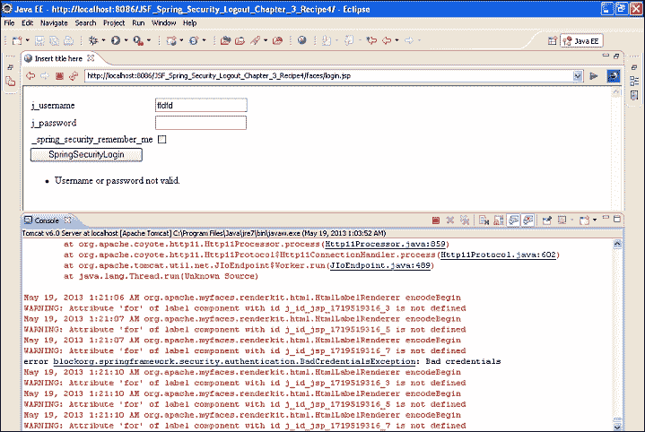
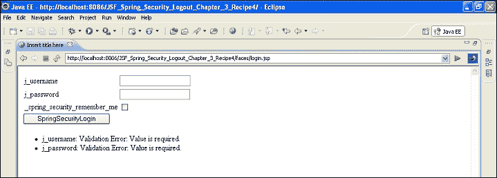

# 三、SpringSecurity 和 JSF

在本章中，我们将介绍：

*   将 JSF 与 SpringSecurity集成
*   JSF 与基于表单的 SpringSecurity
*   使用 Spring Security 显示登录用户的 JSF 和基于表单的身份验证
*   使用 JSF 和基于摘要/哈希的 SpringSecurity
*   使用 SpringSecurity使用 JSF 注销
*   使用 SpringSecurity和 JSF 对数据库进行身份验证
*   使用 JSF 和 SpringSecurity的 ApacheDS 身份验证
*   JSF 和 SpringSecurity的身份验证错误消息

# 导言

有许多应用程序是用 ApacheFaces/JSF 开发的。它不像 Struts 2 那样是一个面向操作的框架，而是纯粹用于视图层。为了用 JSF 实现 SpringSecurity，我们需要找到一些解决方法。让我们看一些关于 JSF 和 SpringSecurity的方法。

我使用了 SpringSecurity 和 SpringCore 的最新稳定版本。如果要对库进行更新，可以阅读以下部分。对于 Maven 用户来说，这都是关于更新依赖项的，对于普通 Eclipse 用户来说，这是关于将`.jar`文件添加到`lib`文件夹的。

**在 Eclipse**上设置 JSF 应用程序

1.  使用 EclipseJavaEE 开发者工具，设置动态 web 项目。
2.  给出项目名称：`JSf_Spring_Security_Chapter_3_Recipe1`。
3.  选择动态 web 模块版本 2.5。
4.  配置：JavaServerFacesV1.2 项目。
5.  在下一个**新建动态 Web 项目**窗口中，点击**下载库**。
6.  选择 Apache MyFaces 库。

**SpringSecurity大/小/补丁版本**

当我为我的应用程序设置安全性时，我在模式版本控制方面遇到了很多错误。

Spring 源代码很好地描述了要下载的版本。这表明补丁版本是最安全的，不会影响现有代码，因为它将使用向后兼容性。次要版本随设计更改而来，而主要版本随主要 API 更改而来。对于 JSF 配方，我使用了 3.1.4 安全版本，并下载了 Spring-3.1.4 相关 JAR。

您可以下载 spring-security-3.1.4.RELEASE-dist，它附带了所有最新的 jar。

罐：

*   `spring-security-config`进行名称空间解析并读取`spring-security.xml`文件
*   SpringSecurityWeb 与 web 应用程序过滤器交互
*   SpringSecurity内核

将这些 JAR 保存在 web 应用程序的`WEB-INF/lib`文件夹中。

# 将 JSF 与 Spring Security 集成

让我们在 Eclipse 中创建一个简单的 ApacheMyFaces 应用程序。另外，让我们将 SpringSecurity集成到 JSF 中，然后演示基本的身份验证。

## 准备好了吗

*   您将需要 Eclipse Indigo 或更高版本
*   创建一个动态 web 项目 JSF
*   在 Eclipse IDE 中，创建一个动态 web 项目：`JSf_Spring_Security_Chapter_3_Recipe1`
*   创建源文件夹：`src/main/java`
*   创建包：`com.packt.jsf.bean`
*   创建托管 Bean：`User.java`
*   使用 Tomcat 服务器部署应用程序

## 怎么做。。。

执行以下步骤，使用 JSF 和 Spring Security 实现基本的身份验证机制：

1.  `User.java` is the Managed Bean of the application. It has two methods: `sayHello()` and `reset()`:

    `User.java class`：

    ```java
    package com.packt.jsf.bean;
    public class User {
       private String name;
       private boolean flag= true; 
       public String getName() {
             return this.name;
       }
       public void setName(String name) {
             this.name = name;
       }
        public String  sayHello(){
              flag= false;
              name="Hello "+ name;
             return this.name;

        }
        public String  reset(){
              flag= true;
              name=null;
             return "reset";

        }
       public boolean isFlag() {
             return flag;
       }

       public void setFlag(boolean flag) {
             this.flag = flag;
       }
    }
    ```

2.  Let's create a JSP file, which is based on the `ApacheMyFaces` tags. It expects a mandatory `<f:view>` tag. It's a convention to create a JSP file with the same name as its bean. It has a form which accepts the name and says **"hello"** on clicking the button:

    `User.jsp`：

    ```java
    <%@ page language="java" contentType="text/html; charset=ISO-8859-1" pageEncoding="ISO-8859-1"%>
    <%@ taglib prefix="f"  uri="http://java.sun.com/jsf/core"%>
    <%@ taglib prefix="h"  uri="http://java.sun.com/jsf/html"%>
    <!DOCTYPE html PUBLIC "-//W3C//DTD HTML 4.01 Transitional//EN" "http://www.w3.org/TR/html4/loose.dtd">
    <html>
    <head>
    <meta http-equiv="Content-Type" content="text/html; charset=ISO-8859-1">
    <title>User</title>
    </head>
    <body>
    <f:view>
      <h:form>
        <h:panelGrid columns="2">
          <h:outputLabel value="Name"></h:outputLabel>
          <h:inputText  value="#{user.name}"></h:inputText>
        </h:panelGrid>
        <h:commandButton action="#{user.sayHello}" value="sayHello"></h:commandButton>
        <h:commandButton action="#{user.reset}" value="Reset"></h:commandButton>
         <h:messages layout="table"></h:messages>
      </h:form>

      <h:panelGroup rendered="#{user.flag!=true}">
      <h3> Result </h3>
      <h:outputLabel value="Welcome "></h:outputLabel>
      <h:outputLabel value="#{user.name}"></h:outputLabel>
      </h:panelGroup>
    </f:view>
    </body>
    </html>
    ```

3.  使用托管 Bean 更新`faces-config.xml`文件：

    ```java
    <?xml version="1.0" encoding="UTF-8"?>
    <faces-config

        xmlns:xsi="http://www.w3.org/2001/XMLSchema-instance"
        xsi:schemaLocation="http://java.sun.com/xml/ns/javaee http://java.sun.com/xml/ns/javaee/web-facesconfig_1_2.xsd"
        version="1.2">
        <application>

             <el-resolver>org.springframework.web.jsf.el.SpringBeanFacesELResolver</el-resolver>   
               <!-- 
               <variable-resolver>org.springframework.web.jsf.SpringBeanVariableResolver</variable-resolver>
               -->
       </application>
       <managed-bean>
              <managed-bean-name>user</managed-bean-name>
              <managed-bean-class>com.packt.jsf.bean.User</managed-bean-class>
              <managed-bean-scope>session</managed-bean-scope>
       </managed-bean>

    </faces-config>
    ```

4.  `Spring-security.xml`文件保持不变，但我使用了最新的 jar-3.1.4 安全 jar:

    ```java
    <beans:beans  xmlns:beans="http://www.springframework.org/schema/beans" xmlns:xsi="http://www.w3.org/2001/XMLSchema-instance" xsi:schemaLocation="http://www.springframework.org/schema/beans http://www.springframework.org/schema/beans/spring-beans-3.0.xsd 
     http://www.springframework.org/schema/security
     http://www.springframework.org/schema/security/spring-security-3.1.xsd">

     <global-method-security pre-post-annotations="enabled">

        </global-method-security>
        <http auto-config="true" use-expressions="true" >
              <intercept-url pattern="/faces/User.jsp" access="hasRole('ROLE_DIRECTOR')"/>
              <http-basic />
        </http>
        <authentication-manager>
          <authentication-provider>
            <user-service>
              <user name="packt" password="123456" authorities="ROLE_DIRECTOR" />
            </user-service>
          </authentication-provider>
        </authentication-manager>
    </beans:beans>
    ```

5.  The `web.xml` file should be updated with Spring filters and listeners. It also has configurations of MyFaces:

    `Spring-security.xml`：

    ```java
    <?xml version="1.0" encoding="UTF-8"?><web-app xmlns:xsi="http://www.w3.org/2001/XMLSchema-instance"  xmlns:web="http://java.sun.com/xml/ns/javaee/web-app_2_5.xsd" xsi:schemaLocation="http://java.sun.com/xml/ns/javaee http://java.sun.com/xml/ns/javaee/web-app_2_5.xsd" id="WebApp_ID" version="2.5">
      <display-name>JSf_Spring_Security_Chapter_3_Recipe1</display-name>
      <welcome-file-list>
        <welcome-file>index.jsp</welcome-file>
      </welcome-file-list>

      <context-param>
        <param-name>contextConfigLocation</param-name>
        <param-value>
              /WEB-INF/spring-security.xml

              </param-value>
      </context-param>
     <filter>
        <filter-name>springSecurityFilterChain</filter-name>
        <filter-class>
      org.springframework.web.filter.DelegatingFilterProxy
                    </filter-class>
      </filter>
      <filter-mapping>
        <filter-name>springSecurityFilterChain</filter-name>
        <url-pattern>/*</url-pattern>
      </filter-mapping>
      <listener>
        <listener-class>org.springframework.web.context.ContextLoaderListener</listener-class>
      </listener>
      <servlet>
        <servlet-name>Faces Servlet</servlet-name>
        <servlet-class>javax.faces.webapp.FacesServlet</servlet-class>
        <load-on-startup>1</load-on-startup>
      </servlet>
      <servlet-mapping>
        <servlet-name>Faces Servlet</servlet-name>
        <url-pattern>/faces/*</url-pattern>
      </servlet-mapping>
      <context-param>
        <param-name>javax.servlet.jsp.jstl.fmt.localizationContext</param-name>
        <param-value>resources.application</param-value>
      </context-param>
      <context-param>
        <description>State saving method: 'client' or 'server' (=default). See JSF Specification 2.5.2</description>
        <param-name>javax.faces.STATE_SAVING_METHOD</param-name>
        <param-value>client</param-value>
      </context-param>
      <context-param>
        <description>
       This parameter tells MyFaces if javascript code should be allowed in
       the rendered HTML output.
       If javascript is allowed, command_link anchors will have javascript code
       that submits the corresponding form.
       If javascript is not allowed, the state saving info and nested parameters
       will be added as url parameters.
       Default is 'true'</description>
        <param-name>org.apache.myfaces.ALLOW_JAVASCRIPT</param-name>
        <param-value>true</param-value>
      </context-param>
      <context-param>
        <description>
       If true, rendered HTML code will be formatted, so that it is 'human-readable'
       i.e. additional line separators and whitespace will be written, that do not
       influence the HTML code.
       Default is 'true'</description>
        <param-name>org.apache.myfaces.PRETTY_HTML</param-name>
        <param-value>true</param-value>
      </context-param>
      <context-param>
        <param-name>org.apache.myfaces.DETECT_JAVASCRIPT</param-name>
        <param-value>false</param-value>
      </context-param>
      <context-param>
        <description>
       If true, a javascript function will be rendered that is able to restore the
       former vertical scroll on every request. Convenient feature if you have pages
       with long lists and you do not want the browser page to always jump to the top
       if you trigger a link or button action that stays on the same page.
       Default is 'false'
    </description>
        <param-name>org.apache.myfaces.AUTO_SCROLL</param-name>
        <param-value>true</param-value>
      </context-param>
      <listener>
        <listener-class>org.apache.myfaces.webapp.StartupServletContextListener</listener-class>
      </listener>
    </web-app>:beans>
    ```

## 它是如何工作的。。。

当用户试图访问受保护的`user.jsp`页面时，SpringSecurity 截获 URL 并将用户重定向到登录页面。认证成功后，用户被重定向到`spring-security.xml`文件中提到的成功`url`。下面的屏幕截图显示了使用 JSF 和 Spring Security 实现基本身份验证的工作流程。

现在访问以下 URL:`http://localhost:8086/JSf_Spring_Security_Chapter_3_Recipe1/faces/User.jsp`。

您应该会看到一个基本身份验证对话框，要求您登录，如以下屏幕截图所示：



下面的截图是 JSF 的安全页面，认证成功后可以访问：


## 另见

*   基于表单的 SpringSecurity配方的*JSF*
*   *JSF 和基于表单的身份验证使用 Spring Security 显示登录用户*配方
*   *使用 JSF 和基于摘要/哈希的 SpringSecurity*配方
*   *使用 Spring Security*方法使用 JSF 注销
*   使用 Spring Security 和 JSF 配方的*身份验证数据库*
*   使用 JSF 和 Spring Security 的*ApacheDS 身份验证*方法
*   JSF 和 Spring Security 的*身份验证错误消息*配方

# 具有基于表单的 SpringSecurity的 JSF

在这一节中，我们将使用 JSF 和 Spring Security 实现基于表单的身份验证。将 ApacheMyFaces 与 SpringSecurity集成并不像 Struts 2 集成那样简单。

这需要一个变通办法。ApacheMyfaces 无法理解`/j_spring_security`方法。解决方法是在托管 Bean 类中创建一个自定义登录方法。我们将使用 JSF 外部上下文类将身份验证请求传递给 SpringSecurity框架。

## 准备好了吗

*   在 Eclipse IDE 中创建一个新项目：`JSF_Spring_Security_Chapter_3_Recipe2`
*   执行以下屏幕截图中所示的配置
*   创建包：`com.packt.jsf.beans`

## 怎么做。。。

执行以下步骤将 JSF 与 Spring Security 集成，以实现基于表单的身份验证：

1.  Create a web project in Eclipse:

    

2.  Create a Credential Manager Bean:

    此 bean 具有基于表单的身份验证 bean 和自定义登录方法（）的所有属性；

    将设置`j_username`和`j_password`值，并在安全页面中显示用户。

    `doSpringSecurityLogin()`bean：就像我们访问`ServletContext`并将其与请求分派器绑定一样，我们可以使用`ExternalContext`与请求分派器一起执行`/j_spring_security_check`。

    `phaseListener`实现旨在捕获身份验证异常。

    `CredentialManager.java`：

    ```java
    public class CredentialManager implements PhaseListener{
       private String j_username;
       private String j_password;

        public String getJ_password() {
             return j_password;
       }
       public void setJ_password(String j_password) {
             this.j_password = j_password;
       }
       public String doSpringSecurityLogin() throws IOException, ServletException
           {
               ExternalContext context = FacesContext.getCurrentInstance().getExternalContext();
               RequestDispatcher dispatcher = ((ServletRequest) context.getRequest()).getRequestDispatcher("/j_spring_security_check");
               dispatcher.forward((ServletRequest) context.getRequest(),(ServletResponse) context.getResponse());
               FacesContext.getCurrentInstance().responseComplete();
               return null;
           }
       public String getJ_username() {
             return j_username;
       }
       public void setJ_username(String j_username) {
             this.j_username = j_username;
       }
       @Override
       public void afterPhase(PhaseEvent arg0) {
             // TODO Auto-generated method stub

       }
       @Override
       public void beforePhase(PhaseEvent event) {
             Exception e = (Exception) FacesContext.getCurrentInstance().getExternalContext().getSessionMap().get(
              WebAttributes.AUTHENTICATION_EXCEPTION);

              if (e instanceof BadCredentialsException) {
                  System.out.println("error block"+e);
                   FacesContext.getCurrentInstance().getExternalContext().getSessionMap().put(
                       WebAttributes.AUTHENTICATION_EXCEPTION, null);
                   FacesContext.getCurrentInstance().addMessage(null, new FacesMessage(FacesMessage.SEVERITY_ERROR,"Username or password not valid.", "Username or password not valid"));
               }
       }

       @Override
       public PhaseId getPhaseId() {
              return PhaseId.RENDER_RESPONSE;
       }
    }
    ```

3.  让我们更新文件。`login-processing`-`url`映射到`j_security_check`：

    ```java
    <beans:beans  xmlns:beans="http://www.springframework.org/schema/beans" xmlns:xsi="http://www.w3.org/2001/XMLSchema-instance" xsi:schemaLocation="http://www.springframework.org/schema/beans http://www.springframework.org/schema/beans/spring-beans-3.0.xsd http://www.springframework.org/schema/securityhttp://www.springframework.org/schema/security/spring-security-3.1.xsd">

     <global-method-security pre-post-annotations="enabled">

        </global-method-security>
       <http auto-config="true" use-expressions="true" >

              <intercept-url pattern="/faces/Supplier.jsp" access="hasRole('ROLE_USER')"/>  

             <form-login login-processing-url="/j_spring_security_check" login-page="/faces/login.jsp" default-target-url="/faces/Supplier.jsp" authentication-failure-url="/faces/login.jsp" />
             <logout/>
       </http>

       <authentication-manager>
         <authentication-provider>
           <user-service>
             <user name="anjana" password="anju123456" authorities="ROLE_USER"/>
           </user-service>
         </authentication-provider>
       </authentication-manager>
    </beans: beans>
    ```

4.  将托管 Bean 添加到`faces-config.xml`文件中：

    ```java
    <?xml version="1.0" encoding="UTF-8"?>

    <faces-config

        xmlns:xsi="http://www.w3.org/2001/XMLSchema-instance"
        xsi:schemaLocation="http://java.sun.com/xml/ns/javaee http://java.sun.com/xml/ns/javaee/web-facesconfig_1_2.xsd"
        version="1.2">
        <lifecycle>
             <phase-listener>com.packt.jsf.beans.CredentialManager</phase-listener>
       </lifecycle>
        <application>

              <el-resolver>org.springframework.web.jsf.el.SpringBeanFacesELResolver</el-resolver>	
              <!-- 
              <variable-resolver>org.springframework.web.jsf.SpringBeanVariableResolver</variable-resolver>
               -->
       </application>

             <managed-bean>
             <managed-bean-name>credentialmanager</managed-bean-name>
             <managed-bean-class>com.packt.jsf.beans.CredentialManager</managed-bean-class>
             <managed-bean-scope>session</managed-bean-scope>
       </managed-bean>

    </faces-config>
    ```

5.  Now comes the `login.jsp` file for Apache MyFaces.

    `login.jsp`文件应具有以下内容：

    `prependID=false`

    提交`ManagedBean`中定义的自定义登录方式

    ```java
    <%@ page language="java" contentType="text/html; charset=ISO-8859-1" pageEncoding="ISO-8859-1"%>
    <%@ taglib prefix="f" uri="http://java.sun.com/jsf/core"%>
    <%@ taglib prefix="h" uri="http://java.sun.com/jsf/html"%>
    <!DOCTYPE html PUBLIC "-//W3C//DTD HTML 4.01 Transitional//EN" "http://www.w3.org/TR/html4/loose.dtd">
    <html>
    <head>
    <meta http-equiv="Content-Type" content="text/html; charset=ISO-8859-1">
    <title>Spring Security Login</title>
    </head>
    <body>
    <f:view>
    <h:form prependId="false">
    <h:panelGrid columns="2">
    <h:outputLabel value="j_username"></h:outputLabel>
    <h:inputText   id="j_username" required="true" value="#{credentialmanager.j_username}"></h:inputText>
    <h:outputLabel value="j_password"></h:outputLabel>
    <h:inputSecret  id ="j_password" required="true" value="#{credentialmanager.j_password}"></h:inputSecret>
    </h:panelGrid>
    <h:commandButton action="#{credentialmanager.doSpringSecurityLogin}" value="SpringSecurityLogin"/>
     </h:form>
    </f:view>
    </body>
    </html>
    ```

## 它是如何工作的。。。

访问以下 URL:`localhost:8086/JSF_Spring_Security_Chapter_3_Recipe2/faces/Supplier.jsp`。

当用户访问 URL 时，他们将被重定向到登录页面。然后，用户输入其凭证并单击**提交**。`ExternalContext`对象是使用`PhaseListener`实现的`FacesContext`对象实例化的。`context`对象通过`'j_spring_security_check'`URL 传递给请求对象。SpringSecurity将执行身份验证和授权。身份验证失败时，将引发异常。

## 另见

*   *JSF 和基于表单的身份验证使用 Spring Security 显示登录用户*配方
*   *使用 JSF 和基于摘要/哈希的 SpringSecurity*配方
*   *使用 Spring Security*方法使用 JSF 注销
*   使用 Spring Security 和 JSF 配方的*身份验证数据库*
*   使用 JSF 和 Spring Security 的*ApacheDS 身份验证*方法
*   JSF 和 Spring Security 的*身份验证错误消息*配方

# JSF 和基于表单的身份验证，使用 Spring Security 显示登录用户

在前面的配方中，我们演示了使用 Spring Security 和 JSF`phaseListener`实现基于表单的身份验证。在本节中，我们将显示已登录的用户。

## 准备好了吗

您必须在`Supplier.jsp`文件中执行一些小的更改。

## 怎么做。。。

执行以下步骤以在浏览器上显示登录的用户详细信息：

1.  要显示登录的用户，请访问安全页面中的托管 bean 对象。
2.  在 `Supplier.jsp`文件中，编辑以下内容：

    ```java
    <%@ page language="java" contentType="text/html; charset=ISO-8859-1" pageEncoding="ISO-8859-1"%>
    <%@ taglib prefix="f" uri="http://java.sun.com/jsf/core"%>
    <%@ taglib prefix="h" uri="http://java.sun.com/jsf/html"%>
    <!DOCTYPE html PUBLIC "-//W3C//DTD HTML 4.01 Transitional//EN" "http://www.w3.org/TR/html4/loose.dtd">
    <html>
    <head>
    <meta http-equiv="Content-Type" content="text/html; charset=ISO-8859-1">
    <title>Insert title here</title>
    </head>
    <body>
    <f:view>
    <h:panelGroup>
      <h3> Result </h3>
      <h:outputLabel value="Welcome "></h:outputLabel>
      <h:outputLabel value="#{credentialmanager.j_username}"></h:outputLabel>
      </h:panelGroup>
    </f:view>
    </body>
    </html>
    ```

## 它是如何工作的。。。

当用户被重定向到登录页面时，faces 上下文对象将用户信息提交给 Spring Security。成功后，用户 POJO 的 getter 和 setter 设置用户信息，用于在 JSP 页面上显示用户信息。

以下屏幕截图显示了使用 JSF 和 Spring Security 以及基于表单的身份验证在浏览器中显示用户信息的工作流：


成功验证后，用户将被引导到以下页面：


## 另见

*   *使用 JSF 和基于摘要/哈希的 SpringSecurity*配方
*   *使用 Spring Security*方法使用 JSF 注销
*   使用 Spring Security 和 JSF 配方的*身份验证数据库*
*   使用 JSF 和 Spring Security 的*ApacheDS 身份验证*方法
*   JSF 和 Spring Security 的*身份验证错误消息*配方

# 使用 JSF 和基于摘要/哈希的 SpringSecurity

在这一节中，我们将使用 JSF 和 SpringSecurity实现摘要身份验证。使用其中一种加密算法对用户密码进行哈希运算，并在`.xml`文件中进行配置。配置文件中还提到了用于散列密码的算法。

## 准备好了吗

SpringDigest 身份验证也适用于 JSF。我们需要使用`jacksum.jar`散列密码。在配置文件中提供哈希密码。还要提到配置文件中用于散列的算法。

## 怎么做。。。

执行以下步骤，使用 JSF 和 Spring Security 实现摘要身份验证机制：

1.  让我们加密密码：`packt123456`。
2.  我们需要使用一个外部 jar，Jacksum，这意味着 Java 校验和。
3.  它支持 MD5 和 SHA1 加密。
4.  Download the `jacksum.zip` file and extract the ZIP folder.

    ```java
    packt>java -jar jacksum.jar -a sha -q"txt:packt123456"
    ```

    

5.  让我们创建一个新项目来演示这一点，我们将使用基本身份验证。在 Eclipse 中创建一个动态 web 项目，并将其命名为`JSF_Spring_Security_DIGEST_Recipe3`。
6.  The `web.xml`, `face-config.xml`, and JSP settings remain the same as the `JSF_Spring_Security_Chapter3_Recipe1`. We need to update the `Spring-security.xml` file to authenticate using the SHA encryption and decryption:

    `Spring-security.xml`：

    ```java
    <beans:beans  xmlns:beans="http://www.springframework.org/schema/beans" xmlns:xsi="http://www.w3.org/2001/XMLSchema-instance" xsi:schemaLocation="http://www.springframework.org/schema/beans http://www.springframework.org/schema/beans/spring-beans-3.0.xsd http://www.springframework.org/schema/securityhttp://www.springframework.org/schema/security/spring-security-3.1.xsd">

     <global-method-security pre-post-annotations="enabled">

        </global-method-security>
       <http auto-config="true" use-expressions="true" >
             <intercept-url pattern="/faces/User.jsp" access="hasRole('ROLE_DIRECTOR')"/>
             <http-basic />
       </http>

       <authentication-manager>
          <authentication-provider>
     <password-encoder hash="sha" />
     <user-service>
     <user name="anjana" password="bde892ed4e131546a2f9997cc94d31e2c8f18b2a" 
     authorities="ROLE_DIRECTOR" />
     </user-service>
     </authentication-provider>
     </authentication-manager>
    </beans:beans>
    ```

## 它是如何工作的。。。

当您运行应用程序时，会出现对话框提示。

输入用户名和密码后，Spring 框架将解密密码，并将其与用户输入的详细信息进行比较。当它们匹配时，它会标记身份验证成功消息，这将使上下文对象将用户重定向到成功 URL。

下面的屏幕截图显示了使用 JSF 和 Spring 进行摘要身份验证的工作流程。

它是一种基本形式，但身份验证机制是摘要的。

Spring 已通过解密密码对用户进行身份验证：


## 另见

*   *使用 Spring Security*方法使用 JSF 注销
*   使用 Spring Security 和 JSF 配方的*身份验证数据库*
*   使用 JSF 和 Spring Security 的*ApacheDS 身份验证*方法
*   JSF 和 Spring Security 的*身份验证错误消息*配方

# 使用 Spring Security 使用 JSF 注销

在这一节中，我们将在 JSF 应用程序中使用 Spring Security 实现注销场景。

## 准备好了吗

*   实现`PhaseListener`类
*   在 JSF 页面上添加一个`commandButton`

## 怎么做。。。

执行以下步骤在 JSF 应用程序中实现 SpringSecurity注销：

1.  Create a **New Dynamic Web Project** in your Eclipse:

    

2.  我们将再次创建`CredentialManager`bean。它将有另一个自定义注销方法。`Login.jsp`与前面的示例相同。别忘了将复制到新项目中。我们将在此处使用基于表单的身份验证：

    ```java
    package com.packt.jsf.beans;

    import java.io.IOException;

    import javax.faces.context.ExternalContext;
    import javax.faces.context.FacesContext;
    import javax.faces.event.PhaseEvent;
    import javax.faces.event.PhaseId;
    import javax.faces.event.PhaseListener;
    import org.springframework.security.authentication.BadCredentialsException;
    import javax.faces.application.FacesMessage;

    import org.springframework.security.web.WebAttributes;

    public class CredentialManager implements PhaseListener{
       /**
        * 
        */
       private static final long serialVersionUID = 1L;
       private String j_username;
       private String j_password;

        public String getJ_password() {
             return j_password;
       }
       public void setJ_password(String j_password) {
             this.j_password = j_password;
       }
       public String doSpringSecurityLogin() throws IOException, ServletException
           {
               ExternalContext context = FacesContext.getCurrentInstance().getExternalContext();
               RequestDispatcher dispatcher = ((ServletRequest) context.getRequest()).getRequestDispatcher("/j_spring_security_check");
               dispatcher.forward((ServletRequest) context.getRequest(),(ServletResponse) context.getResponse());
               FacesContext.getCurrentInstance().responseComplete();
               return null;
           }
       public String doSpringSecurityLogout() throws IOException, ServletException
     {
     ExternalContext context = FacesContext.getCurrentInstance().getExternalContext();
     RequestDispatcher dispatcher = ((ServletRequest) context.getRequest()).getRequestDispatcher("/j_spring_security_logout");
     dispatcher.forward((ServletRequest) context.getRequest(),(ServletResponse) context.getResponse());
     FacesContext.getCurrentInstance().responseComplete();
     return null;
     }
       public String getJ_username() {
             return j_username;
       }
       public void setJ_username(String j_username) {
             this.j_username = j_username;
       }
       public void afterPhase(PhaseEvent arg0) {
             // TODO Auto-generated method stub

       }
       public void beforePhase(PhaseEvent arg0) {
             Exception e = (Exception) FacesContext.getCurrentInstance().getExternalContext().getSessionMap().get(
                WebAttributes.AUTHENTICATION_EXCEPTION);

              if (e instanceof BadCredentialsException) {
                  System.out.println("error block"+e);
                   FacesContext.getCurrentInstance().getExternalContext().getSessionMap().put(
                       WebAttributes.AUTHENTICATION_EXCEPTION, null);
                   FacesContext.getCurrentInstance().addMessage(null, new FacesMessage(FacesMessage.SEVERITY_ERROR,"Username or password not valid.", "Username or password not valid"));
               }
       }
       public PhaseId getPhaseId() {
              return PhaseId.RENDER_RESPONSE;
       }

    }
    ```

3.  Let's provide a **Logout** button in our secured page:

    `Supplier.jsp`：

    ```java
    <%@ page language="java" contentType="text/html; charset=ISO-8859-1" pageEncoding="ISO-8859-1"%>
    <%@ taglib prefix="f"  uri="http://java.sun.com/jsf/core"%>
    <%@ taglib prefix="h"  uri="http://java.sun.com/jsf/html"%>
    <!DOCTYPE html PUBLIC "-//W3C//DTD HTML 4.01 Transitional//EN" "http://www.w3.org/TR/html4/loose.dtd">
    <html>
    <head>
    <meta http-equiv="Content-Type" content="text/html; charset=ISO-8859-1">
    <title>Insert title here</title>
    </head>
    <body>
    <f:view>
      <h:form prependId="false">
    <h:panelGroup>
      <h:outputLabel value="Welcome "></h:outputLabel>
      <h:outputLabel value="#{credentialmanager.j_username}"></h:outputLabel>
      </h:panelGroup>

     <h:commandButton action="#{credentialmanager.doSpringSecurityLogout}" value="SpringSecurityLogout" />
      </h:form>
    </f:view>
    </body>
    </html>
    ```

4.  更新的`Spring-security.xml`文件：

    ```java
    <beans:beans  xmlns:beans="http://www.springframework.org/schema/beans" xmlns:xsi="http://www.w3.org/2001/XMLSchema-instance" xsi:schemaLocation="http://www.springframework.org/schema/beans http://www.springframework.org/schema/beans/spring-beans-3.0.xsd 
     http://www.springframework.org/schema/securityhttp://www.springframework.org/schema/security/spring-security-3.1.xsd">

     <global-method-security pre-post-annotations="enabled">

        </global-method-security>
       <http auto-config="true" use-expressions="true" >

              <intercept-url pattern="/faces/Supplier.jsp" access="hasRole('ROLE_USER')"/>  
             <form-login login-processing-url="/j_spring_security_check" login-page="/faces/login.jsp" default-target-url="/faces/Supplier.jsp" authentication-failure-url="/faces/login.jsp" />
             <logout  logout-success-url="/faces/login.jsp" />
       </http>

       <authentication-manager>
         <authentication-provider>
           <user-service>
             <user name="anjana" password="123456" authorities="ROLE_USER"/>
           </user-service>
         </authentication-provider>
       </authentication-manager>
    </beans:beans>
    ```

## 它是如何工作的。。。

`CredentialManager`类实现的`phaseListener interface`。`doSpringSecurityLogout`方法通过使用`ExternalContext`创建上下文对象来处理 Spring 注销。然后，上下文将注销请求提交给 SpringSecurity框架，该框架将用户注销。


单击注销后，用户将重定向到登录页面。

## 另见

*   使用 Spring Security 和 JSF 配方的*身份验证数据库*
*   使用 JSF 和 Spring Security 的*ApacheDS 身份验证*方法
*   JSF 和 Spring Security 的*身份验证错误消息*配方

# 使用 Spring Security 和 JSF 对数据库进行身份验证

在这一节中，我们将使用数据库在 JSF 应用程序中使用 Spring Security 对用户进行身份验证。我们已经参考了注销示例，并使用了数据库进行身份验证。

## 准备好了吗

*   在 Eclipse 中创建动态 web 项目：`JSF_Spring_DBAuthentication_Recipe6`
*   所有文件和文件夹与注销应用程序保持相同
*   更新`security.xml`文件和`web.xml`文件
*   如果您正在使用 Maven，请将以下 JAR 添加到`lib`文件夹或更新 POM 文件：
    *   spring-jdbc-3.1.4 版本
    *   mysql-connector-java-5.1.17-bin
    *   公共 dbcp
    *   commons-pool-1.5.4

## 怎么做。。。

以下步骤将帮助我们通过从数据库检索数据来验证用户信息：

1.  Update the `Spring-security.xml` file to read the database configuration:

    `applicationContext-security.xml`：

    ```java
    <beans: beans  xmlns:beans="http://www.springframework.org/schema/beans" xmlns:xsi="http://www.w3.org/2001/XMLSchema-instance" xsi:schemaLocation="http://www.springframework.org/schema/beans http://www.springframework.org/schema/beans/spring-beans-3.0.xsd http://www.springframework.org/schema/securityhttp://www.springframework.org/schema/security/spring-security-3.1.xsd">

     <global-method-security pre-post-annotations="enabled">

        </global-method-security>
       <http auto-config="true" use-expressions="true" >

               <intercept-url pattern="/faces/Supplier.jsp" access="hasRole('ROLE_USER')"/>  
             <form-login login-processing-url="/j_spring_security_check" login-page="/faces/login.jsp" default-target-url="/faces/Supplier.jsp" authentication-failure-url="/faces/login.jsp" />
             <logout  logout-success-url="/faces/login.jsp" />

       </http>

       <authentication-manager> 
          <authentication-provider> 
              <jdbc-user-service data-source-ref="MySqlDS" 
                users-by-username-query=" 
                  select username,password, enabled   
                  from users1 where username=?"  

                authorities-by-username-query=" 
                   select u.username, ur.role from users1 u, user_roles ur  
             where u.user_id = ur.user_id and u.username =?  " /> 
          </authentication-provider>
             </authentication-manager> 
    </beans: beans>
    ```

## 它是如何工作的。。。

数据源参考在`Sping-security.xml`文件中给出。当用户点击**登录**时，SpringSecurity过滤器会调用数据库认证相关类，读取`db-beans.xml`文件建立连接。`<jdbc-user-service>`标记通过执行查询并根据用户在浏览器中提交的参数从数据库中检索用户信息来实现数据库身份验证。

## 另见

*   使用 JSF 和 Spring Security 的*ApacheDS 身份验证*方法
*   JSF 和 Spring Security 的*身份验证错误消息*配方

# 使用 JSF 和 Spring Security 的 ApacheDS 身份验证

在这一节中，我们将使用 ApacheDS 和 Spring Security 对 JSF 应用程序中的用户进行身份验证。

## 准备好了吗

ApacheDS 身份验证类似于 Struts 2 ApacheDS 身份验证：

*   在 Eclipse 中创建动态 web 项目：`JSF_Spring_ApacheDSAuthentication_Recipe7`
*   所有文件和文件夹与注销应用程序保持相同
*   更新`security.xml`文件
*   将`spring-security-ldap.jar`添加到您的`web-inf/lib`文件夹中

## 怎么做。。。

执行以下步骤，使用 Spring 和 JSF 应用程序配置 LDAP：

1.  更新`Spring-security.xml`文件以读取 LDAP 配置：

    ```java
    <beans:beans  xmlns:beans="http://www.springframework.org/schema/beans" xmlns:xsi="http://www.w3.org/2001/XMLSchema-instance" xsi:schemaLocation="http://www.springframework.org/schema/beans http://www.springframework.org/schema/beans/spring-beans-3.0.xsd http://www.springframework.org/schema/securityhttp://www.springframework.org/schema/security/spring-security-3.1.xsd">

     <global-method-security pre-post-annotations="enabled">

        </global-method-security>
       <http auto-config="true" use-expressions="true" >

               <intercept-url pattern="/faces/Supplier.jsp" access="hasRole('ROLE_USER')"/>  
             <form-login login-processing-url="/j_spring_security_check" login-page="/faces/login.jsp" default-target-url="/faces/Supplier.jsp" authentication-failure-url="/faces/login.jsp" />
             <logout  logout-success-url="/faces/login.jsp" />
                   </http>
             <authentication-manager>
               <ldap-authentication-provider 
                                user-search-filter="(mail={0})" 
                                user-search-base="ou=people"
                                group-search-filter="(uniqueMember={0})"
                          group-search-base="ou=groups"
                          group-role-attribute="cn"
                          role-prefix="ROLE_">
               </ldap-authentication-provider>
       </authentication-manager>

       <ldap-server url="ldap://localhost:389/o=example" manager-dn="uid=admin,ou=system" manager-password="secret" /></beans:beans>
    ```

## 它是如何工作的。。。

JSF 过滤器用于委托。Spring 过滤器用于身份验证。我们使用 ldap 身份验证提供程序为 SpringSecurity引擎设置 ldap 参数。当应用程序收到身份验证和授权请求时，spring security ldap provider 设置 ldap 参数，并使用 ldap 服务器 url 参数连接 ldap。然后，它检索用户详细信息，并将其提供给 Spring 身份验证管理器和过滤器，以处理身份验证的响应。

## 另见

*   JSF 和 Spring Security 的*身份验证错误消息*配方

# 使用 JSF 和 Spring Security 的身份验证错误消息

在部分中，我们将了解如何捕获认证错误消息，并在浏览器上向用户显示。上例中显示的`credentialmanager`bean 将捕获身份验证失败异常。我们将看到如何在 JSP 中捕获它。

## 准备好了吗

`credentialmanager`bean 已捕获坏凭证异常。

我们需要向用户显示它。这可以通过在 JSP 文件中使用`<h: messages>`标记来完成。这应该在网格标记中给出。在托管 Bean 中实现`phaselistener`的目的就是捕获消息并将其显示给用户。这是更新后的`login.jsp`。

## 怎么做。。。

执行以下步骤以在 JSP 中捕获身份验证失败消息：

*   编辑`login.jsp`文件：

    ```java
    <!DOCTYPE html PUBLIC "-//W3C//DTD HTML 4.01 Transitional//EN" "http://www.w3.org/TR/html4/loose.dtd">
    <%@ page language="java" contentType="text/html; charset=ISO-8859-1" pageEncoding="ISO-8859-1"%>
    <%@ taglib prefix="f"  uri="http://java.sun.com/jsf/core"%>
    <%@ taglib prefix="h"  uri="http://java.sun.com/jsf/html"%>

    <html>
    <head>
    <meta http-equiv="Content-Type" content="text/html; charset=ISO-8859-1">
    <title>Insert title here</title>
    </head>
    <body>
    <f:view>
    <h:form prependId="false">
                    <h:panelGrid columns="2">

                     <h:outputLabel value="j_username"></h:outputLabel>
                <h:inputText    id="j_username" required="true" value="#{credentialmanager.j_username}"></h:inputText>
                   <h:outputLabel value="j_password"></h:outputLabel>
                <h:inputSecret    id ="j_password" required="true" value="#{credentialmanager.j_password}"></h:inputSecret>
                 <h:outputLabel value="_spring_security_remember_me"></h:outputLabel>
                   <h:selectBooleanCheckbox
                          id="_spring_security_remember_me" />

                  </h:panelGrid>
                  <h:commandButton action="#{credentialmanager.doSpringSecurityLogin}" value="SpringSecurityLogin" />
     <h:messages />

             </h:form>
             </f:view>
    </body>
    </html>
    ```

## 它是如何工作的。。。

`credentialmanager`中的`beforePhase()`方法捕获认证异常消息。异常被添加到`FacesMessage`中，该异常在 JSP 文件中被捕获。

```java
FacesContext.getCurrentInstance().addMessage(null, new FacesMessage(FacesMessage.SEVERITY_ERROR,"Username or password not valid.", "Username or password not valid"));
```

以下屏幕截图显示了实现：


下面的屏幕截图显示认证失败时的屏幕：



以下屏幕截图显示在用户名和密码字段中输入空凭证时的屏幕：



## 另见

*   [第四章](04.html "Chapter 4. Spring Security with Grails")*圣杯SpringSecurity*